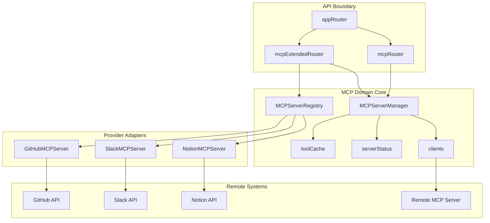
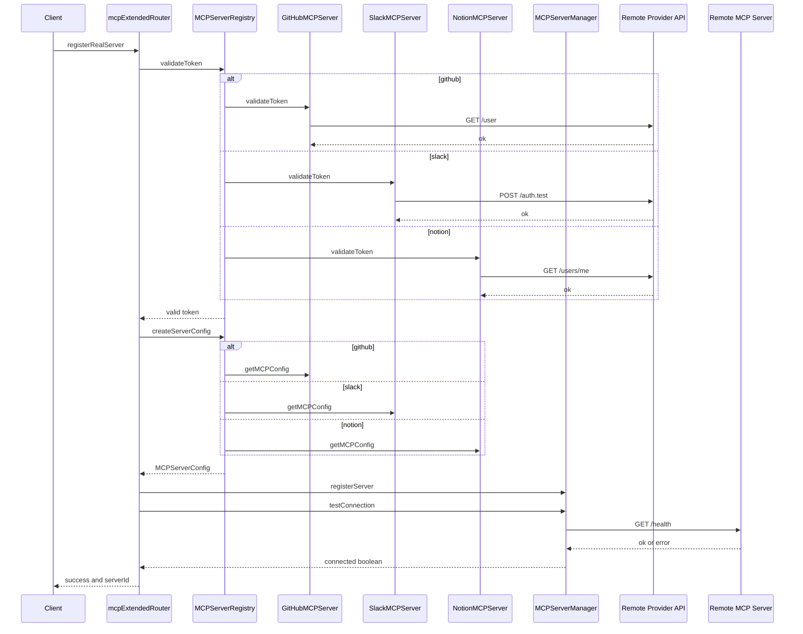
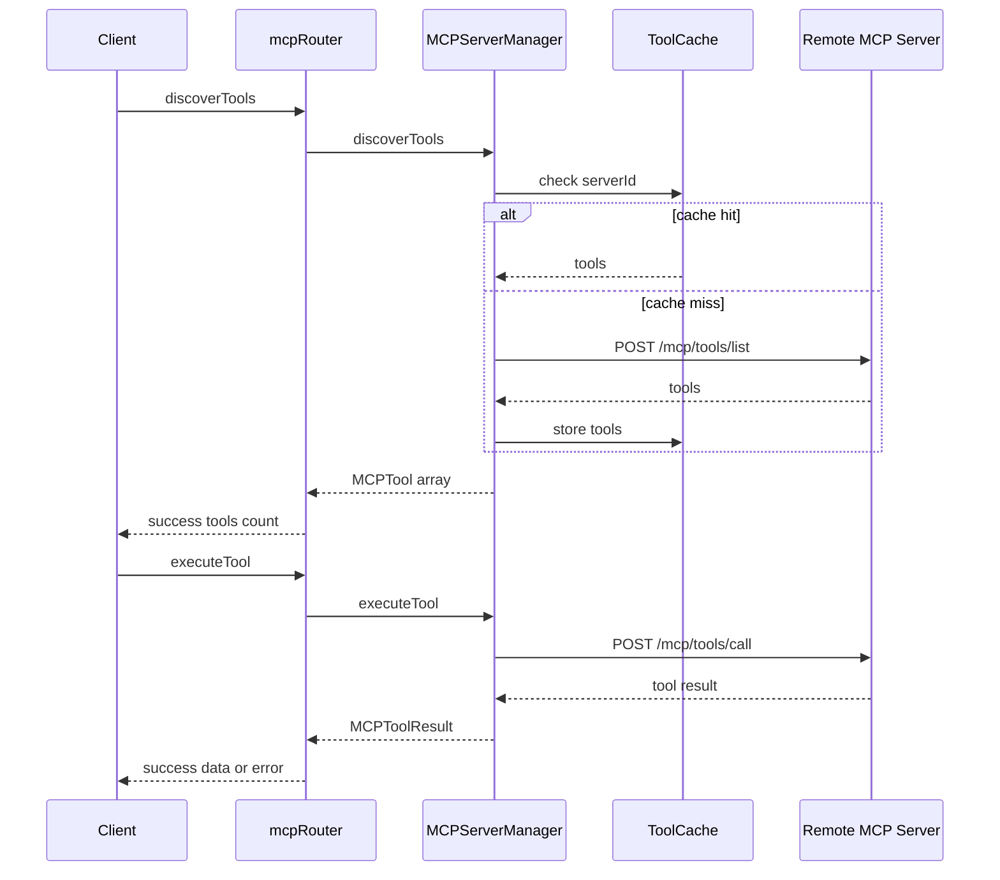
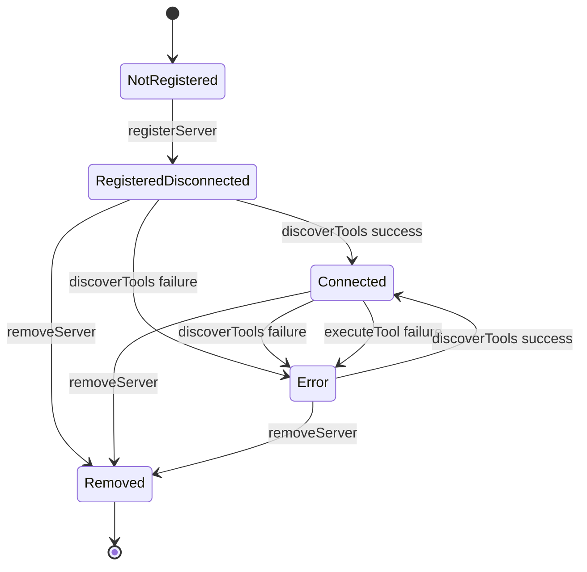

# MCP Integration Domain

*server/mcp/mcp-router.ts, server/mcp/mcp-router-extended.ts, server/mcp/mcp-server-manager.ts, server/mcp/mcp-server-registry.ts, server/routers.ts, docs/api/README.md*

## Overview

The MCP Integration domain is the backend boundary that turns MCP servers into first-class, managed integration targets inside MCP Hub. It exposes protected tRPC procedures for server registration, tool discovery, tool execution, health checks, cache management, and registry lookups, while `MCPServerRegistry` and `MCPServerManager` coordinate provider-specific definitions, live connections, and server status.

From the client’s perspective, this domain is what makes GitHub, Slack, and Notion available as discoverable and executable tool sources. From the server’s perspective, it is the layer that translates a token and a server type into a runnable MCP configuration, then maintains the HTTP client, discovery cache, and status record for that server across its lifecycle.

## Architecture Overview



## Component Structure

### 1. API Boundary

####

 only lists mcp.discoverTools(), mcp.executeTool(), and mcp.getServerStatus(), but  also mounts mcp.registerServer(), cache operations, lifecycle operations, and the full mcpServers router surface.

*server/routers.ts*

`appRouter` is the top-level tRPC composition point for the server. In this domain it mounts `mcp` for core server lifecycle and tool operations, and `mcpServers` for registry-driven discovery and real-server onboarding.

| Namespace | Source | Responsibility |
| --- | --- | --- |
| `mcp` | `mcpRouter` | Server registration, discovery, execution, status, and cache control |
| `mcpServers` | `mcpExtendedRouter` | Registry discovery, provider validation, and real MCP server onboarding |


####

*server/mcp/mcp-router.ts*

`mcpRouter` is the protected tRPC surface for already-registered MCP servers. It delegates all lifecycle work to `mcpServerManager`, and it converts thrown errors into structured `{ success: false, ... }` responses for discovery and execution operations.

| Procedure | Description |
| --- | --- |
| `registerServer` | Registers an MCP server configuration and initializes manager state |
| `discoverTools` | Discovers tools from a registered server and returns a cached or live list |
| `executeTool` | Executes a tool against a registered server |
| `getServerStatus` | Returns the current status record for a single server |
| `getAllServerStatuses` | Returns all known server status records |
| `testConnection` | Probes a registered server health endpoint |
| `clearToolCache` | Clears the cached tool list for a server |
| `clearAllCaches` | Clears all cached tool lists |
| `removeServer` | Removes a server and all of its manager state |
| `getAllServers` | Returns all registered server configurations |
| `getServer` | Returns a single registered server configuration |


####

*server/mcp/mcp-router-extended.ts*

`mcpExtendedRouter` adds registry and onboarding procedures on top of `mcpServerManager`. It resolves built-in server types, validates provider tokens, creates provider-specific configs, and can register and test a real server in one flow.

| Procedure | Description |
| --- | --- |
| `getAvailableServers` | Returns all built-in server definitions |
| `getServerDefinition` | Returns a built-in definition for a server type |
| `getServerTools` | Returns the tool inventory for a server type without connecting |
| `validateToken` | Validates a token against the provider API for a server type |
| `registerRealServer` | Validates a token, creates a config, registers it, and tests the connection |
| `getRegisteredServers` | Returns registered servers merged with runtime status |
| `discoverServerTools` | Discovers and caches tools for a registered server |
| `executeServerTool` | Executes a tool on a registered server |
| `testServerConnection` | Probes connectivity for a registered server |
| `unregisterServer` | Removes a server from the manager |


####

*docs/api/README.md*

This document defines the shared API contract for the backend. It establishes the base URLs, JWT requirement, standard error envelope, and request rate limit that apply to the MCP domain procedures exposed through tRPC.

| Contract Item | Value |
| --- | --- |
| Development base URL | `http://localhost:3000` |
| Production base URL |  |
| Authentication header | `Authorization: Bearer <jwt_token>` |
| Error format | `{ "code": "...", "message": "...", "details": {} }` |
| Rate limit | `1000` requests per minute per user |


### 2. Business Layer

####

The API documentation names mcp.discoverTools(), mcp.executeTool(), and mcp.getServerStatus(), while  exposes a wider MCP surface through mcp and mcpServers.

*server/mcp/mcp-server-manager.ts*

`MCPServerManager` is the runtime controller for registered servers. It owns the live HTTP clients, the tool cache, and the status map, and it is the layer that actually talks to a remote MCP server.

| Property | Type | Description |
| --- | --- | --- |
| `servers` | `Map<string, MCPServerConfigWithUnknownHeaders>` | Registered server configurations keyed by `serverId` |
| `clients` | `Map<string, AxiosInstance>` | Live Axios clients keyed by `serverId` |
| `toolCache` | `Map<string, MCPTool[]>` | Cached tool lists keyed by `serverId` |
| `serverStatus` | `Map<string, ServerStatus>` | Runtime status records keyed by `serverId` |


| Method | Description |
| --- | --- |
| `registerServer` | Stores the config, creates an Axios client, and initializes status as `disconnected` |
| `discoverTools` | Returns cached tools when present, otherwise fetches `/mcp/tools/list`, caches the result, and updates status |
| `executeTool` | Calls `/mcp/tools/call` and returns the remote tool result |
| `getServerStatus` | Returns the status record for one server |
| `getAllServerStatuses` | Returns all status records |
| `testConnection` | GETs `/health` with a 5 second timeout and returns a boolean |
| `clearToolCache` | Deletes one server’s cached tool list |
| `clearAllCaches` | Clears all cached tool lists |
| `removeServer` | Deletes the server config, client, cache entry, and status entry |
| `getAllServers` | Returns all stored server configs |
| `getServer` | Returns one stored server config |


####

*server/mcp/mcp-server-registry.ts*

`MCPServerRegistry` is the static catalog of supported server types. It maps each `ServerType` to a definition object, and it knows how to synthesize provider configs, enumerate provider tools, and validate provider tokens.

| Property | Type | Description |
| --- | --- | --- |
| `servers` | `Map<ServerType, ServerDefinition>` | Built-in server definitions keyed by `ServerType` |


| Method | Description |
| --- | --- |
| `getServerDefinition` | Returns the definition for a single server type |
| `getAllServers` | Returns every built-in server definition |
| `createServerConfig` | Builds a provider-specific `MCPServerConfig` from a type and token |
| `getServerTools` | Returns the static tool inventory for a provider type |
| `validateToken` | Validates a provider token through the provider adapter |


####

*server/mcp/servers/github-mcp.ts*

`GitHubMCPServer` wraps the GitHub provider-specific MCP shape. It creates the MCP server config, exposes the GitHub tool inventory, and validates tokens with a live GitHub request.

| Property | Type | Description |
| --- | --- | --- |
| `config` | `GitHubConfig` | Provider configuration with the supplied token and optional base URL |


| Constructor Dependencies | Description |
| --- | --- |
| `GitHubConfig` | Requires a token and optionally overrides the default GitHub base URL |


| Method | Description |
| --- | --- |
| `getMCPConfig` | Returns the GitHub MCP server config with headers, auth, timeout, and transport URL |
| `getAvailableTools` | Returns the GitHub tool inventory |
| `validateToken` | Calls GitHub and returns whether the token is accepted |


####

*server/mcp/servers/slack-mcp.ts*

`SlackMCPServer` encapsulates Slack-specific MCP configuration and validation. It produces the Slack server config, exposes Slack tools, and validates the token with Slack’s auth endpoint.

| Property | Type | Description |
| --- | --- | --- |
| `config` | `SlackConfig` | Provider configuration with the supplied token and optional base URL |


| Constructor Dependencies | Description |
| --- | --- |
| `SlackConfig` | Requires a token and optionally overrides the default Slack base URL |


| Method | Description |
| --- | --- |
| `getMCPConfig` | Returns the Slack MCP server config with JSON content headers and bearer auth |
| `getAvailableTools` | Returns the Slack tool inventory |
| `validateToken` | Calls Slack and returns whether the token is accepted |


####

*server/mcp/servers/notion-mcp.ts*

`NotionMCPServer` encapsulates Notion-specific MCP configuration and validation. It produces the Notion server config, exposes Notion tools, and validates the token with the Notion user endpoint.

| Property | Type | Description |
| --- | --- | --- |
| `config` | `NotionConfig` | Provider configuration with the supplied token and optional base URL |


| Constructor Dependencies | Description |
| --- | --- |
| `NotionConfig` | Requires a token and optionally overrides the default Notion base URL |


| Method | Description |
| --- | --- |
| `getMCPConfig` | Returns the Notion MCP server config with Notion version headers and bearer auth |
| `getAvailableTools` | Returns the Notion tool inventory |
| `validateToken` | Calls Notion and returns whether the token is accepted |


### 3. Data Models

#### `ServerDefinition`

*server/mcp/mcp-server-registry.ts*

| Property | Type | Description |
| --- | --- | --- |
| `id` | `ServerType` | Registry identifier for the server type |
| `name` | `string` | Display name shown in server selection and onboarding flows |
| `description` | `string` | Human-readable summary of the provider capability |
| `icon` | `string` | Icon key used by the UI layer |
| `docs` | `string` | Provider documentation URL |
| `requiredScopes` | `string[]` | Optional provider scopes required for access |
| `authMethod` | `'bearer' \ | 'api-key' \ | 'basic'` | Authentication mode expected by the provider |


#### `MCPServerConfig`

*server/mcp/mcp-server-manager.ts*

| Property | Type | Description |
| --- | --- | --- |
| `id` | `string` | Unique server identifier used as the manager key |
| `name` | `string` | Display name for the registered server |
| `url` | `string` | Base URL used by `MCPServerManager` when building the Axios client |
| `type` | `'http' \ | 'websocket' \ | 'stdio'` | Transport type |
| `headers` | `Record<string, string>` | Optional custom headers merged into every request |
| `auth` | `{ type: 'bearer' \ | 'api-key' \ | 'basic'; token?: string; username?: string; password?: string; }` | Optional auth bundle converted into request headers |
| `timeout` | `number` | Optional request timeout in milliseconds |
| `retryAttempts` | `number` | Optional retry count retained in config |


#### `ServerStatus`

*server/mcp/mcp-server-manager.ts*

| Property | Type | Description |
| --- | --- | --- |
| `id` | `string` | Server identifier |
| `name` | `string` | Display name |
| `status` | `'connected' \ | 'disconnected' \ | 'error'` | Current runtime status |
| `lastConnected` | `Date` | Timestamp of the last successful tool discovery |
| `lastError` | `string` | Last recorded error message |
| `toolCount` | `number` | Number of tools discovered for the server |


#### `MCPTool`

*server/mcp/mcp-server-manager.ts*

| Property | Type | Description |
| --- | --- | --- |
| `name` | `string` | Tool name sent to `/mcp/tools/call` |
| `description` | `string` | Human-readable tool description |
| `inputSchema` | `{ type: string; properties: Record<string, any>; required?: string[]; }` | JSON schema-like input shape for the tool |


#### `MCPToolResult`

*server/mcp/mcp-server-manager.ts*

| Property | Type | Description |
| --- | --- | --- |
| `success` | `boolean` | Indicates whether tool execution succeeded |
| `data` | `any` | Tool response payload on success |
| `error` | `string` | Error message on failure |


#### `GitHubConfig`

*server/mcp/servers/github-mcp.ts*

| Property | Type | Description |
| --- | --- | --- |
| `token` | `string` | GitHub bearer token |
| `baseUrl` | `string` | Optional override for the GitHub API base URL |


#### `SlackConfig`

*server/mcp/servers/slack-mcp.ts*

| Property | Type | Description |
| --- | --- | --- |
| `token` | `string` | Slack bearer token |
| `baseUrl` | `string` | Optional override for the Slack API base URL |


#### `NotionConfig`

*server/mcp/servers/notion-mcp.ts*

| Property | Type | Description |
| --- | --- | --- |
| `token` | `string` | Notion bearer token |
| `baseUrl` | `string` | Optional override for the Notion API base URL |


#### `ServerType`

*server/mcp/mcp-server-registry.ts*

`github`, `slack`, `notion`

### 4. API Integration

#### `mcp.registerServer`

*server/mcp/mcp-router.ts*

```api
{
    "title": "Register MCP Server",
    "description": "Registers an MCP server configuration and initializes runtime manager state",
    "method": "POST",
    "baseUrl": "<ApiBaseUrl>",
    "endpoint": "/api/trpc/mcp.registerServer",
    "headers": [
        {
            "key": "Authorization",
            "value": "Bearer <jwt_token>",
            "required": true
        },
        {
            "key": "Content-Type",
            "value": "application/json",
            "required": true
        }
    ],
    "queryParams": [],
    "pathParams": [],
    "bodyType": "json",
    "requestBody": "{\n    \"id\": \"github-prod\",\n    \"name\": \"GitHub Production\",\n    \"url\": \"https://api.github.com/mcp\",\n    \"type\": \"http\",\n    \"headers\": {\n        \"Content-Type\": \"application/json\"\n    },\n    \"auth\": {\n        \"type\": \"bearer\",\n        \"token\": \"ghp_example_token\"\n    },\n    \"timeout\": 30000,\n    \"retryAttempts\": 3\n}",
    "formData": [],
    "rawBody": "",
    "responses": {
        "200": {
            "description": "Server registered",
            "body": "{\n    \"success\": true,\n    \"serverId\": \"github-prod\"\n}"
        }
    }
}
```

#### `mcp.discoverTools`

*server/mcp/mcp-router.ts*

```api
{
    "title": "Discover Tools",
    "description": "Discovers tools from a registered MCP server and caches the result",
    "method": "POST",
    "baseUrl": "<ApiBaseUrl>",
    "endpoint": "/api/trpc/mcp.discoverTools",
    "headers": [
        {
            "key": "Authorization",
            "value": "Bearer <jwt_token>",
            "required": true
        },
        {
            "key": "Content-Type",
            "value": "application/json",
            "required": true
        }
    ],
    "queryParams": [],
    "pathParams": [],
    "bodyType": "json",
    "requestBody": "{\n    \"serverId\": \"github-prod\"\n}",
    "formData": [],
    "rawBody": "",
    "responses": {
        "200": {
            "description": "Tools discovered",
            "body": "{\n    \"success\": true,\n    \"tools\": [\n        {\n            \"name\": \"list_repositories\",\n            \"description\": \"List repositories for the authenticated user or organization\",\n            \"inputSchema\": {\n                \"type\": \"object\",\n                \"properties\": {\n                    \"org\": {\n                        \"type\": \"string\",\n                        \"description\": \"Organization name\"\n                    },\n                    \"per_page\": {\n                        \"type\": \"number\",\n                        \"description\": \"Items per page\"\n                    },\n                    \"page\": {\n                        \"type\": \"number\",\n                        \"description\": \"Page number\"\n                    }\n                }\n            }\n        }\n    ],\n    \"count\": 1\n}"
        }
    }
}
```

#### `mcp.executeTool`

*server/mcp/mcp-router.ts*

```api
{
    "title": "Execute Tool",
    "description": "Executes a tool on a registered MCP server",
    "method": "POST",
    "baseUrl": "<ApiBaseUrl>",
    "endpoint": "/api/trpc/mcp.executeTool",
    "headers": [
        {
            "key": "Authorization",
            "value": "Bearer <jwt_token>",
            "required": true
        },
        {
            "key": "Content-Type",
            "value": "application/json",
            "required": true
        }
    ],
    "queryParams": [],
    "pathParams": [],
    "bodyType": "json",
    "requestBody": "{\n    \"serverId\": \"github-prod\",\n    \"toolName\": \"create_issue\",\n    \"input\": {\n        \"owner\": \"acme\",\n        \"repo\": \"app\",\n        \"title\": \"Bug report\",\n        \"body\": \"Tool execution example\"\n    }\n}",
    "formData": [],
    "rawBody": "",
    "responses": {
        "200": {
            "description": "Tool execution result",
            "body": "{\n    \"success\": true,\n    \"data\": {\n        \"ok\": true\n    }\n}"
        }
    }
}
```

#### `mcp.getServerStatus`

*server/mcp/mcp-router.ts*

```api
{
    "title": "Get Server Status",
    "description": "Returns the runtime status record for a single registered server",
    "method": "POST",
    "baseUrl": "<ApiBaseUrl>",
    "endpoint": "/api/trpc/mcp.getServerStatus",
    "headers": [
        {
            "key": "Authorization",
            "value": "Bearer <jwt_token>",
            "required": true
        },
        {
            "key": "Content-Type",
            "value": "application/json",
            "required": true
        }
    ],
    "queryParams": [],
    "pathParams": [],
    "bodyType": "json",
    "requestBody": "{\n    \"serverId\": \"github-prod\"\n}",
    "formData": [],
    "rawBody": "",
    "responses": {
        "200": {
            "description": "Server status",
            "body": "{\n    \"id\": \"github-prod\",\n    \"name\": \"GitHub Production\",\n    \"status\": \"connected\",\n    \"lastConnected\": \"2026-05-10T12:00:00.000Z\",\n    \"lastError\": null,\n    \"toolCount\": 8\n}"
        }
    }
}
```

#### `mcp.getAllServerStatuses`

*server/mcp/mcp-router.ts*

```api
{
    "title": "Get All Server Statuses",
    "description": "Returns all runtime server status records",
    "method": "POST",
    "baseUrl": "<ApiBaseUrl>",
    "endpoint": "/api/trpc/mcp.getAllServerStatuses",
    "headers": [
        {
            "key": "Authorization",
            "value": "Bearer <jwt_token>",
            "required": true
        },
        {
            "key": "Content-Type",
            "value": "application/json",
            "required": true
        }
    ],
    "queryParams": [],
    "pathParams": [],
    "bodyType": "json",
    "requestBody": "[]",
    "formData": [],
    "rawBody": "",
    "responses": {
        "200": {
            "description": "All statuses",
            "body": "[\n    {\n        \"id\": \"github-prod\",\n        \"name\": \"GitHub Production\",\n        \"status\": \"connected\",\n        \"lastConnected\": \"2026-05-10T12:00:00.000Z\",\n        \"lastError\": null,\n        \"toolCount\": 8\n    }\n]"
        }
    }
}
```

#### `mcp.testConnection`

*server/mcp/mcp-router.ts*

```api
{
    "title": "Test Connection",
    "description": "Probes the /health endpoint of a registered MCP server",
    "method": "POST",
    "baseUrl": "<ApiBaseUrl>",
    "endpoint": "/api/trpc/mcp.testConnection",
    "headers": [
        {
            "key": "Authorization",
            "value": "Bearer <jwt_token>",
            "required": true
        },
        {
            "key": "Content-Type",
            "value": "application/json",
            "required": true
        }
    ],
    "queryParams": [],
    "pathParams": [],
    "bodyType": "json",
    "requestBody": "{\n    \"serverId\": \"github-prod\"\n}",
    "formData": [],
    "rawBody": "",
    "responses": {
        "200": {
            "description": "Connection test result",
            "body": "{\n    \"success\": true,\n    \"connected\": true\n}"
        }
    }
}
```

#### `mcp.clearToolCache`

*server/mcp/mcp-router.ts*

```api
{
    "title": "Clear Tool Cache",
    "description": "Deletes the cached tool list for one server",
    "method": "POST",
    "baseUrl": "<ApiBaseUrl>",
    "endpoint": "/api/trpc/mcp.clearToolCache",
    "headers": [
        {
            "key": "Authorization",
            "value": "Bearer <jwt_token>",
            "required": true
        },
        {
            "key": "Content-Type",
            "value": "application/json",
            "required": true
        }
    ],
    "queryParams": [],
    "pathParams": [],
    "bodyType": "json",
    "requestBody": "{\n    \"serverId\": \"github-prod\"\n}",
    "formData": [],
    "rawBody": "",
    "responses": {
        "200": {
            "description": "Cache cleared",
            "body": "{\n    \"success\": true\n}"
        }
    }
}
```

#### `mcp.clearAllCaches`

*server/mcp/mcp-router.ts*

```api
{
    "title": "Clear All Tool Caches",
    "description": "Deletes every cached tool list from the manager",
    "method": "POST",
    "baseUrl": "<ApiBaseUrl>",
    "endpoint": "/api/trpc/mcp.clearAllCaches",
    "headers": [
        {
            "key": "Authorization",
            "value": "Bearer <jwt_token>",
            "required": true
        },
        {
            "key": "Content-Type",
            "value": "application/json",
            "required": true
        }
    ],
    "queryParams": [],
    "pathParams": [],
    "bodyType": "json",
    "requestBody": "[]",
    "formData": [],
    "rawBody": "",
    "responses": {
        "200": {
            "description": "All caches cleared",
            "body": "{\n    \"success\": true\n}"
        }
    }
}
```

#### `mcp.removeServer`

*server/mcp/mcp-router.ts*

```api
{
    "title": "Remove Server",
    "description": "Removes a registered server and its runtime state",
    "method": "POST",
    "baseUrl": "<ApiBaseUrl>",
    "endpoint": "/api/trpc/mcp.removeServer",
    "headers": [
        {
            "key": "Authorization",
            "value": "Bearer <jwt_token>",
            "required": true
        },
        {
            "key": "Content-Type",
            "value": "application/json",
            "required": true
        }
    ],
    "queryParams": [],
    "pathParams": [],
    "bodyType": "json",
    "requestBody": "{\n    \"serverId\": \"github-prod\"\n}",
    "formData": [],
    "rawBody": "",
    "responses": {
        "200": {
            "description": "Server removed",
            "body": "{\n    \"success\": true\n}"
        }
    }
}
```

#### `mcp.getAllServers`

*server/mcp/mcp-router.ts*

```api
{
    "title": "Get All Servers",
    "description": "Returns every registered server configuration",
    "method": "POST",
    "baseUrl": "<ApiBaseUrl>",
    "endpoint": "/api/trpc/mcp.getAllServers",
    "headers": [
        {
            "key": "Authorization",
            "value": "Bearer <jwt_token>",
            "required": true
        },
        {
            "key": "Content-Type",
            "value": "application/json",
            "required": true
        }
    ],
    "queryParams": [],
    "pathParams": [],
    "bodyType": "json",
    "requestBody": "[]",
    "formData": [],
    "rawBody": "",
    "responses": {
        "200": {
            "description": "Registered servers",
            "body": "[\n    {\n        \"id\": \"github-prod\",\n        \"name\": \"GitHub Production\",\n        \"url\": \"https://api.github.com/mcp\",\n        \"type\": \"http\",\n        \"headers\": {\n            \"Content-Type\": \"application/json\"\n        },\n        \"auth\": {\n            \"type\": \"bearer\",\n            \"token\": \"ghp_example_token\"\n        },\n        \"timeout\": 30000,\n        \"retryAttempts\": 3\n    }\n]"
        }
    }
}
```

#### `mcp.getServer`

*server/mcp/mcp-router.ts*

```api
{
    "title": "Get Server",
    "description": "Returns one registered server configuration",
    "method": "POST",
    "baseUrl": "<ApiBaseUrl>",
    "endpoint": "/api/trpc/mcp.getServer",
    "headers": [
        {
            "key": "Authorization",
            "value": "Bearer <jwt_token>",
            "required": true
        },
        {
            "key": "Content-Type",
            "value": "application/json",
            "required": true
        }
    ],
    "queryParams": [],
    "pathParams": [],
    "bodyType": "json",
    "requestBody": "{\n    \"serverId\": \"github-prod\"\n}",
    "formData": [],
    "rawBody": "",
    "responses": {
        "200": {
            "description": "Server configuration",
            "body": "{\n    \"id\": \"github-prod\",\n    \"name\": \"GitHub Production\",\n    \"url\": \"https://api.github.com/mcp\",\n    \"type\": \"http\",\n    \"headers\": {\n        \"Content-Type\": \"application/json\"\n    },\n    \"auth\": {\n        \"type\": \"bearer\",\n        \"token\": \"ghp_example_token\"\n    },\n    \"timeout\": 30000,\n    \"retryAttempts\": 3\n}"
        }
    }
}
```

#### `mcpServers.getAvailableServers`

*server/mcp/mcp-router-extended.ts*

```api
{
    "title": "Get Available Servers",
    "description": "Returns the built-in registry definitions for supported MCP server types",
    "method": "POST",
    "baseUrl": "<ApiBaseUrl>",
    "endpoint": "/api/trpc/mcpServers.getAvailableServers",
    "headers": [
        {
            "key": "Authorization",
            "value": "Bearer <jwt_token>",
            "required": true
        },
        {
            "key": "Content-Type",
            "value": "application/json",
            "required": true
        }
    ],
    "queryParams": [],
    "pathParams": [],
    "bodyType": "json",
    "requestBody": "[]",
    "formData": [],
    "rawBody": "",
    "responses": {
        "200": {
            "description": "Registry definitions",
            "body": "[\n    {\n        \"id\": \"github\",\n        \"name\": \"GitHub\",\n        \"description\": \"Access GitHub repositories, issues, pull requests, and more\",\n        \"icon\": \"github\",\n        \"docs\": \"https://docs.github.com/en/rest\",\n        \"requiredScopes\": [\n            \"repo\",\n            \"user\",\n            \"gist\"\n        ],\n        \"authMethod\": \"bearer\"\n    },\n    {\n        \"id\": \"slack\",\n        \"name\": \"Slack\",\n        \"description\": \"Send messages, manage channels, and interact with Slack workspace\",\n        \"icon\": \"slack\",\n        \"docs\": \"https://api.slack.com\",\n        \"requiredScopes\": [\n            \"chat:write\",\n            \"channels:read\",\n            \"users:read\"\n        ],\n        \"authMethod\": \"bearer\"\n    },\n    {\n        \"id\": \"notion\",\n        \"name\": \"Notion\",\n        \"description\": \"Query databases, create pages, and manage Notion workspace\",\n        \"icon\": \"notion\",\n        \"docs\": \"https://developers.notion.com\",\n        \"requiredScopes\": [],\n        \"authMethod\": \"bearer\"\n    }\n]"
        }
    }
}
```

#### `mcpServers.getServerDefinition`

*server/mcp/mcp-router-extended.ts*

```api
{
    "title": "Get Server Definition",
    "description": "Returns the built-in definition for a server type",
    "method": "POST",
    "baseUrl": "<ApiBaseUrl>",
    "endpoint": "/api/trpc/mcpServers.getServerDefinition",
    "headers": [
        {
            "key": "Authorization",
            "value": "Bearer <jwt_token>",
            "required": true
        },
        {
            "key": "Content-Type",
            "value": "application/json",
            "required": true
        }
    ],
    "queryParams": [],
    "pathParams": [],
    "bodyType": "json",
    "requestBody": "{\n    \"type\": \"github\"\n}",
    "formData": [],
    "rawBody": "",
    "responses": {
        "200": {
            "description": "Server definition",
            "body": "{\n    \"id\": \"github\",\n    \"name\": \"GitHub\",\n    \"description\": \"Access GitHub repositories, issues, pull requests, and more\",\n    \"icon\": \"github\",\n    \"docs\": \"https://docs.github.com/en/rest\",\n    \"requiredScopes\": [\n        \"repo\",\n        \"user\",\n        \"gist\"\n    ],\n    \"authMethod\": \"bearer\"\n}"
        }
    }
}
```

#### `mcpServers.getServerTools`

*server/mcp/mcp-router-extended.ts*

```api
{
    "title": "Get Server Tools",
    "description": "Returns the static tool inventory for a server type without connecting",
    "method": "POST",
    "baseUrl": "<ApiBaseUrl>",
    "endpoint": "/api/trpc/mcpServers.getServerTools",
    "headers": [
        {
            "key": "Authorization",
            "value": "Bearer <jwt_token>",
            "required": true
        },
        {
            "key": "Content-Type",
            "value": "application/json",
            "required": true
        }
    ],
    "queryParams": [],
    "pathParams": [],
    "bodyType": "json",
    "requestBody": "{\n    \"type\": \"slack\"\n}",
    "formData": [],
    "rawBody": "",
    "responses": {
        "200": {
            "description": "Tool inventory",
            "body": "{\n    \"success\": true,\n    \"tools\": [\n        {\n            \"name\": \"send_message\",\n            \"description\": \"Send a message to a Slack channel\",\n            \"inputSchema\": {\n                \"type\": \"object\",\n                \"properties\": {\n                    \"channel\": {\n                        \"type\": \"string\",\n                        \"description\": \"Channel ID or name\"\n                    },\n                    \"text\": {\n                        \"type\": \"string\",\n                        \"description\": \"Message text\"\n                    },\n                    \"thread_ts\": {\n                        \"type\": \"string\",\n                        \"description\": \"Thread timestamp\"\n                    },\n                    \"blocks\": {\n                        \"type\": \"array\",\n                        \"description\": \"Block Kit blocks\"\n                    }\n                },\n                \"required\": [\n                    \"channel\",\n                    \"text\"\n                ]\n            }\n        }\n    ],\n    \"count\": 10\n}"
        }
    }
}
```

#### `mcpServers.validateToken`

*server/mcp/mcp-router-extended.ts*

```api
{
    "title": "Validate Token",
    "description": "Validates a provider token for a server type",
    "method": "POST",
    "baseUrl": "<ApiBaseUrl>",
    "endpoint": "/api/trpc/mcpServers.validateToken",
    "headers": [
        {
            "key": "Authorization",
            "value": "Bearer <jwt_token>",
            "required": true
        },
        {
            "key": "Content-Type",
            "value": "application/json",
            "required": true
        }
    ],
    "queryParams": [],
    "pathParams": [],
    "bodyType": "json",
    "requestBody": "{\n    \"type\": \"notion\",\n    \"token\": \"secret_token\"\n}",
    "formData": [],
    "rawBody": "",
    "responses": {
        "200": {
            "description": "Validation result",
            "body": "{\n    \"success\": true,\n    \"valid\": true\n}"
        }
    }
}
```

#### `mcpServers.registerRealServer`

*server/mcp/mcp-router-extended.ts*

```api
{
    "title": "Register Real Server",
    "description": "Validates the token, creates a provider config, registers the server, and tests the connection",
    "method": "POST",
    "baseUrl": "<ApiBaseUrl>",
    "endpoint": "/api/trpc/mcpServers.registerRealServer",
    "headers": [
        {
            "key": "Authorization",
            "value": "Bearer <jwt_token>",
            "required": true
        },
        {
            "key": "Content-Type",
            "value": "application/json",
            "required": true
        }
    ],
    "queryParams": [],
    "pathParams": [],
    "bodyType": "json",
    "requestBody": "{\n    \"type\": \"github\",\n    \"token\": \"ghp_example_token\",\n    \"customName\": \"GitHub Workspace\"\n}",
    "formData": [],
    "rawBody": "",
    "responses": {
        "200": {
            "description": "Real server registration result",
            "body": "{\n    \"success\": true,\n    \"serverId\": \"github-mcp\",\n    \"serverName\": \"GitHub Workspace\",\n    \"connected\": true\n}"
        }
    }
}
```

#### `mcpServers.getRegisteredServers`

*server/mcp/mcp-router-extended.ts*

```api
{
    "title": "Get Registered Servers",
    "description": "Returns registered servers merged with runtime status",
    "method": "POST",
    "baseUrl": "<ApiBaseUrl>",
    "endpoint": "/api/trpc/mcpServers.getRegisteredServers",
    "headers": [
        {
            "key": "Authorization",
            "value": "Bearer <jwt_token>",
            "required": true
        },
        {
            "key": "Content-Type",
            "value": "application/json",
            "required": true
        }
    ],
    "queryParams": [],
    "pathParams": [],
    "bodyType": "json",
    "requestBody": "[]",
    "formData": [],
    "rawBody": "",
    "responses": {
        "200": {
            "description": "Merged server list",
            "body": "[\n    {\n        \"id\": \"github-mcp\",\n        \"name\": \"GitHub Workspace\",\n        \"type\": \"http\",\n        \"status\": \"connected\",\n        \"toolCount\": 8,\n        \"lastConnected\": \"2026-05-10T12:00:00.000Z\",\n        \"lastError\": null\n    }\n]"
        }
    }
}
```

#### `mcpServers.discoverServerTools`

*server/mcp/mcp-router-extended.ts*

```api
{
    "title": "Discover Server Tools",
    "description": "Discovers and caches tools for a registered server",
    "method": "POST",
    "baseUrl": "<ApiBaseUrl>",
    "endpoint": "/api/trpc/mcpServers.discoverServerTools",
    "headers": [
        {
            "key": "Authorization",
            "value": "Bearer <jwt_token>",
            "required": true
        },
        {
            "key": "Content-Type",
            "value": "application/json",
            "required": true
        }
    ],
    "queryParams": [],
    "pathParams": [],
    "bodyType": "json",
    "requestBody": "{\n    \"serverId\": \"github-mcp\"\n}",
    "formData": [],
    "rawBody": "",
    "responses": {
        "200": {
            "description": "Discovery result",
            "body": "{\n    \"success\": true,\n    \"tools\": [\n        {\n            \"name\": \"list_repositories\",\n            \"description\": \"List repositories for the authenticated user or organization\",\n            \"inputSchema\": {\n                \"type\": \"object\",\n                \"properties\": {\n                    \"org\": {\n                        \"type\": \"string\",\n                        \"description\": \"Organization name\"\n                    },\n                    \"per_page\": {\n                        \"type\": \"number\",\n                        \"description\": \"Items per page\"\n                    },\n                    \"page\": {\n                        \"type\": \"number\",\n                        \"description\": \"Page number\"\n                    }\n                }\n            }\n        }\n    ],\n    \"count\": 1\n}"
        }
    }
}
```

#### `mcpServers.executeServerTool`

*server/mcp/mcp-router-extended.ts*

```api
{
    "title": "Execute Server Tool",
    "description": "Executes a tool on a registered server using named parameters",
    "method": "POST",
    "baseUrl": "<ApiBaseUrl>",
    "endpoint": "/api/trpc/mcpServers.executeServerTool",
    "headers": [
        {
            "key": "Authorization",
            "value": "Bearer <jwt_token>",
            "required": true
        },
        {
            "key": "Content-Type",
            "value": "application/json",
            "required": true
        }
    ],
    "queryParams": [],
    "pathParams": [],
    "bodyType": "json",
    "requestBody": "{\n    \"serverId\": \"slack-mcp\",\n    \"toolName\": \"send_message\",\n    \"parameters\": {\n        \"channel\": \"C12345678\",\n        \"text\": \"Hello from MCP Hub\"\n    }\n}",
    "formData": [],
    "rawBody": "",
    "responses": {
        "200": {
            "description": "Execution result",
            "body": "{\n    \"success\": true,\n    \"data\": {\n        \"ok\": true\n    }\n}"
        }
    }
}
```

#### `mcpServers.testServerConnection`

*server/mcp/mcp-router-extended.ts*

```api
{
    "title": "Test Server Connection",
    "description": "Probes a registered server health endpoint",
    "method": "POST",
    "baseUrl": "<ApiBaseUrl>",
    "endpoint": "/api/trpc/mcpServers.testServerConnection",
    "headers": [
        {
            "key": "Authorization",
            "value": "Bearer <jwt_token>",
            "required": true
        },
        {
            "key": "Content-Type",
            "value": "application/json",
            "required": true
        }
    ],
    "queryParams": [],
    "pathParams": [],
    "bodyType": "json",
    "requestBody": "{\n    \"serverId\": \"notion-mcp\"\n}",
    "formData": [],
    "rawBody": "",
    "responses": {
        "200": {
            "description": "Connection test result",
            "body": "{\n    \"success\": true,\n    \"connected\": true\n}"
        }
    }
}
```

#### `mcpServers.unregisterServer`

*server/mcp/mcp-router-extended.ts*

```api
{
    "title": "Unregister Server",
    "description": "Removes a server from the manager",
    "method": "POST",
    "baseUrl": "<ApiBaseUrl>",
    "endpoint": "/api/trpc/mcpServers.unregisterServer",
    "headers": [
        {
            "key": "Authorization",
            "value": "Bearer <jwt_token>",
            "required": true
        },
        {
            "key": "Content-Type",
            "value": "application/json",
            "required": true
        }
    ],
    "queryParams": [],
    "pathParams": [],
    "bodyType": "json",
    "requestBody": "{\n    \"serverId\": \"github-mcp\"\n}",
    "formData": [],
    "rawBody": "",
    "responses": {
        "200": {
            "description": "Server removed",
            "body": "{\n    \"success\": true\n}"
        }
    }
}
```

## Feature Flows

### 1. Register a Real MCP Server



### 2. Discover and Execute Tools



### 3. Server Lifecycle and Status Updates



`testConnection` returns a boolean and does not write to the status map, so the visible status transitions come from `registerServer`, `discoverTools`, `executeTool`, and `removeServer`.

## State Management

### Manager Runtime State

- **`servers`**: stores the authoritative server configuration for each registered server id.
- **`clients`**: stores the live Axios instance used for transport calls.
- **`toolCache`**: stores discovered tools for each server id.
- **`serverStatus`**: stores the current lifecycle status and last error metadata.

### Status Values

- **`disconnected`**: created by `registerServer`.
- **`connected`**: set by `discoverTools` after a successful tool list fetch.
- **`error`**: set by `discoverTools` or `executeTool` when transport or remote execution fails.

### Registry State

- **`ServerType`**: `github`, `slack`, `notion`.
- **`authMethod`**: `bearer`, `api-key`, `basic`.

## Error Handling

The MCP domain uses three distinct error patterns:

1. **Structured return objects**- `discoverTools` and `executeTool` catch errors and return `success: false` with an error string.
- `validateToken`, `registerRealServer`, `discoverServerTools`, and `executeServerTool` also wrap failures in structured return values.

1. **Inline fallback objects**- `getServerDefinition` and `getServer` return `{ error: '...' }` when a lookup misses.
- `getServerTools` returns an empty list for an unknown server type.
- `validateToken` returns `false` for an unsupported type.

1. **Thrown errors from the manager**- `discoverTools` throws when the server or client is missing.
- `executeTool` throws when the server or client is missing.
- `getServerStatus` and `getServer` return `null` when a lookup misses, allowing the router to translate that into an error object.

```ts
try {
  const tools = await mcpServerManager.discoverTools(input.serverId);
  return {
    success: true,
    tools,
    count: tools.length,
  };
} catch (error) {
  return {
    success: false,
    tools: [],
    count: 0,
    error: error instanceof Error ? error.message : 'Unknown error',
  };
}
```

## Caching Strategy

| Cache or State Map | Key | Populated By | Cleared By |
| --- | --- | --- | --- |
| `toolCache` | `serverId` | `discoverTools` after a successful remote fetch | `clearToolCache`, `clearAllCaches`, `removeServer` |
| `servers` | `serverId` | `registerServer` | `removeServer` |
| `clients` | `serverId` | `registerServer` | `removeServer` |
| `serverStatus` | `serverId` | `registerServer`, `discoverTools`, `executeTool` | `removeServer` |
| `MCPServerRegistry.servers` | `ServerType` | Module initialization | Module lifetime |


registerRealServer returns { success: true, connected } after the connection test even when connected is false, because connection test failure does not convert the mutation into an error response. [!NOTE] MCPServerManager creates its Axios client with baseURL: config.url, while discoverTools(), executeTool(), and testConnection() call /mcp/tools/list, /mcp/tools/call, and /health. The provider adapters return url: \\${baseUrl}/mcp\`, so configs created by createServerConfig() and registerRealServer() produce requests with a duplicated mcp` path segment.

`toolCache` is read before every live discovery call. A cache hit returns the cached `MCPTool[]` immediately, while a cache miss calls the remote server and stores the response under the same `serverId`. The cache is only invalidated by explicit cache procedures or server removal.

## Dependencies

### Backend Libraries

- `zod` for request validation in `mcpRouter` and `mcpExtendedRouter`
- `axios` and `AxiosInstance` for live MCP transport
- `router`, `publicProcedure`, and `protectedProcedure` from `server/_core/trpc`

### Provider and Runtime Dependencies

- GitHub REST API for GitHub token validation
- Slack Web API for Slack token validation
- Notion API for Notion token validation
- `fetch` for provider validation and connection checks
- `btoa` for HTTP Basic auth header assembly inside `MCPServerManager`

### Application Integration

-  mounts the MCP routers under `mcp` and `mcpServers`
-  defines the shared auth, rate limiting, and error format contract

## Testing Considerations

- Validate that every protected procedure rejects calls without `Authorization: Bearer <jwt_token>`.
- Confirm `registerServer` initializes `serverStatus` as `disconnected`.
- Verify that `discoverTools` populates `toolCache` and updates `toolCount` and `lastConnected`.
- Verify that `executeTool` updates `serverStatus.lastError` on failures and returns `success: false`.
- Verify that `clearToolCache`, `clearAllCaches`, and `removeServer` update only the intended manager maps.
- Verify that `getRegisteredServers` merges status with config and falls back to `status: 'unknown'` and `toolCount: 0` when a status entry is missing.
- Verify that `validateToken` returns `false` for unsupported server types.
- Verify that `registerRealServer` returns the provider-derived `serverId` values `github-mcp`, `slack-mcp`, and `notion-mcp`.
- Verify that `getServerDefinition` and `getServer` return fallback error objects when lookups miss.

## Key Classes Reference

| Class | Location | Responsibility |
| --- | --- | --- |
| `appRouter` | `routers.ts` | Composes the backend router tree and mounts the MCP namespaces |
| `mcpRouter` | `mcp-router.ts` | Exposes protected MCP lifecycle, status, execution, and cache procedures |
| `mcpExtendedRouter` | `mcp-router-extended.ts` | Exposes registry lookup, token validation, and real-server onboarding procedures |
| `MCPServerManager` | `mcp-server-manager.ts` | Manages live clients, discovery cache, status records, and tool execution |
| `MCPServerRegistry` | `mcp-server-registry.ts` | Stores built-in server definitions and creates provider-specific configs |
| `GitHubMCPServer` | `github-mcp.ts` | Builds the GitHub MCP config, tool inventory, and token validation call |
| `SlackMCPServer` | `slack-mcp.ts` | Builds the Slack MCP config, tool inventory, and token validation call |
| `NotionMCPServer` | `notion-mcp.ts` | Builds the Notion MCP config, tool inventory, and token validation call |
|  | `README.md` | Defines the shared API contract for authentication, errors, and rate limits |
