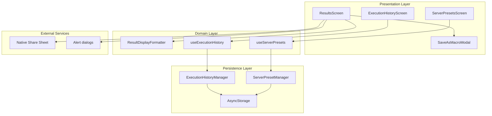
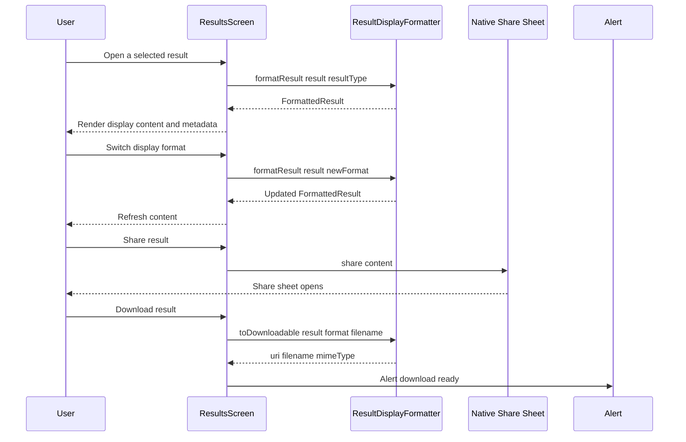
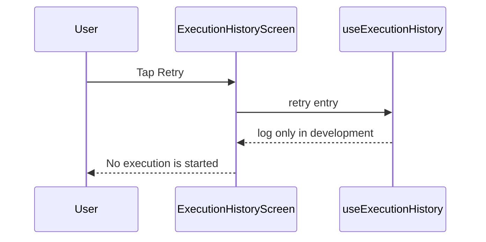
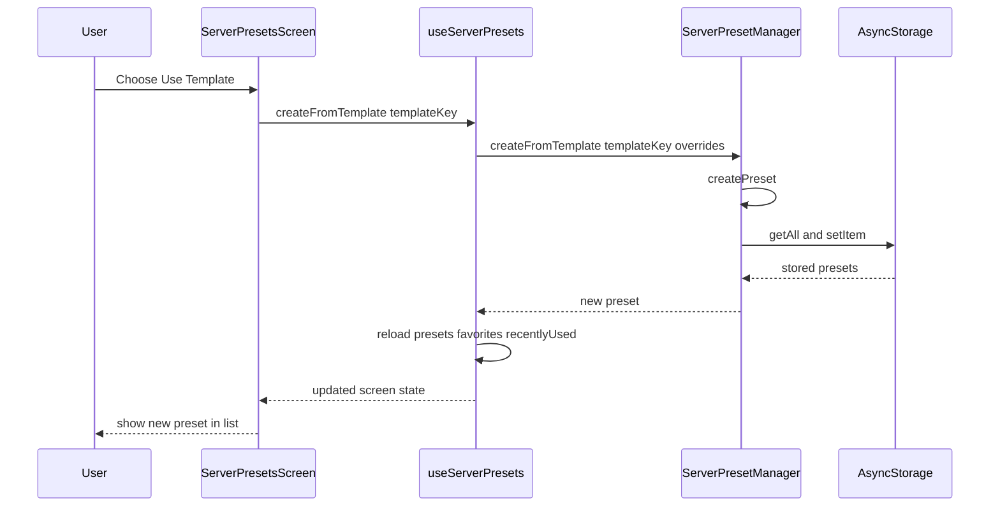
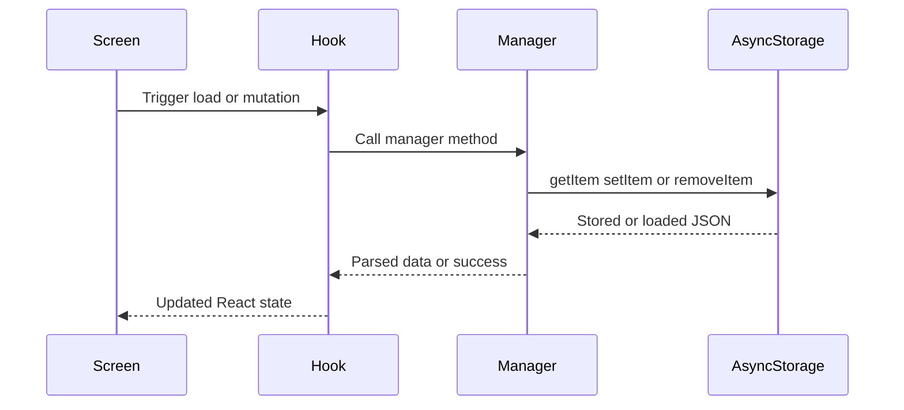

# MCP Integration Domain

## Overview

This feature set covers the user-facing loop for working with MCP tool outputs and the operational data that surrounds them: rendered results, execution history, reusable server presets, and validation workflows for live servers. It lets a user inspect a tool result in multiple display styles, revisit prior executions, save frequently used server configurations, and move those configurations between devices or app sessions.

The code in this section is centered on local state and local persistence. `ResultDisplayFormatter` turns raw tool output into display-ready content, `ExecutionHistoryManager` and `ServerPresetManager` persist app data with `AsyncStorage`, and the screens in `app/(tabs)` expose the workflows for browsing, filtering, and managing that data.

## Architecture Overview

## Result Display Formatting

### `ResultDisplayFormatter`

*`lib/utils/ResultDisplayFormatter.ts`*

This utility converts raw execution output into a stable shape for the results screen. It also produces downloadable payloads and alternative display choices for result types that have multiple presentation options.

#### Properties

| Property | Type | Description |
| --- | --- | --- |
| `MAX_DISPLAY_SIZE` | `number` | Maximum displayed content size, set to `1024 * 1024` bytes. |
| `LARGE_THRESHOLD` | `number` | Threshold for marking content as large, set to `100 * 1024` bytes. |

#### Public Methods

| Method | Description |
| --- | --- |
| `formatResult` | Formats a raw result into display content plus metadata. |
| `toDownloadable` | Converts a result into a data URI, filename, and MIME type. |
| `getAvailableFormats` | Returns the supported display choices for a given result type. |

#### `FormattedResult`

| Property | Type | Description |
| --- | --- | --- |
| `format` | `ResultType` | The selected result type used for formatting. |
| `content` | `string` | The display-ready output string. |
| `raw` | `any` | The original unformatted result. |
| `metadata.size` | `number` | UTF-8 byte length of the formatted content. |
| `metadata.isLarge` | `boolean` | Indicates whether the content exceeded `LARGE_THRESHOLD`. |
| `metadata.canDownload` | `boolean` | Enables the download action for supported types. |
| `metadata.canCopy` | `boolean` | Enables the copy action for supported types. |

#### Result Type Coverage

`ResultType` values: `TEXT`, `JSON`, `MARKDOWN`, `HTML`, `IMAGE`, `BINARY`, `STREAM`, `TABLE`, `TREE`, `CODE_BLOCK`, `MIXED`.

| Result Type | Formatting Behavior | Copy | Download |
| --- | --- | --- | --- |
| `TEXT` | Returns the string value or `String(result)`. | Yes | No |
| `JSON` | Parses JSON strings when possible and pretty-prints with two-space indentation. | Yes | No |
| `MARKDOWN` | Returns the text as-is. | Yes | No |
| `HTML` | Returns the text as-is. | Yes | No |
| `CODE_BLOCK` | Wraps content in a fenced code block and detects a language tag. | Yes | No |
| `TABLE` | Builds a Markdown table from an array of objects using the first item’s keys. | Yes | No |
| `TREE` | Renders nested arrays and objects as an indented tree-like structure. | Yes | No |
| `IMAGE` | Returns the original string, or prefixes base64 content with `data:image/png;base64,`. | No | Yes |
| `BINARY` | Returns a placeholder for non-string data or an `ArrayBuffer` byte count. | No | Yes |
| `STREAM` | Joins array items with newlines. | Yes | No |
| `MIXED` | Pretty-prints the result as JSON. | Yes | No |

#### Internal Helpers

| Method | Description |
| --- | --- |
| `formatText` | Normalizes any value to plain text. |
| `formatJson` | Parses and pretty-prints JSON, falling back to `String(result)` on parse failure. |
| `formatMarkdown` | Returns Markdown content unchanged. |
| `formatHtml` | Returns HTML content unchanged. |
| `formatCodeBlock` | Detects a language and wraps the content in a fenced block. |
| `formatTable` | Builds a Markdown table from arrays of objects and escapes cell values. |
| `formatTree` | Recursively renders arrays and objects as a tree. |
| `formatImage` | Passes through URLs and data URIs, or prefixes raw strings as PNG base64. |
| `formatBinary` | Returns a readable binary placeholder and byte length when available. |
| `formatStream` | Joins partial results into a newline-delimited string. |
| `formatMixed` | Serializes mixed content with pretty JSON formatting. |
| `detectLanguage` | Heuristically assigns a language tag for code blocks. |
| `escapeTableCell` | Escapes pipes and newlines, then truncates overly long table cells. |

#### Result Rendering Flow

### `ResultsScreen`

toDownloadable sets mimeType for IMAGE and BINARY, but content is not populated in those branches before the data URI is created. The returned URI therefore contains an empty base64 body for those types.

*`app/(tabs)/results.tsx`*

This screen is the main display surface for formatted execution output. It owns the selected result, the currently selected format, raw JSON visibility, and the macro-save modal state.

#### State

| State | Type | Description |
| --- | --- | --- |
| `selectedResult` | `ToolExecutionResult \ | null` | The currently displayed execution result. |
| `selectedFormat` | `ResultType` | The active display format for the result. |
| `formattedResult` | `FormattedResult \ | null` | The formatter output used for rendering. |
| `showRawJson` | `boolean` | Toggles the raw JSON panel. |
| `executionHistory` | `ToolExecutionResult[]` | Local history state used by the screen. |
| `showSaveAsMacroModal` | `boolean` | Controls the macro-save modal visibility. |

#### Key Actions

| Action | Behavior |
| --- | --- |
| Copy to clipboard | Shows an alert placeholder confirming copy. |
| Share | Calls `Share.share` with the formatted content. |
| Download | Calls `ResultDisplayFormatter.toDownloadable` and shows the generated filename. |
| Save as Macro | Opens `SaveAsMacroModal` and forwards the selected execution ID. |
| Raw JSON toggle | Shows or hides a pretty-printed JSON dump of the selected result. |

#### UI States

| State | Condition | User Experience |
| --- | --- | --- |
| Empty | `selectedResult` is `null` | Shows the empty state with the prompt to execute a tool. |
| Ready | `selectedResult` exists | Shows metadata, format selector, rendered result, and action buttons. |
| Large result | `formattedResult.metadata.isLarge` is `true` | Shows a truncation notice under the result panel. |

### `SaveAsMacroModal`

*`components/SaveAsMacroModal.tsx`*

This modal captures a macro name and description for one or more execution IDs. The selected execution list is displayed as a count so the user can confirm how many steps are being recorded.

#### Props

| Property | Type | Description |
| --- | --- | --- |
| `visible` | `boolean` | Controls whether the modal is shown. |
| `executionIds` | `string[]` | Execution IDs to include in the saved macro. |
| `onSave` | `(name: string, description?: string) => Promise<void>` | Called when the user submits the macro. |
| `onCancel` | `() => void` | Called when the user dismisses the modal. |
| `isLoading?` | `boolean` | Optional loading state for the save operation. |

#### Behavior

- Requires a non-empty macro name.
- Clears the local name and description fields after save or cancel.
- Shows a loading indicator while the save callback is running.
- Displays the number of selected executions that will be recorded.

## Execution History

### `ExecutionStatus`

*`lib/models/ExecutionHistory.ts`*

`SUCCESS`, `FAILED`, `TIMEOUT`, `CANCELLED`, `PARTIAL`.

### `ExecutionHistoryEntry`

*`lib/models/ExecutionHistory.ts`*

| Property | Type | Description |
| --- | --- | --- |
| `id` | `string` | Unique execution identifier. |
| `serverId` | `string` | Server that ran the tool. |
| `serverName` | `string` | Display name of the server. |
| `toolName` | `string` | Tool that was executed. |
| `toolDescription?` | `string` | Optional tool description. |
| `parameters` | `Record<string, any>` | Input parameters used for execution. |
| `result` | `any` | Raw tool output. |
| `resultType` | `string` | Stored result classification. |
| `resultSize` | `number` | Size of the raw result payload. |
| `timestamp` | `number` | Execution timestamp in milliseconds. |
| `executionTimeMs` | `number` | Duration of the execution. |
| `status` | `ExecutionStatus` | Outcome of the execution. |
| `error?` | `ExecutionError` | Optional execution error payload. |
| `tags?` | `string[]` | Optional labels attached to the execution. |
| `notes?` | `string` | Optional freeform notes. |

### `ExecutionHistoryFilter`

*`lib/models/ExecutionHistory.ts`*

| Property | Type | Description |
| --- | --- | --- |
| `serverId?` | `string` | Filters to a specific server. |
| `toolName?` | `string` | Filters by tool name substring. |
| `status?` | `ExecutionStatus` | Filters by status. |
| `dateFrom?` | `number` | Inclusive start timestamp. |
| `dateTo?` | `number` | Inclusive end timestamp. |
| `searchText?` | `string` | Searches tool name, server name, and notes. |
| `limit?` | `number` | Maximum number of entries to return. |
| `offset?` | `number` | Starting index for pagination. |

### `ExecutionHistoryStats`

*`lib/models/ExecutionHistory.ts`*

| Property | Type | Description |
| --- | --- | --- |
| `totalExecutions` | `number` | Total number of stored executions. |
| `successCount` | `number` | Count of successful executions. |
| `failureCount` | `number` | Count of failed executions. |
| `timeoutCount` | `number` | Count of timed out executions. |
| `averageExecutionTimeMs` | `number` | Average execution time across all entries. |
| `mostUsedTools` | `Array<{ toolName: string; count: number }>` | Ranked tool usage summary. |
| `mostUsedServers` | `Array<{ serverId: string; serverName: string; count: number }>` | Ranked server usage summary. |

### `ExecutionHistoryManager`

*`lib/models/ExecutionHistory.ts`*

This manager is the persistence and analytics layer for execution records. It stores entries locally, computes summary statistics, supports history filtering, and handles import/export.

#### Properties

| Property | Type | Description |
| --- | --- | --- |
| `STORAGE_KEY` | `string` | AsyncStorage key used for execution history. |
| `MAX_HISTORY_SIZE` | `number` | Maximum retained entries, set to `1000`. |

#### Public Methods

| Method | Description |
| --- | --- |
| `addExecution` | Adds a new execution and trims the stored list to the newest 1000 entries. |
| `getAll` | Returns the full stored history. |
| `getFiltered` | Returns a filtered and paginated subset of the history. |
| `getById` | Returns a single execution by ID. |
| `deleteExecution` | Removes one execution by ID. |
| `deleteByServer` | Removes all executions for a server ID. |
| `clearAll` | Removes the history key from storage. |
| `getStats` | Computes summary statistics from stored history. |
| `exportAsJson` | Serializes the entire history to JSON. |
| `importFromJson` | Merges JSON input into storage and skips duplicate IDs. |

#### Internal Helper

| Method | Description |
| --- | --- |
| `saveHistory` | Writes the full history array back to `AsyncStorage`. |

#### Storage and Filtering Behavior

- `getFiltered` applies filters in this order: `serverId`, `toolName`, `status`, `dateFrom`, `dateTo`, `searchText`, then pagination.
- `getStats` counts statuses, computes average execution time, and returns the top 10 tools and servers.
- `importFromJson` merges by `id` only and trims the result to `MAX_HISTORY_SIZE`.

### `useExecutionHistory`

*`lib/hooks/useExecutionHistory.ts`*

This hook wraps `ExecutionHistoryManager` with React state and screen-friendly methods. It refreshes history on mount and keeps loading, error, stats, and total-count state synchronized after each mutation.

#### Return Shape

##### `UseExecutionHistoryReturn`

| Property | Type | Description |
| --- | --- | --- |
| `history` | `ExecutionHistoryEntry[]` | Current in-memory history list. |
| `isLoading` | `boolean` | Loading flag for history fetches. |
| `error` | `string \ | null` | Last error message. |
| `stats` | `ExecutionHistoryStats \ | null` | Cached summary statistics. |
| `totalCount` | `number` | Number of loaded entries. |
| `loadHistory` | `(filter?: ExecutionHistoryFilter) => Promise<void>` | Reloads history with optional filters. |
| `addExecution` | `(entry: ExecutionHistoryEntry) => Promise<void>` | Persists a new history entry and reloads state. |
| `deleteExecution` | `(id: string) => Promise<void>` | Deletes one entry and reloads state. |
| `deleteByServer` | `(serverId: string) => Promise<void>` | Deletes all entries for a server and reloads state. |
| `clearAll` | `() => Promise<void>` | Clears all history and resets hook state. |
| `getStats` | `() => Promise<void>` | Refreshes the cached statistics. |
| `exportAsJson` | `() => Promise<string>` | Returns the current history as JSON. |
| `importFromJson` | `(jsonData: string) => Promise<number>` | Imports JSON data and reloads state. |
| `retry` | `(entry: ExecutionHistoryEntry) => void` | Stub callback intended for parent-driven retry orchestration. |

#### State and Lifecycle

- Calls `loadHistory()` on mount.
- `loadHistory` uses `ExecutionHistoryManager.getFiltered` when a filter is supplied, otherwise `getAll`.
- Mutations refresh the in-memory list after the storage write completes.
- Errors are surfaced as a user-friendly string and logged to the console.

### `Execution History Screen`

*`app/(tabs)/execution-history.tsx`*

This screen shows stored executions, summary metrics, filter chips, search, and delete actions. It is the operational view for reviewing past tool runs.

#### Local State

| State | Type | Description |
| --- | --- | --- |
| `selectedFilter` | `ExecutionStatus \ | 'ALL'` | Status filter selected by the user. |
| `searchText` | `string` | Search text for tool and server names. |

#### Display Helpers

| Helper | Behavior |
| --- | --- |
| `getStatusColor` | Maps `SUCCESS`, `FAILED`, and `TIMEOUT` to themed colors. |
| `formatTime` | Formats timestamps with `toLocaleString()`. |
| `formatDuration` | Displays milliseconds, seconds, or minutes depending on size. |

#### UI States

| State | Condition | User Experience |
| --- | --- | --- |
| Loading | `isLoading` is `true` | Shows `Loading history...`. |
| Error | `error` is set | Shows the error text in the center of the screen. |
| Empty | `filteredHistory.length === 0` | Shows `No executions found`. |
| Populated | History exists | Renders summary cards and the execution list. |

#### Actions Exposed in the Screen

| Action | Behavior |
| --- | --- |
| Retry | Shows a button, but the handler is still a placeholder. |
| Delete | Prompts for confirmation and calls `deleteExecution`. |
| Clear All History | Prompts for confirmation and calls `clearAll`. |
| Search | Filters by `toolName` and `serverName`. |
| Status Filter | Filters by `ALL`, `SUCCESS`, `FAILED`, or `TIMEOUT`. |

#### Retry From History Flow

## Server Presets

### `ServerPreset`

The visible Retry button in execution-history.tsx does not trigger a new execution. The screen handler contains a TODO comment, and the hook’s retry callback only logs the entry in development builds. [!NOTE] ExecutionStatus includes CANCELLED and PARTIAL, but the filter strip in execution-history.tsx only exposes ALL, SUCCESS, FAILED, and TIMEOUT. Those additional statuses can still exist in stored data, but they are not directly filterable from this screen.

*`lib/models/ServerPreset.ts`*

| Property | Type | Description |
| --- | --- | --- |
| `id` | `string` | Unique preset identifier. |
| `name` | `string` | Display name for the preset. |
| `description?` | `string` | Optional description. |
| `host` | `string` | Server host name or address. |
| `port` | `number` | Server port. |
| `transport` | `TransportType` | Connection transport selection. |
| `authToken?` | `string` | Optional auth token. |
| `timeoutMs` | `number` | Timeout for the preset connection. |
| `retryAttempts` | `number` | Number of retry attempts to use. |
| `tags?` | `string[]` | Optional labels attached to the preset. |
| `isFavorite` | `boolean` | Favorite flag used in the UI. |
| `usageCount` | `number` | Number of times the preset has been used. |
| `lastUsedAt?` | `number` | Last usage timestamp in milliseconds. |
| `createdAt` | `number` | Creation timestamp in milliseconds. |
| `updatedAt` | `number` | Last update timestamp in milliseconds. |

### `ServerPresetTemplate`

*`lib/models/ServerPreset.ts`*

| Property | Type | Description |
| --- | --- | --- |
| `name` | `string` | Template display name. |
| `description` | `string` | Template description. |
| `host` | `string` | Default host value. |
| `port` | `number` | Default port value. |
| `transport` | `TransportType` | Default transport value. |
| `timeoutMs?` | `number` | Optional timeout override. |
| `retryAttempts?` | `number` | Optional retry override. |
| `tags?` | `string[]` | Optional tags. |

### `ServerPresetFilter`

*`lib/models/ServerPreset.ts`*

| Property | Type | Description |
| --- | --- | --- |
| `searchText?` | `string` | Searches name, description, and host. |
| `tags?` | `string[]` | Filters by overlapping tags. |
| `isFavorite?` | `boolean` | Filters by favorite state. |
| `limit?` | `number` | Maximum number of presets. |
| `offset?` | `number` | Pagination offset. |

### Built-in Templates

`claude_filesystem`, `claude_web`, `claude_git`, `local_stdio`.

| Template Key | Name | Host | Port | Transport | Tags |
| --- | --- | --- | --- | --- | --- |
| `claude_filesystem` | Claude Filesystem MCP | `localhost` | `3001` | `HTTP` | `official`, `filesystem`, `file-operations` |
| `claude_web` | Claude Web MCP | `localhost` | `3002` | `HTTP` | `official`, `web`, `browsing` |
| `claude_git` | Claude Git MCP | `localhost` | `3003` | `HTTP` | `official`, `git`, `version-control` |
| `local_stdio` | Local Stdio MCP | `localhost` | `0` | `STDIO` | `local`, `stdio` |

### `ServerPresetManager`

*`lib/models/ServerPreset.ts`*

This manager owns preset persistence and the built-in templates. It supports creation, template instantiation, updates, favorites, usage tracking, deletion, and import/export.

#### Properties

| Property | Type | Description |
| --- | --- | --- |
| `STORAGE_KEY` | `string` | AsyncStorage key used for presets. |

#### Public Methods

| Method | Description |
| --- | --- |
| `createPreset` | Creates a new preset with generated ID and timestamps. |
| `createFromTemplate` | Creates a preset from `SERVER_PRESET_TEMPLATES`. |
| `getAll` | Returns all stored presets. |
| `getFiltered` | Filters presets by search text, tags, favorite state, and pagination. |
| `getById` | Returns one preset by ID. |
| `updatePreset` | Updates a preset while preserving `id` and `createdAt`. |
| `toggleFavorite` | Flips the `isFavorite` flag for a preset. |
| `recordUsage` | Increments `usageCount` and updates `lastUsedAt`. |
| `deletePreset` | Removes one preset by ID. |
| `getFavorites` | Returns only favorite presets. |
| `getRecentlyUsed` | Returns the most recently used presets. |
| `exportAsJson` | Serializes all presets to JSON. |
| `importFromJson` | Imports JSON data and skips duplicate IDs. |

#### Internal Helper

| Method | Description |
| --- | --- |
| `savePresets` | Writes the full preset list back to `AsyncStorage`. |

#### Storage and Sorting Behavior

- `createPreset` generates IDs in the form `preset_<timestamp>_<random>`.
- `createFromTemplate` applies template defaults and then merges overrides.
- `updatePreset` preserves the original `id` and `createdAt`.
- `importFromJson` merges by `id` only.
- `getRecentlyUsed` sorts by `lastUsedAt` descending and slices to the requested limit.

### `useServerPresets`

ServerPresetManager.getFiltered sorts favorites before non-favorites and then orders by lastUsedAt. The inline comment says the result is sorted by usage count and last used, but usageCount is not part of the actual sort logic.

*`lib/hooks/useServerPresets.ts`*

This hook provides the screen-facing API for managing presets. It keeps the preset list, favorites, and recently used views synchronized after each change.

#### Return Shape

##### `UseServerPresetsReturn`

| Property | Type | Description |
| --- | --- | --- |
| `presets` | `ServerPreset[]` | Current preset list. |
| `favorites` | `ServerPreset[]` | Favorite presets. |
| `recentlyUsed` | `ServerPreset[]` | Most recently used presets. |
| `isLoading` | `boolean` | Loading flag for preset fetches. |
| `error` | `string \ | null` | Last error message. |
| `loadPresets` | `(filter?: ServerPresetFilter) => Promise<void>` | Loads all presets or a filtered subset. |
| `loadFavorites` | `() => Promise<void>` | Loads favorite presets. |
| `loadRecentlyUsed` | `(limit?: number) => Promise<void>` | Loads recently used presets. |
| `createPreset` | `(preset: Omit<ServerPreset, 'id' \ | 'createdAt' \ | 'updatedAt'>) => Promise<ServerPreset>` | Creates a new preset. |
| `createFromTemplate` | `(templateKey: string, overrides?: Partial<ServerPreset>) => Promise<ServerPreset>` | Creates a preset from a template. |
| `getPreset` | `(id: string) => Promise<ServerPreset \ | null>` | Returns a single preset or `null`. |
| `updatePreset` | `(id: string, updates: Partial<ServerPreset>) => Promise<ServerPreset>` | Updates a preset and reloads the list. |
| `deletePreset` | `(id: string) => Promise<void>` | Deletes one preset and reloads the list. |
| `toggleFavorite` | `(id: string) => Promise<void>` | Toggles the favorite state and reloads views. |
| `recordUsage` | `(id: string) => Promise<void>` | Increments usage and refreshes the recent list. |
| `exportAsJson` | `() => Promise<string>` | Exports all presets as JSON. |
| `importFromJson` | `(jsonData: string) => Promise<number>` | Imports presets and reloads the list. |
| `getTemplates` | `() => Record<string, any>` | Returns the built-in template map. |

#### Lifecycle

- Calls `loadPresets()`, `loadFavorites()`, and `loadRecentlyUsed()` on mount.
- Every write path refreshes the relevant local state after the storage update completes.
- Errors are stored in the hook and logged to the console.

### `Server Presets Screen`

*`app/(tabs)/server-presets.tsx`*

This screen is the preset management surface. It combines template creation, manual preset creation, search, favorites, recently used, and deletion.

#### Local State

| State | Type | Description |
| --- | --- | --- |
| `showTemplates` | `boolean` | Controls the template picker modal. |
| `showNewPreset` | `boolean` | Controls the manual preset modal. |
| `searchText` | `string` | Filters presets by name or host. |
| `newPreset.name` | `string` | Name field for the manual preset form. |
| `newPreset.host` | `string` | Host field for the manual preset form. |
| `newPreset.port` | `number` | Port field for the manual preset form. |
| `newPreset.transport` | `TransportType` | Transport selector for the manual preset form. |

#### UI States

| State | Condition | User Experience |
| --- | --- | --- |
| Loading | `isLoading` is `true` | Shows `Loading presets...`. |
| Error | `error` is set | Shows the error text in the center of the screen. |
| Empty | `filteredPresets.length === 0` | Shows `No presets found`. |
| Populated | Presets exist | Shows favorite, recently used, and all-presets sections. |

#### Actions Exposed in the Screen

| Action | Behavior |
| --- | --- |
| Use Template | Opens the template modal and creates from a built-in template. |
| New Preset | Opens the manual preset modal. |
| Favorite Toggle | Calls `toggleFavorite`. |
| Delete | Prompts for confirmation and calls `deletePreset`. |
| Search | Filters by preset name and host. |
| Connect | Visible in the preset card but still a stubbed action. |
| Create Preset | Visible in the manual modal but still a stubbed action. |

#### Preset Reuse Flow

## AsyncStorage Persistence Service

### Usage Scope

The Connect button inside PresetCard and the Create Preset button in the manual modal are present in the UI, but both handlers contain TODO comments. Template creation, favorite toggling, deletion, search, and import/export are the implemented preset workflows in this section.

`AsyncStorage` is the shared persistence layer used by both history and preset management.

| Classes Using It | Role |
| --- | --- |
| `ExecutionHistoryManager` | Stores and retrieves execution history under `mcp_execution_history`. |
| `ServerPresetManager` | Stores and retrieves server presets under `mcp_server_presets`. |

### Data Flow

- `useExecutionHistory` and `useServerPresets` call their managers.
- The managers read and write `AsyncStorage` directly inside their methods.
- After writes, the hooks reload their in-memory arrays so the screens always render the latest persisted data.

### Storage Keys

| Key | Data Stored |
| --- | --- |
| `mcp_execution_history` | Array of `ExecutionHistoryEntry` records. |
| `mcp_server_presets` | Array of `ServerPreset` records. |

### Persistence Sequence

## Real Server Testing and Operational Validation

This feature is designed to be validated against live MCP servers, not just sample output. The testing path centers on three checks: live result rendering, durable history/preset persistence, and device-level behaviors such as share and export flows.

### Companion Testing Artifacts

- `MCP_TESTING_GUIDE.md`
- `MCP_SERVER_TESTING.md`
- `REAL_DEVICE_TESTING.md`
- `PERFORMANCE_MCP_REPORT.md`

### What to Verify Against Real Servers

- Result rendering across all 11 `ResultType` values.
- Pretty-printed JSON formatting for live tool payloads.
- Table rendering from real arrays of objects.
- Tree rendering for nested results.
- Code block language detection from real code payloads.
- Image and binary download metadata.
- History persistence after app relaunch.
- Preset persistence after app relaunch.
- Template creation, favorite toggling, deletion, import, and export.
- Large-result truncation behavior for payloads above `100 KB`.
- Display cap behavior for payloads above `1 MB`.
- Share behavior on a physical device.
- The copy action placeholder in the results screen.

### Operational Expectations

- Use live execution output to confirm `resultType`, `resultSize`, and `executionTimeMs`.
- Re-run the same server with saved presets to verify reuse after persistence.
- Confirm that imported histories and presets skip duplicate IDs and reload correctly.
- Validate the screen behaviors on real hardware when testing share and persistence flows.

## Dependencies

### Local and Framework Dependencies

- `react` hooks: `useState`, `useEffect`, `useCallback`.
- `react-native` UI primitives, `Share`, and `Alert`.
- `@react-native-async-storage/async-storage` for local persistence.
- `expo-file-system/legacy` and `expo-sharing` for macro export and share flows.
- `Buffer` for byte-size calculation and data URI generation.
- `ResultType` from .
- `SaveAsMacroModal` for preserving selected executions as reusable macros.

### Feature Integration Points

- `useToolExecution` supplies result history data used by `ResultsScreen`.
- `useMacroExecution` is used when saving results as a macro.
- `ScreenContainer` standardizes the layout shell used by the feature screens.

## Testing Considerations

- Confirm all 11 result formats render correctly with live data.
- Confirm `JSON`, `TABLE`, `MARKDOWN`, and `CODE_BLOCK` produce the expected alternate formats from `getAvailableFormats`.
- Confirm `formatResult` marks images and binaries as downloadable and non-copyable.
- Confirm the large-result warning appears when the formatted content exceeds `100 KB`.
- Confirm the display is truncated when the formatted content exceeds `1 MB`.
- Confirm `ExecutionHistoryManager.importFromJson` and `ServerPresetManager.importFromJson` merge by `id`.
- Confirm `ExecutionHistoryManager` trims stored entries to `1000`.
- Confirm `useExecutionHistory` and `useServerPresets` refresh local state after every write.
- Confirm the retry control in history is still a stub before relying on it for operational recovery.
- Confirm the manual preset creation UI is not persisted yet, while template creation is persisted.
- Confirm live-server testing uses real server data and not mocked output.

## Key Classes Reference

| Class | Responsibility |
| --- | --- |
| `ResultDisplayFormatter.ts` | Formats raw tool results for display, download, and format selection. |
| `ExecutionHistory.ts` | Stores execution records, computes statistics, and manages history persistence. |
| `ServerPreset.ts` | Stores preset records, templates, and preset persistence helpers. |
| `useExecutionHistory.ts` | React hook for loading, mutating, exporting, importing, and summarizing history. |
| `useServerPresets.ts` | React hook for loading, mutating, exporting, importing, and templating presets. |
| `results.tsx` | Displays formatted execution results and supports share, download, and macro save actions. |
| `execution-history.tsx` | Renders execution history, stats, filters, and deletion actions. |
| `server-presets.tsx` | Manages templates, favorites, recently used presets, and preset search. |
| `SaveAsMacroModal.tsx` | Captures metadata for saving selected executions as a macro. |
