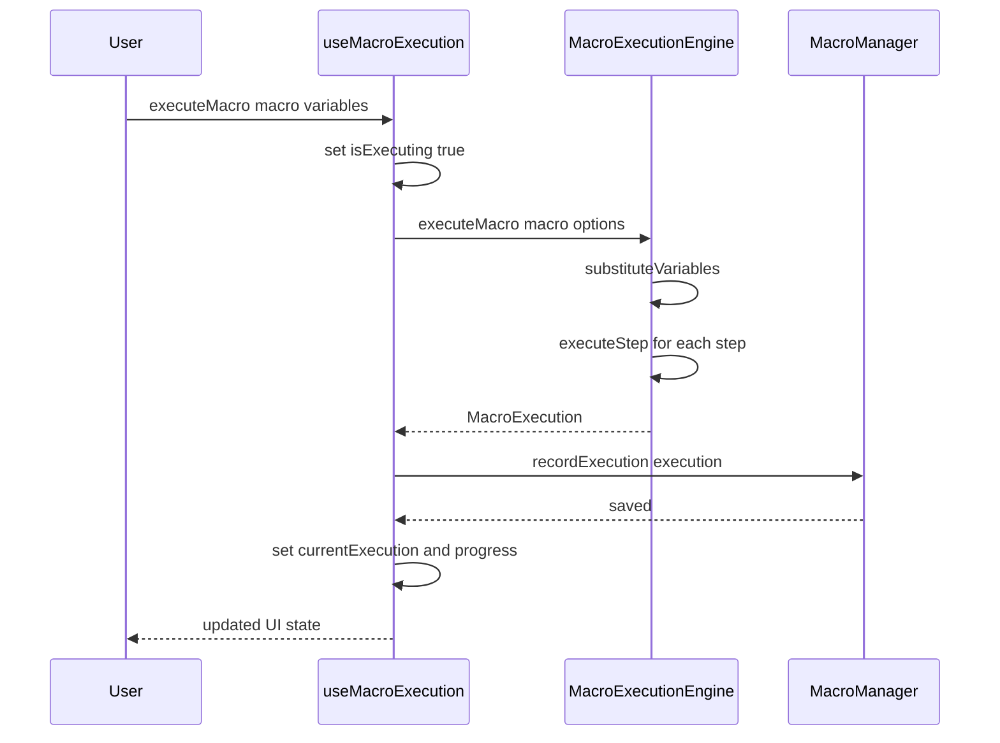
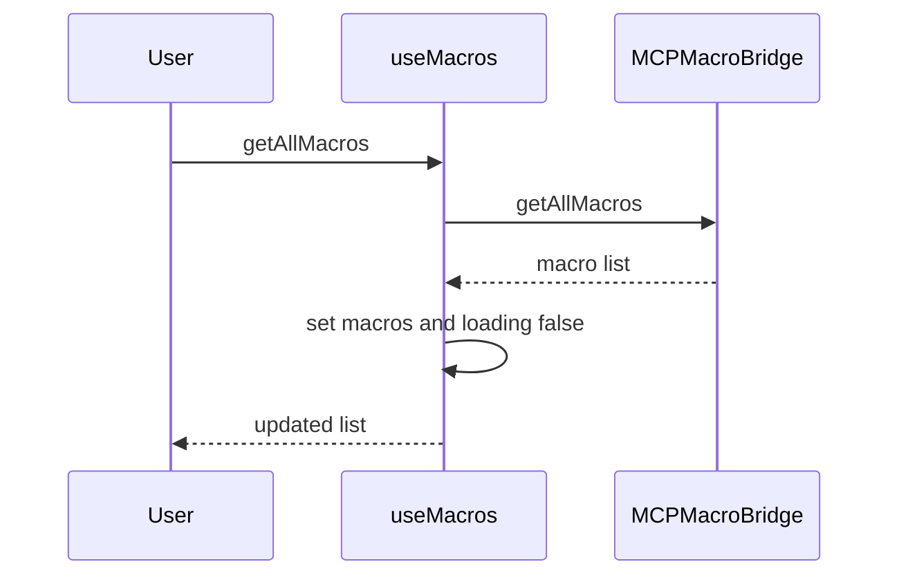
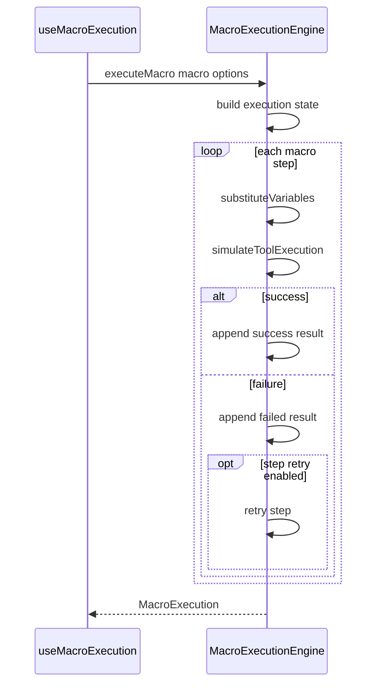
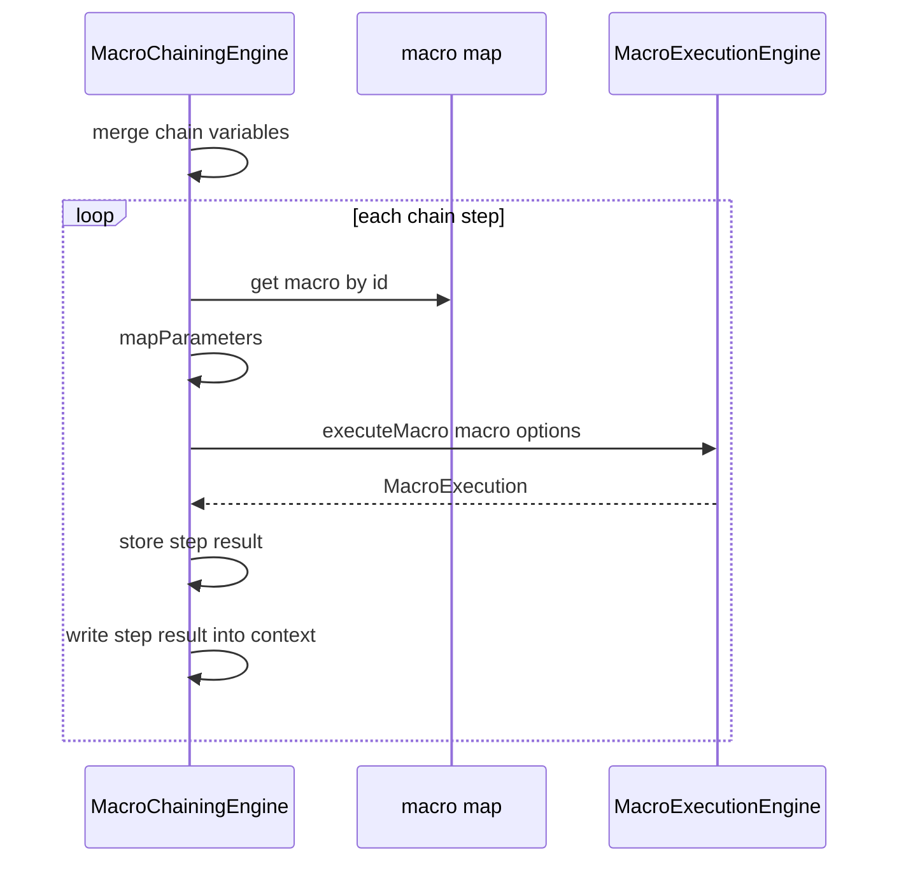
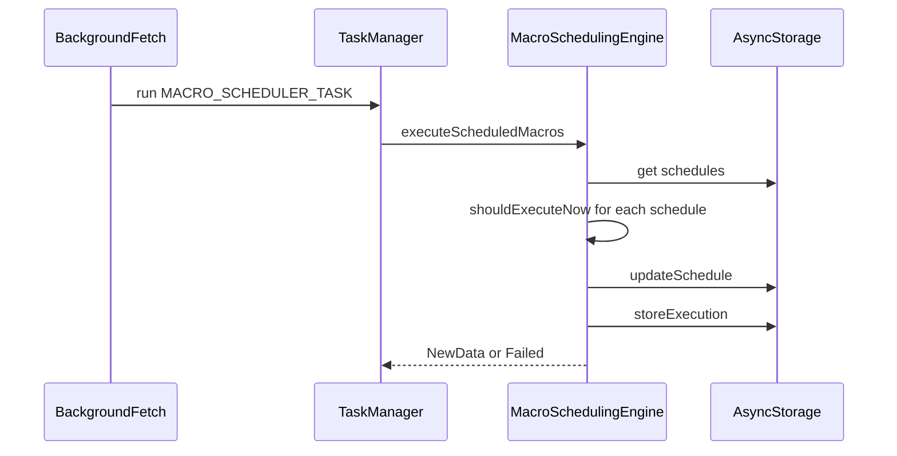
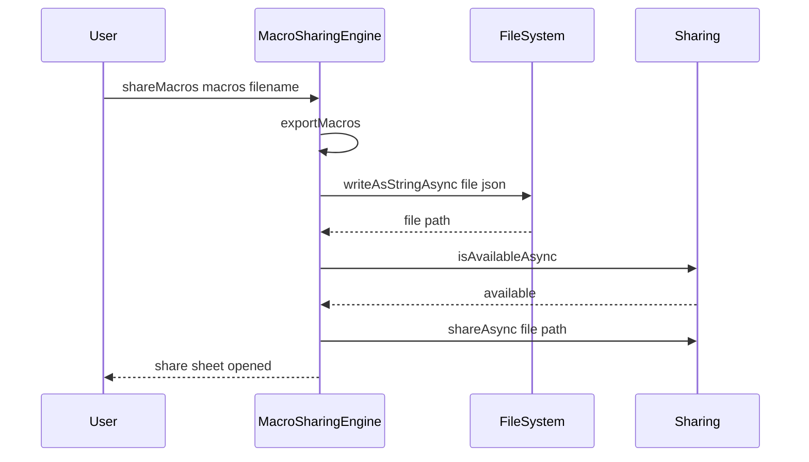
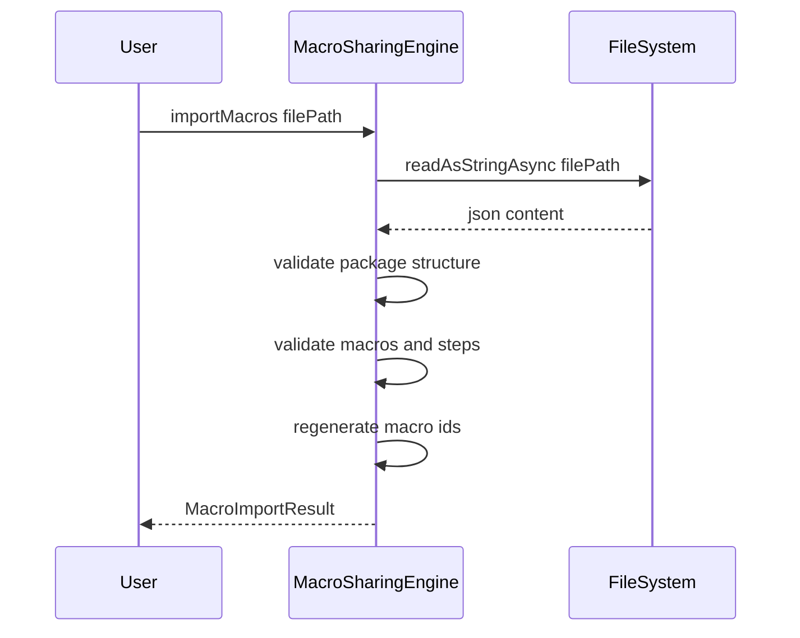
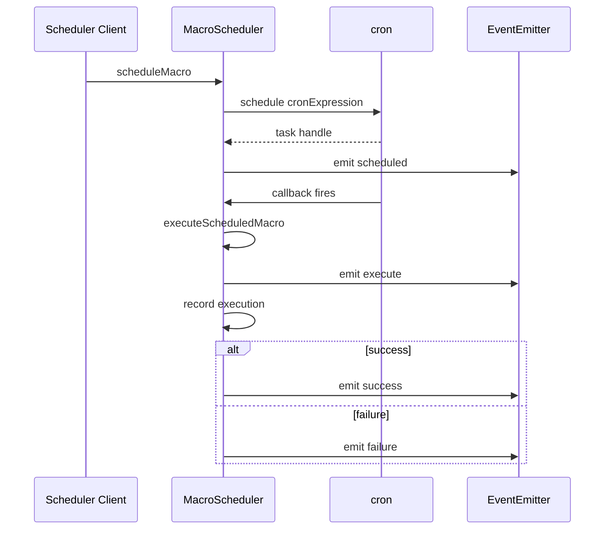

# Macro Management and Execution Domain

## Overview

This domain covers the runtime layer that actually runs macros, composes macros into chains, schedules macros in the background, and exports or imports them for sharing. In MCP Hub, these engines are the bridge between authored macro definitions and real execution behavior on device and on the server.

The user-facing value is straightforward: a macro can be played, paused, resumed, cancelled, chained into a multi-step automation, scheduled to run later, and packaged for sharing or backup. The implementation in this section is intentionally split across client-side hooks, local persistence, Expo services, and server-side execution helpers so execution can work both interactively and in scheduled background flows.

## Architecture Overview

```mermaid
flowchart TB
    subgraph PresentationLayer [Presentation Layer]
        UseMacroExecution[useMacroExecution hook]
        UseMacros[use-macros hook]
    end

    subgraph BusinessLayer [Business Layer]
        MacroExecutionEngine[MacroExecutionEngine]
        MacroChainingEngine[MacroChainingEngine]
        MacroSchedulingEngine[MacroSchedulingEngine]
        MacroSharingEngine[MacroSharingEngine]
        MacroManager[MacroManager]
        WorkflowEngine[WorkflowEngine]
        MacroScheduler[MacroScheduler]
    end

    subgraph InfrastructureLayer [Infrastructure Layer]
        AsyncStorage[AsyncStorage]
        TaskManager[TaskManager]
        BackgroundFetch[BackgroundFetch]
        FileSystem[FileSystem]
        Sharing[Sharing]
        MCPMacroBridge[MCPMacroBridge]
        Cron[cron]
        EventEmitter[EventEmitter]
    end

    UseMacroExecution --> MacroExecutionEngine
    UseMacroExecution --> MacroManager
    UseMacros --> MCPMacroBridge

    MacroExecutionEngine --> MacroManager
    MacroSchedulingEngine --> AsyncStorage
    MacroSchedulingEngine --> TaskManager
    MacroSchedulingEngine --> BackgroundFetch
    MacroSharingEngine --> FileSystem
    MacroSharingEngine --> Sharing
    MacroScheduler --> Cron
    MacroScheduler --> EventEmitter
    MacroScheduler --> MacroExecutionEngine
    MacroChainingEngine --> MacroExecutionEngine
    WorkflowEngine --> MacroExecutionEngine
```



## Presentation Layer

### `useMacroExecution`

*`lib/hooks/useMacroExecution.ts`*

This hook owns the interactive macro playback state for the React Native client. It loads macros, executes a selected macro with variable substitution and step callbacks, records the completed execution, and exposes pause, resume, and cancel controls through a single state object.

#### State

| Property | Type | Description |
| --- | --- | --- |
| `macros` | `Macro[]` | Macro list shown to the UI. |
| `currentExecution` | `MacroExecution \ | null` | Latest execution returned by `MacroExecutionEngine`. |
| `isExecuting` | `boolean` | Indicates an execution is in progress. |
| `isPaused` | `boolean` | Mirrors the local pause flag. |
| `error` | `string \ | null` | Last error message raised by hook actions. |
| `progress` | `number` | Completion percentage reported by the engine. |


#### Public Methods

| Method | Description |
| --- | --- |
| `loadMacros` | Loads all macros through `MacroManager.getAll()`. |
| `createFromHistory` | Builds a macro from execution history via `MacroManager.createFromExecutionHistory()`. |
| `createFromTemplate` | Creates a macro from a template via `MacroManager.createFromTemplate()`. |
| `executeMacro` | Runs a macro with variables and step callbacks. |
| `pauseExecution` | Pauses the active engine instance. |
| `resumeExecution` | Resumes the active engine instance. |
| `cancelExecution` | Cancels the active engine instance and updates hook state. |
| `deleteMacro` | Removes a macro through `MacroManager.deleteMacro()`. |
| `toggleFavorite` | Toggles favorite status through `MacroManager.toggleFavorite()`. |
| `getExecutionHistory` | Fetches execution history through `MacroManager.getExecutionHistory()`. |
| `exportMacro` | Exports a macro through `MacroManager.exportMacro()`. |
| `importMacro` | Imports a macro through `MacroManager.importMacro()`. |


#### Execution Flow

`executeMacro` does four things in order:

1. Marks the hook as executing and clears the error.
2. Calls `MacroExecutionEngine.executeMacro()` with variables, `stopOnError: false`, and step callbacks.
3. Persists the resulting execution with `MacroManager.recordExecution()`.
4. Stores the returned execution and final progress in hook state.

#### Sequence: Interactive Macro Playback



#### State Transitions

useMacroExecution passes retryFailedSteps: true, but MacroExecutionEngine.executeMacro() only retries when a step itself has retryOnFailure and maxRetries. The hook-level retry flag does not change the engine behavior.

- `isExecuting` becomes `true` when playback begins and returns to `false` after completion or failure.
- `isPaused` follows `pauseExecution` and `resumeExecution`.
- `progress` is driven by `onProgress` from the engine and ends at `100` on success.
- `error` is cleared at the start of each operation and filled on failure paths.

---

### `use-macros`

*`hooks/use-macros.ts`*

This hook is the native-bridge-facing macro manager used by the client to create, fetch, update, delete, execute, search, export, and import macros through `NativeModules.MCPMacroBridge`. It maintains a simpler UI state than `useMacroExecution`, centered on the current macro list and request status.

#### State

| Property | Type | Description |
| --- | --- | --- |
| `macros` | `Macro[]` | Macro list returned by the native bridge. |
| `loading` | `boolean` | Indicates a bridge call is in progress. |
| `error` | `string \ | null` | Last bridge error. |


#### Public Methods

| Method | Description |
| --- | --- |
| `createMacro` | Creates a macro through `MCPMacroBridge.createMacro()`. |
| `getMacro` | Fetches a macro by ID through `MCPMacroBridge.getMacro()`. |
| `getAllMacros` | Loads all macros through `MCPMacroBridge.getAllMacros()`. |
| `updateMacro` | Updates a macro through `MCPMacroBridge.updateMacro()`. |
| `deleteMacro` | Deletes a macro through `MCPMacroBridge.deleteMacro()`. |
| `executeMacro` | Executes a macro through `MCPMacroBridge.executeMacro()`. |
| `parseIntent` | Parses an intent string through `MCPMacroBridge.parseIntent()`. |
| `searchMacros` | Searches macros through `MCPMacroBridge.searchMacros()`. |
| `getStatistics` | Reads macro statistics through `MCPMacroBridge.getStatistics()`. |
| `exportMacros` | Exports macros through `MCPMacroBridge.exportMacros()`. |
| `importMacros` | Imports macros through `MCPMacroBridge.importMacros()`. |


#### Local Native Model

| Property | Type | Description |
| --- | --- | --- |
| `id` | `string` | Macro identifier returned by the bridge. |
| `name` | `string` | Macro name. |
| `description` | `string` | Macro description. |
| `intent` | `string` | Human-readable intent string. |
| `createdAt` | `number` | Creation timestamp in milliseconds. |
| `updatedAt` | `number` | Last update timestamp in milliseconds. |
| `isActive` | `boolean` | Active flag. |
| `executionCount` | `number` | Number of times the macro has been executed. |
| `lastExecutedAt` | `number \ | undefined` | Last execution timestamp. |
| `averageExecutionTime` | `number` | Rolling execution time in milliseconds. |


#### Execution Result Shape

| Property | Type | Description |
| --- | --- | --- |
| `macroId` | `string` | Macro identifier. |
| `macroName` | `string` | Macro name. |
| `startTime` | `number` | Execution start timestamp. |
| `endTime` | `number` | Execution end timestamp. |
| `duration` | `number` | Total runtime in milliseconds. |
| `status` | `"SUCCESS" \ | "FAILED" \ | "CANCELLED" \ | "TIMEOUT"` | Final status. |
| `error` | `string \ | undefined` | Failure message if execution failed. |
| `output` | `string \ | undefined` | Serialized output if produced. |


#### Sequence: Native Bridge Macro Management



## Business Layer

### `MacroExecutionEngine`

*`lib/engines/MacroExecutionEngine.ts`*

This engine runs a single macro step by step on the client, substituting variables into step parameters, simulating tool execution, and tracking progress and step outcomes. It is stateful per engine instance so pause, resume, and cancel operate on the current run.

#### Properties

| Property | Type | Description |
| --- | --- | --- |
| `currentExecution` | `MacroExecution \ | null` | Active execution state for the current macro run. |
| `isPaused` | `boolean` | Local pause flag checked between steps. |
| `isCancelled` | `boolean` | Local cancellation flag checked before each step. |


#### Constructor Dependencies

| Type | Description |
| --- | --- |
| `None` | The engine is instantiated directly and does not inject external services. |


#### Public Methods

| Method | Description |
| --- | --- |
| `executeMacro` | Executes a macro sequentially with progress callbacks, error handling, and optional retries. |
| `pause` | Pauses the current execution. |
| `resume` | Resumes a paused execution. |
| `cancel` | Cancels the current execution and marks it as failed. |
| `getCurrentExecution` | Returns the active execution object. |
| `isRunning` | Returns whether the engine is currently playing a macro. |
| `isPausedStatus` | Returns the current pause flag. |


#### Execution Options

| Property | Type | Description |
| --- | --- | --- |
| `variables` | `Record<string, any> \ | undefined` | Variable context passed to substitution. |
| `stopOnError` | `boolean \ | undefined` | Stops the macro on the first failing step. |
| `retryFailedSteps` | `boolean \ | undefined` | Present in the options shape, but not used by the engine logic. |
| `timeout` | `number \ | undefined` | Timeout passed to simulated tool execution. |
| `onStepComplete` | `((stepIndex: number, result: any, duration: number) => void) \ | undefined` | Called after successful steps. |
| `onStepError` | `((stepIndex: number, error: string) => void) \ | undefined` | Called after failed steps. |
| `onProgress` | `((progress: number) => void) \ | undefined` | Called after each completed step. |


#### Macro Execution Shape

| Property | Type | Description |
| --- | --- | --- |
| `id` | `string` | Execution identifier. |
| `macroId` | `string` | Macro identifier. |
| `macroName` | `string` | Macro name. |
| `startTime` | `number` | Start timestamp. |
| `endTime` | `number \ | undefined` | Completion timestamp. |
| `duration` | `number \ | undefined` | Total duration in milliseconds. |
| `status` | `MacroStatus` | Current execution status. |
| `currentStepIndex` | `number` | Index of the active step. |
| `totalSteps` | `number` | Number of steps in the macro. |
| `results` | `Array` | Step-by-step results. |
| `variables` | `Record<string, any> \ | undefined` | Execution variable context. |
| `error` | `string \ | undefined` | Failure message. |


#### Step Result Shape

| Property | Type | Description |
| --- | --- | --- |
| `stepId` | `string` | Step identifier. |
| `stepIndex` | `number` | Step index. |
| `toolName` | `string` | Tool name. |
| `result` | `any` | Tool result. |
| `duration` | `number` | Step duration in milliseconds. |
| `status` | `"SUCCESS" \ | "FAILED" \ | "TIMEOUT"` | Step status. |
| `error` | `string \ | undefined` | Failure message. |


#### Execution Behavior

- Steps execute in order from index `0` to `macro.steps.length - 1`.
- Parameter substitution replaces `${variable}` tokens in string values recursively through nested parameter objects.
- `simulateToolExecution()` is a placeholder that resolves after about 100 ms and returns the tool name, parameters, timestamp, and success flag.
- `timeout` is enforced only in the simulated tool path by rejecting when the timer fires first.
- On step failure, the engine records a failed step result and calls `onStepError`.
- If `stopOnError` is `true`, the macro fails immediately.
- If a step has `retryOnFailure` and `maxRetries`, the engine retries that step and overwrites the last result on success.
- `pause()` causes the run loop to wait in 100 ms intervals until resumed.
- `cancel()` flips the current run to failed and stops further step processing.

#### Sequence: Sequential Execution and Retry



cancel() only affects the active MacroExecutionEngine instance. A different engine instance is not impacted.

---

### `MacroChainingEngine`

*`lib/engines/MacroChainingEngine.ts`*

This engine composes multiple macros into a chain and runs them in order while passing results forward through the chain context. It supports per-step parameter mapping, dot-notation variable resolution, pause and resume controls, and a simple validation pass for chain integrity.

#### Properties

| Property | Type | Description |
| --- | --- | --- |
| `activeExecutions` | `Map<string, ChainExecution>` | Running chain executions keyed by execution ID. |


#### Constructor Dependencies

| Type | Description |
| --- | --- |
| `None` | The engine is static and does not inject external services. |


#### Public Methods

| Method | Description |
| --- | --- |
| `createChain` | Creates a new chain definition with IDs derived from the macro sequence. |
| `executeChain` | Executes the chain sequentially against a macro map. |
| `cancelExecution` | Removes an active chain execution from the tracking map. |
| `getExecutionStatus` | Returns the active chain execution if it is still tracked. |
| `validateChain` | Validates missing macros, duplicate macro IDs, and empty chains. |
| `estimateExecutionTime` | Estimates total runtime from macro step counts and step timeouts. |


#### Chain Data Shapes

##### `MacroChainStep`

| Property | Type | Description |
| --- | --- | --- |
| `order` | `number` | Step order in the chain definition. |
| `macroId` | `string` | Macro to execute. |
| `macroName` | `string` | Display name of the chained macro. |
| `parameterMappings` | `Record<string, string> \ | undefined` | Macro parameter to chain variable mapping. |
| `continueOnError` | `boolean` | Whether the chain proceeds after step failure. |
| `timeout` | `number \ | undefined` | Optional step timeout in milliseconds. |


##### `MacroChain`

| Property | Type | Description |
| --- | --- | --- |
| `id` | `string` | Chain identifier. |
| `name` | `string` | Chain name. |
| `description` | `string \ | undefined` | Optional chain description. |
| `macroIds` | `string[]` | Flattened list of macro IDs used by the chain. |
| `macroSequence` | `MacroChainStep[]` | Ordered step definitions. |
| `variables` | `Record<string, any>` | Chain-level variables. |
| `isEnabled` | `boolean` | Whether the chain is enabled. |
| `createdAt` | `number` | Creation timestamp. |
| `updatedAt` | `number` | Last update timestamp. |
| `usageCount` | `number` | How many times the chain has been used. |
| `lastExecutedAt` | `number \ | undefined` | Last execution timestamp. |


##### `ChainExecution`

| Property | Type | Description |
| --- | --- | --- |
| `id` | `string` | Chain execution identifier. |
| `chainId` | `string` | Chain identifier. |
| `startedAt` | `number` | Start timestamp. |
| `completedAt` | `number \ | undefined` | Completion timestamp. |
| `status` | `"running" \ | "success" \ | "failed" \ | "paused"` | Current chain state. |
| `currentStepIndex` | `number` | Index of the current chain step. |
| `stepResults` | `MacroExecution[]` | Macro execution results collected per step. |
| `errors` | `string[]` | Step or execution errors. |
| `isPaused` | `boolean` | Pause flag. |


#### Execution Behavior

- Chain variables are merged with runtime variables, with runtime values taking precedence.
- `mapParameters()` resolves each mapping through `resolveVariable()`, including dot notation.
- `buildContextFromResults()` writes `step_0_result`, `step_1_result`, and so on into the resumed context.
- Each macro step is executed by a fresh `MacroExecutionEngine` instance.
- Successful step results are stored in `stepResults` and added back into the context for later steps.
- If a macro is missing from the map, the chain records an error for that step.
- If `continueOnError` is `false`, the chain fails immediately on step error.

#### Sequence: Chained Macro Execution



#### Cancellation and Pausing

resumeExecution() restarts its loop at execution.currentStepIndex. If the paused step had already completed before pause, the resumed run can repeat that step.

- `pauseExecution()` marks the tracked chain execution as paused and sets status to `paused`.
- `cancelExecution()` removes the execution from `activeExecutions`.
- `getExecutionStatus()` only returns executions that are still stored in `activeExecutions`.

---

### `MacroSchedulingEngine`

*`lib/engines/MacroSchedulingEngine.ts`*

This engine stores macro schedules locally, registers an Expo background task, and periodically checks which schedules are due. It is built around AsyncStorage persistence and a 15-minute background fetch cadence.

#### Properties

| Property | Type | Description |
| --- | --- | --- |
| `isInitialized` | `boolean` | Guard that prevents background task registration from running twice. |


#### Constants

| Constant | Type | Description |
| --- | --- | --- |
| `TASK_NAME` | `string` | Background task identifier `MACRO_SCHEDULER_TASK`. |
| `STORAGE_KEY_SCHEDULES` | `string` | AsyncStorage key for schedules. |
| `STORAGE_KEY_EXECUTIONS` | `string` | AsyncStorage key for scheduled execution history. |


#### Constructor Dependencies

| Type | Description |
| --- | --- |
| `AsyncStorage` | Persists schedules and scheduled execution history. |
| `TaskManager` | Defines the Expo background task. |
| `BackgroundFetch` | Registers the task for periodic background execution. |


#### Public Methods

| Method | Description |
| --- | --- |
| `initialize` | Registers the background task and background fetch handler once. |
| `createSchedule` | Creates a schedule and persists it in AsyncStorage. |
| `getSchedules` | Loads all schedules from AsyncStorage. |
| `getSchedulesForMacro` | Filters schedules by macro ID. |
| `updateSchedule` | Updates a schedule and rewrites AsyncStorage. |
| `deleteSchedule` | Removes a schedule from AsyncStorage. |
| `executeScheduledMacros` | Scans schedules and records due executions. |
| `getExecutions` | Loads scheduled execution history from AsyncStorage. |


#### Schedule Data Shapes

##### `ScheduleFrequency`

`ONCE`, `DAILY`, `WEEKLY`, `MONTHLY`, `CUSTOM`

##### `MacroSchedule`

| Property | Type | Description |
| --- | --- | --- |
| `id` | `string` | Schedule identifier. |
| `macroId` | `string` | Macro to execute. |
| `frequency` | `ScheduleFrequency` | Schedule cadence. |
| `scheduledTime` | `string` | Time in `HH:mm` format. |
| `daysOfWeek` | `number[] \ | undefined` | Weekly day filter, `0-6` from Sunday to Saturday. |
| `dayOfMonth` | `number \ | undefined` | Monthly day filter. |
| `isEnabled` | `boolean` | Enable flag. |
| `lastExecutedAt` | `number \ | undefined` | Last run timestamp. |
| `nextExecutionAt` | `number \ | undefined` | Next computed run timestamp. |
| `createdAt` | `number` | Creation timestamp. |
| `updatedAt` | `number` | Update timestamp. |
| `retryCount` | `number` | Current retry counter. |
| `maxRetries` | `number` | Maximum retry count. |
| `notifyOnSuccess` | `boolean` | Success notification preference. |
| `notifyOnFailure` | `boolean` | Failure notification preference. |


##### `ScheduleExecution`

| Property | Type | Description |
| --- | --- | --- |
| `id` | `string` | Execution identifier. |
| `scheduleId` | `string` | Schedule identifier. |
| `macroId` | `string` | Macro identifier. |
| `executedAt` | `number` | Execution timestamp. |
| `status` | `"success" \ | "failed" \ | "pending"` | Execution status. |
| `result` | `any \ | undefined` | Optional execution result. |
| `error` | `string \ | undefined` | Error message if the execution failed. |
| `duration` | `number` | Duration in milliseconds. |


#### Execution Behavior

- `initialize()` defines `MACRO_SCHEDULER_TASK` through `TaskManager.defineTask()` and registers it through `BackgroundFetch.registerTaskAsync()`.
- `BackgroundFetch.registerTaskAsync()` is configured with `minimumInterval: 15 * 60`, `stopOnTerminate: false`, and `startOnBoot: true`.
- `createSchedule()` assigns defaults for `retryCount`, `maxRetries`, `notifyOnSuccess`, and `notifyOnFailure`.
- `shouldExecuteNow()` requires the current clock time to match the scheduled `HH:mm` value and then applies the selected frequency rule.
- `executeScheduledMacros()` updates `lastExecutedAt`, `nextExecutionAt`, and `retryCount` after success.
- When an error occurs, retry count is incremented up to `maxRetries`.
- `storeExecution()` appends to the local execution list and trims it to the last 1000 entries.
- `getExecutions()` can return the latest slice of history through its `limit` argument.

#### Sequence: Background Scheduled Run



#### Retry Behavior

executeScheduledMacros() creates a successful ScheduleExecution record without invoking a real macro runner in the shown code. The actual macro execution call is still a placeholder.

- Retry state is persisted per schedule with `retryCount`.
- The engine resets `retryCount` to `0` after a successful execution update.
- There is no backoff field applied in the shown execution path even though the schedule shape includes `maxRetries`.

---

### `MacroSharingEngine`

*`lib/engines/MacroSharingEngine.ts`*

This engine serializes macros into JSON files, shares them through the system share sheet, and imports them back from disk. It also creates a lightweight share link format for quick handoff and backup restore helpers.

#### Properties

| Property | Type | Description |
| --- | --- | --- |
| `SHARE_VERSION` | `string` | Share package version `1.0.0`. |
| `SHARE_MIME_TYPE` | `string` | MIME type `application/json`. |


#### Constructor Dependencies

| Type | Description |
| --- | --- |
| `FileSystem` | Reads and writes macro package files. |
| `Sharing` | Opens the platform share sheet and checks availability. |


#### Public Methods

| Method | Description |
| --- | --- |
| `exportMacros` | Writes a macro package to the app document directory. |
| `shareMacros` | Exports macros and opens the system share sheet. |
| `importMacros` | Reads and validates a macro package from disk. |
| `generateShareLink` | Creates a compact `mcphub://share/` link. |
| `parseShareLink` | Parses a share link back into a macro summary payload. |
| `exportSingleMacro` | Exports one macro with a file name derived from its name. |
| `createBackup` | Exports macros with a timestamped backup file name. |
| `restoreFromBackup` | Restores a backup by delegating to `importMacros`. |


#### Share Package Shapes

##### `MacroSharePackage`

| Property | Type | Description |
| --- | --- | --- |
| `version` | `string` | Share format version. |
| `exportedAt` | `number` | Export timestamp. |
| `macros` | `Macro[]` | Exported macros. |
| `metadata.count` | `number` | Macro count. |
| `metadata.totalSteps` | `number` | Total number of steps across all macros. |
| `metadata.exportedBy` | `string \ | undefined` | Optional exporter identity. |


##### `MacroImportResult`

| Property | Type | Description |
| --- | --- | --- |
| `imported` | `number` | Count of successfully imported macros. |
| `skipped` | `number` | Count of skipped macros. |
| `errors` | `string[]` | Validation or import errors. |
| `macros` | `Macro[]` | Newly created macro objects. |


#### Import Behavior

- The package must contain `version` and a `macros` array.
- Major version mismatches are reported in `errors` but do not abort the import.
- Each imported macro gets a new ID, new timestamps, `usageCount: 0`, `isFavorite: false`, and `version: 1`.
- Each step must include `toolName` and `serverId`.
- Invalid macro structure increments `skipped` and records an error.
- Invalid step structure throws and is captured per macro.

#### Sequence: Export and Share



#### Sequence: Import and Restore



generateShareLink() serializes only name, description, and step count, while parseShareLink() returns data.macros from that compact payload. The link format does not carry full macro definitions.

---

### `MacroManager` Support

*`lib/models/Macro.ts`*

This class is the local macro catalog and execution log store used by `useMacroExecution`. It persists macros and macro execution history in AsyncStorage and is the persistence boundary for the client-side macro library.

#### Properties

| Property | Type | Description |
| --- | --- | --- |
| `STORAGE_KEY` | `string` | Macro list storage key `mcp_macros`. |
| `EXECUTION_LOG_KEY` | `string` | Execution history storage key `mcp_macro_executions`. |
| `MAX_MACROS` | `number` | Maximum number of stored macros. |
| `MAX_EXECUTIONS` | `number` | Maximum number of stored execution records. |


#### Public Methods

| Method | Description |
| --- | --- |
| `createMacro` | Creates a new macro with generated IDs and timestamps. |
| `createFromTemplate` | Builds a macro from `MACRO_TEMPLATES`. |
| `recordExecution` | Stores a macro execution and increments usage. |
| `getExecutionHistory` | Reads stored executions filtered by macro ID. |
| `exportMacro` | Serializes a macro to formatted JSON. |
| `importMacro` | Parses a macro from JSON and persists it. |


#### Data Flow

- `createMacro()` appends a generated macro to the stored macro list and trims the list to `MAX_MACROS`.
- `recordExecution()` prepends execution records into `EXECUTION_LOG_KEY` and trims to `MAX_EXECUTIONS`.
- After storing an execution, it updates the macro usage count and `lastExecutedAt`.
- `getExecutionHistory()` filters by macro ID and returns the newest records first.

---

### `WorkflowEngine`

*`server/macros/workflow-engine.ts`*

This server-side engine is the workflow executor used by the backend workflow orchestration layer. It supports tool steps, conditional branches, loops, parallel execution, and delay steps, and it records execution history and errors in a context object.

#### Properties

| Property | Type | Description |
| --- | --- | --- |
| `context` | `WorkflowContext` | Current workflow execution context. |
| `steps` | `Map<string, WorkflowStep>` | Registered workflow steps. |
| `conditions` | `Map<string, WorkflowCondition>` | Registered conditional branches. |
| `loops` | `Map<string, WorkflowLoop>` | Registered loop definitions. |


#### Constructor Dependencies

| Type | Description |
| --- | --- |
| `None` | The engine creates its own in-memory context and maps. |


#### Public Methods

| Method | Description |
| --- | --- |
| `registerStep` | Registers a workflow step. |
| `registerCondition` | Registers a conditional branch. |
| `registerLoop` | Registers a loop. |
| `setVariable` | Stores a workflow variable. |
| `getVariable` | Reads a workflow variable. |
| `executeStep` | Executes one step and records execution history. |
| `executeWorkflow` | Runs a workflow starting from a step ID. |
| `pauseWorkflow` | Marks the workflow as paused. |
| `resumeWorkflow` | Clears the paused flag. |
| `stopWorkflow` | Stops the workflow by clearing the running flag. |
| `getContext` | Returns the current execution context. |
| `getExecutionHistory` | Returns execution records. |
| `getErrors` | Returns accumulated workflow errors. |
| `reset` | Resets the workflow context to the initial state. |


#### Data Shapes

##### `WorkflowContext`

| Property | Type | Description |
| --- | --- | --- |
| `variables` | `Record<string, any>` | Mutable workflow variables. |
| `executionHistory` | `ExecutionRecord[]` | Execution history for steps. |
| `currentStepId` | `string` | Current step identifier. |
| `isRunning` | `boolean` | Running flag. |
| `isPaused` | `boolean` | Pause flag. |
| `errors` | `WorkflowError[]` | Collected workflow errors. |


##### `WorkflowStep`

| Property | Type | Description |
| --- | --- | --- |
| `id` | `string` | Step identifier. |
| `type` | `"tool" \ | "condition" \ | "loop" \ | "parallel" \ | "delay"` | Step kind. |
| `name` | `string` | Step name. |
| `config` | `Record<string, any>` | Step configuration payload. |
| `nextStepId` | `string \ | undefined` | Next step identifier. |
| `onErrorStepId` | `string \ | undefined` | Error branch step identifier. |


##### `WorkflowLoop`

| Property | Type | Description |
| --- | --- | --- |
| `variableName` | `string` | Variable used for each iteration item. |
| `iterableVariable` | `string` | Name of the array variable to iterate over. |
| `bodyStepId` | `string` | Loop body step identifier. |
| `nextStepId` | `string \ | undefined` | Next step after the loop. |


##### `ExecutionRecord`

| Property | Type | Description |
| --- | --- | --- |
| `stepId` | `string` | Executed step ID. |
| `stepName` | `string` | Executed step name. |
| `type` | `string` | Step type. |
| `startTime` | `Date` | Start time. |
| `endTime` | `Date \ | undefined` | End time. |
| `duration` | `number \ | undefined` | Duration in milliseconds. |
| `status` | `"pending" \ | "running" \ | "success" \ | "failed" \ | "skipped"` | Step result. |
| `result` | `any \ | undefined` | Step output. |
| `error` | `string \ | undefined` | Step failure message. |


#### Execution Behavior

- `executeStep()` records a `running` execution record before dispatching to the step handler.
- Step types are dispatched through a `switch` statement for `tool`, `condition`, `loop`, `parallel`, and `delay`.
- Errors are appended to `context.errors` with timestamps and a recoverable flag.
- `executeWorkflow()` runs from the supplied start step until the workflow stops or no next step exists.
- `executeParallel()` uses `Promise.allSettled()` and returns counts for fulfilled and rejected steps.
- `executeLoop()` updates the loop variable for each item and continues past recoverable errors.

This engine is the runtime used by the workflow procedure layer in .

---

### `MacroScheduler`

*`server/scheduling/macro-scheduler.ts`*

This server-side scheduler manages cron, interval, and one-time scheduling for macros and emits lifecycle events as executions run. It tracks execution history in memory and computes basic run statistics per macro.

#### Properties

| Property | Type | Description |
| --- | --- | --- |
| `schedules` | `Map<string, ScheduledMacro>` | Active schedules keyed by macro ID. |
| `executionHistory` | `ExecutionRecord[]` | In-memory execution log. |
| `maxHistorySize` | `number` | Maximum retained execution records. |


#### Constructor Dependencies

| Type | Description |
| --- | --- |
| `cron` | Cron schedule parser and runner. |
| `EventEmitter` | Base event bus for schedule lifecycle events. |


#### Public Methods

| Method | Description |
| --- | --- |
| `scheduleMacro` | Creates a cron-based schedule. |
| `scheduleInterval` | Creates an interval-based schedule. |
| `scheduleOnce` | Creates a one-time schedule. |
| `stopSchedule` | Stops and removes an active schedule. |
| `pauseSchedule` | Marks a schedule disabled. |
| `resumeSchedule` | Marks a schedule enabled. |
| `getSchedule` | Returns one schedule by macro ID. |
| `getUserSchedules` | Returns all schedules for a user. |
| `getAllSchedules` | Returns every active schedule. |
| `getExecutionHistory` | Returns execution history with optional macro filtering. |
| `getExecutionStats` | Returns schedule statistics for one macro. |
| `cleanup` | Stops all schedules and clears in-memory state. |


#### Data Shapes

##### `ScheduleOptions`

| Property | Type | Description |
| --- | --- | --- |
| `retryOnFailure` | `boolean \ | undefined` | Retry flag for scheduled execution. |
| `maxRetries` | `number \ | undefined` | Maximum retries. |
| `retryDelay` | `number \ | undefined` | Retry delay. |
| `timeout` | `number \ | undefined` | Optional execution timeout. |
| `notifyOnSuccess` | `boolean \ | undefined` | Success notification flag. |
| `notifyOnFailure` | `boolean \ | undefined` | Failure notification flag. |


##### `ScheduledMacro`

| Property | Type | Description |
| --- | --- | --- |
| `id` | `string` | Schedule identifier. |
| `macroId` | `string` | Macro identifier. |
| `userId` | `string` | Owner user ID. |
| `cronExpression` | `string` | Cron expression or empty string for interval and one-time schedules. |
| `interval` | `number \ | undefined` | Interval in milliseconds. |
| `enabled` | `boolean` | Schedule enabled flag. |
| `createdAt` | `Date` | Creation time. |
| `lastRun` | `Date \ | null` | Last run time. |
| `nextRun` | `Date` | Next scheduled run. |
| `executionCount` | `number` | Total attempts. |
| `successCount` | `number` | Successful runs. |
| `failureCount` | `number` | Failed runs. |
| `totalDuration` | `number` | Cumulative duration. |
| `options` | `ScheduleOptions` | Schedule behavior options. |
| `task` | `any` | Cron, timer, or stop handle. |
| `oneTime` | `boolean \ | undefined` | Marks a single-use schedule. |


##### `ExecutionRecord`

| Property | Type | Description |
| --- | --- | --- |
| `macroId` | `string` | Macro identifier. |
| `userId` | `string` | Owner user ID. |
| `status` | `"success" \ | "failure"` | Execution outcome. |
| `duration` | `number` | Runtime in milliseconds. |
| `error` | `string \ | undefined` | Failure message. |
| `timestamp` | `Date` | Execution time. |


##### `ExecutionStats`

| Property | Type | Description |
| --- | --- | --- |
| `macroId` | `string` | Macro identifier. |
| `totalExecutions` | `number` | Total execution count. |
| `successfulExecutions` | `number` | Success count. |
| `failedExecutions` | `number` | Failure count. |
| `successRate` | `number` | Success percentage. |
| `averageDuration` | `number` | Average duration of successful runs. |
| `totalDuration` | `number` | Total duration across successful runs. |
| `lastRun` | `Date \ | null` | Last run time. |
| `nextRun` | `Date` | Next scheduled run. |


#### Event Bus

`MacroScheduler` extends `EventEmitter` and emits these lifecycle events:

- `scheduled`
- `execute`
- `success`
- `failure`
- `stopped`
- `paused`
- `resumed`

Each emitted payload carries macro ID and schedule context appropriate to the event type.

#### Execution Behavior

- `scheduleMacro()` validates the cron expression with `cron.validate()`.
- `scheduleInterval()` rejects intervals below 1000 ms.
- `scheduleOnce()` computes a delay from the target date and stops any prior schedule for the same macro ID.
- `executeScheduledMacro()` simulates macro execution, updates counts, and records history.
- `stopSchedule()` handles `stop`, `clearInterval`, and `clearTimeout` cleanup paths depending on the stored task shape.
- `calculateNextRun()` returns a placeholder one-hour-ahead time for cron expressions in the shown code.

#### Sequence: Server Scheduler Lifecycle



pauseSchedule() only flips enabled to false. The cron or timer callback still invokes executeScheduledMacro() directly, so the pause flag is not checked before execution in the shown code. [!NOTE] calculateNextRun() returns a placeholder one-hour-ahead timestamp for cron-based schedules. The nextRun value is not a true cron expansion.

---

## Supporting Infrastructure Services

### AsyncStorage Persistence

*Used by `MacroManager` and `MacroSchedulingEngine`*

| Consumer | Storage Key | Purpose |
| --- | --- | --- |
| `MacroManager` | `mcp_macros` | Stores the macro catalog. |
| `MacroManager` | `mcp_macro_executions` | Stores macro execution history. |
| `MacroSchedulingEngine` | `macro_schedules` | Stores background schedules. |
| `MacroSchedulingEngine` | `macro_executions` | Stores scheduled execution history. |


#### Data Flow

- `MacroManager.createMacro()`, `createFromTemplate()`, `recordExecution()`, `importMacro()`, and macro mutation methods rewrite the stored arrays.
- `MacroSchedulingEngine.createSchedule()`, `updateSchedule()`, `deleteSchedule()`, and `storeExecution()` rewrite the serialized schedule or execution arrays.
- Both engines trim history or catalog arrays to their configured maximum sizes after writes.

### Expo Task Manager and Background Fetch

*Used by `MacroSchedulingEngine`*

This service pair registers `MACRO_SCHEDULER_TASK` and schedules it to run periodically in the background. The task handler calls `executeScheduledMacros()` and maps success or failure to the Expo background fetch result enum.

#### Lifecycle

1. `initialize()` defines the task with `TaskManager.defineTask()`.
2. The task handler executes `executeScheduledMacros()`.
3. `BackgroundFetch.registerTaskAsync()` binds the task to the device lifecycle.
4. The handler returns `NewData` or `Failed` based on the execution outcome.

### Expo File System and Sharing

*Used by `MacroSharingEngine`*

`FileSystem` writes and reads share packages in the app document directory, and `Sharing` presents the file to the system share sheet. `shareMacros()` checks `Sharing.isAvailableAsync()` before it opens the share dialog.

### Native Module Bridge MCPMacroBridge

*Used by `use-macros.ts`*

The hook calls `NativeModules.MCPMacroBridge` for the macro catalog and execution actions. The bridge is the runtime boundary for the native macro implementation used by the app.

#### Bridge Calls Used by the Hook

- `createMacro`
- `getMacro`
- `getAllMacros`
- `updateMacro`
- `deleteMacro`
- `executeMacro`
- `parseIntent`
- `searchMacros`
- `getStatistics`
- `exportMacros`
- `importMacros`

### EventEmitter

*Used by `MacroScheduler`*

`MacroScheduler` uses the Node `EventEmitter` contract to publish schedule lifecycle events and execution outcomes. Those events carry macro IDs, durations, and error text so higher layers can react without polling.

---

## State Management

### `useMacroExecution` State Pattern

- `macros` holds the current macro catalog.
- `currentExecution` stores the most recent playback result.
- `isExecuting` and `isPaused` describe live playback control.
- `progress` is updated from engine callbacks.
- `error` is written by each asynchronous branch on failure.

### `use-macros` State Pattern

- `macros` is replaced after a full catalog refresh or after mutating operations.
- `loading` wraps every bridge call.
- `error` is cleared before each operation and filled only when the bridge throws.

### Engine Status Sets

- `MacroExecutionEngine`: `PLAYING`, `PAUSED`, `FAILED`, `COMPLETED`
- `ChainExecution`: `running`, `paused`, `failed`, `success`
- `ScheduleExecution`: `success`, `failed`, `pending`
- `MacroScheduler` schedule flag: `enabled` boolean
- `WorkflowEngine` context: `isRunning`, `isPaused`

## Integration Points

- `useMacroExecution` composes the interactive runtime with `MacroManager` persistence.
- `MacroChainingEngine` composes repeated `MacroExecutionEngine` runs into a single chain context.
- `MacroSchedulingEngine` composes with Expo background tasks to run due macros without UI interaction.
- `MacroSharingEngine` composes with file export and system sharing to move macros between devices or users.
- `WorkflowEngine` is the backend execution core used by the workflow orchestration layer in .
- `MacroScheduler` provides server-side cron and interval scheduling for macro execution workflows.

## Error Handling

### Engine-Level Error Paths

- `MacroExecutionEngine` records failed steps and can stop immediately when `stopOnError` is set.
- `MacroChainingEngine` appends step errors and optionally stops when `continueOnError` is `false`.
- `MacroSchedulingEngine` logs schedule failures and increments retry state when available.
- `MacroSharingEngine` wraps export and import failures in explicit `Error` messages.
- `MacroScheduler` records success and failure outcomes separately in history and emits failure events.

### Representative Pattern

```ts
try {
  const execution = await engine.executeMacro(macro, {
    variables,
    stopOnError: false,
    onProgress: (progress) => setState((prev) => ({ ...prev, progress })),
  });
  await MacroManager.recordExecution(execution);
} catch (error) {
  setState((prev) => ({ ...prev, error: error instanceof Error ? error.message : 'Execution failed' }));
}
```

## Dependencies

- React hooks: `useState`, `useCallback`, `useRef`
- `NativeModules.MCPMacroBridge`
- `@react-native-async-storage/async-storage`
- `expo-task-manager`
- `expo-background-fetch`
- `expo-file-system/legacy`
- `expo-sharing`
- `node-cron`
- Node `events`
- `MacroManager`
- `WorkflowEngine`
- `MacroExecutionEngine`

## Testing Considerations

- Verify step substitution for `${variable}` placeholders in nested parameter objects.
- Verify `pause()`, `resume()`, and `cancel()` against an active macro execution.
- Verify step retries only happen when `retryOnFailure` and `maxRetries` are present.
- Verify chain validation rejects missing macros, duplicate macro IDs, and empty chains.
- Verify `resumeExecution()` continues from the stored step index behavior.
- Verify background scheduling writes and reads `macro_schedules` and `macro_executions`.
- Verify `MacroSharingEngine` rejects invalid packages and regenerates IDs on import.
- Verify `MacroScheduler` emits all lifecycle events and trims execution history.

## Key Classes Reference

| Class | Responsibility |
| --- | --- |
| `MacroExecutionEngine.ts` | Sequential macro playback with substitution, pause, resume, cancel, and retries. |
| `MacroChainingEngine.ts` | Executes ordered macro chains and propagates results into chain context. |
| `MacroSchedulingEngine.ts` | Stores schedules locally and runs them through Expo background fetch. |
| `MacroSharingEngine.ts` | Exports, shares, imports, and backs up macros as JSON packages. |
| `MacroManager` | Persists macro catalog and execution logs in AsyncStorage. |
| `useMacroExecution.ts` | Client hook for playback state and execution actions. |
| `use-macros.ts` | Native bridge hook for catalog and execution actions. |
| `workflow-engine.ts` | Server workflow executor for tool, condition, loop, parallel, and delay steps. |
| `macro-scheduler.ts` | Server scheduler for cron, interval, and one-time macro runs. |
