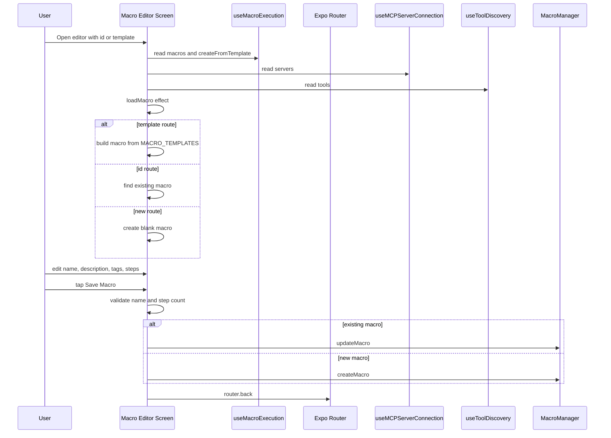
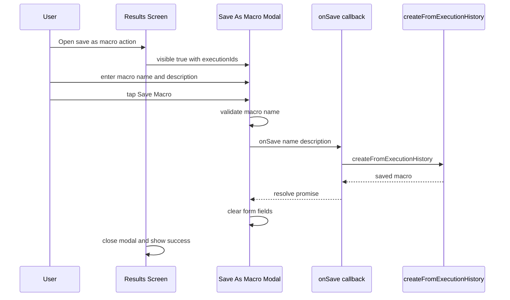
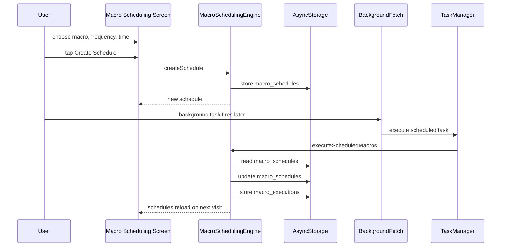
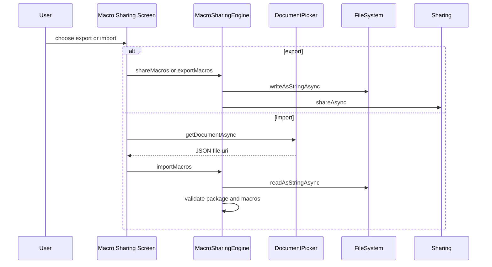
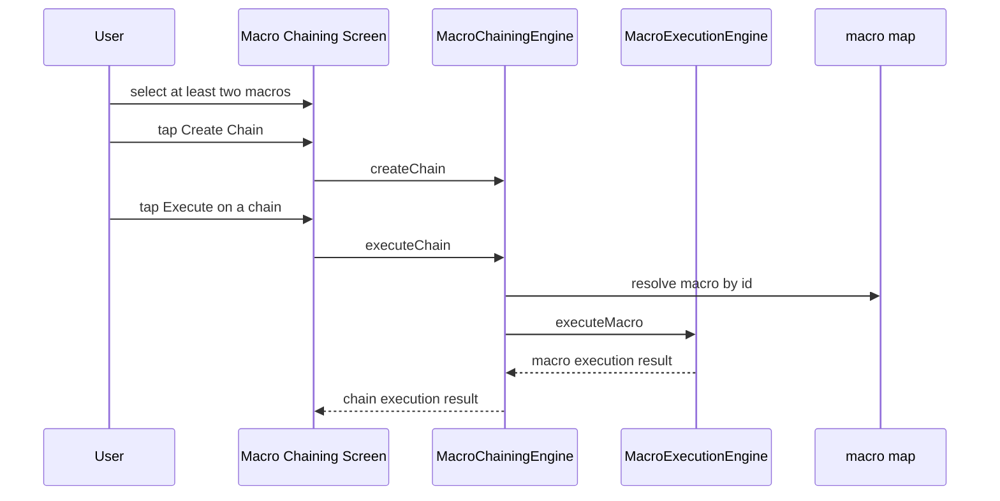
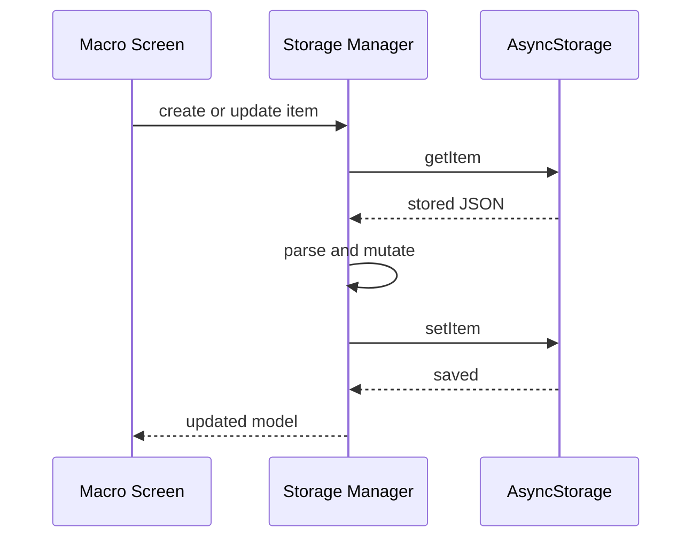
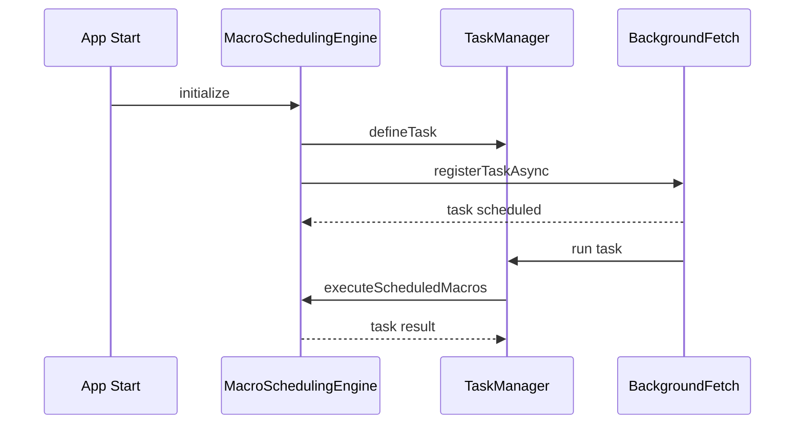
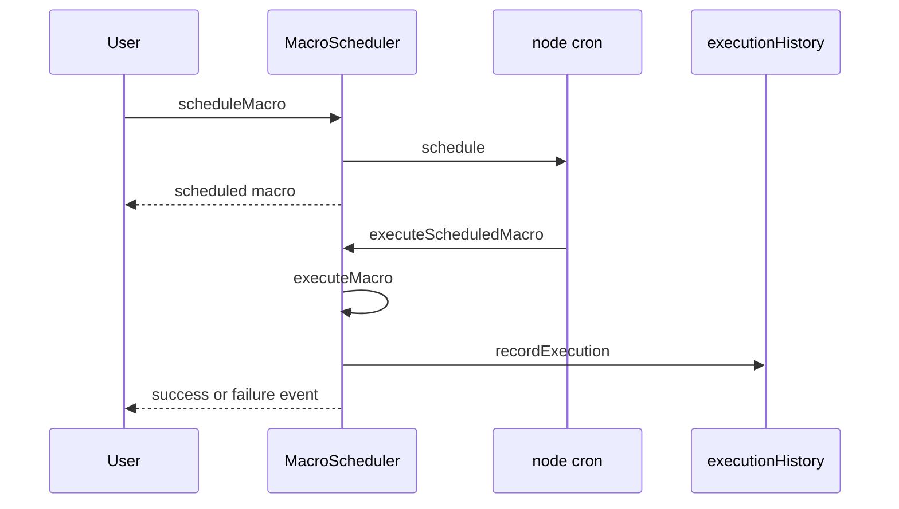
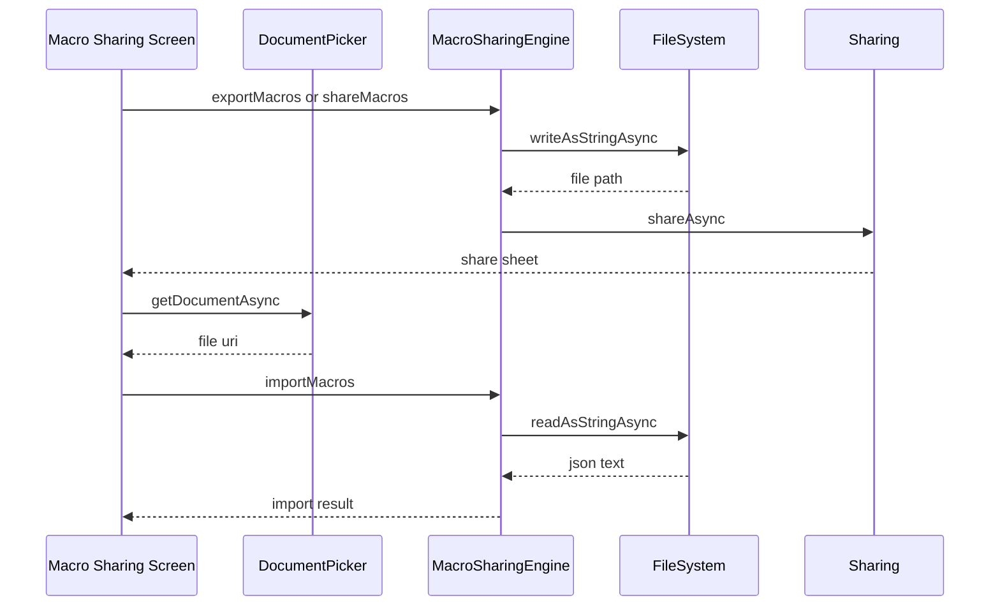

# Macro Management and Execution Domain

## Overview

This domain gives users multiple ways to create, refine, run, and reuse macros: editing from a list, starting from templates, recording by demonstration, chaining existing macros, scheduling automated runs, exporting or importing macro libraries, and capturing a finished execution back into a reusable macro. The screens are intentionally specialized, so each entry point matches a different user intent instead of forcing one long authoring wizard.

The UX is built around local React state, explicit validation, and modal-driven transitions. That makes each surface easy to enter from a different place in the app, but it also means the macro experience is distributed across many parallel routes: `macro-management`, `macro-editor`, `macro-recorder`, `macro-chaining`, `macro-scheduling`, `macro-sharing`, `macro-marketplace`, `workflow-templates`, `macro-debugger`, `macro-version-history`, `macro-comments`, and the `SaveAsMacroModal` capture flow from results.

## Architecture Overview

```mermaid
flowchart TB
  subgraph PresentationLayer[Presentation Layer]
    MG[Macro Management Screen]
    ME[Macro Editor Screen]
    MB[Macro Builder Screen]
    GA[Macro Gallery Screen]
    WT[Workflow Templates Screen]
    MP[Macro Marketplace Screen]
    MR[Macro Recorder Screen]
    MC[Macro Chaining Screen]
    MS[Macro Scheduling Screen]
    MUI[Macro Scheduler UI Screen]
    SH[Macro Sharing Screen]
    DB[Macro Debugger Screen]
    VH[Macro Version History Screen]
    CM[Macro Comments Screen]
    RS[Results Screen Save As Macro]
    SM[Save As Macro Modal]
  end

  subgraph BusinessLayer[Business Layer]
    UM[useMacros]
    UME[useMacroExecution]
    UW[useWorkflows]
    CW[useCreateWorkflow]
    SW[useSaveWorkflow]
    EW[useExecuteWorkflow]
    MCE[MacroChainingEngine]
    MSE[MacroSchedulingEngine]
    MSH[MacroSharingEngine]
    EHM[ExecutionHistoryManager]
    WTM[WorkflowTemplateManager]
    RDF[ResultDisplayFormatter]
    MM[MacroManager]
  end

  subgraph InfraLayer[Infrastructure and Storage]
    AS[AsyncStorage]
    TM[TaskManager]
    BF[BackgroundFetch]
    FS[FileSystem]
    SHS[Sharing]
    DP[DocumentPicker]
    EB[EventEmitter]
  end

  PresentationLayer --> BusinessLayer
  BusinessLayer --> InfraLayer
```

## Authoring Workflow and UX Topology

The app does not use one canonical macro editor. Instead, it splits authoring into several task-specific surfaces:

- **Create from scratch**: `macro-management.tsx` opens the `macro-editor.tsx` flow for naming, describing, and adding steps.
- **Start from a template**: `macro-editor.tsx` accepts a `template` route parameter and seeds a macro from `MACRO_TEMPLATES`.
- **Clone from a template library**: `workflow-templates.tsx` exposes cloned workflow templates for starter reuse.
- **Record by demonstration**: `macro-recorder.tsx` captures user actions and lets the user save them as a macro.
- **Save from a finished run**: `results.tsx` opens `SaveAsMacroModal.tsx` and serializes the selected execution into a reusable macro.
- **Compose existing macros**: `macro-chaining.tsx` builds higher-order chains from multiple saved macros.
- **Automate execution**: `macro-scheduling.tsx` and `macro-scheduler-ui.tsx` create schedules with different timing models.
- **Discover reusable content**: `macro-gallery.tsx` and `macro-marketplace.tsx` present templates and community macros.
- **Inspect and collaborate**: `macro-debugger.tsx`, `macro-version-history.tsx`, and `macro-comments.tsx` support troubleshooting, rollback, and review.

This layout lowers cognitive load for each task, but it also means users can enter the macro system from several different mental models. The visible labels and modal copy in each screen are therefore important because they tell the user whether they are editing, recording, chaining, scheduling, browsing, or capturing a result.

## Feature Flows

### 1. Create or Edit a Macro

### 2. Capture a Finished Execution as a Macro

### 3. Create and Run a Scheduled Macro

### 4. Export, Import, and Backup Macros

### 5. Build a Chain of Macros

## Component Structure

### 1. Presentation Layer

#### Macro Management Screen

In MacroChainingEngine.executeChain, the local variable named execution is redeclared for the per-macro run and then cast when pushing stepResults. The push targets the macro execution object rather than the outer chain execution record, so the returned chain state can lose its collected step history.

*`app/macro-management.tsx`*

This is the main management surface for existing macros. It renders a stats card, a create button, a list of macros, and a modal for naming a new macro.

**State**

| State | Type | Purpose |
| --- | --- | --- |
| `isLoading` | `boolean` | Controls create and delete loading states. |
| `refreshing` | `boolean` | Drives pull-to-refresh spinner state. |
| `showModal` | `boolean` | Opens and closes the create macro modal. |
| `newMacroName` | `string` | Draft macro name in the create modal. |
| `newMacroDescription` | `string` | Draft description in the create modal. |

**Methods**

| Method | Description |
| --- | --- |
| `macroToMacroItem` | Maps a macro into the list item shape used by the screen. |
| `handleRefresh` | Toggles the refresh control state and clears it after a short delay. |
| `handleCreateMacro` | Validates the form, calls `createMacro`, clears the form, and closes the modal. |
| `handleDeleteMacro` | Prompts before deleting a macro through `deleteMacro`. |
| `formatDate` | Formats the macro creation timestamp for display. |
| `renderMacroItem` | Renders a card with name, description, action count, date, and delete action. |

**UI states**

- **Empty**: Shows a `No Macros Yet` card when the hook returns an empty list.
- **Loading**: Renders skeleton cards while `isLoading` is true.
- **Content**: Shows the list with the create modal available.

---

#### Macro Editor Screen

*`app/(tabs)/macro-editor.tsx`*

This is the primary edit surface for a single macro. It supports three entry modes: load by `id`, seed from a `template`, or create a blank macro when neither parameter is present.

**State**

| State | Type | Purpose |
| --- | --- | --- |
| `macro` | `Macro \ | null` | Working macro being edited. |
| `isLoading` | `boolean` | Initial load state. |
| `isSaving` | `boolean` | Save button loading state. |
| `editingStepIndex` | `number \ | null` | Index of the step currently in edit mode. |

**Methods**

| Method | Description |
| --- | --- |
| `loadMacro` | Effect-driven loader that resolves the macro from template, existing id, or blank creation. |
| `handleSaveMacro` | Validates the macro, updates an existing one or creates a new one, and navigates back. |
| `handleAddStep` | Inserts a new step seeded with the first discovered server. |
| `handleRemoveStep` | Confirms and removes a step, then renumbers the remaining steps. |
| `handleUpdateStep` | Applies partial updates to a specific step. |

**Key behavior**

- Template creation uses `MACRO_TEMPLATES[templateKey]` and assigns fresh ids to the macro and each step.
- Existing macro editing reads from `macros` returned by `useMacroExecution`.
- New steps default to `servers[0]` and a blank `toolName`.
- Save validation requires a non-empty name and at least one step.

**UI states**

- **Loading**: Shows a full-screen activity indicator.
- **Empty**: The route falls back to a blank macro object rather than a separate empty state.
- **Content**: Shows editable fields, step cards, and save or cancel actions.

---

#### Macro Builder Screen

*`app/(tabs)/macro-builder.tsx`*

This screen is a workflow-oriented authoring surface. It manages a list of workflows, an editor tab, a create workflow modal, and a step picker for step types.

**Local interfaces**

| Property | Type | Description |
| --- | --- | --- |
| `Workflow.id` | `string` | Workflow identifier. |
| `Workflow.name` | `string` | Display name. |
| `Workflow.description` | `string` | Human-readable summary. |
| `Workflow.steps` | `WorkflowStep[]` | Ordered workflow steps. |
| `Workflow.createdAt` | `Date` | Creation timestamp. |
| `Workflow.lastModified` | `Date` | Last edit timestamp. |

| Property | Type | Description |
| --- | --- | --- |
| `WorkflowStep.id` | `string` | Step identifier. |
| `WorkflowStep.type` | `'tool' \ | 'condition' \ | 'loop' \ | 'parallel'` | Step kind. |
| `WorkflowStep.name` | `string` | Step label. |
| `WorkflowStep.config` | `Record<string, any>` | Step configuration payload. |
| `WorkflowStep.nextStepId` | `string \ | undefined` | Optional next step link. |

**State**

| State | Type | Purpose |
| --- | --- | --- |
| `workflows` | `Workflow[]` | Local workflow list copied from `useWorkflows`. |
| `activeTab` | `'list' \ | 'editor'` | Switches between list and editor views. |
| `selectedWorkflow` | `Workflow \ | null` | Workflow currently being edited. |
| `showNewModal` | `boolean` | Controls the create workflow modal. |
| `newWorkflowName` | `string` | Draft workflow name. |
| `newWorkflowDesc` | `string` | Draft workflow description. |
| `showStepPicker` | `boolean` | Controls the add step modal. |
| `selectedStepType` | `string \ | null` | Tracks the chosen step type. |

**Methods**

| Method | Description |
| --- | --- |
| `handleCreateWorkflow` | Calls `createWorkflow`, creates the local workflow record, and enters the editor tab. |
| `handleAddStep` | Appends a new workflow step of the selected type. |
| `handleDeleteStep` | Removes a step and updates the selected workflow state. |
| `handleSaveWorkflow` | Validates that the workflow has steps and calls `saveWorkflow`. |
| `getStepTypeInfo` | Finds metadata for a step type in `STEP_TYPES`. |
| `formatDate` | Formats dates for workflow cards. |

**STEP_TYPES**

`tool`, `condition`, `loop`, `parallel`

**UX notes**

- The top tab switch shows either the list or the editor.
- The step picker is a bottom-sheet style modal with a type-specific description for each step kind.
- The editor expects at least one step before save.

---

#### Macro Gallery Screen

*`app/(tabs)/macro-gallery.tsx`*

This is a lightweight discovery surface with a fixed set of example macros and a single call to action to browse all templates.

**Data shape**

| Property | Type | Description |
| --- | --- | --- |
| `id` | `string` | Macro card id. |
| `name` | `string` | Macro name. |
| `description` | `string` | Short summary. |
| `category` | `string` | Macro category label. |
| `uses` | `number` | Usage count shown on the card. |

**Behavior**

- Renders three sample cards: GitHub Issue to Slack, Daily Standup Report, and Notion Database Sync.
- Uses `Pressable` cards with category chips and use counts.
- Ends with a `Browse All Templates` button.

---

#### Workflow Templates Screen

*`app/(tabs)/workflow-templates.tsx`*

This screen presents pre-built workflow templates and lets the user clone them into a new workflow.

**Local interface**

| Property | Type | Description |
| --- | --- | --- |
| `Template.id` | `string` | Template identifier. |
| `Template.name` | `string` | Template name. |
| `Template.description` | `string` | Template summary. |
| `Template.category` | `string` | Category label. |
| `Template.tags` | `string[]` | Search and filter tags. |
| `Template.rating` | `number` | Template rating. |
| `Template.cloneCount` | `number` | Number of clones shown in UI. |

**State**

| State | Type | Purpose |
| --- | --- | --- |
| `templates` | `Template[]` | Source template list. |
| `filteredTemplates` | `Template[]` | Search and filter results. |
| `selectedCategory` | `string \ | null` | Category filter. |
| `searchText` | `string` | Search query. |
| `loading` | `boolean` | Clone button loading state. |

**Methods**

| Method | Description |
| --- | --- |
| `filterTemplates` | Applies category and text filters. |
| `handleCategoryChange` | Updates category and re-filters the list. |
| `handleSearch` | Updates search text and re-filters the list. |
| `handleCloneTemplate` | Simulates a clone action and shows a success alert. |
| `renderTemplateCard` | Renders a card with tags, rating, clone count, and clone action. |

**UX notes**

- The screen uses static mock templates in the visible code.
- Search matches name, description, and tags.
- Category chips include `multi-server`, `github`, `slack`, and `notion`.

---

#### Macro Marketplace Screen

*`app/macro-marketplace.tsx`*

This is a community-style browsing surface with search, category filters, sorting controls, a detail modal, ratings, and a download action.

**State**

| State | Type | Purpose |
| --- | --- | --- |
| `macros` | `any[]` | Loaded macro catalog. |
| `filteredMacros` | `any[]` | Search and filter result set. |
| `searchQuery` | `string` | Search text. |
| `selectedCategory` | `string \ | null` | Category filter. |
| `sortBy` | `string` | Sort selector state. |
| `isLoading` | `boolean` | Loading indicator for catalog and actions. |
| `selectedMacro` | `any \ | null` | Detail modal target. |

**Methods**

| Method | Description |
| --- | --- |
| `loadMacros` | Loads the mock macro catalog into local state. |
| `handleDownloadMacro` | Shows a success alert and closes the detail modal. |
| `handleRateMacro` | Shows a thank-you alert for the selected rating. |
| `renderMacroCard` | Renders the browseable list card. |
| `renderMacroDetail` | Renders the modal with rating, downloads, category, tags, and actions. |

**Categories**

`productivity`, `communication`, `social_media`, `entertainment`, `utilities`, `automation`, `other`

**Sort options**

`downloads`, `rating`, `newest`

The visible filtering effect updates the search and category results, but the sortBy state is not applied to the rendered list in the code shown. The sort controls change the UI state without changing the item order in the displayed list.

---

#### Macro Recorder Screen

*`app/macro-recorder.tsx`*

This screen captures a macro by demonstration. It lets the user name the macro first, then records synthetic tap, text, swipe, and wait actions while a timer runs.

**State**

| State | Type | Purpose |
| --- | --- | --- |
| `isRecording` | `boolean` | Recording session state. |
| `isPaused` | `boolean` | Pause state for the session timer and capture buttons. |
| `macroName` | `string` | Required macro name field. |
| `macroDescription` | `string` | Optional description field. |
| `recordedActions` | `any[]` | Captured action list. |
| `recordingDuration` | `number` | Elapsed recording time in milliseconds. |
| `selectedActionIndex` | `number \ | null` | Selected action row for delete controls. |

**Methods**

| Method | Description |
| --- | --- |
| `handleStartRecording` | Validates the name and starts a new session. |
| `handleStopRecording` | Stops recording and shows a summary alert. |
| `handleTogglePause` | Toggles paused state. |
| `handleRecordTap` | Adds a synthetic tap action with random coordinates. |
| `handleRecordText` | Adds a synthetic text input action. |
| `handleRecordSwipe` | Adds a synthetic swipe action. |
| `handleRecordWait` | Adds a wait action. |
| `handleDeleteAction` | Removes a selected action row. |
| `handleClearActions` | Confirms and clears all recorded actions. |
| `handleSaveMacro` | Validates the draft and clears state after success. |
| `formatDuration` | Formats milliseconds into a `seconds.millis` string. |

**Action shape**

| Field | Type | Description |
| --- | --- | --- |
| `id` | `string` | Action identifier. |
| `type` | `string` | Action type such as `tap`, `type_text`, `swipe`, or `wait`. |
| `timestamp` | `number` | Offset from recording start. |
| `description` | `string` | Human-readable action summary. |
| `x` | `number` | Synthetic tap x coordinate. |
| `y` | `number` | Synthetic tap y coordinate. |
| `text` | `string` | Recorded text value for text actions. |
| `direction` | `string` | Swipe direction. |
| `distance` | `number` | Swipe distance. |
| `duration` | `number` | Wait duration. |

**Timer behavior**

- A `useEffect` interval increments `recordingDuration` every 100 milliseconds while recording and not paused.
- The action buttons are only available during active, unpaused recording.

---

#### Macro Chaining Screen

*`app/(tabs)/macro-chaining.tsx`*

This screen composes multiple macros into a chain and runs them in sequence through `MacroChainingEngine`.

**Local interfaces**

| Property | Type | Description |
| --- | --- | --- |
| `MacroChain.id` | `string` | Chain identifier. |
| `MacroChain.name` | `string` | Chain name. |
| `MacroChain.description` | `string \ | undefined` | Optional description. |
| `MacroChain.macroIds` | `string[]` | Ids of macros in the chain. |
| `MacroChain.macroSequence` | `MacroChainStep[]` | Ordered step sequence. |
| `MacroChain.variables` | `Record<string, any>` | Chain-level variables. |
| `MacroChain.isEnabled` | `boolean` | Enabled state. |
| `MacroChain.createdAt` | `number` | Creation timestamp. |
| `MacroChain.updatedAt` | `number` | Last update timestamp. |
| `MacroChain.usageCount` | `number` | Execution count. |
| `MacroChain.lastExecutedAt` | `number \ | undefined` | Last execution time. |

| Property | Type | Description |
| --- | --- | --- |
| `MacroChainStep.order` | `number` | Step order. |
| `MacroChainStep.macroId` | `string` | Macro id to execute. |
| `MacroChainStep.macroName` | `string` | Display name for the step. |
| `MacroChainStep.parameterMappings` | `Record<string, string> \ | undefined` | Chain variable mapping. |
| `MacroChainStep.continueOnError` | `boolean` | Error continuation flag. |
| `MacroChainStep.timeout` | `number \ | undefined` | Per-step timeout in milliseconds. |

| Property | Type | Description |
| --- | --- | --- |
| `ChainExecution.id` | `string` | Execution identifier. |
| `ChainExecution.chainId` | `string` | Related chain id. |
| `ChainExecution.startedAt` | `number` | Start timestamp. |
| `ChainExecution.completedAt` | `number \ | undefined` | Completion timestamp. |
| `ChainExecution.status` | `'running' \ | 'success' \ | 'failed' \ | 'paused'` | Execution status. |
| `ChainExecution.currentStepIndex` | `number` | Current step pointer. |
| `ChainExecution.stepResults` | `MacroExecution[]` | Macro execution results. |
| `ChainExecution.errors` | `string[]` | Collected error messages. |
| `ChainExecution.isPaused` | `boolean` | Pause flag. |

**State**

| State | Type | Purpose |
| --- | --- | --- |
| `chains` | `MacroChain[]` | Local chain list. |
| `showCreateModal` | `boolean` | Controls create chain modal. |
| `chainName` | `string` | Draft chain name. |
| `selectedMacros` | `string[]` | Macro ids selected for the chain. |
| `isLoading` | `boolean` | Create and execute loading state. |

**Methods**

| Method | Description |
| --- | --- |
| `handleCreateChain` | Builds a `MacroChainStep[]` array and calls `MacroChainingEngine.createChain`. |
| `handleDeleteChain` | Confirms and removes a chain from local state. |
| `handleExecuteChain` | Calls `MacroChainingEngine.executeChain` with a macro map. |
| `toggleMacroSelection` | Adds or removes a macro id from selection. |
| `renderMacroSelector` | Renders the selectable macro list row. |
| `renderChainItem` | Renders a chain card with preview, execute, and delete actions. |

**UX notes**

- The create modal requires at least two macros before the Create button is enabled.
- The info box explicitly tells users that chains run in sequence and can continue on error.
- The preview shows only the first three steps, then collapses the rest into a `+N more` summary.

---

#### Macro Scheduling Screen

*`app/(tabs)/macro-scheduling.tsx`*

This is the persisted schedule management surface. It uses `MacroSchedulingEngine` to create, update, delete, and reload schedules.

**Local enum**

`ScheduleFrequency`: `ONCE`, `DAILY`, `WEEKLY`, `MONTHLY`, `CUSTOM`

**Local interface**

| Property | Type | Description |
| --- | --- | --- |
| `MacroSchedule.id` | `string` | Schedule identifier. |
| `MacroSchedule.macroId` | `string` | Scheduled macro id. |
| `MacroSchedule.frequency` | `ScheduleFrequency` | Frequency enum value. |
| `MacroSchedule.scheduledTime` | `string` | Time in `HH:mm` format. |
| `MacroSchedule.daysOfWeek` | `number[] \ | undefined` | Weekly day selection. |
| `MacroSchedule.dayOfMonth` | `number \ | undefined` | Monthly day selection. |
| `MacroSchedule.isEnabled` | `boolean` | Enabled state. |
| `MacroSchedule.lastExecutedAt` | `number \ | undefined` | Last execution timestamp. |
| `MacroSchedule.nextExecutionAt` | `number \ | undefined` | Next execution timestamp. |
| `MacroSchedule.createdAt` | `number` | Creation timestamp. |
| `MacroSchedule.updatedAt` | `number` | Last update timestamp. |
| `MacroSchedule.retryCount` | `number` | Retry counter. |
| `MacroSchedule.maxRetries` | `number` | Retry limit. |
| `MacroSchedule.notifyOnSuccess` | `boolean` | Success notification flag. |
| `MacroSchedule.notifyOnFailure` | `boolean` | Failure notification flag. |

**State**

| State | Type | Purpose |
| --- | --- | --- |
| `schedules` | `MacroSchedule[]` | Current schedule list. |
| `selectedMacroId` | `string \ | null` | Macro selected for scheduling. |
| `frequency` | `ScheduleFrequency` | Selected frequency. |
| `scheduledTime` | `string` | Draft time value. |
| `isLoading` | `boolean` | Create button loading state. |

**Methods**

| Method | Description |
| --- | --- |
| `loadSchedules` | Fetches all schedules from `MacroSchedulingEngine`. |
| `handleCreateSchedule` | Validates selection and creates a schedule. |
| `handleDeleteSchedule` | Confirms deletion and calls `deleteSchedule`. |
| `handleToggleSchedule` | Flips `isEnabled` for the chosen schedule. |
| `getMacroName` | Resolves a macro name from the loaded macro list. |
| `formatFrequency` | Converts the frequency enum to a readable label. |
| `renderScheduleItem` | Renders an active schedule card. |

**UI states**

- **Empty**: Shows a `No Schedules` message when no schedules are loaded.
- **Content**: Shows macro chips, frequency chips, time selector, create button, and active schedules.
- **Loading**: Disables the create action while a schedule is being created.

---

#### Macro Scheduler UI Screen

*`app/macro-scheduler-ui.tsx`*

This screen is a local schedule composer. It keeps schedule objects in component state instead of persistence storage, and it exposes cron, interval, and once modes in the same panel.

**State**

| State | Type | Purpose |
| --- | --- | --- |
| `schedules` | `any[]` | In-memory schedule list. |
| `showNewSchedule` | `boolean` | Controls the create form. |
| `scheduleType` | `'cron' \ | 'interval' \ | 'once'` | Selected schedule mode. |
| `cronExpression` | `string` | Cron input value. |
| `intervalMinutes` | `string` | Interval input value. |
| `executeTime` | `string` | One-time execute time. |
| `retryOnFailure` | `boolean` | Retry toggle. |
| `maxRetries` | `string` | Retry count input. |
| `notifyOnSuccess` | `boolean` | Success notification toggle. |
| `notifyOnFailure` | `boolean` | Failure notification toggle. |
| `selectedSchedule` | `any \ | null` | Selected schedule card. |

**Methods**

| Method | Description |
| --- | --- |
| `handleAddSchedule` | Validates timing fields and appends a new local schedule. |
| `handleToggleSchedule` | Enables or disables a local schedule. |
| `handleDeleteSchedule` | Confirms and removes a local schedule. |
| `formatInterval` | Formats minutes into `m`, `h`, or `d` labels. |
| `renderScheduleCard` | Renders a schedule card with status and delete action. |
| `renderNewScheduleForm` | Renders the schedule composer form. |

**Schedule object shape**

| Property | Type | Description |
| --- | --- | --- |
| `id` | `string` | Local schedule id. |
| `type` | `'cron' \ | 'interval' \ | 'once'` | Schedule mode. |
| `cronExpression` | `string \ | undefined` | Cron expression for cron mode. |
| `interval` | `number \ | undefined` | Milliseconds for interval mode. |
| `executeTime` | `string \ | undefined` | Time for one-time mode. |
| `enabled` | `boolean` | Active toggle. |
| `retryOnFailure` | `boolean` | Retry behavior. |
| `maxRetries` | `number` | Retry count. |
| `notifyOnSuccess` | `boolean` | Success notifications. |
| `notifyOnFailure` | `boolean` | Failure notifications. |
| `createdAt` | `Date` | Creation time. |
| `nextRun` | `Date` | Computed next run. |
| `lastRun` | `Date \ | null` | Last run time. |
| `executionCount` | `number` | Run count. |

---

#### Macro Sharing Screen

*`app/(tabs)/macro-sharing.tsx`*

This screen exports, imports, and backs up macros. It also supports multi-select export and file-based import through the document picker.

**State**

| State | Type | Purpose |
| --- | --- | --- |
| `selectedMacros` | `string[]` | Ids selected for export. |
| `isLoading` | `boolean` | Shared loading state for import, export, and backup. |
| `importedCount` | `number` | Number of imported macros. |

**Methods**

| Method | Description |
| --- | --- |
| `handleExport` | Exports selected macros using `MacroSharingEngine.shareMacros`. |
| `handleExportAll` | Exports the full macro list. |
| `handleImport` | Uses `DocumentPicker` to choose a JSON file and imports it. |
| `handleBackup` | Creates a backup file for all macros. |
| `toggleMacroSelection` | Adds or removes a macro from the selection. |
| `renderMacroItem` | Renders a selectable macro row. |

**UX notes**

- The selected-macro banner appears only when one or more macros are chosen.
- Import uses `application/json` as the picker filter.
- The screen clears selection after a successful export.

---

#### Macro Debugger Screen

*`app/macro-debugger.tsx`*

This is a step-through debugging UI with breakpoints, watches, and variable inspection.

**State**

| State | Type | Purpose |
| --- | --- | --- |
| `debugTab` | `'execution' \ | 'variables' \ | 'breakpoints' \ | 'watch'` | View switch. |
| `isPaused` | `boolean` | Pause toggle for execution controls. |
| `currentLine` | `number` | Current selected action line. |
| `newWatch` | `string` | Draft watch expression. |

**Static data shown in the UI**

- Actions with `line`, `type`, `target`, `duration`, `text`, `direction`, and `status`.
- Variables with `name`, `value`, and `type`.
- Breakpoints at lines `3`, `6`, and `10`.
- Watches with expressions like `$message.length`.

**Methods**

| Method | Description |
| --- | --- |
| `renderActionLine` | Renders a line entry with status and breakpoint markers. |
| `renderVariable` | Renders a variable row with a type chip. |

---

#### Macro Version History Screen

*`app/macro-version-history.tsx`*

This screen gives a local version history view with rollback and a diff panel.

**State**

| State | Type | Purpose |
| --- | --- | --- |
| `versions` | `any[]` | Version list shown in the UI. |
| `selectedVersion` | `any \ | null` | Selected version card. |
| `compareMode` | `boolean` | Compare toggle. |
| `compareVersion` | `any \ | null` | Second version used in comparison. |

**Visible version shape**

| Property | Type | Description |
| --- | --- | --- |
| `id` | `string` | Version identifier. |
| `versionNumber` | `number` | Version number. |
| `author` | `string` | Version author. |
| `timestamp` | `Date` | Version time. |
| `description` | `string` | Version summary. |
| `changes` | `number` | Change count. |
| `isReleased` | `boolean` | Release flag. |

**Methods**

| Method | Description |
| --- | --- |
| `handleRollback` | Prompts before rolling back to a chosen version. |
| `renderDiffView` | Renders the side-by-side comparison panel. |

---

#### Macro Comments Screen

*`app/macro-comments.tsx`*

This screen shows threaded comments on macro lines with replies, reactions, and resolution state.

**State**

| State | Type | Purpose |
| --- | --- | --- |
| `newComment` | `string` | Draft comment text. |
| `expandedThreads` | `Set<string>` | Expanded comment thread ids. |
| `selectedLine` | `number \ | null` | Line number currently selected. |

**Visible comment shape**

| Property | Type | Description |
| --- | --- | --- |
| `id` | `string` | Comment id. |
| `lineNumber` | `number` | Target macro line. |
| `author` | `string` | Comment author. |
| `content` | `string` | Comment body. |
| `createdAt` | `string` | Relative time label. |
| `resolved` | `boolean` | Resolution state. |
| `reactions` | `{ emoji: string; count: number }[]` | Reaction list. |
| `replies` | Comment reply objects | Nested thread responses. |

The visible code focuses on display and navigation rather than persistence. It uses a back button and a mock threaded comment dataset.

---

#### Schedule Workflow Entry Point

*`app/(tabs)/schedule-workflow.tsx`*

This file exposes a minimal scheduling entry action. The visible code shows a `Create Schedule` button and no additional state or flow in the provided snippet.

---

#### Results Screen Save As Macro Entry

*`app/(tabs)/results.tsx`*

This screen bridges execution results back into macro authoring. It renders `SaveAsMacroModal` with the selected execution id and saves the execution sequence as a reusable macro.

**Visible behavior**

- Passes `visible`, `executionIds`, `onSave`, and `onCancel` into `SaveAsMacroModal`.
- Builds the save callback through `handleSaveAsMacro`.
- On success, closes the modal and shows a success alert.
- Uses `ResultDisplayFormatter` for result display, copying, sharing, downloading, and format selection.

---

#### Save As Macro Modal

*`components/SaveAsMacroModal.tsx`*

This modal captures a finished run and turns it into a reusable macro. It is used from the results screen.

**Props**

| Property | Type | Description |
| --- | --- | --- |
| `visible` | `boolean` | Controls modal visibility. |
| `executionIds` | `string[]` | Execution ids that will be recorded as macro steps. |
| `onSave` | `(name: string, description?: string) => Promise<void>` | Save callback. |
| `onCancel` | `() => void` | Cancel callback. |
| `isLoading` | `boolean \ | undefined` | Optional loading override. |

**State**

| State | Type | Purpose |
| --- | --- | --- |
| `macroName` | `string` | Draft name. |
| `macroDescription` | `string` | Draft description. |
| `isSaving` | `boolean` | Modal-local save state. |

**Methods**

| Method | Description |
| --- | --- |
| `handleSave` | Validates the name, invokes `onSave`, and clears local fields. |
| `handleCancel` | Clears local fields and invokes `onCancel`. |

**Behavior**

- Tapping the backdrop cancels the modal.
- The modal blocks outside presses while saving.
- The info box shows the number of selected execution ids that will become macro steps.
- Name validation is required before save.

## 2. Business Layer

#### Macro Chaining Engine

*`lib/engines/MacroChainingEngine.ts`*

This class composes macros into chains, executes them, supports pause and resume, and performs basic chain validation and timing estimates.

**Properties**

| Property | Type | Description |
| --- | --- | --- |
| `activeExecutions` | `Map<string, ChainExecution>` | Tracks running chain executions. |

**Methods**

| Method | Description |
| --- | --- |
| `createChain` | Creates a new chain from a sequence of macro steps. |
| `executeChain` | Runs a chain through `MacroExecutionEngine`. |
| `pauseExecution` | Marks a running chain as paused. |
| `resumeExecution` | Continues a paused chain from the current step. |
| `cancelExecution` | Removes a chain execution from active tracking. |
| `getExecutionStatus` | Returns the in-memory execution record for an id. |
| `validateChain` | Checks for missing macros, duplicate macro ids, and empty chains. |
| `estimateExecutionTime` | Estimates chain runtime from macro step counts and step timeouts. |

**Local interfaces**

| Property | Type | Description |
| --- | --- | --- |
| `MacroChain.id` | `string` | Chain id. |
| `MacroChain.name` | `string` | Chain name. |
| `MacroChain.description` | `string \ | undefined` | Optional description. |
| `MacroChain.macroIds` | `string[]` | Macro ids in the chain. |
| `MacroChain.macroSequence` | `MacroChainStep[]` | Ordered step sequence. |
| `MacroChain.variables` | `Record<string, any>` | Chain variables. |
| `MacroChain.isEnabled` | `boolean` | Chain enabled flag. |
| `MacroChain.createdAt` | `number` | Creation time. |
| `MacroChain.updatedAt` | `number` | Update time. |
| `MacroChain.usageCount` | `number` | Usage count. |
| `MacroChain.lastExecutedAt` | `number \ | undefined` | Last execution time. |

| Property | Type | Description |
| --- | --- | --- |
| `MacroChainStep.order` | `number` | Step order. |
| `MacroChainStep.macroId` | `string` | Macro to execute. |
| `MacroChainStep.macroName` | `string` | Macro label. |
| `MacroChainStep.parameterMappings` | `Record<string, string> \ | undefined` | Macro parameter to chain variable mapping. |
| `MacroChainStep.continueOnError` | `boolean` | Error continuation flag. |
| `MacroChainStep.timeout` | `number \ | undefined` | Per-step timeout in milliseconds. |

| Property | Type | Description |
| --- | --- | --- |
| `ChainExecution.id` | `string` | Execution id. |
| `ChainExecution.chainId` | `string` | Related chain id. |
| `ChainExecution.startedAt` | `number` | Start time. |
| `ChainExecution.completedAt` | `number \ | undefined` | Completion time. |
| `ChainExecution.status` | `'running' \ | 'success' \ | 'failed' \ | 'paused'` | Execution state. |
| `ChainExecution.currentStepIndex` | `number` | Current step pointer. |
| `ChainExecution.stepResults` | `MacroExecution[]` | Macro execution results. |
| `ChainExecution.errors` | `string[]` | Error messages. |
| `ChainExecution.isPaused` | `boolean` | Pause state. |

---

#### Macro Scheduling Engine

*`lib/engines/MacroSchedulingEngine.ts`*

This class persists schedules to `AsyncStorage`, registers a background fetch task, and executes scheduled macros on a time-based cadence.

**Properties**

| Property | Type | Description |
| --- | --- | --- |
| `isInitialized` | `boolean` | Guards one-time background task registration. |

**Methods**

| Method | Description |
| --- | --- |
| `initialize` | Registers the background task and background fetch handler. |
| `createSchedule` | Creates a schedule and stores it in `AsyncStorage`. |
| `getSchedules` | Reads and parses stored schedules. |
| `getSchedulesForMacro` | Filters schedules by macro id. |
| `updateSchedule` | Updates a stored schedule. |
| `deleteSchedule` | Removes a stored schedule. |
| `executeScheduledMacros` | Scans schedules and runs those due now. |
| `getExecutions` | Reads stored execution records. |

**Local enum**

`ScheduleFrequency`: `once`, `daily`, `weekly`, `monthly`, `custom`

**Local interfaces**

| Property | Type | Description |
| --- | --- | --- |
| `MacroSchedule.id` | `string` | Schedule id. |
| `MacroSchedule.macroId` | `string` | Macro id. |
| `MacroSchedule.frequency` | `ScheduleFrequency` | Frequency enum. |
| `MacroSchedule.scheduledTime` | `string` | `HH:mm` time. |
| `MacroSchedule.daysOfWeek` | `number[] \ | undefined` | Weekly schedule days. |
| `MacroSchedule.dayOfMonth` | `number \ | undefined` | Monthly schedule day. |
| `MacroSchedule.isEnabled` | `boolean` | Enabled flag. |
| `MacroSchedule.lastExecutedAt` | `number \ | undefined` | Last execution timestamp. |
| `MacroSchedule.nextExecutionAt` | `number \ | undefined` | Next execution timestamp. |
| `MacroSchedule.createdAt` | `number` | Creation time. |
| `MacroSchedule.updatedAt` | `number` | Update time. |
| `MacroSchedule.retryCount` | `number` | Retry counter. |
| `MacroSchedule.maxRetries` | `number` | Retry cap. |
| `MacroSchedule.notifyOnSuccess` | `boolean` | Success notification flag. |
| `MacroSchedule.notifyOnFailure` | `boolean` | Failure notification flag. |

| Property | Type | Description |
| --- | --- | --- |
| `ScheduleExecution.id` | `string` | Execution id. |
| `ScheduleExecution.scheduleId` | `string` | Related schedule id. |
| `ScheduleExecution.macroId` | `string` | Macro id. |
| `ScheduleExecution.executedAt` | `number` | Execution timestamp. |
| `ScheduleExecution.status` | `'success' \ | 'failed' \ | 'pending'` | Execution state. |
| `ScheduleExecution.result` | `any \ | undefined` | Execution result payload. |
| `ScheduleExecution.error` | `string \ | undefined` | Error text if execution failed. |
| `ScheduleExecution.duration` | `number` | Duration in milliseconds. |

**Storage keys**

| Key | Purpose |
| --- | --- |
| `macro_schedules` | Persisted schedules. |
| `macro_executions` | Persisted schedule execution history. |

---

#### Macro Sharing Engine

*`lib/engines/MacroSharingEngine.ts`*

This class exports macros into JSON packages, shares them through the device share sheet, imports packages back into the app, and creates backups.

**Properties**

| Property | Type | Description |
| --- | --- | --- |
| `SHARE_VERSION` | `string` | Package version string. |
| `SHARE_MIME_TYPE` | `string` | MIME type used for the share sheet. |

**Methods**

| Method | Description |
| --- | --- |
| `exportMacros` | Serializes macros to a JSON file in the document directory. |
| `shareMacros` | Exports macros and opens the system share sheet. |
| `importMacros` | Reads, validates, and imports a JSON share package. |
| `generateShareLink` | Produces a custom scheme link for shareable macro metadata. |
| `parseShareLink` | Parses a custom scheme share link. |
| `exportSingleMacro` | Exports one macro with a derived filename. |
| `createBackup` | Exports a backup package with a timestamped filename. |
| `restoreFromBackup` | Imports a backup package. |

**Local interfaces**

| Property | Type | Description |
| --- | --- | --- |
| `MacroSharePackage.version` | `string` | Share package version. |
| `MacroSharePackage.exportedAt` | `number` | Export time. |
| `MacroSharePackage.macros` | `Macro[]` | Exported macros. |
| `MacroSharePackage.metadata` | `{ count: number; totalSteps: number; exportedBy?: string }` | Export summary. |

| Property | Type | Description |
| --- | --- | --- |
| `MacroImportResult.imported` | `number` | Imported macro count. |
| `MacroImportResult.skipped` | `number` | Skipped macro count. |
| `MacroImportResult.errors` | `string[]` | Import errors. |
| `MacroImportResult.macros` | `Macro[]` | Imported macro objects. |

**Import validation**

- Requires a package with `version` and a `macros` array.
- Rejects macros without a `name` or a `steps` array.
- Each step must include `toolName` and `serverId`.
- Imported macros receive new ids, timestamps, `usageCount = 0`, `isFavorite = false`, and `version = 1`.

---

#### Execution History Manager

*`lib/models/ExecutionHistory.ts`*

This manager stores execution history in `AsyncStorage`, supports filtering and statistics, and can export or import JSON history payloads.

**Properties**

| Property | Type | Description |
| --- | --- | --- |
| `STORAGE_KEY` | `string` | History storage key. |
| `MAX_HISTORY_SIZE` | `number` | Upper bound for stored executions. |

**Methods**

| Method | Description |
| --- | --- |
| `addExecution` | Prepends a new execution and trims stored history. |
| `getAll` | Reads all saved history entries. |
| `getFiltered` | Applies server, tool, status, date, and text filters. |
| `getById` | Returns a single entry by id. |
| `deleteExecution` | Removes one entry and saves the remaining list. |
| `deleteByServer` | Removes entries for a server. |
| `clearAll` | Deletes the stored history key. |
| `getStats` | Computes counts, averages, and top tools or servers. |
| `exportAsJson` | Serializes the full history. |
| `importFromJson` | Merges imported entries without duplicating ids. |

**Local types**

| Property | Type | Description |
| --- | --- | --- |
| `ExecutionStatus` | `SUCCESS, FAILED, TIMEOUT, CANCELLED, PARTIAL` | Stored execution status values. |
| `ExecutionError.code` | `string` | Error code. |
| `ExecutionError.message` | `string` | Error message. |
| `ExecutionError.details` | `Record<string, any> \ | undefined` | Optional error details. |

| Property | Type | Description |
| --- | --- | --- |
| `ExecutionHistoryEntry.id` | `string` | Entry id. |
| `ExecutionHistoryEntry.serverId` | `string` | Server id. |
| `ExecutionHistoryEntry.serverName` | `string` | Server name. |
| `ExecutionHistoryEntry.toolName` | `string` | Tool name. |
| `ExecutionHistoryEntry.toolDescription` | `string \ | undefined` | Optional tool description. |
| `ExecutionHistoryEntry.parameters` | `Record<string, any>` | Input parameters. |
| `ExecutionHistoryEntry.result` | `any` | Execution result. |
| `ExecutionHistoryEntry.resultType` | `string` | Result type label. |
| `ExecutionHistoryEntry.resultSize` | `number` | Result size in bytes. |
| `ExecutionHistoryEntry.timestamp` | `number` | Execution timestamp. |
| `ExecutionHistoryEntry.executionTimeMs` | `number` | Runtime duration. |
| `ExecutionHistoryEntry.status` | `ExecutionStatus` | Execution status. |
| `ExecutionHistoryEntry.error` | `ExecutionError \ | undefined` | Optional error record. |
| `ExecutionHistoryEntry.tags` | `string[] \ | undefined` | Optional tags. |
| `ExecutionHistoryEntry.notes` | `string \ | undefined` | Optional notes. |

| Property | Type | Description |
| --- | --- | --- |
| `ExecutionHistoryFilter.serverId` | `string \ | undefined` | Server filter. |
| `ExecutionHistoryFilter.toolName` | `string \ | undefined` | Tool filter. |
| `ExecutionHistoryFilter.status` | `ExecutionStatus \ | undefined` | Status filter. |
| `ExecutionHistoryFilter.dateFrom` | `number \ | undefined` | Start timestamp. |
| `ExecutionHistoryFilter.dateTo` | `number \ | undefined` | End timestamp. |
| `ExecutionHistoryFilter.searchText` | `string \ | undefined` | Search text. |
| `ExecutionHistoryFilter.limit` | `number \ | undefined` | Page size. |
| `ExecutionHistoryFilter.offset` | `number \ | undefined` | Page offset. |

| Property | Type | Description |
| --- | --- | --- |
| `ExecutionHistoryStats.totalExecutions` | `number` | Total count. |
| `ExecutionHistoryStats.successCount` | `number` | Success count. |
| `ExecutionHistoryStats.failureCount` | `number` | Failure count. |
| `ExecutionHistoryStats.timeoutCount` | `number` | Timeout count. |
| `ExecutionHistoryStats.averageExecutionTimeMs` | `number` | Mean runtime. |
| `ExecutionHistoryStats.mostUsedTools` | `{ toolName: string; count: number }[]` | Top tools list. |
| `ExecutionHistoryStats.mostUsedServers` | `{ serverId: string; serverName: string; count: number }[]` | Top servers list. |

---

#### Workflow Template Manager

*`server/templates/workflow-templates.ts`*

This manager supplies starter templates and supports cloning with variable overrides. It is the backing template source for template-first authoring flows.

**Properties**

| Property | Type | Description |
| --- | --- | --- |
| `templates` | `Map<string, WorkflowTemplate>` | In-memory template registry. |

**Methods**

| Method | Description |
| --- | --- |
| `getAllTemplates` | Returns public templates. |
| `getTemplate` | Returns one template or `null`. |
| `cloneTemplate` | Copies a template into a private workflow and applies overrides. |
| `searchTemplates` | Filters by category, tags, and search text. |

**Local interfaces**

| Property | Type | Description |
| --- | --- | --- |
| `WorkflowTemplate.id` | `string` | Template id. |
| `WorkflowTemplate.name` | `string` | Template name. |
| `WorkflowTemplate.description` | `string` | Template summary. |
| `WorkflowTemplate.category` | `'github' \ | 'slack' \ | 'notion' \ | 'multi-server' \ | 'custom'` | Template category. |
| `WorkflowTemplate.steps` | `TemplateStep[]` | Template steps. |
| `WorkflowTemplate.variables` | `TemplateVariable[]` | Template variables. |
| `WorkflowTemplate.tags` | `string[]` | Tags. |
| `WorkflowTemplate.author` | `string` | Author label. |
| `WorkflowTemplate.version` | `string` | Template version. |
| `WorkflowTemplate.createdAt` | `Date` | Creation date. |
| `WorkflowTemplate.updatedAt` | `Date` | Update date. |
| `WorkflowTemplate.isPublic` | `boolean` | Public visibility. |
| `WorkflowTemplate.cloneCount` | `number` | Clone count. |
| `WorkflowTemplate.rating` | `number` | Template rating. |
| `WorkflowTemplate.documentation` | `string` | Template description text. |

| Property | Type | Description |
| --- | --- | --- |
| `TemplateStep.id` | `string` | Step id. |
| `TemplateStep.name` | `string` | Step name. |
| `TemplateStep.description` | `string` | Step description. |
| `TemplateStep.serverId` | `string` | Target server id. |
| `TemplateStep.serverType` | `'github' \ | 'slack' \ | 'notion'` | Server type. |
| `TemplateStep.toolName` | `string` | Tool name. |
| `TemplateStep.parameters` | `Record<string, unknown>` | Input parameters. |
| `TemplateStep.condition` | `string \ | undefined` | Optional condition. |
| `TemplateStep.retryPolicy` | `{ maxRetries: number; backoffMs: number } \ | undefined` | Retry policy. |
| `TemplateStep.timeout` | `number \ | undefined` | Timeout in milliseconds. |

| Property | Type | Description |
| --- | --- | --- |
| `TemplateVariable.id` | `string` | Variable id. |
| `TemplateVariable.name` | `string` | Variable name. |
| `TemplateVariable.type` | `'string' \ | 'number' \ | 'boolean' \ | 'array' \ | 'object'` | Variable type. |
| `TemplateVariable.description` | `string` | Variable description. |
| `TemplateVariable.defaultValue` | `unknown \ | undefined` | Optional default value. |
| `TemplateVariable.required` | `boolean` | Required flag. |
| `TemplateVariable.options` | `unknown[] \ | undefined` | Optional allowed values. |

| Property | Type | Description |
| --- | --- | --- |
| `TemplateCloneInput.templateId` | `string` | Template to clone. |
| `TemplateCloneInput.newName` | `string` | Name for the cloned workflow. |
| `TemplateCloneInput.variables` | `Record<string, unknown> \ | undefined` | Optional override values. |

---

#### Result Display Formatter

*`lib/utils/ResultDisplayFormatter.ts`*

This utility formats execution results for on-screen display and downloadable export.

**Properties**

| Property | Type | Description |
| --- | --- | --- |
| `MAX_DISPLAY_SIZE` | `number` | Maximum displayable content size. |
| `LARGE_THRESHOLD` | `number` | Threshold for large result metadata. |

**Methods**

| Method | Description |
| --- | --- |
| `formatResult` | Converts raw results into a display format with metadata. |
| `toDownloadable` | Produces a data URI, filename, and MIME type for download. |
| `getAvailableFormats` | Returns allowed display formats for a result type. |

## 3. Infrastructure Services

### AsyncStorage

*Used by `MacroSchedulingEngine` and `ExecutionHistoryManager`*

This service stores schedule and execution data locally. The visible code reads and writes through fixed storage keys and trims old entries before persistence.

**Writers and readers**

| Class | Reads | Writes | Key |
| --- | --- | --- | --- |
| `MacroSchedulingEngine` | `getSchedules`, `getExecutions` | `createSchedule`, `updateSchedule`, `deleteSchedule`, `storeExecution` | `macro_schedules`, `macro_executions` |
| `ExecutionHistoryManager` | `getAll`, `getFiltered`, `getById`, `getStats` | `addExecution`, `deleteExecution`, `deleteByServer`, `clearAll`, `importFromJson` | `mcp_execution_history` |

**Lifecycle**

1. A screen calls a schedule or history manager.
2. The manager reads JSON text from `AsyncStorage`.
3. The manager parses, mutates, and writes the updated JSON string back.
4. List screens reload from the manager after create, update, or delete actions.

**Sequence**

---

### Background Fetch and Task Manager

*Used by `MacroSchedulingEngine.initialize`*

The scheduling engine registers one background task and one background fetch job. The initialization guard prevents duplicate registration.

**Lifecycle**

| Step | Behavior |
| --- | --- |
| `initialize` | Exits early if already initialized. |
| Task definition | Calls `TaskManager.defineTask` with the macro scheduler task name. |
| Fetch registration | Calls `BackgroundFetch.registerTaskAsync` with a 15 minute minimum interval. |
| Task run | Invokes `executeScheduledMacros`. |
| Task result | Returns `NewData` on success or `Failed` on error. |

**Sequence**

---

### EventEmitter

*Used by `MacroScheduler`*

`MacroScheduler` extends `EventEmitter` and emits lifecycle events for schedule creation, execution, pause, resume, stop, success, and failure.

**Properties**

| Property | Type | Description |
| --- | --- | --- |
| `schedules` | `Map<string, ScheduledMacro>` | Active schedules keyed by macro id. |
| `executionHistory` | `ExecutionRecord[]` | In-memory execution log. |
| `maxHistorySize` | `number` | Cap for the execution log. |

**Emitted events**

`scheduled`, `execute`, `success`, `failure`, `stopped`, `paused`, `resumed`

**Methods**

| Method | Description |
| --- | --- |
| `scheduleMacro` | Schedules a cron-based macro run. |
| `scheduleInterval` | Schedules a repeating interval run. |
| `scheduleOnce` | Schedules a one-time run. |
| `stopSchedule` | Stops and removes an active schedule. |
| `pauseSchedule` | Disables a schedule without removing it. |
| `resumeSchedule` | Re-enables a paused schedule. |
| `getSchedule` | Returns one active schedule or `null`. |
| `getUserSchedules` | Returns all active schedules for a user. |
| `getAllSchedules` | Returns every active schedule. |
| `getExecutionHistory` | Returns recent execution records. |
| `getExecutionStats` | Returns aggregate execution statistics. |
| `cleanup` | Stops all schedules and clears memory. |

**Sequence**

---

### File System and Sharing

*Used by `MacroSharingEngine` and `app/(tabs)/macro-sharing.tsx`*

This pipeline writes JSON exports to the document directory, reads them back during import, and hands files off to the device share sheet.

**File flow**

| Step | Service | Behavior |
| --- | --- | --- |
| Export | `FileSystem.writeAsStringAsync` | Writes the package JSON to a file under `documentDirectory`. |
| Share | `Sharing.shareAsync` | Opens the system share sheet with `application/json`. |
| Import | `DocumentPicker.getDocumentAsync` | Lets the user choose a JSON file. |
| Read | `FileSystem.readAsStringAsync` | Reads the chosen JSON file. |
| Validate | `MacroSharingEngine.importMacros` | Checks version and macro structure. |

**Sequence**

## State Management

### Local UI state with effect-driven hydration

The macro surfaces rely on screen-local `useState`, `useEffect`, and `useCallback` instead of a global editor store.

- **Hydration on mount**: `macro-editor.tsx`, `macro-scheduling.tsx`, `macro-marketplace.tsx`, `workflow-templates.tsx`, and `macro-builder.tsx` each populate state in `useEffect`.
- **Derived lists**: `filteredMacros` and `filteredTemplates` are derived from search and category state.
- **Selection state**: `selectedMacros`, `selectedMacro`, `selectedVersion`, `selectedLine`, and `selectedSchedule` drive modal and detail panels.
- **Validation gates**: create, save, and export actions are blocked with `Alert.alert` until required inputs are present.
- **Nested scroll handling**: several list views set `scrollEnabled={false}` because they are already inside a `ScrollView`.

### Timing and lifecycle patterns

- `macro-recorder.tsx` uses a 100 millisecond timer interval that is started and cleared by effect cleanup.
- `MacroSchedulingEngine.initialize` uses a one-time guard to avoid duplicate background task registration.
- `MacroSharingEngine` sets `isSaving` and `isLoading` flags around file IO and sharing operations.

## Error Handling

The visible code uses alert-first validation for user-facing failures and `try/catch/finally` for async operations.

- **Validation failures**: Missing macro names, no selected macros, missing schedule fields, and empty chain selections show `Alert.alert` immediately.
- **Async failures**: Create, save, export, import, and schedule actions catch thrown errors and show an error alert.
- **Cleanup**: Async actions reset loading state in `finally` blocks.
- **Fallback behavior**: `getSchedules` and `getExecutions` return empty arrays on read failure, while `MacroSharingEngine.importMacros` collects per-macro errors into the import result.

## Dependencies

### App and navigation

- `expo-router`
- `react-native`
- `@expo/vector-icons/MaterialIcons`
- `@expo/vector-icons/Ionicons`

### Macro authoring and execution

- `@/lib/hooks/useMacroExecution`
- `@/hooks/use-api`
- `@/hooks/use-macros`
- `@/lib/engines/MacroChainingEngine`
- `@/lib/engines/MacroSchedulingEngine`
- `@/lib/engines/MacroSharingEngine`
- `@/lib/utils/ResultDisplayFormatter`

### Storage and background services

- `@react-native-async-storage/async-storage`
- `expo-task-manager`
- `expo-background-fetch`
- `expo-document-picker`
- `expo-file-system/legacy`
- `expo-sharing`
- `node-cron`
- `events`

### Macro editor support hooks

- `useMCPServerConnection`
- `useToolDiscovery`
- `MacroManager`
- `MACRO_TEMPLATES`

## Testing Considerations

- Create macro from a template route parameter and verify ids are regenerated.
- Load an existing macro by id and verify save updates the existing entry.
- Record actions, pause, resume, and verify the timer stops during pause.
- Validate that chain creation requires at least two macros.
- Verify chain execution honors `continueOnError` and step ordering.
- Create, toggle, delete, and reload schedules from `MacroSchedulingEngine`.
- Export, share, and import macros with valid and invalid JSON packages.
- Confirm `SaveAsMacroModal` blocks save when the name is empty and clears fields on success.
- Exercise marketplace filters and detail modal states.
- Verify version rollback prompts before applying the rollback action.
- Confirm background task registration only happens once per app lifecycle.

## Key Classes Reference

| Class | Location | Responsibility |
| --- | --- | --- |
| `MacroManagementScreen` | `macro-management.tsx` | Browse, create, and delete macros. |
| `MacroEditorScreen` | `macro-editor.tsx` | Load macros from templates or ids and edit steps. |
| `MacroBuilderScreen` | `macro-builder.tsx` | Build workflows with tabs, steps, and save actions. |
| `MacroGalleryScreen` | `macro-gallery.tsx` | Show a small gallery of curated macro examples. |
| `WorkflowTemplatesScreen` | `workflow-templates.tsx` | Browse starter templates and clone them. |
| `MacroMarketplaceScreen` | `macro-marketplace.tsx` | Browse, rate, and download community macros. |
| `MacroRecorderScreen` | `macro-recorder.tsx` | Capture actions by demonstration. |
| `MacroChainingScreen` | `macro-chaining.tsx` | Combine multiple macros into ordered chains. |
| `MacroSchedulingScreen` | `macro-scheduling.tsx` | Persist and manage macro schedules. |
| `MacroSchedulerUIScreen` | `macro-scheduler-ui.tsx` | Compose local cron, interval, and once schedules. |
| `MacroSharingScreen` | `macro-sharing.tsx` | Export, import, and back up macros. |
| `MacroDebuggerScreen` | `macro-debugger.tsx` | Step through execution with breakpoints and watches. |
| `MacroVersionHistoryScreen` | `macro-version-history.tsx` | Inspect versions and rollback. |
| `MacroCommentsScreen` | `macro-comments.tsx` | Display threaded comments on macro lines. |
| `SaveAsMacroModal` | `SaveAsMacroModal.tsx` | Capture execution ids as a reusable macro. |
| `MacroChainingEngine` | `MacroChainingEngine.ts` | Execute macro chains and validate chain structure. |
| `MacroSchedulingEngine` | `MacroSchedulingEngine.ts` | Persist schedules and trigger background execution. |
| `MacroSharingEngine` | `MacroSharingEngine.ts` | Export, import, and share macro packages. |
| `MacroScheduler` | `macro-scheduler.ts` | Drive event-based cron and interval scheduling. |
| `ExecutionHistoryManager` | `ExecutionHistory.ts` | Persist execution history and compute stats. |
| `WorkflowTemplateManager` | `workflow-templates.ts` | Provide templates and cloning with overrides. |
| `ResultDisplayFormatter` | `ResultDisplayFormatter.ts` | Format results for display and download. |
