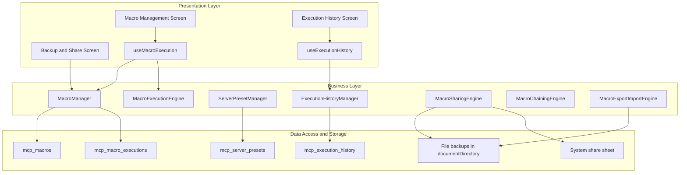
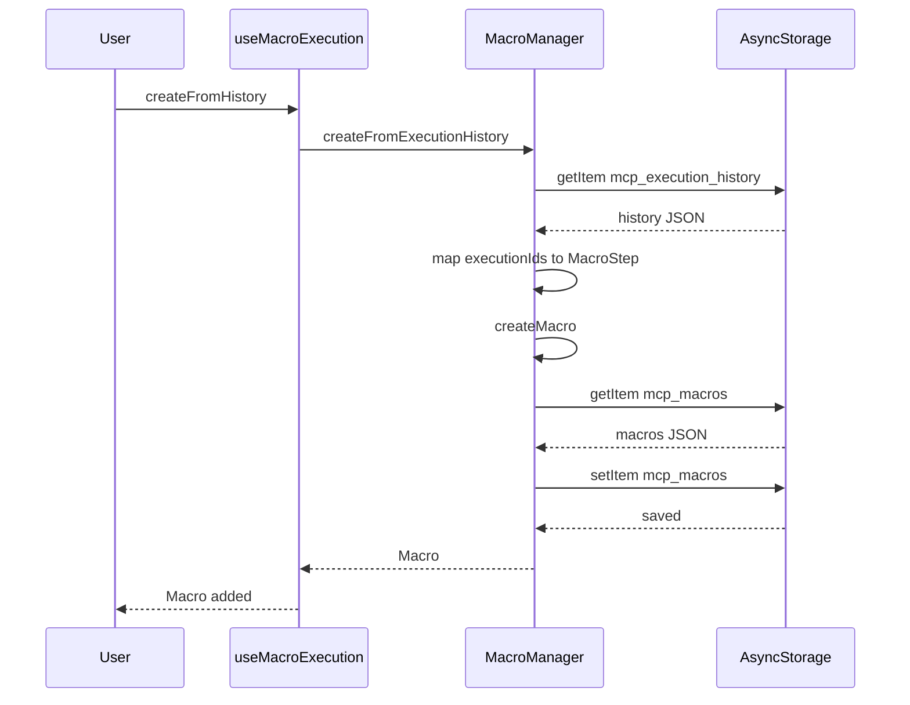
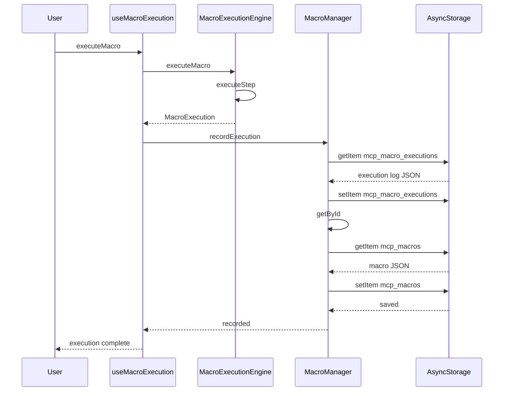
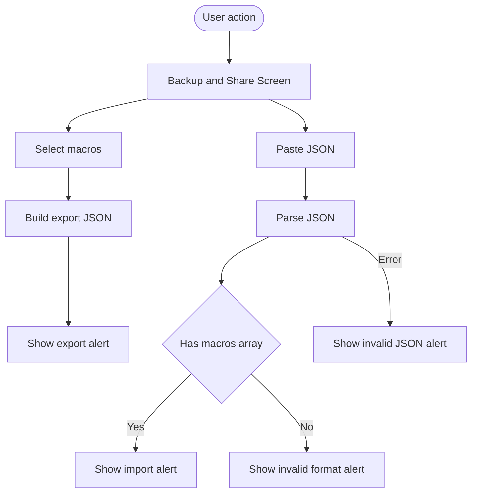

# Macro Management and Execution Domain

## Overview

This domain centers on reusable macro definitions, local persistence, execution logging, and the ability to derive new macros from prior tool activity. A macro in this project is a persisted sequence of tool steps stored on device, enriched with usage metadata such as `usageCount`, `lastExecutedAt`, favorite state, and optional tags and variables.

The same domain also keeps a separate execution audit trail for tool runs and server presets for connection profiles. `MacroManager` owns macro persistence and history-driven macro creation, `ExecutionHistoryManager` manages tool execution history and history statistics, and `ServerPresetManager` stores reusable server connection settings that macro steps reference through `serverId` and `serverName`.

## Architecture Overview

## Component Structure

### 1. Presentation Layer

#### Macro Management Screen

> **Note:** `MacroManager.createFromExecutionHistory` reads from `mcp_execution_history`, while `MacroManager.recordExecution` writes macro playback entries to `mcp_macro_executions`. Macro generation from history therefore depends on tool execution records produced by `ExecutionHistoryManager`, not on the macro playback log that `MacroManager.recordExecution` maintains.

*app/macro-management.tsx*

This screen is the user-facing macro list and creation surface. It renders macro cards, a create modal, loading skeletons, and an empty-state prompt when no macros exist. The visible `MacroItem` shape is a presentation-only mapping of macro data for list rendering.

**Local presentation model**

| Property | Type | Description |
| --- | --- | --- |
| `id` | `string` | Macro identifier used for navigation and deletion. |
| `name` | `string` | Display name shown in the list. |
| `description` | `string \ | undefined` | Optional summary under the title. |
| `actions` | `any[]` | Presentation count source for the visible `actions.length` badge. |
| `createdAt` | `number` | Timestamp used for list date formatting. |

**UI responsibilities**

- Shows the total macro count.
- Opens the create modal.
- Navigates to the macro editor when a macro card is pressed.
- Prompts before deleting a macro.
- Formats macro creation dates for display.

#### Backup and Share Screen

*app/export-import.tsx*

This screen exposes a manual export/import workflow for macros. It keeps all state locally, builds a JSON payload from selected entries, and validates pasted JSON during import.

**Local state**

| Property | Type | Description |
| --- | --- | --- |
| `tab` | `'export' \ | 'import'` | Controls which panel is visible. |
| `selectedMacros` | `string[]` | Selected macro IDs for export. |
| `importData` | `string` | Raw JSON pasted into the import editor. |
| `exportFormat` | `'json' \ | 'bundle'` | Export label shown in the generated payload. |
| `macros` | `{ id: string; name: string; description: string }[]` | Local mock macro list used by the screen. |

**Key methods**

| Method | Description |
| --- | --- |
| `toggleMacro` | Adds or removes a macro ID from `selectedMacros`. |
| `handleExport` | Builds a JSON string with `version`, `exportedAt`, `format`, and `macros`, then shows a success alert. |
| `handleImport` | Parses pasted JSON, verifies a `macros` array, and shows success or validation alerts. |

#### Execution History Screen

> **Note:** This screen uses a hard-coded `macros` array and only surfaces export/import through local JSON strings and alerts. It does not call `MacroManager`, `ExecutionHistoryManager`, or `ServerPresetManager`, so this path is a standalone mock backup flow rather than a persistence-backed one. **Note:** The `exportFormat` toggle changes only the `format` field in the payload. The exported JSON structure itself remains the same in this screen.

*app/(tabs)/execution-history.tsx*

This screen presents past tool executions with status filters, summary stats, and formatted timing metadata. It consumes `useExecutionHistory` and renders the four main UI states that are visible in the code: loading, error, empty, and populated history.

**Visible behaviors**

- Filters by execution `status`.
- Shows summary metrics from `ExecutionHistoryStats`.
- Formats timestamps and execution duration for display.
- Renders per-entry tool name, server name, result type, and status badge.
- Supports a retry action via the hook return object.

#### Macro Execution Hook

*lib/hooks/useMacroExecution.ts*

This hook is the orchestration layer between the UI and the macro persistence/execution services.

**State**

| Property | Type | Description |
| --- | --- | --- |
| `macros` | `Macro[]` | Loaded macro definitions. |
| `currentExecution` | `MacroExecution \ | null` | Most recent macro playback record. |
| `isExecuting` | `boolean` | Tracks an active macro run. |
| `isPaused` | `boolean` | Tracks paused playback state. |
| `error` | `string \ | null` | Last surfaced error message. |
| `progress` | `number` | Execution progress percentage. |
| `engineRef` | `MacroExecutionEngine` | Imperative execution engine instance. |

**Returned methods**

| Method | Description |
| --- | --- |
| `loadMacros` | Loads all persisted macros from `MacroManager`. |
| `createFromHistory` | Creates a macro from prior execution IDs using `MacroManager.createFromExecutionHistory`. |
| `createFromExecutionHistory` | Alias for `createFromHistory`. |
| `createFromTemplate` | Creates a macro from `MACRO_TEMPLATES`. |
| `executeMacro` | Runs a macro through `MacroExecutionEngine` and records the result. |
| `pauseExecution` | Pauses the active engine run. |
| `resumeExecution` | Resumes the active engine run. |
| `cancelExecution` | Cancels the active engine run and sets an execution error. |
| `deleteMacro` | Deletes a macro and removes it from local state. |
| `toggleFavorite` | Toggles a macro’s favorite flag and refreshes local cache. |
| `getExecutionHistory` | Returns macro-specific playback history. |
| `exportMacro` | Exports a macro as JSON via `MacroManager`. |
| `importMacro` | Imports a macro JSON payload via `MacroManager`. |

#### Execution History Hook

*lib/hooks/useExecutionHistory.ts*

This hook wraps `ExecutionHistoryManager` and exposes history loading, mutation, export/import, and statistics.

**Interface: ****`UseExecutionHistoryReturn`**

| Property | Type | Description |
| --- | --- | --- |
| `history` | `ExecutionHistoryEntry[]` | Current history list. |
| `isLoading` | `boolean` | Current fetch state. |
| `error` | `string \ | null` | Latest error message. |
| `stats` | `ExecutionHistoryStats \ | null` | Computed execution analytics. |
| `totalCount` | `number` | Current history item count. |
| `loadHistory` | `(filter?: ExecutionHistoryFilter) => Promise<void>` | Loads all or filtered entries. |
| `addExecution` | `(entry: ExecutionHistoryEntry) => Promise<void>` | Persists a new history entry and reloads. |
| `deleteExecution` | `(id: string) => Promise<void>` | Deletes one entry and reloads. |
| `deleteByServer` | `(serverId: string) => Promise<void>` | Deletes all entries for a server and reloads. |
| `clearAll` | `() => Promise<void>` | Removes the full history store. |
| `getStats` | `() => Promise<void>` | Recomputes summary statistics. |
| `exportAsJson` | `() => Promise<string>` | Serializes the current history. |
| `importFromJson` | `(jsonData: string) => Promise<number>` | Imports JSON history and reloads. |
| `retry` | `(entry: ExecutionHistoryEntry) => void` | Pass-through callback for retrying an entry. |

### 2. Macro Storage and Execution Services

#### Macro Manager and Model

*lib/models/Macro.ts*

`MacroManager` owns the macro repository, template instantiation, execution-log linkage, export/import, and favorite/usage state updates. The same file also defines the macro domain model, execution model, built-in templates, and macro status enum.

**`MacroManager`**** properties**

| Property | Type | Description |
| --- | --- | --- |
| `STORAGE_KEY` | `string` | AsyncStorage key for macro definitions. |
| `EXECUTION_LOG_KEY` | `string` | AsyncStorage key for macro playback records. |
| `MAX_MACROS` | `number` | Upper bound for stored macros. |
| `MAX_EXECUTIONS` | `number` | Upper bound for stored macro playback records. |

**`MacroManager`**** public methods**

| Method | Description |
| --- | --- |
| `createMacro` | Creates a new macro, assigns a generated ID, timestamps it, trims the store, and saves it. |
| `createFromTemplate` | Builds a macro from `MACRO_TEMPLATES`, normalizes step IDs and order, and applies optional overrides. |
| `createFromExecutionHistory` | Rebuilds a macro from selected execution history IDs by mapping history entries to `MacroStep` records. |
| `getAll` | Reads and parses all macros from storage. |
| `getById` | Returns one macro by ID or `null`. |
| `updateMacro` | Merges updates into an existing macro, preserves `id` and `createdAt`, increments `version`, and resaves. |
| `deleteMacro` | Removes one macro from the stored list. |
| `getFavorites` | Returns favorite macros sorted by `usageCount` descending. |
| `toggleFavorite` | Flips a macro’s favorite flag. |
| `recordExecution` | Prepends a `MacroExecution` to the execution log, trims the log, and increments the macro’s `usageCount` and `lastExecutedAt`. |
| `getExecutionHistory` | Returns macro-specific execution records with an optional limit. |
| `exportMacro` | Serializes one macro as formatted JSON. |
| `importMacro` | Parses macro JSON, generates a fresh ID, resets timestamps, and stores it. |

**`Macro`**** interface**

| Property | Type | Description |
| --- | --- | --- |
| `id` | `string` | Stable macro identifier. |
| `name` | `string` | Display name. |
| `description` | `string \ | undefined` | Optional macro description. |
| `steps` | `MacroStep[]` | Ordered tool execution steps. |
| `variables` | `MacroVariable[] \ | undefined` | Macro-level variables for parameter substitution. |
| `tags` | `string[] \ | undefined` | User-facing labels. |
| `isFavorite` | `boolean` | Favorite marker. |
| `usageCount` | `number` | Number of recorded executions. |
| `lastExecutedAt` | `number \ | undefined` | Most recent execution timestamp. |
| `createdAt` | `number` | Creation timestamp. |
| `updatedAt` | `number` | Last update timestamp. |
| `createdBy` | `string \ | undefined` | Optional author or owner marker. |
| `version` | `number` | Local macro revision number. |

**`MacroStep`**** interface**

| Property | Type | Description |
| --- | --- | --- |
| `id` | `string` | Step identifier. |
| `serverId` | `string` | Logical server reference used by the step. |
| `serverName` | `string` | Display name of the server. |
| `toolName` | `string` | Tool to execute. |
| `parameters` | `Record<string, any>` | Tool parameters, including variable placeholders. |
| `resultFormat` | `string \ | undefined` | Optional format hint for the expected result. |
| `expectedResult` | `any \ | undefined` | Optional expected output contract. |
| `timeout` | `number \ | undefined` | Optional step timeout in milliseconds. |
| `retryOnFailure` | `boolean \ | undefined` | Optional retry flag. |
| `maxRetries` | `number \ | undefined` | Optional retry limit. |
| `order` | `number` | Step ordering within the macro. |

**`MacroVariable`**** interface**

| Property | Type | Description |
| --- | --- | --- |
| `name` | `string` | Variable name. |
| `description` | `string \ | undefined` | Optional help text. |
| `defaultValue` | `any \ | undefined` | Optional default value. |
| `type` | `'string' \ | 'number' \ | 'boolean' \ | 'array' \ | 'object'` | Variable type constraint. |

**`MacroExecution`**** interface**

| Property | Type | Description |
| --- | --- | --- |
| `id` | `string` | Macro execution identifier. |
| `macroId` | `string` | Macro being run. |
| `macroName` | `string` | Macro display name at execution time. |
| `startTime` | `number` | Execution start timestamp. |
| `endTime` | `number \ | undefined` | Optional completion timestamp. |
| `duration` | `number \ | undefined` | Optional total duration. |
| `status` | `MacroStatus` | Current macro playback status. |
| `currentStepIndex` | `number` | Zero-based active step index. |
| `totalSteps` | `number` | Total steps in the macro. |
| `results` | `{ stepId: string; stepIndex: number; toolName: string; result: any; duration: number; status: 'SUCCESS' \ | 'FAILED' \ | 'TIMEOUT'; error?: string; }[]` | Per-step execution results. |
| `variables` | `Record<string, any> \ | undefined` | Runtime variable values used for playback. |
| `error` | `string \ | undefined` | Macro-level error message. |

**Step result item shape**

| Property | Type | Description |
| --- | --- | --- |
| `stepId` | `string` | Related macro step. |
| `stepIndex` | `number` | Step index in the macro. |
| `toolName` | `string` | Executed tool name. |
| `result` | `any` | Tool result payload. |
| `duration` | `number` | Step duration in milliseconds. |
| `status` | `'SUCCESS' \ | 'FAILED' \ | 'TIMEOUT'` | Step execution outcome. |
| `error` | `string \ | undefined` | Optional step error. |

**`MacroTemplate`**** interface**

| Property | Type | Description |
| --- | --- | --- |
| `name` | `string` | Template name. |
| `description` | `string` | Template description. |
| `steps` | `Omit<MacroStep, 'id' \ | 'order'>[]` | Template step prototypes. |
| `variables` | `MacroVariable[] \ | undefined` | Template variables. |
| `tags` | `string[] \ | undefined` | Template tags. |
| `category` | `string \ | undefined` | Optional category label. |

**`MacroStatus`**** enum**

`IDLE`, `RECORDING`, `PLAYING`, `PAUSED`, `COMPLETED`, `FAILED`

**Built-in macro templates**

| Key | Name | Category | Steps | Variables | Tags |
| --- | --- | --- | --- | --- | --- |
| `read_and_analyze` | `Read and Analyze File` | `filesystem` | `read_file` | `filePath` | `file`, `read`, `analyze` |
| `list_and_filter` | `List and Filter Directory` | `filesystem` | `list_directory` | `dirPath` | `directory`, `list`, `filter` |
| `web_fetch_and_parse` | `Fetch and Parse Web Content` | `web` | `fetch` | `webUrl` | `web`, `fetch`, `parse` |

**Execution linkage**

- `recordExecution` increments macro `usageCount` and sets `lastExecutedAt`.
- `createFromExecutionHistory` builds `MacroStep` entries from selected execution records by copying `serverId`, `serverName`, `toolName`, `parameters`, and `resultType` into `resultFormat`.
- `createFromTemplate` and `createFromExecutionHistory` both persist through the same macro store.

#### Execution History Manager and Model

*lib/models/ExecutionHistory.ts*

`ExecutionHistoryManager` stores tool-level execution history, filters it, summarizes it, and imports or exports it as JSON.

**`ExecutionHistoryManager`**** properties**

| Property | Type | Description |
| --- | --- | --- |
| `STORAGE_KEY` | `string` | AsyncStorage key for execution history. |
| `MAX_HISTORY_SIZE` | `number` | Upper bound for stored history entries. |

**`ExecutionHistoryManager`**** public methods**

| Method | Description |
| --- | --- |
| `addExecution` | Prepends a new history entry, trims the store, and saves it. |
| `getAll` | Reads and parses the full history list. |
| `getFiltered` | Returns filtered history by server, tool, status, date range, search text, and pagination. |
| `getById` | Returns one history record or `null`. |
| `deleteExecution` | Removes one entry by ID. |
| `deleteByServer` | Removes all entries for a server ID. |
| `clearAll` | Deletes the entire history store. |
| `getStats` | Computes execution counts, average duration, and top tools and servers. |
| `exportAsJson` | Serializes the full history list. |
| `importFromJson` | Merges imported entries by ID and trims to the maximum history size. |

**`ExecutionHistoryEntry`**** interface**

| Property | Type | Description |
| --- | --- | --- |
| `id` | `string` | Execution identifier. |
| `serverId` | `string` | Server that handled the tool call. |
| `serverName` | `string` | Display name of the server. |
| `toolName` | `string` | Executed tool name. |
| `toolDescription` | `string \ | undefined` | Optional tool description. |
| `parameters` | `Record<string, any>` | Input parameters used for execution. |
| `result` | `any` | Raw tool result. |
| `resultType` | `string` | Result type label. |
| `resultSize` | `number` | Serialized result size. |
| `timestamp` | `number` | Execution timestamp. |
| `executionTimeMs` | `number` | Measured duration. |
| `status` | `ExecutionStatus` | Final status. |
| `error` | `ExecutionError \ | undefined` | Optional structured error. |
| `tags` | `string[] \ | undefined` | Optional metadata tags. |
| `notes` | `string \ | undefined` | Optional user notes. |

**`ExecutionHistoryFilter`**** interface**

| Property | Type | Description |
| --- | --- | --- |
| `serverId` | `string \ | undefined` | Filter by server. |
| `toolName` | `string \ | undefined` | Filter by tool name substring. |
| `status` | `ExecutionStatus \ | undefined` | Filter by result status. |
| `dateFrom` | `number \ | undefined` | Inclusive lower bound timestamp. |
| `dateTo` | `number \ | undefined` | Inclusive upper bound timestamp. |
| `searchText` | `string \ | undefined` | Free-text search across tool, server, and notes. |
| `limit` | `number \ | undefined` | Page size. |
| `offset` | `number \ | undefined` | Page offset. |

**`ExecutionHistoryStats`**** interface**

| Property | Type | Description |
| --- | --- | --- |
| `totalExecutions` | `number` | Total history entries considered. |
| `successCount` | `number` | Count of successful executions. |
| `failureCount` | `number` | Count of failed executions. |
| `timeoutCount` | `number` | Count of timeouts. |
| `averageExecutionTimeMs` | `number` | Mean execution duration. |
| `mostUsedTools` | `{ toolName: string; count: number }[]` | Top tool names by usage. |
| `mostUsedServers` | `{ serverId: string; serverName: string; count: number }[]` | Top server IDs by usage. |

**`ExecutionStatus`**** enum**

`SUCCESS`, `FAILED`, `TIMEOUT`, `CANCELLED`, `PARTIAL`

**Stats aggregation detail**

- `getStats` computes counts directly from the full list.
- `mostUsedTools` and `mostUsedServers` are sorted descending and truncated to 10 items.

#### Server Preset Manager and Model

*lib/models/ServerPreset.ts*

`ServerPresetManager` stores reusable server connection profiles, template presets, favorites, usage counts, and JSON import/export.

**`ServerPresetManager`**** properties**

| Property | Type | Description |
| --- | --- | --- |
| `STORAGE_KEY` | `string` | AsyncStorage key for server presets. |

**`ServerPresetManager`**** public methods**

| Method | Description |
| --- | --- |
| `createPreset` | Creates a new preset with generated ID and timestamps. |
| `createFromTemplate` | Creates a preset from `SERVER_PRESET_TEMPLATES` and applies overrides. |
| `getAll` | Reads and parses all presets. |
| `getFiltered` | Returns presets matching a `ServerPresetFilter`. |
| `updatePreset` | Merges changes into an existing preset while preserving `id` and `createdAt`. |
| `toggleFavorite` | Toggles a preset’s favorite flag. |
| `recordUsage` | Increments `usageCount` and updates `lastUsedAt`. |
| `deletePreset` | Removes a preset by ID. |
| `getFavorites` | Returns only favorite presets. |
| `getRecentlyUsed` | Returns recently used presets sorted by `lastUsedAt`. |
| `exportAsJson` | Serializes all presets. |
| `importFromJson` | Merges imported presets by ID and saves the merged list. |

**`ServerPreset`**** interface**

| Property | Type | Description |
| --- | --- | --- |
| `id` | `string` | Preset identifier. |
| `name` | `string` | Preset name. |
| `description` | `string \ | undefined` | Optional description. |
| `host` | `string` | Server host. |
| `port` | `number` | Server port. |
| `transport` | `TransportType` | Transport mode. |
| `authToken` | `string \ | undefined` | Optional auth token. |
| `timeoutMs` | `number` | Connection timeout in milliseconds. |
| `retryAttempts` | `number` | Retry count for connection setup. |
| `tags` | `string[] \ | undefined` | Optional tags. |
| `isFavorite` | `boolean` | Favorite marker. |
| `usageCount` | `number` | Number of times the preset has been used. |
| `lastUsedAt` | `number \ | undefined` | Last usage timestamp. |
| `createdAt` | `number` | Creation timestamp. |
| `updatedAt` | `number` | Last update timestamp. |

**`ServerPresetTemplate`**** interface**

| Property | Type | Description |
| --- | --- | --- |
| `name` | `string` | Template name. |
| `description` | `string` | Template description. |
| `host` | `string` | Default host. |
| `port` | `number` | Default port. |
| `transport` | `TransportType` | Default transport. |
| `timeoutMs` | `number \ | undefined` | Optional timeout override. |
| `retryAttempts` | `number \ | undefined` | Optional retry override. |
| `tags` | `string[] \ | undefined` | Optional preset tags. |

**Built-in server preset templates**

| Key | Name | Host | Port | Transport | Tags |
| --- | --- | --- | --- | --- | --- |
| `claude_filesystem` | `Claude Filesystem MCP` | `localhost` | `3001` | `HTTP` | `official`, `filesystem`, `file-operations` |
| `claude_web` | `Claude Web MCP` | `localhost` | `3002` | `HTTP` | `official`, `web`, `browsing` |
| `claude_git` | `Claude Git MCP` | `localhost` | `3003` | `HTTP` | `official`, `git`, `version-control` |
| `local_stdio` | `Local Stdio MCP` | `localhost` | `0` | `STDIO` | `local`, `stdio` |

**Link to macros**

- Macro steps store `serverId` and `serverName`, not the full host/port transport details.
- Presets supply the reusable connection profile for those logical server references.
- `recordUsage` mirrors macro usage tracking by updating `usageCount` and `lastUsedAt`.

#### Macro Execution Engine

*lib/engines/MacroExecutionEngine.ts*

`MacroExecutionEngine` executes macro steps sequentially, performs variable substitution, tracks pause/cancel state, and returns a `MacroExecution` record.

**Properties**

| Property | Type | Description |
| --- | --- | --- |
| `currentExecution` | `MacroExecution \ | null` | Active execution record. |
| `isPaused` | `boolean` | Pause flag for the current run. |
| `isCancelled` | `boolean` | Cancel flag for the current run. |

**Public methods**

| Method | Description |
| --- | --- |
| `executeMacro` | Builds a `MacroExecution`, steps through `macro.steps`, applies substitutions, and returns the completed execution record. |
| `pause` | Marks the active execution as paused. |
| `resume` | Resumes a paused execution. |
| `cancel` | Cancels the active execution. |

**Execution behavior**

- Initializes `MacroStatus.PLAYING`.
- Replaces `${variable}` placeholders recursively in nested parameter objects.
- Uses `step.timeout` when provided.
- Appends step results with per-step success or failure status.
- `pause`, `resume`, and `cancel` mutate engine state and the current execution status.

#### Macro Sharing Engine

*lib/engines/MacroSharingEngine.ts*

`MacroSharingEngine` handles file-based export/import, backup generation, system sharing, and share-link helpers.

**Properties**

| Property | Type | Description |
| --- | --- | --- |
| `SHARE_VERSION` | `string` | Share package version string. |
| `SHARE_MIME_TYPE` | `string` | MIME type passed to the share sheet. |

**Public methods**

| Method | Description |
| --- | --- |
| `exportMacros` | Serializes macros into a JSON file in `documentDirectory`. |
| `shareMacros` | Exports macros and opens the system share sheet if available. |
| `importMacros` | Reads a JSON file, validates the package, and returns an import result with imported, skipped, error, and macro lists. |
| `generateShareLink` | Creates a `mcphub://share/` URL from a compact JSON payload. |
| `parseShareLink` | Parses a share link and returns decoded payload data. |
| `exportSingleMacro` | Convenience wrapper that exports one macro. |
| `createBackup` | Writes a timestamped backup file. |
| `restoreFromBackup` | Imports macros from a backup file path. |

#### Macro Chaining Engine

> **Note:** `generateShareLink` encodes only the macro `name`, `description`, and `steps` count, but `parseShareLink` is typed to return `Macro[] | null`. The share payload does not contain the full executable `Macro` shape, so parsed results are summaries rather than complete macros.

*lib/engines/MacroChainingEngine.ts*

`MacroChainingEngine` coordinates multiple macro runs in sequence and keeps active chain executions in memory.

**Properties**

| Property | Type | Description |
| --- | --- | --- |
| `activeExecutions` | `Map<string, ChainExecution>` | In-memory registry of chain executions. |

**Public methods**

| Method | Description |
| --- | --- |
| `createChain` | Creates a new chain definition from a macro sequence. |
| `executeChain` | Runs a chain step by step using `MacroExecutionEngine`. |
| `cancelExecution` | Removes a chain execution from the active registry. |
| `getExecutionStatus` | Returns the current `ChainExecution` entry for an ID. |

**Execution behavior**

- Merges chain variables with runtime variables.
- Resolves macro IDs to `Macro` instances from the provided `Map`.
- Maps step parameters through the chain context.
- Carries each macro result forward into the context under `step_${i}_result`.
- Stops on errors unless the chain step allows continuation.

#### Macro Export Import Engine

*server/export-import/macro-export-import.ts*

This server-side engine serializes macros into a portable package, verifies checksums, validates compatibility, merges macros, and supports bundle import/export.

**Public methods**

| Method | Description |
| --- | --- |
| `exportMacro` | Builds a checksum-protected macro export package. |
| `importMacro` | Validates and imports one exported macro package. |
| `exportMacroBundle` | Serializes multiple macros into a bundle format. |
| `importMacroBundle` | Imports a bundle and aggregates per-macro results. |
| `validateCompatibility` | Checks for deprecated actions and missing variables. |
| `mergeMacros` | Merges two macro payloads using `concat` or `override`. |
| `estimateMacroSize` | Estimates serialized and compressed macro size. |

**Export/import contract types**

**`ExportedMacro`**** interface**

| Property | Type | Description |
| --- | --- | --- |
| `version` | `string` | Export package version. |
| `exportedAt` | `string` | ISO export timestamp. |
| `macro` | `{ id: string; name: string; description: string; actions: any[]; variables: any[]; tags: string[]; metadata: { createdAt: any; updatedAt: any; author: string; version: string; }; }` | Serialized macro payload. |
| `dependencies` | `MacroDependency[]` | Resolved dependency list. |
| `checksums` | `{ macro: string; dependencies: Record<string, string>; }` | Integrity hashes. |

**`MacroDependency`**** interface**

| Property | Type | Description |
| --- | --- | --- |
| `id` | `string` | Dependency identifier. |
| `type` | `'app' \ | 'variable' \ | 'macro'` | Dependency kind. |
| `name` | `string` | Dependency name. |
| `version` | `string` | Dependency version. |
| `required` | `boolean` | Whether the dependency is required. |

**`ImportResult`**** interface**

| Property | Type | Description |
| --- | --- | --- |
| `success` | `boolean` | Import success flag. |
| `error` | `string \ | null` | Import error message. |
| `macro` | `any \ | null` | Imported macro payload. |
| `missingDependencies` | `string[]` | Missing or invalid dependency IDs. |

**`MacroBundle`**** interface**

| Property | Type | Description |
| --- | --- | --- |
| `version` | `string` | Bundle version. |
| `exportedAt` | `string` | ISO export timestamp. |
| `macros` | `ExportedMacro[]` | Bundled macro exports. |
| `metadata` | `{ count: number; totalSize: number; }` | Bundle metadata. |

**`BundleImportResult`**** interface**

| Property | Type | Description |
| --- | --- | --- |
| `success` | `boolean` | Bundle import success flag. |
| `error` | `string \ | null` | Bundle import error message. |
| `macros` | `any[]` | Imported macro payloads. |
| `failedCount` | `number` | Number of failed imports. |

**`CompatibilityResult`**** interface**

| Property | Type | Description |
| --- | --- | --- |
| `compatible` | `boolean` | Overall compatibility flag. |
| `issues` | `CompatibilityIssue[]` | Compatibility warnings or errors. |
| `targetVersion` | `string` | Target version used for validation. |

**`CompatibilityIssue`**** interface**

| Property | Type | Description |
| --- | --- | --- |
| `severity` | `'error' \ | 'warning'` | Issue severity. |
| `message` | `string` | Human-readable issue message. |
| `line` | `number` | Source line index or `-1` for computed issues. |
| `suggestion` | `string` | Suggested remediation text. |

**`MacroSize`**** interface**

| Property | Type | Description |
| --- | --- | --- |
| `uncompressed` | `number` | Raw JSON length. |
| `estimated_compressed` | `number` | Estimated compressed size. |
| `actions` | `number` | Number of macro actions. |
| `variables` | `number` | Number of macro variables. |

### 3. Persistence and Storage

#### AsyncStorage-backed stores

| Storage key | Owned by | Stored shape | Main writers | Main readers |
| --- | --- | --- | --- | --- |
| `mcp_macros` | `MacroManager` | `Macro[]` | `createMacro`, `createFromTemplate`, `createFromExecutionHistory`, `updateMacro`, `deleteMacro`, `toggleFavorite`, `importMacro` | `getAll`, `getById`, `getFavorites`, `exportMacro` |
| `mcp_macro_executions` | `MacroManager` | `MacroExecution[]` | `recordExecution` | `getExecutionHistory`, `recordExecution` |
| `mcp_execution_history` | `ExecutionHistoryManager` | `ExecutionHistoryEntry[]` | `addExecution`, `importFromJson`, `deleteExecution`, `deleteByServer`, `clearAll` | `getAll`, `getFiltered`, `getById`, `getStats`, `exportAsJson` |
| `mcp_server_presets` | `ServerPresetManager` | `ServerPreset[]` | `createPreset`, `createFromTemplate`, `updatePreset`, `toggleFavorite`, `recordUsage`, `deletePreset`, `importFromJson` | `getAll`, `getFiltered`, `getFavorites`, `getRecentlyUsed`, `exportAsJson` |
| `documentDirectory` JSON file | `MacroSharingEngine` | Share package JSON | `exportMacros`, `createBackup` | `importMacros`, `restoreFromBackup` |

#### Persistence behaviors

> **Note:** This engine serializes `actions`, while  persists `steps`. The two payload shapes are not interchangeable without translation.

- All three AsyncStorage managers read the full array, mutate in memory, and write the entire array back.
- Macro and execution stores are trimmed to their configured maximum sizes.
- Import paths regenerate IDs for macros, dedupe execution history and presets by `id`, and preserve existing records on merge.
- `MacroManager.recordExecution` also updates the macro definition itself, linking runtime usage back to persistent metadata.

### 4. Feature Flows

#### Create Macro from Prior Tool Executions

This flow rebuilds a reusable macro definition from a selection of execution history IDs. Each matching history entry becomes a `MacroStep`, with `resultType` copied into `resultFormat`, and the resulting macro is tagged with `from-history`.

#### Execute Macro and Record Usage

This flow ties playback history back to the saved macro definition. The execution log stores the runtime record, while the macro definition is updated with the new `usageCount` and `lastExecutedAt`.

#### Backup and Restore Macros

This screen-level flow is local to . It is distinct from the file-based backup and share flow in `MacroSharingEngine`.

### 5. State Management

#### Macro status model

`MacroStatus` is used by `MacroExecution` and `MacroExecutionEngine`.

- `IDLE`: initial state in the enum.
- `RECORDING`: recording-oriented state in the enum.
- `PLAYING`: active execution state used by `executeMacro`.
- `PAUSED`: set by `pause`.
- `COMPLETED`: terminal success state in the enum.
- `FAILED`: terminal failure state used by execution errors and cancellation.

#### Execution status model

`ExecutionStatus` is used by `ExecutionHistoryEntry` and `ExecutionHistoryManager`.

- `SUCCESS`
- `FAILED`
- `TIMEOUT`
- `CANCELLED`
- `PARTIAL`

#### Hook-local state patterns

- `useMacroExecution` tracks macro lists, execution lifecycle state, progress, and the latest error.
- `useExecutionHistory` tracks history entries, loading state, summary stats, and the last error.
-  tracks the active tab, selected macro IDs, pasted JSON, and export format locally.

### 6. Error Handling

The domain uses a consistent pattern across managers and hooks:

- Managers log failures with `console.error` and then either rethrow or return a safe fallback.
- Read methods that cannot complete often return `[]` or `null`.
- Hooks convert thrown values into user-facing `error` strings and keep the component state in sync.
- The export/import screen uses `Alert.alert` for invalid selection, invalid JSON, and invalid structure.

**Examples of fallback behavior**

- `MacroManager.getAll` returns `[]` on storage read failure.
- `MacroManager.getById` returns `null` on lookup failure.
- `ExecutionHistoryManager.getAll` returns `[]` on storage read failure.
- `ServerPresetManager.getFavorites` delegates to filtered reads.
- `MacroSharingEngine` and `MacroExportImportEngine` return structured error objects or throw wrapped `Error` instances depending on the method.

### 7. Dependencies

- `@react-native-async-storage/async-storage` for macro, history, and preset persistence.
- `react` hooks in `useMacroExecution` and `useExecutionHistory`.
- `expo-file-system` and `expo-sharing` in `MacroSharingEngine`.
- JavaScript `JSON.parse`, `JSON.stringify`, `btoa`, and `atob` for serialization helpers.
- `react-native` UI primitives and `Alert` in the export/import screen and related views.
- `expo-router` in the presentation layer for navigation.

### 8. Testing Considerations

- Creating a macro from execution IDs should preserve step order and skip missing IDs.
- `recordExecution` should prepend the newest record and update the macro’s usage metadata.
- Store trimming should respect `MAX_MACROS`, `MAX_EXECUTIONS`, and `MAX_HISTORY_SIZE`.
- Import paths should dedupe by `id` where implemented.
- `ExecutionHistoryManager.getFiltered` should correctly combine server, tool, text, status, date, and pagination filters.
- `MacroSharingEngine.importMacros` should reject malformed step objects and version-mismatched packages.
- `generateShareLink` and `parseShareLink` should be tested as a pair because the link payload is intentionally compact.
-  should be tested separately from the persistence managers because it currently uses local mock data.

## Key Classes Reference

| Class | Responsibility |
| --- | --- |
| `Macro.ts` | Macro definitions, template instantiation, execution log linkage, and local export/import. |
| `ExecutionHistory.ts` | Tool execution history persistence, filtering, statistics, and JSON import/export. |
| `ServerPreset.ts` | Reusable server connection presets, template presets, favorites, usage tracking, and JSON import/export. |
| `MacroExecutionEngine.ts` | Sequential macro playback with variable substitution, pause, resume, and cancel support. |
| `MacroSharingEngine.ts` | File-based macro export, import, backup creation, sharing, and share-link helpers. |
| `MacroChainingEngine.ts` | Sequential execution of multiple macros as a chain with in-memory status tracking. |
| `macro-export-import.ts` | Portable export/import package handling, dependency checks, compatibility validation, and macro merging. |
| `useMacroExecution.ts` | UI-facing orchestration for loading, creating, executing, exporting, and importing macros. |
| `useExecutionHistory.ts` | UI-facing orchestration for execution history queries, stats, mutations, and import/export. |
| `macro-management.tsx` | Macro list, creation modal, deletion, and navigation entry point. |
| `export-import.tsx` | Local JSON backup/share screen for selected macros. |
| `execution-history.tsx` | Execution history viewer with filters, stats, and status rendering. |
