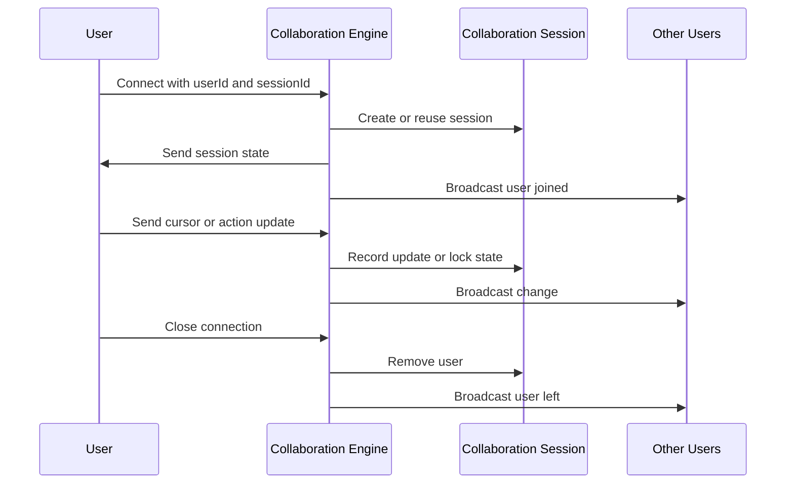
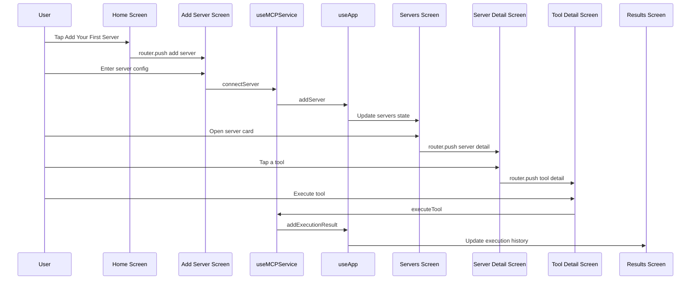
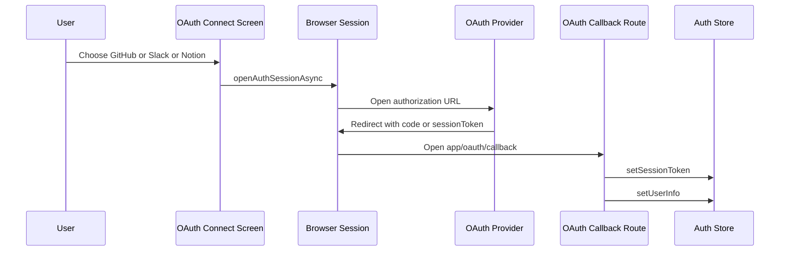
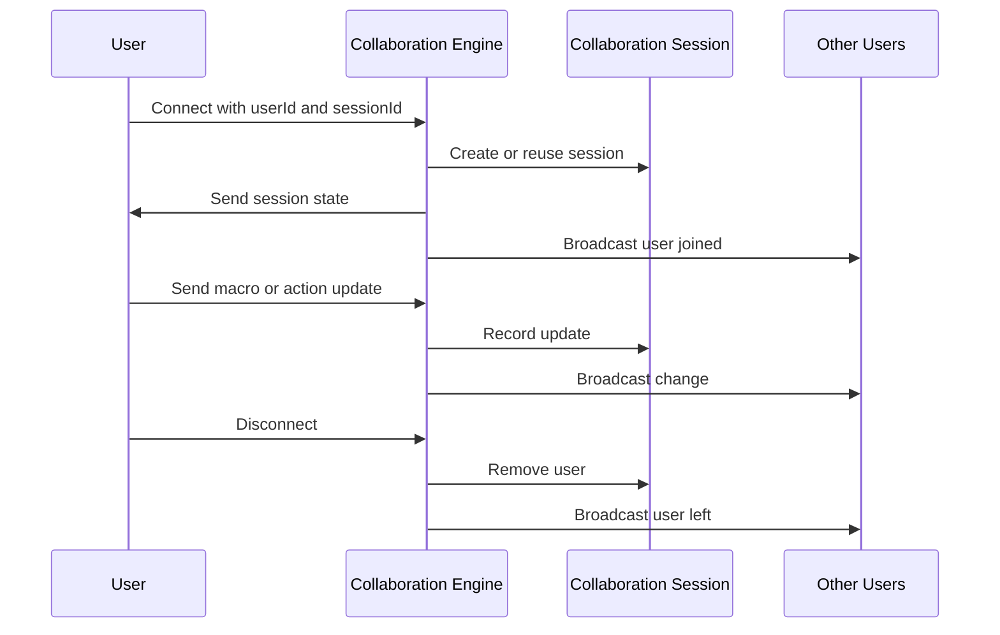

# Platform Architecture and End-to-End Flow

## Overview

MCP Hub is organized as an Expo Router client that uses a tab-group shell for everyday navigation and root-level routes for operations, OAuth callback handling, and admin-style workflows. The screen tree is centered on server discovery, tool browsing and execution, macro authoring and sharing, analytics, governance, and token lifecycle management.

From a user’s perspective, the app starts as a dashboard in , then fans out into server management, tool execution, analytics, settings, and admin surfaces. The code uses shared UI primitives like `ScreenContainer`, `Button`, and `SaveAsMacroModal`, plus route-driven state via `useRouter`, `useNavigation`, and `useLocalSearchParams`, so navigation is expressed through direct route pushes and callback routes rather than a custom in-app navigator.

## Architecture Overview

```mermaid
flowchart TD
    subgraph PresentationLayer [Presentation Layer]
        HomeScreen[Home Screen]
        ServersScreen[Servers Screen]
        ServerDetailScreen[Server Detail Screen]
        EditServerScreen[Edit Server Screen]
        AddServerScreen[Add Server Screen]
        ToolDetailScreen[Tool Detail Screen]
        ToolBrowserScreen[Tool Browser Screen]
        ToolDiscoveryScreen[Tool Discovery Screen]
        ToolExecutionScreen[Tool Execution Screen]
        ResultsScreen[Results Screen]
        ChatScreen[Chat Screen]
        SettingsScreen[Settings Screen]
        AnalyticsScreens[Analytics Screens]
        AdminDashboardScreen[Admin Dashboard Screen]
        MacroScreens[Macro Screens]
        OAuthConnectScreen[OAuth Connect Screen]
        OAuthCallbackRoute[OAuth Callback Route]
    end

    subgraph SharedUILayer [Shared UI Layer]
        ScreenContainer[Screen Container]
        ThemedView[Themed View]
        Button[Button]
        SaveAsMacroModal[Save As Macro Modal]
        ResultDisplayFormatter[Result Display Formatter]
    end

    subgraph ClientStateLayer [Client State Layer]
        useApp[useApp]
        useMCPService[useMCPService]
        useMCPBridge[useMCPBridge]
        useMCPServerConnection[useMCPServerConnection]
        trpc[trpc]
        useColors[useColors]
    end

    subgraph ServiceLayer [Service Layer]
        ServerPresetManager[Server Preset Manager]
        MacroSharingEngine[Macro Sharing Engine]
        MacroChainingEngine[Macro Chaining Engine]
        ExecutionAnalytics[Execution Analytics]
        MacroAnalytics[Macro Analytics]
        TrendingAnalyticsEngine[Trending Analytics Engine]
        CollaborationEngine[Collaboration Engine]
        GitHubMCPServer[GitHub MCP Server]
        SlackMCPServer[Slack MCP Server]
        NotionMCPServer[Notion MCP Server]
    end

    HomeScreen --> ScreenContainer
    ServersScreen --> ScreenContainer
    ServerDetailScreen --> ScreenContainer
    EditServerScreen --> ScreenContainer
    AddServerScreen --> ScreenContainer
    ToolDetailScreen --> ScreenContainer
    ToolBrowserScreen --> ScreenContainer
    ToolDiscoveryScreen --> ScreenContainer
    ToolExecutionScreen --> ScreenContainer
    ResultsScreen --> ScreenContainer
    ChatScreen --> ScreenContainer
    SettingsScreen --> ScreenContainer
    AnalyticsScreens --> ScreenContainer
    AdminDashboardScreen --> ScreenContainer
    MacroScreens --> ScreenContainer
    OAuthConnectScreen --> ScreenContainer

    HomeScreen --> useApp
    ServersScreen --> useApp
    ServerDetailScreen --> useApp
    EditServerScreen --> useApp
    AddServerScreen --> useApp
    ToolDetailScreen --> useApp
    ChatScreen --> useApp
    ResultsScreen --> useApp
    SettingsScreen --> useApp

    HomeScreen --> useColors
    ServersScreen --> useColors
    ServerDetailScreen --> useColors
    ToolDetailScreen --> useColors
    ChatScreen --> useColors
    ResultsScreen --> useColors
    SettingsScreen --> useColors

    ToolDetailScreen --> useMCPService
    ChatScreen --> useMCPService
    AddServerScreen --> useMCPService
    EditServerScreen --> useMCPService

    ServerConnectionScreen --> useMCPBridge
    ToolExecutionScreen --> useMCPBridge
    ToolDiscoveryScreen --> useMCPBridge
    MCPControlScreen --> useMCPBridge

    ToolBrowserScreen --> trpc
    MCPServersScreen --> trpc
    AnalyticsScreens --> trpc

    ResultsScreen --> ResultDisplayFormatter
    ResultsScreen --> SaveAsMacroModal

    MacroScreens --> MacroChainingEngine
    MacroScreens --> MacroSharingEngine
    MacroScreens --> ServerPresetManager

    AnalyticsScreens --> ExecutionAnalytics
    AnalyticsScreens --> MacroAnalytics
    AnalyticsScreens --> TrendingAnalyticsEngine

    useMCPService --> GitHubMCPServer
    useMCPService --> SlackMCPServer
    useMCPService --> NotionMCPServer

    OAuthCallbackRoute --> AuthStore[Auth Session Store]
    CollaborationEngine --> WebSocket[WebSocket Session State]
```



## Navigation Model

Expo Router is used in two ways: the `app/(tabs)/` group defines the main tabbed surface, and root routes in `app/` handle callback and admin-style destinations. Navigation is mostly expressed with `router.push`, `router.back`, `navigation.setOptions`, and `useLocalSearchParams`.

### Route Contracts Observed in Code

| Route file | Params or trigger | Traversal role |
| --- | --- | --- |
|  | `id` | Opens a per-server detail view and reads tools for the selected server |
|  | `id` | Opens the edit form for an existing server |
|  | `serverId`, `toolName` | Opens a specific tool execution view |
|  | `code`, `state`, `error`, `sessionToken`, `user` | Handles browser return from OAuth and persists session state |
|  | `userId`, `sessionId` query params | Joins a collaboration session over WebSocket |
| `MacroSharingEngine.generateShareLink` | `mcphub://share/<encoded>` | Produces an app-specific share link for macro payloads |


### Navigation Behavior

- `useRouter` is used for pushes and back navigation in list and detail screens.
- `useNavigation` is used where native header options are customized with `setOptions`.
- `useLocalSearchParams` is used to hydrate detail screens from route parameters instead of a nested stack model.
- Root-level routes like , , and  are opened directly from tab screens or external redirects.
- `ScreenContainer` provides a safe-area wrapper with default edges `["top", "left", "right"]`, which keeps tab content above the bottom bar.

## Screen Inventory

### Home and Tab Surfaces

*File family: `app/(tabs)/`*

| File | Screen name | Primary role | Traversal in and out |
| --- | --- | --- | --- |
|  | `HomeScreen` | Dashboard and launch pad | Enters the app, links to servers, add server, settings, and chat |
|  | `ServersScreen` | Server directory | Reaches server detail, edit server, add server, delete confirmation |
|  | `ChatScreen` | Command-style tool execution | Accepts `@server_name tool_name param=value` input and quick tool chips |
|  | `SettingsScreen` | Operations hub | Routes to audit log, governance, service control, perception test, macro management, notification settings |
|  | `AnalyticsDashboardScreen` | Execution analytics dashboard | Switches time range and analytics tabs, exports metrics |
|  | `AdminDashboardScreen` | System health and monitoring | Refreshes metrics every 30 seconds, switches between overview, workflows, errors |


`HomeScreen` is the first high-density user surface: it shows connected server counts, total tools, recent execution activity, and a bottom quick-action row for settings and chat. The empty state directs users straight to `/(tabs)/add-server`, which makes onboarding part of the home journey.

### Server Management and Provisioning

*File family: `app/(tabs)/` and root server routes*

| File | Screen name | Primary role | Traversal in and out |
| --- | --- | --- | --- |
|  | `AddServerScreen` | Create a new MCP server connection | Imports JSON, edits transport and headers, then returns to the router |
|  | `EditServerScreen` | Edit an existing server config | Reads server by `id`, supports JSON paste and file import, returns to server list |
|  | `ServerDetailScreen` | Inspect one server and its tools | Tabs between `tools` and `info`, pushes into tool detail, returns to server list |
|  | `ServerPresetsScreen` | Preset library for server configs | Creates presets, loads templates, favorites, searches, imports, exports |
|  | `ServerConnectionScreen` | Connect via HTTP, WebSocket, or Stdio | Validates host and port, opens connection via `useMCPServerConnection` |
|  | `ServerConnectionUpdatedScreen` | Bridge-backed connection form | Connects and disconnects bridge sessions, shows active connections |
|  | `MCPServersScreen` | Register and manage backend MCP servers | Tabs between available and registered servers, validates token, discovers tools |
|  | `MCPControlScreen` | Bridge control surface | Starts and stops the server, refreshes status, runs a file tool test |
|  | Governance screen | Governance and allowlist control | Opened from settings as a root route |


The server flow is intentionally split into three layers: add or edit a server, inspect a server’s tools, then execute a tool from the tool detail screen or chat. The list screen and detail screen both keep destructive actions behind `Alert.alert` confirmations, while the connection screens keep validation inline.

### Tool Browsing, Execution, and Results

*File family: `app/(tabs)/`*

| File | Screen name | Primary role | Traversal in and out |
| --- | --- | --- | --- |
|  | `ToolBrowserScreen` | Search and execute discovered tools | Expands selected tool cards and renders parameter forms |
|  | `ToolDiscoveryUpdatedScreen` | Discover tools from a selected server | Calls `discoverTools`, filters search results, shows detail panel |
|  | `ToolExecutionUpdatedScreen` | Execute a tool from bridge input | Parses form values into JSON or strings, then runs the tool |
|  | `ToolDetailScreen` | Focused execution of one server tool | Reads `serverId` and `toolName`, sets native header, captures results |
|  | `ResultsScreen` | Review and export execution results | Switches result format, toggles raw JSON, shares, copies, saves as macro |
|  | `ExecutionDebuggerScreen` | Step-by-step execution inspection | Navigates between steps and exposes step variables |


`tool-browser` is the broadest tool surface. It pulls registered servers from `trpc.mcpServers.getRegisteredServers.useQuery()`, then expands a selected tool card into a parameter form and execution panel. `tool-discovery` and `tool-execution` are bridge-oriented alternatives that center the selected server ID and a direct execution call instead of the list-based browser.

### Macro and Workflow Surfaces

*File family: `app/(tabs)/` and root macro routes*

| File | Screen name | Primary role | Traversal in and out |
| --- | --- | --- | --- |
|  | Macro management screen | Root-level macro administration | Opened from settings |
|  | `MacroBuilderScreen` | Visual workflow editor | Uses workflow hooks for create, save, execute |
|  | Macro editor screen | Step-level macro editing | Selects server and tool per step |
|  | `MacroChainingScreen` | Compose macro chains | Creates chain objects from selected macros |
|  | `MacroSharingScreen` | Export, import, and share macros | Uses file picker and share sheet |
|  | `MacroGalleryScreen` | Browse reusable automation examples | Shows category-tagged macro cards |
|  | Workflow templates screen | Template browsing surface | File exists in the route tree; only imports are visible in the provided code |
|  | `OnboardingScreen` | First-run walkthrough | Steps users through server connect and first workflow |
|  | `TeamWorkspaceScreen` | Team membership and permissions | Invites members and exposes role presets |


`MacroChainingScreen` and `MacroSharingScreen` are the most explicit macro lifecycle surfaces in the code. One builds reusable macro chains from selected macros; the other exports, imports, and shares macros through JSON files and an app-specific share link format.

### Analytics and Admin Surfaces

*File family: `app/(tabs)/` and root analytics route*

| File | Screen name | Primary role | Traversal in and out |
| --- | --- | --- | --- |
|  | `AnalyticsDashboardScreen` | Execution analytics in tab space | Time range selector, overview/tools/servers tabs, export button |
|  | Root analytics dashboard | Macro analytics and user metrics | Uses overview/macros/users tabs |
|  | `AdminDashboardScreen` | System metrics and health | Automatic 30 second refresh, retry on failure |


The tab analytics screen currently uses mocked metrics while the code comments point to a future `generateReport` call. The root analytics screen is macro-centric and shows a separate model: global metrics, macro usage, and user activity rather than execution-level tool stats.

### Governance, Tokens, and OAuth

*File family: `app/(tabs)/` and `app/oauth/`*

| File | Screen name | Primary role | Traversal in and out |
| --- | --- | --- | --- |
|  | `TokenManagementScreen` | Register, rotate, and revoke tokens | Switches between register and manage tabs |
|  | `OAuthConnectScreen` | Launch OAuth sessions | Opens an auth browser session and tracks connected services |
|  | `OAuthCallback` | Deep-link callback handler | Receives browser redirect and persists session state |
|  | Governance screen | Allowlist and blacklist management | Opened directly from settings |


`SettingsScreen` is the navigation hub for this family. It surfaces governance, service control, perception testing, macro management, notifications, and audit history as dedicated route targets instead of collapsing them into a single settings form.

## Shared UI Primitives and Result Formatting

### Screen Container

*File: `components/screen-container.tsx`*

`ScreenContainer` is the shell around almost every visible route. It combines a full-screen `View` with a `SafeAreaView` and defaults to top, left, and right edges, so content stays aligned with device insets while the tab bar owns the bottom edge.

| Property | Type | Description |
| --- | --- | --- |
| `edges` | `Edge[]` | Safe area edges to apply |
| `className` | `string` | Classes for the inner content area |
| `containerClassName` | `string` | Classes for the outer full-screen container |
| `safeAreaClassName` | `string` | Classes for the safe-area wrapper |


### Themed View

*File: `components/themed-view.tsx`*

`ThemedView` is a thin background wrapper used where a screen wants the standard background color without the full safe-area shell.

| Property | Type | Description |
| --- | --- | --- |
| `className` | `string` | Extra classes appended to `bg-background` |


### Button and Button Group

*File: `components/ui/button.tsx`*

`Button` is the shared pressable control used for navigation, confirmation, and destructive actions. It adds haptic feedback through `expo-haptics`, supports loading state, and varies text and background colors by variant.

| Property | Type | Description |
| --- | --- | --- |
| `variant` | `ButtonVariant` | `primary`, `secondary`, `tertiary`, `destructive`, or `ghost` |
| `size` | `ButtonSize` | `small`, `medium`, or `large` |
| `disabled` | `boolean` | Disables press handling and dims the button |
| `loading` | `boolean` | Replaces content with an `ActivityIndicator` |
| `onPress` | `() => void` | Tap handler |
| `children` | `React.ReactNode` | Button label or custom content |
| `className` | `string` | Extra styling |
| `haptic` | `boolean` | Enables or disables haptic feedback |


`ButtonGroup` keeps action rows consistent across forms and modals.

| Property | Type | Description |
| --- | --- | --- |
| `children` | `React.ReactNode` | Buttons to render |
| `direction` | `'row' | 'column'` | Layout direction |
| `gap` | `number` | Spacing token from 0 to 4 |


### Save As Macro Modal

*File: `components/SaveAsMacroModal.tsx`*

`SaveAsMacroModal` turns an execution history slice into a reusable macro. It blocks background taps with a pressable backdrop, validates the macro name, and clears local state after a successful save.

| Property | Type | Description |
| --- | --- | --- |
| `visible` | `boolean` | Controls modal visibility |
| `executionIds` | `string[]` | Execution IDs that will be saved as macro steps |
| `onSave` | `(name: string, description?: string) => Promise<void>` | Save handler |
| `onCancel` | `() => void` | Close handler |
| `isLoading` | `boolean` | Optional loading state |


### Result Display Formatter

*File: `lib/utils/ResultDisplayFormatter.ts`*

`ResultDisplayFormatter` drives the result view in . It converts arbitrary tool output into plain text, JSON, markdown, tables, trees, code blocks, images, binary labels, streams, or mixed content, and it tracks whether a result can be copied or downloaded.

`ResultType` values: `TEXT, JSON, MARKDOWN, HTML, IMAGE, BINARY, STREAM, TABLE, TREE, CODE_BLOCK, MIXED`.

| Interface or method | Purpose |
| --- | --- |
| `FormattedResult` | Render-ready result with metadata |
| `formatResult` | Formats raw output for the selected `ResultType` |
| `toDownloadable` | Produces a data URI and MIME type for export |
| `getAvailableFormats` | Returns alternate render modes for the current result type |


#### `FormattedResult` properties

| Property | Type | Description |
| --- | --- | --- |
| `format` | `ResultType` | Active render format |
| `content` | `string` | Rendered content, truncated when large |
| `raw` | `any` | Unmodified result payload |
| `metadata.size` | `number` | Byte size of the rendered content |
| `metadata.isLarge` | `boolean` | Marks large content for truncation behavior |
| `metadata.canDownload` | `boolean` | Enables export actions |
| `metadata.canCopy` | `boolean` | Enables copy actions |


## Infrastructure Services

### Collaboration Engine

*File: `server/websocket/collaboration-engine.ts`*

`CollaborationEngine` is the real-time collaboration layer. It opens a `WebSocketServer` on the path `/ws/collaborate`, groups users by `sessionId`, and routes join, cursor, action, comment, and lock messages through in-memory `CollaborationSession` objects.

#### Constructor dependencies

| Type | Description |
| --- | --- |
| `http.Server` | Host server used to attach the WebSocket server |


#### Public methods

| Method | Description |
| --- | --- |
| `getSessionState` | Returns the current collaboration session snapshot |
| `closeSession` | Closes a session and disconnects all users |


#### `CollaborationEngine` properties

| Property | Type | Description |
| --- | --- | --- |
| `wss` | `WebSocketServer` | Active WebSocket server instance |
| `sessions` | `Map<string, CollaborationSession>` | Session registry keyed by session ID |
| `userConnections` | `Map<string, Set<WebSocket>>` | Tracks all sockets per user |


#### `CollaborationSession` properties

| Property | Type | Description |
| --- | --- | --- |
| `id` | `string` | Session identifier |
| `users` | `Map<string, CollaborationUser>` | Connected users in the session |
| `updates` | `any[]` | Ordered update history |
| `comments` | `any[]` | Comment history |
| `actionLocks` | `Map<number, string>` | Lock owner per action index |
| `version` | `number` | Session version counter |


#### `CollaborationSession` public methods

| Method | Description |
| --- | --- |
| `addUser` | Registers a user and socket in the session |
| `removeUser` | Removes a user from the session |
| `getUserConnection` | Returns a user socket if present |
| `getUserCount` | Returns the number of users |
| `getUsers` | Returns the list of user IDs |
| `updateUserCursor` | Stores cursor state for a user |
| `recordUpdate` | Appends a session update |
| `addComment` | Appends a session comment |
| `lockAction` | Attempts to lock an action index |
| `unlockAction` | Releases an action lock for the owner |
| `getActionLock` | Returns the current lock owner |
| `incrementVersion` | Advances the session version |
| `getState` | Returns a session snapshot |
| `broadcast` | Sends a message to all users except the sender |
| `closeAll` | Closes all sockets in the session |


#### `CollaborationUser` properties

| Property | Type | Description |
| --- | --- | --- |
| `id` | `string` | User identifier |
| `connection` | `WebSocket` | User socket |
| `cursor` | `any` | Latest cursor payload |
| `joinedAt` | `number` | Join timestamp |


#### Message flow

| Incoming message type | Behavior |
| --- | --- |
| `macro_update` | Increments session version and broadcasts `macro_updated` |
| `action_insert` | Records insert and broadcasts `action_inserted` |
| `action_delete` | Records delete and broadcasts `action_deleted` |
| `action_modify` | Records modify and broadcasts `action_modified` |
| `cursor_position` | Updates cursor and broadcasts `cursor_moved` |
| `comment` | Stores comment and broadcasts `comment_added` |
| `lock_request` | Attempts exclusive lock and returns `action_locked` or `lock_failed` |
| `unlock_request` | Releases lock and broadcasts `action_unlocked` |




### Conflict Resolver

*File: `server/websocket/conflict-resolver.ts`*

`ConflictResolver` resolves simultaneous editing operations with operational transformation, last-write-wins merging, and custom merge strategies.

#### Public methods

| Method | Description |
| --- | --- |
| `resolveConflicts` | Transforms local and remote operations against each other |
| `detectConflict` | Detects index and range conflicts |
| `rangesOverlap` | Checks whether two operation ranges overlap |
| `transformOperation` | Rewrites an operation against another operation |
| `mergeWithLWW` | Returns the newer operation |
| `mergeCustom` | Applies a selected merge strategy |
| `combineOperations` | Merges compatible modify operations |
| `validateConsistency` | Checks version continuity and operation validity |
| `isValidOperation` | Validates a single operation |
| `rebaseOperations` | Rebases operations onto a base operation set |
| `getOperationHistory` | Produces summary history from operations |


#### `Operation` properties

| Property | Type | Description |
| --- | --- | --- |
| `type` | `'insert' | 'delete' | 'modify'` | Operation type |
| `index` | `number` | Target index |
| `data` | `any` | Optional payload |
| `length` | `number` | Affected length |
| `version` | `number` | Operation version |
| `timestamp` | `number` | Operation time |
| `userId` | `string` | Originating user |


#### `Conflict` properties

| Property | Type | Description |
| --- | --- | --- |
| `op1` | `Operation` | First conflicting operation |
| `op2` | `Operation` | Second conflicting operation |
| `type` | `string` | Conflict type |
| `severity` | `'low' | 'medium' | 'high'` | Severity level |


#### `ResolvedConflicts` properties

| Property | Type | Description |
| --- | --- | --- |
| `transformedLocal` | `Operation[]` | Local operations after transformation |
| `transformedRemote` | `Operation[]` | Remote operations after transformation |
| `conflicts` | `Conflict[]` | Detected conflicts |


#### `ValidationResult` properties

| Property | Type | Description |
| --- | --- | --- |
| `valid` | `boolean` | Overall validity flag |
| `errors` | `string[]` | Validation errors |


#### `OperationHistory` properties

| Property | Type | Description |
| --- | --- | --- |
| `total` | `number` | Total operations |
| `byType` | `Record<string, number>` | Counts by operation type |
| `byUser` | `Record<string, number>` | Counts by user |
| `timeline` | `Array<{ timestamp: number; type: string; userId: string }>` | Operation timeline |


#### `MergeStrategy` values

`local_priority, remote_priority, combine, lww`

### Execution Analytics

*File: `server/analytics/execution-analytics.ts`*

`ExecutionAnalytics` records execution telemetry in memory and derives tool, server, error, and performance summaries for the analytics screens. `recordExecution` updates the execution history array as well as the tool and server stat maps.

#### Public methods

| Method | Description |
| --- | --- |
| `recordExecution` | Stores a new execution and updates aggregates |
| `getToolStats` | Returns per-tool stats or a single tool slice |
| `getServerStats` | Returns per-server stats or a single server slice |
| `getExecutionHistory` | Returns filtered execution history |
| `getErrorTrends` | Builds daily error trend data |
| `getPerformanceTrends` | Builds daily latency trend data |
| `generateReport` | Produces a combined analytics report |
| `clearAnalytics` | Clears in-memory analytics state |


#### `ExecutionMetrics` properties

| Property | Type | Description |
| --- | --- | --- |
| `toolName` | `string` | Executed tool name |
| `serverId` | `string` | Server that ran the tool |
| `executionTime` | `number` | Duration in milliseconds |
| `status` | `'success' | 'failed' | 'skipped'` | Execution result |
| `timestamp` | `Date` | Execution time |
| `errorMessage` | `string` | Optional error text |
| `parameters` | `Record<string, any>` | Optional input parameters |
| `result` | `any` | Optional result payload |


#### `ToolStats` properties

| Property | Type | Description |
| --- | --- | --- |
| `toolName` | `string` | Tool name |
| `totalExecutions` | `number` | All runs |
| `successfulExecutions` | `number` | Success count |
| `failedExecutions` | `number` | Failure count |
| `skippedExecutions` | `number` | Skipped count |
| `averageExecutionTime` | `number` | Mean duration |
| `minExecutionTime` | `number` | Fastest run |
| `maxExecutionTime` | `number` | Slowest run |
| `successRate` | `number` | Success percentage |
| `errorRate` | `number` | Failure percentage |
| `lastExecutedAt` | `Date` | Last run time |


#### `ServerStats` properties

| Property | Type | Description |
| --- | --- | --- |
| `serverId` | `string` | Server identifier |
| `serverType` | `string` | Server type label |
| `totalExecutions` | `number` | All runs |
| `successfulExecutions` | `number` | Success count |
| `failedExecutions` | `number` | Failure count |
| `averageExecutionTime` | `number` | Mean duration |
| `successRate` | `number` | Success percentage |
| `toolsUsed` | `number` | Tool count used by the server |
| `lastActivityAt` | `Date` | Last run time |


#### `AnalyticsReport` properties

| Property | Type | Description |
| --- | --- | --- |
| `period` | `{ startDate: Date; endDate: Date }` | Report window |
| `summary` | `{ totalExecutions: number; successfulExecutions: number; failedExecutions: number; averageExecutionTime: number }` | Summary block |
| `topTools` | `ToolStats[]` | Top tools |
| `serverStats` | `ServerStats[]` | Server stats |
| `errorTrends` | `ErrorTrend[]` | Error trends |
| `performanceTrends` | `PerformanceTrend[]` | Latency trends |


#### `ErrorTrend` properties

| Property | Type | Description |
| --- | --- | --- |
| `date` | `Date` | Trend day |
| `errorCount` | `number` | Failed execution count |
| `errorRate` | `number` | Failure percentage |
| `topErrors` | `Array<{ message: string; count: number }>` | Error breakdown |


#### `PerformanceTrend` properties

| Property | Type | Description |
| --- | --- | --- |
| `date` | `Date` | Trend day |
| `averageExecutionTime` | `number` | Mean latency |
| `p50ExecutionTime` | `number` | Median-ish latency |
| `p95ExecutionTime` | `number` | 95th percentile |
| `p99ExecutionTime` | `number` | 99th percentile |


### Macro Analytics

getErrorTrends sorts trend.topErrors and then calls slice(0, 5) without assigning the sliced array back. The code calculates the top-error ordering, but the list is not actually truncated by that expression.

*File: `server/analytics/macro-analytics.ts`*

`MacroAnalytics` extends `EventEmitter` and tracks macro usage, user activity, and global performance. It emits `execution_recorded` each time `recordExecution` runs.

#### Public methods

| Method | Description |
| --- | --- |
| `recordExecution` | Records a macro run and emits `execution_recorded` |
| `getMacroMetrics` | Returns metrics for one macro |
| `getUserMetrics` | Returns metrics for one user |
| `getGlobalMetrics` | Returns aggregate metrics |
| `getMacroPerformanceReport` | Builds a macro report |
| `getUserActivityReport` | Builds a user activity report |
| `getComparisonMetrics` | Compares several macros |
| `getAnomalies` | Detects high failure or latency patterns |
| `exportMetrics` | Serializes metrics as JSON or CSV |
| `clearMetrics` | Clears all stored metrics |


#### `MacroMetrics` properties

| Property | Type | Description |
| --- | --- | --- |
| `macroId` | `string` | Macro identifier |
| `totalExecutions` | `number` | All runs |
| `successfulExecutions` | `number` | Success count |
| `failedExecutions` | `number` | Failure count |
| `totalDuration` | `number` | Total runtime |
| `averageDuration` | `number` | Mean runtime |
| `minDuration` | `number` | Fastest runtime |
| `maxDuration` | `number` | Slowest runtime |
| `successRate` | `number` | Success percentage |
| `lastExecuted` | `Date \ | null` | Last run time |
| `firstExecuted` | `Date` | First run time |
| `executionsByHour` | `Record<number, number>` | Hourly breakdown |
| `executionsByDay` | `Record<string, number>` | Daily breakdown |
| `errorCounts` | `Record<string, number>` | Error frequency |
| `metadata` | `Record<string, any>` | Attached metadata |


#### `UserMetrics` properties

| Property | Type | Description |
| --- | --- | --- |
| `userId` | `string` | User identifier |
| `totalExecutions` | `number` | All runs |
| `successfulExecutions` | `number` | Success count |
| `failedExecutions` | `number` | Failure count |
| `totalDuration` | `number` | Total runtime |
| `averageDuration` | `number` | Mean runtime |
| `macrosUsed` | `Set<string>` | Macro IDs used by the user |
| `favoritesMacros` | `string[]` | Favorite macro IDs |
| `executionsByDay` | `Record<string, number>` | Daily breakdown |
| `lastActive` | `Date` | Last activity |


#### `GlobalMetrics` properties

| Property | Type | Description |
| --- | --- | --- |
| `totalExecutions` | `number` | All macro runs |
| `totalSuccessful` | `number` | Success count |
| `totalFailed` | `number` | Failure count |
| `totalDuration` | `number` | Total runtime |
| `averageDuration` | `number` | Mean runtime |
| `peakHour` | `number` | Last observed hour |
| `topMacros` | `Array<{ macroId: string; executions: number; successRate: number }>` | Top macro summary |
| `topUsers` | `Array<{ userId: string; executions: number; averageDuration: number }>` | Top user summary |


#### `MacroPerformanceReport` properties

| Property | Type | Description |
| --- | --- | --- |
| `macroId` | `string` | Macro identifier |
| `summary` | `{ totalExecutions: number; successfulExecutions: number; failedExecutions: number; successRate: number }` | Execution summary |
| `performance` | `{ averageDuration: number; minDuration: number; maxDuration: number; totalDuration: number }` | Runtime summary |
| `timeline` | `{ firstExecuted: Date; lastExecuted: Date \ | null; executionsByHour: Record<number, number>; executionsByDay: Record<string, number> }` | Activity timeline |
| `errors` | `Record<string, number>` | Error breakdown |


#### `UserActivityReport` properties

| Property | Type | Description |
| --- | --- | --- |
| `userId` | `string` | User identifier |
| `summary` | `{ totalExecutions: number; successfulExecutions: number; failedExecutions: number }` | Execution summary |
| `performance` | `{ averageDuration: number; totalDuration: number }` | Runtime summary |
| `activity` | `{ lastActive: Date; executionsByDay: Record<string, number>; macrosUsed: string[] }` | Activity details |


#### `ComparisonMetrics` properties

| Property | Type | Description |
| --- | --- | --- |
| `macros` | `Array<{ macroId: string; successRate: number; averageDuration: number; totalExecutions: number }>` | Per-macro comparison |
| `averages` | `{ successRate: number; duration: number }` | Aggregate averages |
| `total` | `number` | Total executions across compared macros |


#### `Anomaly` properties

| Property | Type | Description |
| --- | --- | --- |
| `type` | `string` | Anomaly type |
| `macroId` | `string` | Macro identifier |
| `value` | `number` | Measured value |
| `severity` | `'low' | 'medium' | 'high'` | Severity |


### Trending Analytics Engine

*File: `server/analytics/trending-analytics.ts`*

`TrendingAnalyticsEngine` keeps in-memory macro trend data and caches the derived trending payload for five minutes. Any record method invalidates the cache, which forces `getTrendingData` to recompute the report.

#### Public methods

| Method | Description |
| --- | --- |
| `recordMacroExecution` | Updates execution counts and durations |
| `recordMacroDownload` | Increments download counts |
| `recordMacroView` | Increments view counts |
| `recordMacroRating` | Appends a rating entry |
| `recordForkCreation` | Adds fork metrics |
| `recordVersionRelease` | Adds version metrics |
| `getTrendingMacros` | Returns macros sorted by trend score |
| `getPopularMacros` | Returns macros sorted by average rating |
| `getMostDownloadedMacros` | Returns macros sorted by downloads |
| `getTrendingForks` | Returns fork metrics sorted by score |
| `getTrendingVersions` | Returns version metrics sorted by downloads |
| `getMacroStatistics` | Builds macro summary stats |
| `getCommunityInsights` | Builds aggregate community metrics |
| `getTrendingData` | Returns cached or recomputed trend data |
| `getAllMetrics` | Returns raw metrics snapshots |
| `exportAnalytics` | Serializes all trend data as JSON |


#### `MacroMetrics` properties

| Property | Type | Description |
| --- | --- | --- |
| `macroId` | `string` | Macro identifier |
| `totalExecutions` | `number` | All runs |
| `successfulExecutions` | `number` | Success count |
| `failedExecutions` | `number` | Failure count |
| `totalDuration` | `number` | Total runtime |
| `avgDuration` | `number` | Mean runtime |
| `downloads` | `number` | Download count |
| `ratings` | `Rating[]` | Ratings list |
| `views` | `number` | View count |
| `lastExecutedAt` | `Date` | Last run time |
| `createdAt` | `Date` | Creation time |


#### `ForkMetrics` properties

| Property | Type | Description |
| --- | --- | --- |
| `forkId` | `string` | Fork identifier |
| `originalMacroId` | `string` | Source macro |
| `forkedBy` | `string` | Fork author |
| `downloads` | `number` | Download count |
| `views` | `number` | View count |
| `ratings` | `Rating[]` | Ratings list |
| `createdAt` | `Date` | Creation time |


#### `VersionMetrics` properties

| Property | Type | Description |
| --- | --- | --- |
| `versionId` | `string` | Version identifier |
| `macroId` | `string` | Macro identifier |
| `versionNumber` | `number` | Version number |
| `downloads` | `number` | Download count |
| `adoptionRate` | `number` | Adoption percentage |
| `createdAt` | `Date` | Creation time |


#### `Rating` properties

| Property | Type | Description |
| --- | --- | --- |
| `rating` | `number` | Rating value |
| `comment` | `string` | Optional comment |
| `createdAt` | `Date` | Rating time |


#### `MacroStatistics` properties

| Property | Type | Description |
| --- | --- | --- |
| `macroId` | `string` | Macro identifier |
| `totalExecutions` | `number` | All runs |
| `successRate` | `number` | Success percentage |
| `avgDuration` | `number` | Mean runtime |
| `downloads` | `number` | Download count |
| `views` | `number` | View count |
| `avgRating` | `number` | Mean rating |
| `totalRatings` | `number` | Rating count |
| `trendScore` | `number` | Calculated trend score |


#### `CommunityInsights` properties

| Property | Type | Description |
| --- | --- | --- |
| `totalMacros` | `number` | Macro count |
| `totalExecutions` | `number` | Run count |
| `totalDownloads` | `number` | Download count |
| `totalViews` | `number` | View count |
| `avgExecutionDuration` | `number` | Mean runtime |
| `avgCommunityRating` | `number` | Mean community rating |
| `overallSuccessRate` | `number` | Overall success percentage |
| `totalRatings` | `number` | Rating count |


#### `TrendingData` properties

| Property | Type | Description |
| --- | --- | --- |
| `trending` | `MacroMetrics[]` | Trending macros |
| `popular` | `MacroMetrics[]` | Top-rated macros |
| `mostDownloaded` | `MacroMetrics[]` | Most downloaded macros |
| `trendingForks` | `ForkMetrics[]` | Trending forks |
| `communityInsights` | `CommunityInsights` | Aggregate community stats |
| `generatedAt` | `Date` | Computation time |


### Server Preset Manager

TrendingAnalyticsEngine invalidates its cache every time a record method mutates the metric maps, and getTrendingData reuses the cached payload only until cacheExpiry is reached.

*File: `lib/models/ServerPreset.ts`*

`ServerPresetManager` persists server presets in `AsyncStorage` under `mcp_server_presets`. Create, update, delete, favorite, usage, and import operations all save the full preset array back to storage.

`TransportType` values: `HTTP, HTTPS, WEBSOCKET, WSS, STDIO`.

#### Public methods

| Method | Description |
| --- | --- |
| `createPreset` | Creates and persists a new preset |
| `createFromTemplate` | Builds a preset from a template key |
| `getAll` | Returns all stored presets |
| `getFiltered` | Returns filtered and paginated presets |
| `getById` | Returns one preset by ID |
| `updatePreset` | Applies updates and persists them |
| `toggleFavorite` | Flips `isFavorite` |
| `recordUsage` | Increments usage and updates last used time |
| `deletePreset` | Removes a preset |
| `getFavorites` | Returns favorite presets |
| `getRecentlyUsed` | Returns recently used presets |
| `exportAsJson` | Serializes presets as JSON |
| `importFromJson` | Merges JSON presets into storage |


#### `ServerPreset` properties

| Property | Type | Description |
| --- | --- | --- |
| `id` | `string` | Preset identifier |
| `name` | `string` | Display name |
| `description` | `string` | Optional description |
| `host` | `string` | Hostname |
| `port` | `number` | Port number |
| `transport` | `TransportType` | Connection transport |
| `authToken` | `string` | Optional token |
| `timeoutMs` | `number` | Timeout in milliseconds |
| `retryAttempts` | `number` | Retry count |
| `tags` | `string[]` | Optional tags |
| `isFavorite` | `boolean` | Favorite flag |
| `usageCount` | `number` | Usage counter |
| `lastUsedAt` | `number` | Optional last-used timestamp |
| `createdAt` | `number` | Creation timestamp |
| `updatedAt` | `number` | Update timestamp |


#### `ServerPresetTemplate` properties

| Property | Type | Description |
| --- | --- | --- |
| `name` | `string` | Template name |
| `description` | `string` | Template description |
| `host` | `string` | Hostname |
| `port` | `number` | Port number |
| `transport` | `TransportType` | Connection transport |
| `timeoutMs` | `number` | Optional timeout |
| `retryAttempts` | `number` | Optional retry count |
| `tags` | `string[]` | Optional tags |


#### `ServerPresetFilter` properties

| Property | Type | Description |
| --- | --- | --- |
| `searchText` | `string` | Search text |
| `tags` | `string[]` | Tag filters |
| `isFavorite` | `boolean` | Favorite filter |
| `limit` | `number` | Result limit |
| `offset` | `number` | Result offset |


#### Built-in templates

| Template key | Name | Transport |
| --- | --- | --- |
| `claude_filesystem` | `Claude Filesystem MCP` | `HTTP` |
| `claude_web` | `Claude Web MCP` | `HTTP` |
| `claude_git` | `Claude Git MCP` | `HTTP` |
| `local_stdio` | `Local Stdio MCP` | `STDIO` |


### Macro Sharing Engine

*File: `lib/engines/MacroSharingEngine.ts`*

`MacroSharingEngine` exports macros to JSON files, shares them through the system share sheet, and imports them back with validation. It also produces and parses the `mcphub://share/` deep-link format.

#### Public methods

| Method | Description |
| --- | --- |
| `exportMacros` | Writes a macro package JSON file |
| `shareMacros` | Opens the platform share sheet |
| `importMacros` | Reads and validates a macro package |
| `generateShareLink` | Produces an app-specific share link |
| `parseShareLink` | Parses a share link back into macro metadata |
| `exportSingleMacro` | Exports one macro |
| `createBackup` | Exports a timestamped backup |
| `restoreFromBackup` | Restores macros from a backup file |


#### `MacroSharePackage` properties

| Property | Type | Description |
| --- | --- | --- |
| `version` | `string` | Share package version |
| `exportedAt` | `number` | Export timestamp |
| `macros` | `Macro[]` | Exported macros |
| `metadata.count` | `number` | Macro count |
| `metadata.totalSteps` | `number` | Total step count |
| `metadata.exportedBy` | `string` | Optional exporter name |


#### `MacroImportResult` properties

| Property | Type | Description |
| --- | --- | --- |
| `imported` | `number` | Successfully imported macros |
| `skipped` | `number` | Skipped macros |
| `errors` | `string[]` | Validation or import errors |
| `macros` | `Macro[]` | Imported macro objects |


#### Data flow

- `exportMacros` writes to `FileSystem.documentDirectory`.
- `shareMacros` checks `Sharing.isAvailableAsync()` and then opens `Sharing.shareAsync`.
- `importMacros` reads JSON from a file path, validates structure, and re-IDs each imported macro.
- `generateShareLink` encodes a minimal macro summary into `mcphub://share/<encoded>`.
- `parseShareLink` reverses the encoding and returns the parsed macro metadata or `null`.

### GitHub MCP Server

*File: `server/mcp/servers/github-mcp.ts`*

`GitHubMCPServer` wraps GitHub-specific MCP configuration and tool definitions. The class stores the token and base URL in a private `config` object, then exposes a server config, tool catalog, and token validation helper.

#### Constructor dependencies

| Type | Description |
| --- | --- |
| `GitHubConfig` | GitHub token and optional base URL |


#### Public methods

| Method | Description |
| --- | --- |
| `getMCPConfig` | Returns MCP server configuration for GitHub |
| `getAvailableTools` | Returns GitHub tool definitions |
| `validateToken` | Validates the GitHub token against the API |


#### `GitHubConfig` properties

| Property | Type | Description |
| --- | --- | --- |
| `token` | `string` | Personal access token |
| `baseUrl` | `string` | Optional API base URL |


#### Available tools

`list_repositories, create_issue, create_pull_request, list_issues, get_user_profile, search_repositories, add_repository_label, create_repository`

#### `validateToken` endpoint

#### Validate GitHub Token

```api
{
    "title": "Validate GitHub Token",
    "description": "Checks GitHub token validity by calling the GitHub user endpoint",
    "method": "GET",
    "baseUrl": "https://api.github.com",
    "endpoint": "/user",
    "headers": [
        {
            "key": "Authorization",
            "value": "Bearer <token>",
            "required": true
        },
        {
            "key": "Accept",
            "value": "application/vnd.github.v3+json",
            "required": true
        }
    ],
    "queryParams": [],
    "pathParams": [],
    "bodyType": "none",
    "requestBody": "",
    "formData": [],
    "rawBody": "",
    "responses": {
        "200": {
            "description": "Token accepted",
            "body": "[]"
        }
    }
}
```

### Slack MCP Server

*File: `server/mcp/servers/slack-mcp.ts`*

`SlackMCPServer` provides Slack MCP configuration, tool definitions, and token validation. It uses the Slack API base URL and validates the token by reading the `ok` flag from the response payload.

#### Constructor dependencies

| Type | Description |
| --- | --- |
| `SlackConfig` | Slack token and optional base URL |


#### Public methods

| Method | Description |
| --- | --- |
| `getMCPConfig` | Returns MCP server configuration for Slack |
| `getAvailableTools` | Returns Slack tool definitions |
| `validateToken` | Validates the Slack token against the API |


#### `SlackConfig` properties

| Property | Type | Description |
| --- | --- | --- |
| `token` | `string` | Bot token |
| `baseUrl` | `string` | Optional API base URL |


#### Available tools

`send_message, list_channels, get_channel_info, list_users, get_user_info, create_channel, add_reaction, set_topic, invite_users, get_auth_test`

#### `validateToken` endpoint

#### Validate Slack Token

```api
{
    "title": "Validate Slack Token",
    "description": "Checks Slack token validity by calling the Slack auth test endpoint",
    "method": "POST",
    "baseUrl": "https://slack.com/api",
    "endpoint": "/auth.test",
    "headers": [
        {
            "key": "Authorization",
            "value": "Bearer <token>",
            "required": true
        },
        {
            "key": "Content-Type",
            "value": "application/json",
            "required": true
        }
    ],
    "queryParams": [],
    "pathParams": [],
    "bodyType": "none",
    "requestBody": "",
    "formData": [],
    "rawBody": "",
    "responses": {
        "200": {
            "description": "Validation result",
            "body": "{\n    \"ok\": true\n}"
        }
    }
}
```

### Notion MCP Server

*File: `server/mcp/servers/notion-mcp.ts`*

`NotionMCPServer` provides Notion MCP configuration, a tool catalog, and token validation. The class stores the Notion token and uses the Notion API version header when checking the current user.

#### Constructor dependencies

| Type | Description |
| --- | --- |
| `NotionConfig` | Notion token and optional base URL |


#### Public methods

| Method | Description |
| --- | --- |
| `getMCPConfig` | Returns MCP server configuration for Notion |
| `getAvailableTools` | Returns Notion tool definitions |
| `validateToken` | Validates the Notion token against the API |


#### `NotionConfig` properties

| Property | Type | Description |
| --- | --- | --- |
| `token` | `string` | Integration token |
| `baseUrl` | `string` | Optional API base URL |


#### Available tools

`query_database, create_page, update_page, get_page, get_database, append_block_children, search, create_database, retrieve_block_children, delete_block`

#### `validateToken` endpoint

#### Validate Notion Token

```api
{
    "title": "Validate Notion Token",
    "description": "Checks Notion token validity by calling the current user endpoint",
    "method": "GET",
    "baseUrl": "https://api.notion.com/v1",
    "endpoint": "/users/me",
    "headers": [
        {
            "key": "Authorization",
            "value": "Bearer <token>",
            "required": true
        },
        {
            "key": "Notion-Version",
            "value": "2022-06-28",
            "required": true
        }
    ],
    "queryParams": [],
    "pathParams": [],
    "bodyType": "none",
    "requestBody": "",
    "formData": [],
    "rawBody": "",
    "responses": {
        "200": {
            "description": "Token accepted",
            "body": "[]"
        }
    }
}
```

## Feature Flows

### Server Onboarding and Drill-Down



### OAuth Launch and Callback



### Real Time Collaboration Join and Broadcast



### Macro Sharing Export

`MacroSharingScreen` is the visible entry point for this flow. It filters selected macros, exports them through `MacroSharingEngine`, and then invokes the platform share sheet.

1. User selects one or more macros.
2. `MacroSharingEngine.exportMacros` writes a JSON package into the document directory.
3. `Sharing.shareAsync` opens the system share sheet.
4. Import uses `DocumentPicker` and `MacroSharingEngine.importMacros` to validate the package before merging.

## State Management

### Screen State Patterns

| Pattern | Used by | Behavior |
| --- | --- | --- |
| Local tab and filter state | `ServersScreen`, `ServerDetailScreen`, `AnalyticsDashboardScreen`, `AdminDashboardScreen`, `TokenManagementScreen`, `SettingsScreen` | Stores tabs, filters, selected items, and modal visibility with `useState` |
| Route param state | `ServerDetailScreen`, `EditServerScreen`, `ToolDetailScreen`, `OAuthCallback` | Hydrates the screen from `useLocalSearchParams` |
| Global app state | `HomeScreen`, `ServersScreen`, `ServerDetailScreen`, `ToolDetailScreen`, `ChatScreen`, `SettingsScreen`, `ResultsScreen` | Reads `servers`, `tools`, `executionHistory`, `settings`, and update actions from `useApp` |
| Bridge state | `ServerConnectionScreen`, `ServerConnectionUpdatedScreen`, `ToolExecutionScreen`, `ToolDiscoveryScreen`, `MCPControlScreen` | Uses bridge readiness, connection status, and execution helpers |
| Query and mutation state | `ToolBrowserScreen`, `MCPServersScreen`, `TokenManagementScreen` | Uses query loading, refetch, and mutation handlers |
| Refresh cycle state | `AdminDashboardScreen` | Reloads metrics on mount and every 30 seconds |


### Observed UI mode enums

- `ServerDetailScreen.activeTab`: `tools, info`
- `AnalyticsDashboardScreen.timeRange`: `24h, 7d, 30d`
- `AnalyticsDashboardScreen.activeTab`: `overview, tools, servers`
- `AdminDashboardScreen.timeRange`: `hour, day, week, month`
- `AdminDashboardScreen.activeTab`: `overview, workflows, errors`
- `TokenManagementScreen.activeTab`: `register, manage`
- `ServerConnectionScreen.transport`: `http, websocket, sse, stdio`
- `ConnectionType` in add and edit server forms: `stdio, sse, websocket`
- `ResultType`: `TEXT, JSON, MARKDOWN, HTML, IMAGE, BINARY, STREAM, TABLE, TREE, CODE_BLOCK, MIXED`

## Error Handling

The app uses inline validation, blocking alerts, and empty-state fallbacks instead of a centralized error surface. Destructive actions almost always run through `Alert.alert`, while data-dependent screens render a fallback view when the target entity is missing.

### Observed patterns

- `ServersScreen` asks for confirmation before delete, then calls `deleteServer`.
- `ServerDetailScreen` and `ToolDetailScreen` render a not-found state when the route params do not resolve to a live record.
- `AdminDashboardScreen` shows a retry button if metrics fail to load.
- `ServerConnectionScreen` validates host format and port range before connecting.
- `ServerConnectionUpdatedScreen` displays bridge readiness errors and validation messages inline.
- `OAuthCallback` keeps a `processing` state and stores a human-readable error message when callback handling fails.
- `ResultsScreen` handles share and copy failures with `Alert.alert`.
- `TokenManagementScreen` and `SettingsScreen` confirm destructive actions before revocation or history deletion.

## Caching Strategy

| Service or screen | Storage or cache key | Invalidation or refresh rule |
| --- | --- | --- |
| `ServerPresetManager` | `mcp_server_presets` in `AsyncStorage` | Any create, update, delete, favorite toggle, usage record, or import rewrites the stored list |
| `TrendingAnalyticsEngine` | `trendingCache` and `cacheExpiry` | Any record method clears the cache; cached trend data is reused until the expiry timestamp |
| `ExecutionAnalytics` | `executionMetrics`, `toolStats`, `serverStats` in memory | `clearAnalytics` resets all structures |
| `CollaborationEngine` | `sessions` and `userConnections` in memory | Disconnect or `closeSession` removes session data |
| `MacroSharingEngine` | Files in `FileSystem.documentDirectory` | Each export writes a new package file |


## Dependencies

### External packages and APIs

| Dependency | Used by | Role |
| --- | --- | --- |
| `expo-router` | Most screens | Route pushes, back navigation, and deep-link callbacks |
| `@react-navigation/native` | Detail and bridge screens | Native header configuration |
| `react-native` | All screens | Core view primitives and alerts |
| `react-native-safe-area-context` | `ScreenContainer` | Safe-area handling |
| `@expo/vector-icons` | Most screens | Icons and status cues |
| `expo-web-browser` | `OAuthConnectScreen` | OAuth browser session |
| `expo-linking` | `OAuthCallback` | Deep-link support |
| `expo-document-picker` | Add, edit, and macro sharing screens | File import flows |
| `expo-sharing` | `MacroSharingEngine` and share UI | System share sheet |
| `expo-file-system/legacy` | `MacroSharingEngine` | JSON export and import files |
| `expo-haptics` | `Button` | Tap feedback |
| `@react-native-async-storage/async-storage` | `ServerPresetManager` | Preset persistence |
| `ws` | `CollaborationEngine` | WebSocket collaboration transport |
| `events` | `MacroAnalytics`, `CollaborationEngine` | Event emission and server events |


### Internal hooks and modules observed in screens

- `useApp`
- `useMCPService`
- `useMCPBridge`
- `useMCPServerConnection`
- `useColors`
- `ResultDisplayFormatter`
- `MacroChainingEngine`
- `MacroSharingEngine`
- `ServerPresetManager`
- `ExecutionAnalytics`
- `MacroAnalytics`
- `TrendingAnalyticsEngine`
- `CollaborationEngine`
- `trpc`
- `useToolExecution`
- `useMacroExecution`

## Testing Considerations

- Route drill-down from `HomeScreen` to `ServersScreen`, `ServerDetailScreen`, and `ToolDetailScreen` should preserve route params and back navigation.
- Missing `id`, `serverId`, or `toolName` should render the not-found states in detail screens.
- `ServerConnectionScreen` validation should reject invalid hostnames and out-of-range ports.
- `OAuthConnectScreen` should complete the browser callback path and store session data when `sessionToken` is present.
- `ResultsScreen` should switch formats correctly, toggle raw JSON, and preserve the selected result across modal use.
- `MacroSharingEngine` export and import should round-trip macro metadata and reject malformed packages.
- `TrendingAnalyticsEngine` cache invalidation should occur on every record mutation.
- `CollaborationEngine` should broadcast join, update, lock, and leave events only to other session members.

## Key Classes Reference

| Class | Responsibility |
| --- | --- |
| `index.tsx` | Home dashboard and quick navigation hub |
| `servers.tsx` | Server directory, search, edit, and delete entry point |
| `server-detail.tsx` | Server inspection and tool drill-down |
| `tool-detail.tsx` | Focused tool execution screen |
| `results.tsx` | Result viewer, share, and save as macro flow |
| `chat.tsx` | Command-driven tool execution |
| `settings.tsx` | Operations hub for governance, macro management, and notifications |
| `analytics-dashboard.tsx` | Execution analytics dashboard |
| `admin-dashboard.tsx` | System health and workflow monitoring |
|  | OAuth return handler and session persistence |
| `screen-container.tsx` | Safe-area shell used across screens |
| `button.tsx` | Shared action control with variants and haptics |
| `SaveAsMacroModal.tsx` | Macro creation modal from execution history |
| `ResultDisplayFormatter.ts` | Output formatting and export helper |
| `ServerPreset.ts` | Server preset persistence and built-in templates |
| `MacroSharingEngine.ts` | Macro export, import, and share link handling |
| `MacroChainingEngine.ts` | Macro chain composition and execution |
| `ExecutionAnalytics.ts` | Execution history and analytics aggregation |
| `macro-analytics.ts` | Macro usage and user analytics |
| `trending-analytics.ts` | Trending macro and community analytics |
| `collaboration-engine.ts` | WebSocket collaboration sessions |
| `conflict-resolver.ts` | Simultaneous edit conflict resolution |
| `github-mcp.ts` | GitHub MCP adapter |
| `slack-mcp.ts` | Slack MCP adapter |
| `notion-mcp.ts` | Notion MCP adapter |
