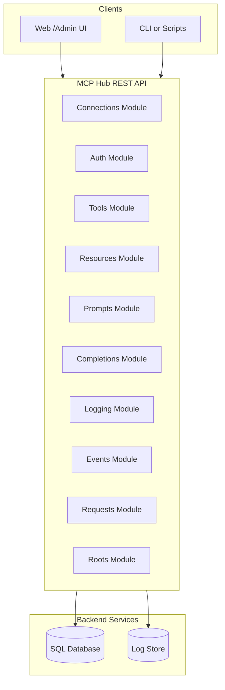

# MCP Hub API Feature Documentation

## Overview

The **MCP Hub API** provides a production-grade RESTful interface to manage connections to Model Context Protocol (MCP) servers. It acts as:
- An **MCP client/host runtime**: opening transports (stdio, streamable HTTP), negotiating JSON-RPC protocols, managing lifecycle.
- A **wrapper API** for front-end/admin UIs: exposing high-level endpoints for connections, auth flows, tools, resources, prompts, completions, logging, events, requests, and client roots.
- A **persistence & observability layer**: recording requests, responses, events, logs, and supporting live streams via SSE/WebSocket.

This API enables developers to programmatically provision and interact with MCP servers, record execution metrics, and integrate with custom dashboards or automation workflows.

---

## Architecture Overview



---

## Component Structure

### Available Modules

| Module       | Description                                           |
|--------------|-------------------------------------------------------|
| **Connections** | Manage MCP connection lifecycle and transports.    |
| **Auth**        | Initiate and track OAuth2/bearer authentication.   |
| **Tools**       | Discover and invoke MCP server tools.             |
| **Resources**   | List, read, and subscribe to resources.           |
| **Prompts**     | List and retrieve prompts with arguments.         |
| **Completions** | Execute completions on prompts or references.     |
| **Logging**     | Configure log level and query persisted logs.    |
| **Events**      | Query event history and live-stream events.       |
| **Requests**    | Inspect and cancel in-flight JSON-RPC requests.   |
| **Roots**       | Manage client roots exposed to MCP servers.       |

---

## 1. Connections Module (`/api/connections`)

Manage the full lifecycle of MCP connections: creation, transport handshake, initialization, status checks, pings, and deletion.

#### List all MCP connections

```api
{
  "title": "List all MCP connections",
  "description": "Retrieve a paginated list of MCP connections.",
  "method": "GET",
  "baseUrl": "/api",
  "endpoint": "/connections",
  "headers": [
    { "key": "Authorization", "value": "Bearer <token>", "required": true }
  ],
  "queryParams": [
    { "key": "limit", "value": "Maximum number of connections to return", "required": false },
    { "key": "offset", "value": "Offset for pagination", "required": false }
  ],
  "responses": {
    "200": {
      "description": "List of MCP connections",
      "body": "[ { /* ConnectionSummary */ } ]"
    },
    "401": {
      "description": "Unauthorized",
      "body": "{ /* ErrorEnvelope */ }"
    }
  }
}
```

#### Create a new MCP connection

```api
{
  "title": "Create MCP connection",
  "description": "Provision a new MCP connection with transport and auth settings.",
  "method": "POST",
  "baseUrl": "/api",
  "endpoint": "/connections",
  "headers": [
    { "key": "Authorization", "value": "Bearer <token>", "required": true },
    { "key": "Content-Type", "value": "application/json", "required": true }
  ],
  "bodyType": "json",
  "requestBody": "{\n  \"serverId\": \"uuid-server-1234\",\n  \"transportConfig\": {\n    \"type\": \"stdio\",\n    \"stdioCommand\": \"/usr/local/bin/mcp-server\",\n    \"stdioArgs\": [\"--flag\"]\n  },\n  \"authMode\": \"secret_env\",\n  \"metadata\": { \"workspaceId\": \"uuid-workspace-5678\" }\n}",
  "responses": {
    "201": {
      "description": "Connection created successfully",
      "body": "{ /* Connection */ }"
    },
    "400": {
      "description": "Bad Request",
      "body": "{ /* ErrorEnvelope */ }"
    },
    "401": {
      "description": "Unauthorized",
      "body": "{ /* ErrorEnvelope */ }"
    }
  }
}
```

#### Get connection details

```api
{
  "title": "Get connection details",
  "description": "Retrieve full details of a specific MCP connection by UUID.",
  "method": "GET",
  "baseUrl": "/api",
  "endpoint": "/connections/{connectionId}",
  "pathParams": [
    { "key": "connectionId", "value": "Connection UUID", "required": true }
  ],
  "headers": [
    { "key": "Authorization", "value": "Bearer <token>", "required": true }
  ],
  "responses": {
    "200": { "description": "Connection details", "body": "{ /* Connection */ }" },
    "401": { "description": "Unauthorized", "body": "{ /* ErrorEnvelope */ }" },
    "404": { "description": "Not Found", "body": "{ /* ErrorEnvelope */ }" }
  }
}
```

#### Delete an MCP connection

```api
{
  "title": "Delete MCP connection",
  "description": "Archive or remove an MCP connection by UUID.",
  "method": "DELETE",
  "baseUrl": "/api",
  "endpoint": "/connections/{connectionId}",
  "pathParams": [
    { "key": "connectionId", "value": "Connection UUID", "required": true }
  ],
  "headers": [
    { "key": "Authorization", "value": "Bearer <token>", "required": true }
  ],
  "responses": {
    "204": { "description": "Connection deleted successfully" },
    "401": { "description": "Unauthorized", "body": "{ /* ErrorEnvelope */ }" },
    "404": { "description": "Not Found", "body": "{ /* ErrorEnvelope */ }" }
  }
}
```

> [!NOTE]
> The Connections module also exposes endpoints for:
> - **connect** (`POST /connections/{connectionId}/connect`)
> - **initialize** (`POST /connections/{connectionId}/initialize`)
> - **disconnect** (`POST /connections/{connectionId}/disconnect`)
> - **ping** (`POST /connections/{connectionId}/ping`)
> - **status** (`GET /connections/{connectionId}/status`)
> - **capabilities** (`GET /connections/{connectionId}/capabilities`)
> - **server-info** (`GET /connections/{connectionId}/server-info`)

---

## 2. Auth Module (`/api/connections/{connectionId}/auth`)

Handle OAuth2 and bearer‐token flows per connection.

##### Start authentication flow

```api
{
  "title": "Start auth flow",
  "description": "Initiate OAuth2 or bearer authentication for a connection.",
  "method": "POST",
  "baseUrl": "/api",
  "endpoint": "/connections/{connectionId}/auth/start",
  "pathParams": [
    { "key": "connectionId", "value": "Connection UUID", "required": true }
  ],
  "headers": [
    { "key": "Authorization", "value": "Bearer <token>", "required": true },
    { "key": "Content-Type", "value": "application/json", "required": true }
  ],
  "bodyType": "json",
  "requestBody": "{\n  \"strategy\": \"oauth2\",\n  \"scopes\": [\"read\",\"write\"],\n  \"resourceUri\": \"https://...\"\n}",
  "responses": {
    "200": { "description": "Auth flow initiated", "body": "{ /* AuthFlowResult */ }" },
    "400": { "description": "Bad Request", "body": "{ /* ErrorEnvelope */ }" },
    "401": { "description": "Unauthorized", "body": "{ /* ErrorEnvelope */ }" }
  }
}
```

##### Get authentication status

```api
{
  "title": "Get auth status",
  "description": "Retrieve the current authentication state for a connection.",
  "method": "GET",
  "baseUrl": "/api",
  "endpoint": "/connections/{connectionId}/auth/status",
  "pathParams": [ { "key": "connectionId", "value": "Connection UUID", "required": true } ],
  "headers": [ { "key": "Authorization", "value": "Bearer <token>", "required": true } ],
  "responses": {
    "200": { "description": "Current auth status", "body": "{ /* AuthStatus */ }" },
    "401": { "description": "Unauthorized", "body": "{ /* ErrorEnvelope */ }" },
    "404": { "description": "Not Found", "body": "{ /* ErrorEnvelope */ }" }
  }
}
```

> [!TIP]
> Use **refresh** (`POST /connections/{connectionId}/auth/refresh`) to renew tokens, and **remove** (`DELETE /connections/{connectionId}/auth`) to clear authentication state.

---

## 3. Tools Module (`/api/connections/{connectionId}/tools`)

Discover and invoke MCP server tools.

##### List tools

```api
{
  "title": "List tools",
  "description": "Fetch available tool metadata for a connection.",
  "method": "GET",
  "baseUrl": "/api",
  "endpoint": "/connections/{connectionId}/tools",
  "pathParams": [ { "key": "connectionId", "required": true } ],
  "queryParams": [
    { "key": "cursor", "required": false },
    { "key": "refresh", "required": false }
  ],
  "responses": {
    "200": { "description": "Array of ToolMetadata", "body": "[ { /* ToolMetadata */ } ]" },
    "401": { "description": "Unauthorized", "body": "{ /* ErrorEnvelope */ }" },
    "404": { "description": "Not Found", "body": "{ /* ErrorEnvelope */ }" }
  }
}
```

##### Call a tool

```api
{
  "title": "Call tool",
  "description": "Invoke a named tool with arguments and options.",
  "method": "POST",
  "baseUrl": "/api",
  "endpoint": "/connections/{connectionId}/tools/{toolName}/call",
  "pathParams": [
    { "key": "connectionId", "required": true },
    { "key": "toolName", "required": true }
  ],
  "bodyType": "json",
  "requestBody": "{\n  \"args\": { /* tool args */ },\n  \"timeoutMs\": 10000,\n  \"progressToken\": \"...\"\n}",
  "responses": {
    "200": { "description": "Tool call result", "body": "{ /* inline_response_200_3 */ }" },
    "400": { "description": "Bad Request", "body": "{ /* ErrorEnvelope */ }" },
    "401": { "description": "Unauthorized", "body": "{ /* ErrorEnvelope */ }" },
    "404": { "description": "Not Found", "body": "{ /* ErrorEnvelope */ }" }
  }
}
```

---

## 4. Data Models

### ErrorEnvelope

| Field    | Type   | Description                       |
|----------|--------|-----------------------------------|
| code     | string | Error code identifier             |
| message  | string | Human-readable error message      |
| details  | object | Optional additional error details |

### ConnectionSummary

| Field         | Type    | Description                                      |
|---------------|---------|--------------------------------------------------|
| id            | string  | Connection UUID                                  |
| serverId      | string  | MCP server UUID                                  |
| status        | string  | disconnected | connecting | connected …           |
| transportType | string  | stdio | streamable_http                            |
| lastSeenAt    | string  | ISO-8601 timestamp of last heartbeat             |

### Connection

All `ConnectionSummary` fields plus:

| Field                       | Type    | Description                                  |
|-----------------------------|---------|----------------------------------------------|
| ownerId                     | string  | Owner UUID                                  |
| workspaceId                 | string  | Workspace UUID                              |
| lifecycleState              | string  | created | connected | initialized …          |
| authState                   | string  | unauthenticated | authenticating …      |
| desiredProtocolVersion      | string  | Requested protocol version                  |
| negotiatedProtocolVersion   | string  | Agreed protocol version                     |
| sessionId                   | string  | Session identifier                          |
| processId                   | integer | Subprocess PID (stdio transport)            |
| lastErrorCode               | string  | Nullable error code                         |
| lastErrorMessage            | string  | Nullable error message                      |
| serverInfo                  | object  | Normalized server info JSON                 |
| clientCapabilities          | object  | JSON of client capabilities                  |
| serverCapabilities          | object  | JSON of server capabilities                  |
| createdAt                   | string  | ISO-8601 creation timestamp                  |
| updatedAt                   | string  | ISO-8601 last update timestamp               |

---

## Error Handling

All error responses use the `ErrorEnvelope` schema and appropriate HTTP status codes:
- **400 Bad Request**
- **401 Unauthorized**
- **404 Not Found**

---

## Dependencies

- **Authorization**: Bearer JWT in `Authorization` header.
- **Transports**: `stdio` subprocess or HTTP(S) POST with optional SSE/WebSocket.
- **Persistence**: SQL database for connections, requests, events; log store for persisted logs.

---

> [!TIP]
> For full interactive testing, import `cassie-marie_mcp-hub-api_1.0.0.json` into Swagger UI, Postman, or similar tools.

---

## Key Classes Reference

| Module Controller            | Responsibility                                         |
|------------------------------|--------------------------------------------------------|
| `ConnectionsController`      | CRUD and lifecycle operations for MCP connections.     |
| `AuthController`             | Authentication initiation, status, refresh, removal.   |
| `ToolsController`            | Discovery and invocation of MCP tools.                |
| `ResourcesController`        | Resource listing, reading, subscription management.   |
| `PromptsController`          | Prompt listing and retrieval with arguments.          |
| `CompletionsController`      | Execute completions for prompts and references.       |
| `LoggingController`          | Set log levels and query persisted logs.             |
| `EventsController`           | Retrieve historical events and open live streams.    |
| `RequestsController`         | Inspect and cancel JSON-RPC request records.         |
| `RootsController`            | Manage client root URIs exposed to servers.          |

---

## Caching Strategy

- **Tools & Resources**: Cached per connection; use `?refresh=true` to invalidate.
- **Prompts**: Cached per connection; no explicit refresh endpoint.
- **Request Records**: Persisted; query parameters filter on time ranges.

---

## Testing Considerations

- Validate all endpoints with both valid and invalid UUIDs.
- Test auth flows end-to-end (OAuth2 redirect, bearer token).
- Simulate transport failures (stdio crash, HTTP timeouts) and verify error states.
- Exercise SSE/WebSocket live event streaming under load.