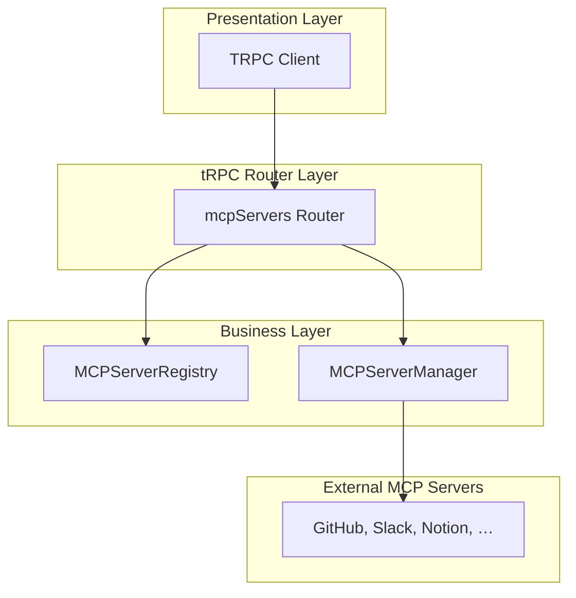
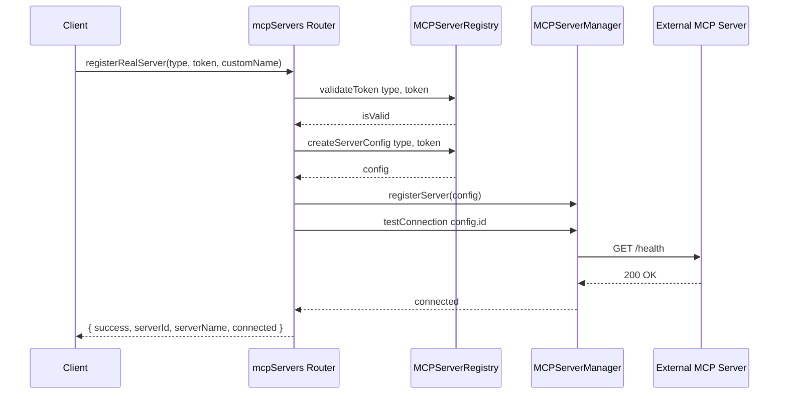
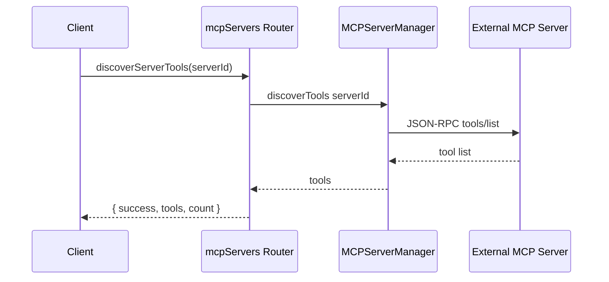

# Extended MCP Router Feature Documentation

## Overview

The **Extended MCP Router** enhances the core MCP API by adding procedures for seamless integration with external services such as GitHub, Slack, and Notion. It exposes tRPC endpoints that let clients:

- Discover supported server types and their definitions.
- Validate service tokens before registration.
- Automatically create and register MCP server configurations.
- Manage registered servers (status, tool discovery, execution, removal).

This feature simplifies onboarding real-world MCP servers into the MCP Hub platform, ensuring consistent authentication, configuration, and interaction patterns across diverse services.

## Architecture Overview



## Component Structure

### 1. tRPC Router Layer

#### **mcpExtendedRouter** ()

All procedures in this router use protectedProcedure, so clients must supply a valid JWT in the Authorization header to invoke them.

- **Purpose:** Define extended procedures for real MCP server integration.
- **Key Procedures:**- `getAvailableServers`
- `getServerDefinition`
- `getServerTools`
- `validateToken`
- `registerRealServer`
- `getRegisteredServers`
- `discoverServerTools`
- `executeServerTool`
- `testServerConnection`
- `unregisterServer`

### 2. Business Layer

#### **MCPServerRegistry** ()

- **Purpose:** Central registry of supported MCP server types and factory for server configs.
- **Key Methods:**

| Method | Description | Returns |  |
| --- | --- | --- | --- |
| `getAllServers()` | List all supported server definitions | `ServerDefinition[]` |  |
| `getServerDefinition(type)` | Retrieve definition for a given server type | `ServerDefinition \ | null` |
| `getServerTools(type)` | Get tool metadata without live connection | `any[]` |  |
| `validateToken(type, token)` | Verify a token’s validity against the service’s OAuth/JWT API | `Promise<boolean>` |  |
| `createServerConfig(type, token)` | Build an `MCPServerConfig` for manager registration | `MCPServerConfig \ | null` |


#### **MCPServerManager** ()

- **Purpose:** Manage MCP server lifecycles, caching, status tracking, and tool operations.
- **Key Methods:**

| Method | Description | Returns |
| --- | --- | --- |
| `registerServer(config)` | Store config and initialize HTTP/SSE/Stdio client | `void` |
| `getAllServers()` | List all registered server configs | `MCPServerConfig[]` |
| `getAllServerStatuses()` | Get status (connected, error, toolCount) for each server | `ServerStatus[]` |
| `testConnection(serverId)` | Check `/health` endpoint reachability | `Promise<boolean>` |
| `discoverTools(serverId)` | Fetch and cache tools from a registered server | `Promise<MCPTool[]>` |
| `executeTool(serverId, name, parameters)` | Invoke a tool on the server | `Promise<MCPToolResult>` |
| `removeServer(serverId)` | Unregister server, clear client and cache | `void` |
| `clearToolCache(serverId)` | Invalidate cached tools for a server | `void` |
| `clearAllCaches()` | Purge all tool caches | `void` |


## Data Models

#### ServerType

| Value | Description |
| --- | --- |
| `github` | GitHub MCP server |
| `slack` | Slack MCP server |
| `notion` | Notion MCP server |


#### ServerDefinition

| Property | Type | Description |  |  |
| --- | --- | --- | --- | --- |
| `id` | `ServerType` | Unique type identifier |  |  |
| `name` | `string` | Display name |  |  |
| `description` | `string` | Brief description |  |  |
| `icon` | `string` | Icon identifier |  |  |
| `docs` | `string` | Documentation URL |  |  |
| `requiredScopes?` | `string[]` | OAuth scopes |  |  |
| `authMethod` | `'bearer' \ | 'api-key' \ | 'basic'` | Authentication mechanism |


#### MCPServerConfig

| Property | Type | Description |  |  |
| --- | --- | --- | --- | --- |
| `id` | `string` | Unique server ID |  |  |
| `name` | `string` | Human-readable server name |  |  |
| `url` | `string` (URL) | Base endpoint for MCP JSON-RPC |  |  |
| `type` | `'http' \ | 'websocket' \ | 'stdio'` | Transport layer |
| `headers?` | `Record<string, unknown>` | Custom HTTP headers |  |  |
| `auth?` | `{ type: …; token?; username?; password? }` | Authentication details |  |  |
| `timeout?` | `number` | Request timeout in ms |  |  |
| `retryAttempts?` | `number` | Number of retry attempts on failure |  |  |


#### Procedure Inputs & Responses

| Procedure | Input Model | Response Model |  |
| --- | --- | --- | --- |
| getAvailableServers |  | `ServerDefinition[]` |  |
| getServerDefinition | `{ type: string }` | `ServerDefinition \ | { error: string }` |
| getServerTools | `{ type: string }` | `{ success: boolean; tools: any[]; count: number }` |  |
| validateToken | `{ type: string; token: string }` | `{ success: boolean; valid: boolean; error?: string }` |  |
| registerRealServer | `{ type: string; token: string; customName?: string }` | `{ success: boolean; serverId?: string; serverName?: string; connected?: boolean; error?: string }` |  |
| getRegisteredServers |  | `Array<{ id; name; type; status; toolCount; lastConnected?; lastError? }>` |  |
| discoverServerTools | `{ serverId: string }` | `{ success: boolean; tools: any[]; count: number; error?: string }` |  |
| executeServerTool | `{ serverId: string; toolName: string; parameters: Record<string, any> }` | `{ success: boolean; data?: any; error?: string }` |  |
| testServerConnection | `{ serverId: string }` | `{ success: boolean; connected: boolean; error?: string }` |  |
| unregisterServer | `{ serverId: string }` | `{ success: boolean }` |  |


## API Integration

### Get Available MCP Server Types

```api
{
    "title": "Get Available MCP Server Types",
    "description": "Retrieve all supported MCP server types and their definitions.",
    "method": "POST",
    "baseUrl": "http://localhost:3000/api/trpc",
    "endpoint": "/mcpServers.getAvailableServers",
    "headers": [
        {
            "key": "Authorization",
            "value": "Bearer <jwt_token>",
            "required": true
        }
    ],
    "queryParams": [],
    "pathParams": [],
    "bodyType": "none",
    "requestBody": "",
    "formData": [],
    "rawBody": "",
    "responses": {
        "200": {
            "description": "Success",
            "body": "[ { \"id\": \"github\", \"name\": \"GitHub\", \"description\": \"\u2026\", \"icon\": \"github\", \"docs\": \"https://docs.github.com/en/rest\", \"authMethod\": \"bearer\", \"requiredScopes\":[\"repo\",\"user\",\"gist\"] }, \u2026 ]"
        }
    }
}
```

### Get Server Definition

```api
{
    "title": "Get MCP Server Definition",
    "description": "Fetch the definition for a specified server type.",
    "method": "POST",
    "baseUrl": "http://localhost:3000/api/trpc",
    "endpoint": "/mcpServers.getServerDefinition",
    "headers": [
        {
            "key": "Authorization",
            "value": "Bearer <jwt_token>",
            "required": true
        }
    ],
    "queryParams": [],
    "pathParams": [],
    "bodyType": "json",
    "requestBody": "{\n  \"type\": \"slack\"\n}",
    "formData": [],
    "rawBody": "",
    "responses": {
        "200": {
            "description": "Success or error if not found",
            "body": "{\n  \"id\": \"slack\",\n  \"name\": \"Slack\",\n  \"description\": \"Send messages\u2026\",\n  \"icon\": \"slack\",\n  \"docs\": \"https://api.slack.com\",\n  \"authMethod\": \"bearer\",\n  \"requiredScopes\": [\"chat:write\",\"channels:read\",\"users:read\"]\n}"
        },
        "200_not_found": {
            "description": "Server type not found",
            "body": "{ \"error\": \"Server type not found\" }"
        }
    }
}
```

### Get Available Tools for Server Type

```api
{
    "title": "Get Server Tools",
    "description": "List tools for a given server type without live connection.",
    "method": "POST",
    "baseUrl": "http://localhost:3000/api/trpc",
    "endpoint": "/mcpServers.getServerTools",
    "headers": [
        {
            "key": "Authorization",
            "value": "Bearer <jwt_token>",
            "required": true
        }
    ],
    "queryParams": [],
    "pathParams": [],
    "bodyType": "json",
    "requestBody": "{\n  \"type\": \"github\"\n}",
    "formData": [],
    "rawBody": "",
    "responses": {
        "200": {
            "description": "Successful retrieval",
            "body": "{\n  \"success\": true,\n  \"tools\": [ /* tool metadata */ ],\n  \"count\": 12\n  }\n"
        }
    }
}
```

### Validate Token

```api
{
    "title": "Validate Service Token",
    "description": "Check whether a provided token is valid for the chosen server type.",
    "method": "POST",
    "baseUrl": "http://localhost:3000/api/trpc",
    "endpoint": "/mcpServers.validateToken",
    "headers": [
        {
            "key": "Authorization",
            "value": "Bearer <jwt_token>",
            "required": true
        }
    ],
    "queryParams": [],
    "pathParams": [],
    "bodyType": "json",
    "requestBody": "{\n  \"type\": \"notion\",\n  \"token\": \"secret_token\"\n}",
    "formData": [],
    "rawBody": "",
    "responses": {
        "200": {
            "description": "Valid or invalid result",
            "body": "{\n  \"success\": true,\n  \"valid\": false\n}"
        },
        "400": {
            "description": "Validation error",
            "body": "{\n  \"success\": false,\n  \"valid\": false,\n  \"error\": \"Validation failed\"\n}"
        }
    }
}
```

### Register Real MCP Server

```api
{
    "title": "Register Real MCP Server",
    "description": "Validate token, create config, register server, and test connection.",
    "method": "POST",
    "baseUrl": "http://localhost:3000/api/trpc",
    "endpoint": "/mcpServers.registerRealServer",
    "headers": [
        {
            "key": "Authorization",
            "value": "Bearer <jwt_token>",
            "required": true
        }
    ],
    "queryParams": [],
    "pathParams": [],
    "bodyType": "json",
    "requestBody": "{\n  \"type\": \"github\",\n  \"token\": \"ghp_\u2026\",\n  \"customName\": \"My GitHub Server\"\n}",
    "formData": [],
    "rawBody": "",
    "responses": {
        "200": {
            "description": "Registration succeeded",
            "body": "{\n  \"success\": true,\n  \"serverId\": \"github-123\",\n  \"serverName\": \"My GitHub Server\",\n  \"connected\": true\n}"
        },
        "500": {
            "description": "Registration error",
            "body": "{ \"success\": false, \"error\": \"Registration failed\" }"
        },
        "400_invalid_token": {
            "description": "Invalid token provided",
            "body": "{ \"success\": false, \"error\": \"Invalid token for this server type\" }"
        }
    }
}
```

### Get Registered Servers

```api
{
    "title": "Get Registered MCP Servers",
    "description": "List all servers registered in MCP Hub along with their status.",
    "method": "POST",
    "baseUrl": "http://localhost:3000/api/trpc",
    "endpoint": "/mcpServers.getRegisteredServers",
    "headers": [
        {
            "key": "Authorization",
            "value": "Bearer <jwt_token>",
            "required": true
        }
    ],
    "queryParams": [],
    "pathParams": [],
    "bodyType": "none",
    "requestBody": "",
    "formData": [],
    "rawBody": "",
    "responses": {
        "200": {
            "description": "Array of server status objects",
            "body": "[{ \"id\": \"slack-1\", \"name\": \"Slack\", \"type\": \"slack\", \"status\": \"connected\", \"toolCount\": 8, \"lastConnected\": \"2026-05-10T12:34:56.000Z\" }, \u2026]"
        }
    }
}
```

### Discover Tools from Registered Server

```api
{
    "title": "Discover Tools on Server",
    "description": "Fetch and cache the latest tools from a registered server.",
    "method": "POST",
    "baseUrl": "http://localhost:3000/api/trpc",
    "endpoint": "/mcpServers.discoverServerTools",
    "headers": [
        {
            "key": "Authorization",
            "value": "Bearer <jwt_token>",
            "required": true
        }
    ],
    "queryParams": [],
    "pathParams": [],
    "bodyType": "json",
    "requestBody": "{\n  \"serverId\": \"github-123\"\n}",
    "formData": [],
    "rawBody": "",
    "responses": {
        "200": {
            "description": "Tools discovered",
            "body": "{ \"success\": true, \"tools\": [ /* \u2026 */ ], \"count\": 10 }"
        },
        "500": {
            "description": "Discovery failed",
            "body": "{ \"success\": false, \"tools\": [], \"count\": 0, \"error\": \"Discovery failed\" }"
        }
    }
}
```

### Execute Tool on Registered Server

```api
{
    "title": "Execute Server Tool",
    "description": "Invoke a specific tool on a registered MCP server.",
    "method": "POST",
    "baseUrl": "http://localhost:3000/api/trpc",
    "endpoint": "/mcpServers.executeServerTool",
    "headers": [
        {
            "key": "Authorization",
            "value": "Bearer <jwt_token>",
            "required": true
        }
    ],
    "queryParams": [],
    "pathParams": [],
    "bodyType": "json",
    "requestBody": "{\n  \"serverId\": \"slack-1\",\n  \"toolName\": \"send_message\",\n  \"parameters\": { \"channel\": \"#dev\", \"text\": \"Hello\" }\n}",
    "formData": [],
    "rawBody": "",
    "responses": {
        "200": {
            "description": "Execution result",
            "body": "{ \"success\": true, \"data\": { /* \u2026 */ } }"
        },
        "500": {
            "description": "Execution error",
            "body": "{ \"success\": false, \"error\": \"Execution failed\" }"
        }
    }
}
```

### Test Server Connection

```api
{
    "title": "Test Server Connection",
    "description": "Check if a registered server is reachable.",
    "method": "POST",
    "baseUrl": "http://localhost:3000/api/trpc",
    "endpoint": "/mcpServers.testServerConnection",
    "headers": [
        {
            "key": "Authorization",
            "value": "Bearer <jwt_token>",
            "required": true
        }
    ],
    "queryParams": [],
    "pathParams": [],
    "bodyType": "json",
    "requestBody": "{\n  \"serverId\": \"notion-2\"\n}",
    "formData": [],
    "rawBody": "",
    "responses": {
        "200": {
            "description": "Connection result",
            "body": "{ \"success\": true, \"connected\": false }"
        },
        "500": {
            "description": "Test error",
            "body": "{ \"success\": false, \"connected\": false, \"error\": \"Test failed\" }"
        }
    }
}
```

### Unregister Server

```api
{
    "title": "Unregister MCP Server",
    "description": "Remove a server from MCP Hub and clear its data.",
    "method": "POST",
    "baseUrl": "http://localhost:3000/api/trpc",
    "endpoint": "/mcpServers.unregisterServer",
    "headers": [
        {
            "key": "Authorization",
            "value": "Bearer <jwt_token>",
            "required": true
        }
    ],
    "queryParams": [],
    "pathParams": [],
    "bodyType": "json",
    "requestBody": "{\n  \"serverId\": \"slack-1\"\n}",
    "formData": [],
    "rawBody": "",
    "responses": {
        "200": {
            "description": "Unregistration success",
            "body": "{ \"success\": true }"
        }
    }
}
```

## Feature Flows

### 1. Registering a Real MCP Server



### 2. Discovering Tools



## Error Handling

All mutations wrap calls in `try/catch` and return a structured error response:

```js
protectedProcedure
  .mutation(async ({ input }) => {
    try {
      // ...operation
      return { success: true, /* data */ };
    } catch (error) {
      return {
        success: false,
        error: error instanceof Error ? error.message : 'Unknown error',
      };
    }
  });
```

## Dependencies

- **zod**: Input validation schemas
- **@trpc/server**: `router`, `protectedProcedure`
- **MCPServerRegistry**: Static registry of server types
- **MCPServerManager**: Singleton for server operations

## Key Classes Reference

| Class | Location | Responsibility |
| --- | --- | --- |
| `mcpExtendedRouter` |  | Defines extended tRPC procedures |
| `MCPServerRegistry` |  | Registry of server definitions and factories |
| `MCPServerManager` |  | Manages server connections, tools, and status |
| `ServerType` |  | Enumeration of supported server types |
| `ServerDefinition` |  | Type for server metadata |


## Testing Considerations

- Verify retrieval of server types and definitions.
- Ensure token validation correctly handles valid/invalid tokens.
- Test full `registerRealServer` flow, including name override and connection test.
- Confirm discovery and execution procedures handle success and failure scenarios.
- Validate that `unregisterServer` removes all associated data.