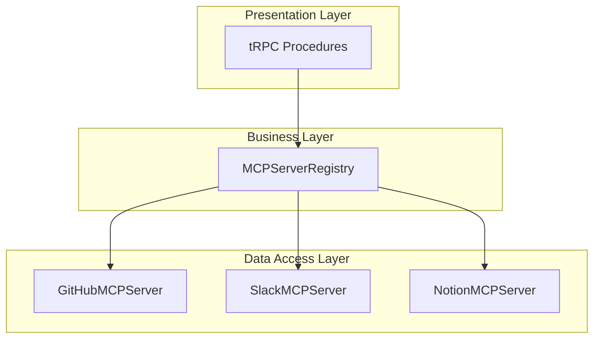
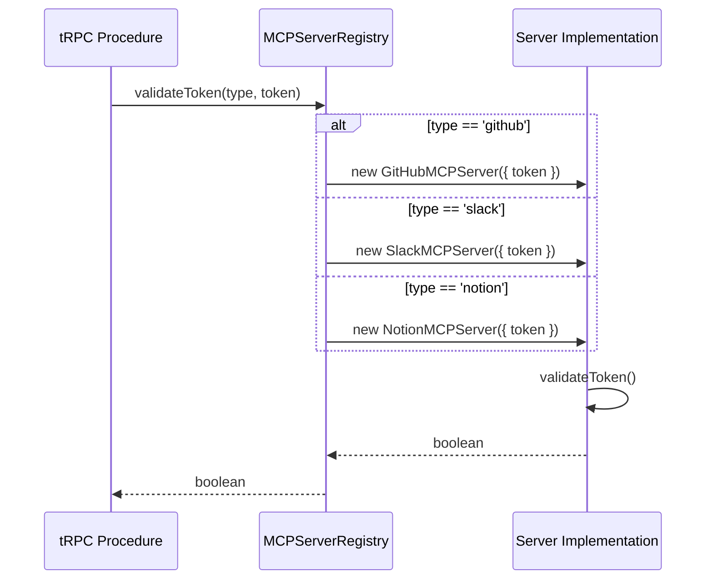
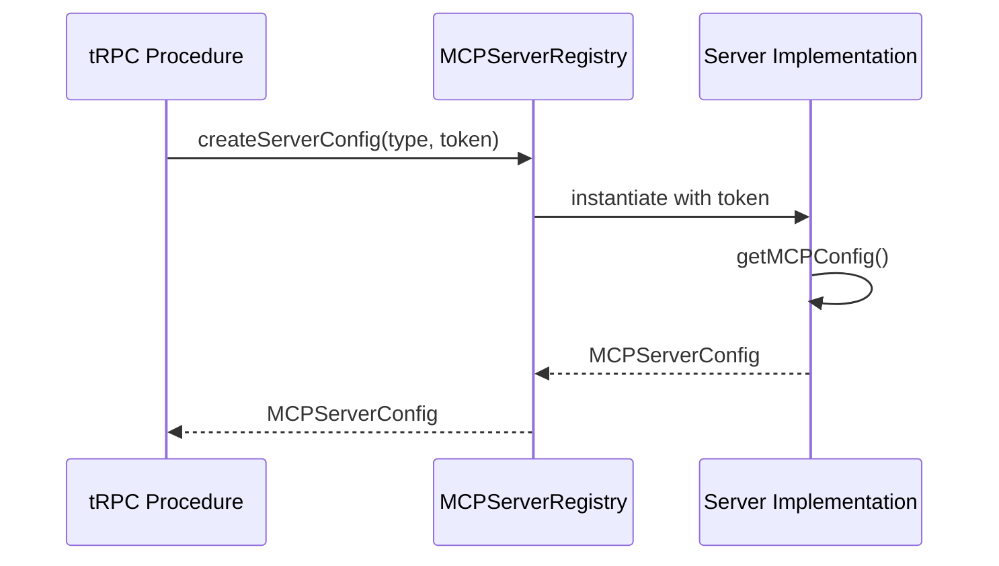

# MCP Server Registry Feature Documentation

## Overview

The **MCP Server Registry** centralizes metadata and factory methods for all supported Model Context Protocol (MCP) server implementations. It provides a unified interface to:

- Retrieve server definitions and documentation links
- Instantiate server-specific configuration objects
- List available tools without needing a live connection
- Validate authentication tokens

By abstracting GitHub, Slack, and Notion integrations behind a common registry, the application’s tRPC layer can dynamically support new server types and ensure consistency in server management workflows.

## Architecture Overview



- **Presentation Layer**: tRPC procedures that handle client requests.
- **Business Layer**: `MCPServerRegistry` orchestrates metadata lookups and factory calls.
- **Data Access Layer**: Concrete server implementations (`GitHubMCPServer`, `SlackMCPServer`, `NotionMCPServer`) provide configurations and tool metadata.

## Component Structure

### 1. Server Types and Definitions

#### **ServerType** ()

- Union of supported MCP server identifiers.

```typescript
export type ServerType = 'github' | 'slack' | 'notion';
```

#### **ServerDefinition** ()

Encapsulates metadata for each server type.

| Property | Type | Description |  |  |
| --- | --- | --- | --- | --- |
| `id` | `ServerType` | Unique server identifier |  |  |
| `name` | `string` | Display name |  |  |
| `description` | `string` | Brief summary of capabilities |  |  |
| `icon` | `string` | UI icon identifier |  |  |
| `docs` | `string` | Link to official documentation |  |  |
| `requiredScopes` | `string[]`  | OAuth scopes needed for full access |  |  |
| `authMethod` | `'bearer' | 'api-key' | 'basic'` | Supported authentication scheme |


Example Definition{
  id: 'github',
  name: 'GitHub',
  description: 'Access GitHub repositories, issues, pull requests, and more',
  icon: 'github',
  docs: 'https://docs.github.com/en/rest',
  authMethod: 'bearer',
  requiredScopes: ['repo', 'user', 'gist'],
}

### 2. MCPServerRegistry ()

The `MCPServerRegistry` class serves as the central registry for server metadata and factory methods.

```card
{
    "title": "Centralized Registry",
    "content": "MCPServerRegistry centralizes server definitions and factory methods for configuration, tool listing, and token validation.",
    "type": "",
    "filePath": "",
    "badges": []
}
```

#### Static Properties

| Property | Type | Description |
| --- | --- | --- |
| `servers` | `Map<ServerType, ServerDefinition>` | Stores metadata for each supported type |


#### Static Methods

| Method | Description | Returns |  |
| --- | --- | --- | --- |
| `getServerDefinition` | Retrieve a server’s metadata by type | `ServerDefinition \ | null` |
| `getAllServers` | List all supported server definitions | `ServerDefinition[]` |  |
| `createServerConfig` | Instantiate and obtain a `MCPServerConfig` for a given type and token | `MCPServerConfig \ | null` |
| `getServerTools` | Fetch available tool metadata without a live connection | `any[]` |  |
| `validateToken` | Verify if an auth token is valid for the specified server type | `Promise<boolean>` |  |


#### Method Details

Use getAllServers() to dynamically populate server selection UIs.

**getServerDefinition**

```typescript
static getServerDefinition(type: ServerType): ServerDefinition | null
```

- Returns the matching definition or `null`.

**getAllServers**

```typescript
static getAllServers(): ServerDefinition[]
```

- Returns all definitions in the registry.

**createServerConfig**

```typescript
static createServerConfig(type: ServerType, token: string): MCPServerConfig | null
```

- Instantiates the corresponding server class:- `GitHubMCPServer({ token })`
- `SlackMCPServer({ token })`
- `NotionMCPServer({ token })`
- Calls `.getMCPConfig()` and returns its output.

**getServerTools**

```typescript
static getServerTools(type: ServerType): any[]
```

- Instantiates each server class with an empty token.
- Calls `.getAvailableTools()` to list tool descriptors.

**validateToken**

```typescript
static async validateToken(type: ServerType, token: string): Promise<boolean>
```

- Instantiates the server class with the provided token.
- Calls `.validateToken()` to confirm token validity.

## Feature Flows

### 1. Token Validation Flow



### 2. Configuration Creation Flow



## Integration Points

- **tRPC Routers**- `mcpExtendedRouter` ():- Uses `getAllServers()`, `getServerDefinition()`, `getServerTools()`, `validateToken()`, `createServerConfig()`.
- **Server Implementations**- `GitHubMCPServer` ()
- `SlackMCPServer` ()
- `NotionMCPServer` ()

## Key Classes Reference

| Class / Type | Location | Responsibility |
| --- | --- | --- |
| `ServerType` |  | Supported MCP server identifiers |
| `ServerDefinition` |  | Metadata for each MCP server type |
| `MCPServerRegistry` |  | Central registry for server definitions and factory methods |


## Error Handling

- **Unsupported **`**ServerType**`:- `getServerDefinition` → `null`
- `createServerConfig` → `null`
- `getServerTools` → `[]`
- `validateToken` → `false`

Errors thrown by underlying server implementations bubble up through registry methods.

## Dependencies

- **Server Classes**:- `GitHubMCPServer`, `GitHubConfig`
- `SlackMCPServer`, `SlackConfig`
- `NotionMCPServer`, `NotionConfig`
- **Configuration Interface**:- `MCPServerConfig` from

## Testing Considerations

- Verify that each `ServerType` key exists in the `servers` map.
- Test `createServerConfig` returns valid configurations for known types.
- Confirm `getServerTools` returns the expected tool metadata structure.
- Validate both success and failure paths of `validateToken` for each server type.