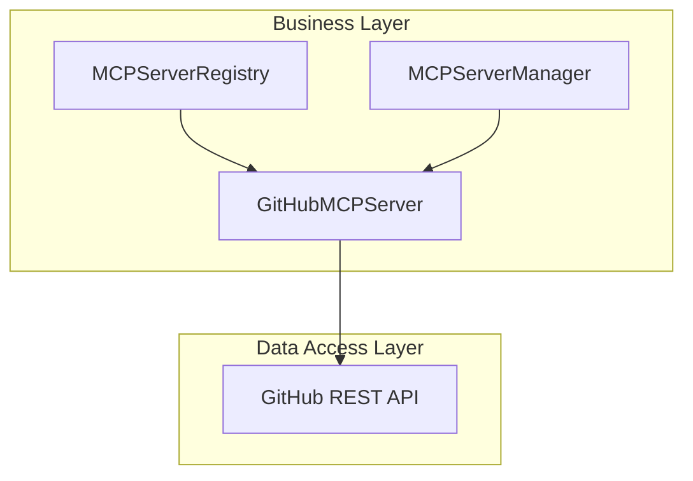

# GitHub MCP Server Feature Documentation

## Overview

The **GitHub MCP Server** integration enables Model Context Protocol (MCP) clients to interact with GitHub resources through a standardized JSON-RPC interface over HTTP. It provides configuration details for connecting to GitHub’s MCP endpoint, exposes a set of GitHub-specific tools (e.g., listing repositories, creating issues), and validates authentication tokens. This feature allows developers to seamlessly integrate GitHub operations into MCP-driven workflows and macros, enhancing automation and cross-server orchestration within the MCP Hub ecosystem.

## Architecture Overview



- **MCPServerRegistry** uses `GitHubMCPServer` to build server configs and list tools.
- **MCPServerManager** registers and invokes `GitHubMCPServer` for discovery and execution.
- **GitHubMCPServer** communicates with GitHub’s REST API under the hood.

## Component Structure

### Data Access Layer

#### **GitHubMCPServer** ()

- **Purpose**: Implements the MCP server interface for GitHub, supplying configuration, tool definitions, and token validation.
- **Key Properties**:- `config: GitHubConfig` — Holds `token` and optional `baseUrl` for API calls.
- **Key Methods**:- `getMCPConfig(): MCPServerConfig` — Returns connection parameters for MCP clients.
- `getAvailableTools(): MCPTool[]` — Lists GitHub-specific tools with JSON schemas.
- `validateToken(): Promise<boolean>` — Checks token validity by fetching the authenticated user.

```typescript
constructor(config: GitHubConfig)
```


 Save

- Merges provided config with defaults (`baseUrl = 'https://api.github.com'`).

```typescript
getMCPConfig(): MCPServerConfig
```


 Save

- Builds `{ id, name, url, type, auth, headers, timeout }` for MCPServerManager registration.

```typescript
getAvailableTools(): MCPTool[]
```


 Save

- Returns an array of tool objects: `{ name, description, inputSchema }`.

```typescript
async validateToken(): Promise<boolean>
```


 Save

- Performs `GET https://api.github.com/user` with bearer token; returns `true` if response is OK.

```plaintext

## Data Models

### GitHubConfig

| Property | Type    | Description                           |
|----------|---------|---------------------------------------|
| token    | string  | GitHub personal access token         |
| baseUrl  | string? | Optional API base URL (default provided) |

### MCPServerConfig (returned by `getMCPConfig`)

| Property | Type     | Description                                                                 |
|----------|----------|-----------------------------------------------------------------------------|
| id       | string   | Unique server identifier (`github-mcp`)                                      |
| name     | string   | Display name (`GitHub`)                                                      |
| url      | string   | MCP endpoint (`<baseUrl>/mcp`)                                               |
| type     | string   | Transport type (`http`)                                                      |
| auth     | object   | Authentication details (`{ type: 'bearer', token }`)                         |
| headers  | object   | Default HTTP headers for GitHub API                                          |
| timeout  | number   | Request timeout in milliseconds                                              |

### MCPTool (elements of `getAvailableTools`)

| Property     | Type     | Description                                                                    |
|--------------|----------|--------------------------------------------------------------------------------|
| name         | string   | Tool identifier (e.g., `create_issue`)                                         |
| description  | string   | Human-readable summary                                                         |
| inputSchema  | object   | JSON Schema for the tool’s parameters                                          |
| required?    | string[] | List of schema-required fields (present on some tools)                         |

## Feature Flows

### 1. Server Configuration Flow

```


 Save

sequenceDiagram

participant R as MCPServerRegistry

participant G as GitHubMCPServer

participant M as MCPServerManager

R->>G: new GitHubMCPServer({ token, baseUrl? })

G-->>R: instance

R->>M: registerServer(G.getMCPConfig())

M-->>R: acknowledgment

```plaintext

1. **Registry** instantiates `GitHubMCPServer`.
2. Calls `getMCPConfig` to obtain `MCPServerConfig`.
3. **Manager** registers the server for tool discovery and execution.

### 2. Tool Discovery Flow

```


 Save

sequenceDiagram

participant M as MCPServerManager

participant G as GitHubMCPServer

M->>G: getAvailableTools()

G-->>M: [MCPTool, ...]

M-->>Client: tool list

```plaintext

1. **Manager** invokes `getAvailableTools`.
2. Receives predefined list of GitHub tools with schemas.
3. Caches or returns tools to clients.

### 3. Token Validation Flow

```


 Save

sequenceDiagram

participant M as MCPServerManager

participant G as GitHubMCPServer

participant API as GitHub REST API

M->>G: validateToken()

G->>API: GET /user (Authorization: Bearer token)

API-->>G: 200 OK or error

G-->>M: true or false