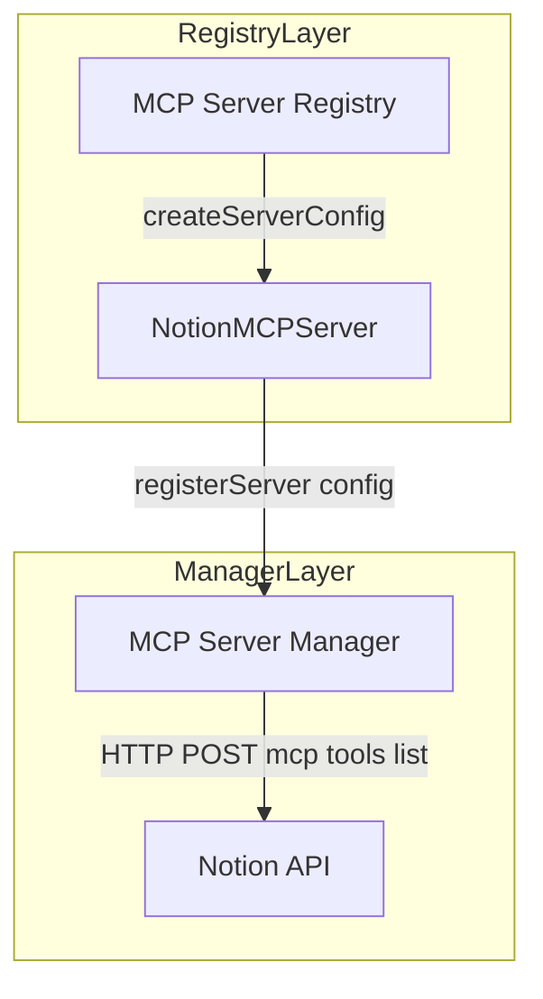

# Notion MCP Server Feature Documentation

## Overview

The **NotionMCPServer** class adapts the Notion REST API to the Model Context Protocol (MCP). It exposes configuration, tool definitions, and token validation to MCP clients. Developers can plug Notion into the MCP Hub for seamless database queries, page management, and search operations.

This feature enables the MCP Hub to treat Notion as a first-class server, discovering tools, executing requests, and handling authentication consistently across multiple MCP integrations .

## Architecture Overview



## Component Structure

### Interface: NotionConfig (server/mcp/servers/notion-mcp.ts)

- **token** (string) : Notion integration token.
- **baseUrl** (string) : Custom API root. Defaults to `https://api.notion.com/v1` .

### Class: NotionMCPServer (server/mcp/servers/notion-mcp.ts)

**Purpose:** Build MCP connection details and list Notion-specific tools.

#### Constructor

```js
constructor(config: NotionConfig)
```

- Merges provided `config` with default `baseUrl` .

#### Methods

- **getMCPConfig()**

Returns an `MCPServerConfig` object with endpoint URL, HTTP type, bearer auth and headers.

- **getAvailableTools()**

Returns an array of tool definitions (name, description, JSON schema) for common Notion operations.

- **validateToken()**

Sends `GET /users/me` to verify token validity. Returns `true` if response is OK.

## 🔧 Tools Reference

The following table lists all tools exposed by **NotionMCPServer** :

| Tool Name | Description | Required Params |
| --- | --- | --- |
| `query_database` | Query a Notion database | `database_id` |
| `create_page` | Create a new page in a database | `parent`, `properties` |
| `update_page` | Update an existing page | `page_id` |
| `get_page` | Get page details | `page_id` |
| `get_database` | Get database schema | `database_id` |
| `append_block_children` | Add blocks to a page | `block_id`, `children` |
| `search` | Search for pages and databases | `query` |
| `create_database` | Create a new database | `parent`, `title`, `properties` |
| `retrieve_block_children` | Get child blocks of a page | `block_id` |
| `delete_block` | Delete a block | `block_id` |


Example JSON Schema for <code>query_database</code>{
  "type": "object",
  "properties": {
    "database_id": { "type": "string", "description": "Database ID" },
    "filter":      { "type": "object", "description": "Filter conditions" },
    "sorts":       { "type": "array",  "description": "Sort order" },
    "page_size":   { "type": "number", "description": "Items per page" }
  },
  "required": ["database_id"]
}

## Dependencies

- Relies on the global `fetch` API for HTTP requests.
- Conforms to `MCPServerConfig` from  .

## Testing Considerations

- **Configuration Test:** Verify `getMCPConfig` output matches expected URL, headers, and auth.
- **Tool Enumeration:** Ensure `getAvailableTools` returns exactly 10 tools with correct schemas.
- **Token Validation:** Mock `/users/me` responses to test success and failure paths.

## Key Classes Reference

| Class | Location | Responsibility |
| --- | --- | --- |
| `NotionConfig` |  | Defines constructor input for NotionMCPServer |
| `NotionMCPServer` |  | Builds MCP config, lists tools, validates token |


## Error Handling

- **validateToken** catches all errors and returns `false` on failure, preventing unhandled exceptions .