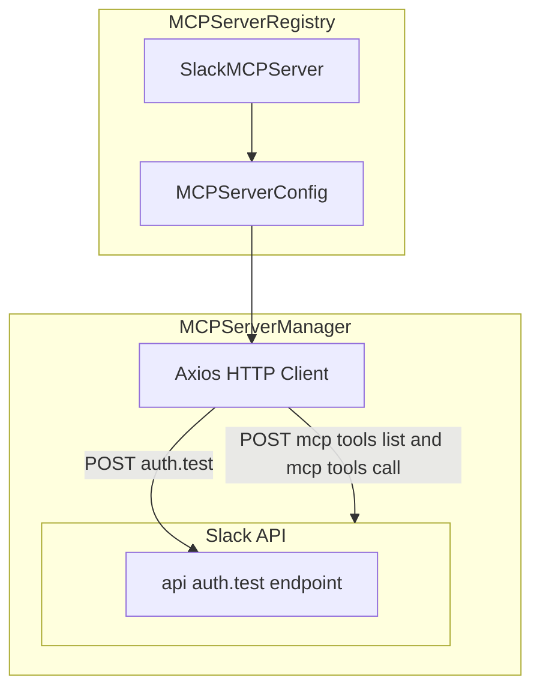
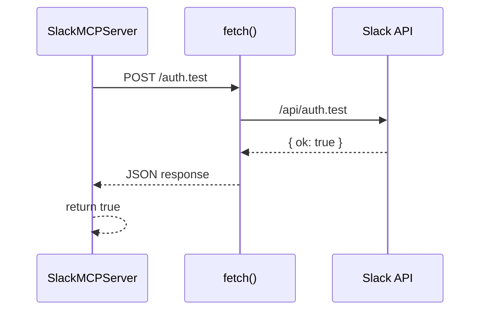

# Slack MCP Server Feature Documentation

## Overview

The **Slack MCP Server** integration adapts Slack’s HTTP API to the Model Context Protocol (MCP) interface. It enables the core application to treat Slack as an MCP server, allowing macro recipes and tool executions to send messages, manage channels, and query user data in a workspace. By standardizing Slack actions as MCP “tools,” developers can orchestrate multi-service workflows (e.g., GitHub→Slack) with a unified API surface.

## Architecture Overview



## Component Structure

### SlackConfig (Data Model)

**Location:**

Defines the credentials and optional endpoint for Slack integration.

| Property | Type | Description |
| --- | --- | --- |
| **token** | string | Bearer token for Slack OAuth  |
| baseUrl | string | Base URL for Slack API , defaults to `https://slack.com/api` |


### SlackMCPServer (Integration Class)

**Location:**

Wraps Slack API as an MCP server. Responsible for generating MCP config, exposing tool schemas, and validating tokens.

#### Constructor

```js
constructor(config: SlackConfig)
```

- Merges provided `baseUrl` with default Slack API URL .

#### Methods Summary

| Method | Signature | Description |
| --- | --- | --- |
| **getMCPConfig** | (): MCPServerConfig | Builds MCP server configuration pointing at Slack’s `/mcp` path |
| **getAvailableTools** | (): SlackToolDefinition[] | Returns list of Slack actions as MCP tools (e.g., `send_message`) |
| **validateToken** | (): Promise<boolean> | Verifies OAuth token via Slack `auth.test` endpoint |


## Data Models

#### MCPServerConfig

Returned by `getMCPConfig`.

| Property | Type | Description |
| --- | --- | --- |
| id | string | Unique server ID (`slack-mcp`) |
| name | string | Human-readable name (`Slack`) |
| url | string | Full MCP endpoint (e.g., `https://…/mcp`) |
| type | string | Transport type (`http`) |
| auth | object | `{ type: 'bearer', token: string }` |
| headers | object | Default headers (`Content-Type: application/json`) |
| timeout | number | Request timeout in ms (30000) |


#### SlackToolDefinition

Represents a Slack action exposed via MCP.

| Property | Type | Description |
| --- | --- | --- |
| name | string | Internal tool identifier (e.g., `send_message`) |
| description | string | Human-friendly description |
| inputSchema | object | JSON Schema detailing allowed input params |
| required | string[] (optional) | Keys required by `inputSchema` |


## Slack API Integration

### Validate Token: `auth.test`

```api
{
    "title": "Validate Slack Token",
    "description": "Verifies OAuth token via Slack auth.test",
    "method": "POST",
    "baseUrl": "https://slack.com/api",
    "endpoint": "/auth.test",
    "headers": [
        {
            "key": "Authorization",
            "value": "Bearer <token>",
            "required": true
        },
        {
            "key": "Content-Type",
            "value": "application/json",
            "required": true
        }
    ],
    "queryParams": [],
    "pathParams": [],
    "bodyType": "none",
    "requestBody": "",
    "formData": [],
    "rawBody": "",
    "responses": {
        "200": {
            "description": "Token valid",
            "body": "{\n  \"ok\": true\n}"
        },
        "default": {
            "description": "Invalid token or error",
            "body": "{\n  \"ok\": false,\n  \"error\": \"invalid_auth\"\n}"
        }
    }
}
```

## Sequence Diagram: Token Validation Flow



## Key Classes Reference

| Class | Location | Responsibility |
| --- | --- | --- |
| **SlackConfig** |  | Holds Slack token and optional API base URL |
| **SlackMCPServer** |  | MCP adapter for Slack API |


## Error Handling

- **Token Validation:** Catches network or parsing failures and resolves to `false`, marking the token invalid .

## Dependencies

- Uses native `fetch` for HTTP calls.
- Imports `MCPServerConfig` type from `mcp-server-manager` .

## Integration Points

- **MCPServerRegistry** invokes `new SlackMCPServer({ token })` to obtain the MCP config and tool list for type `"slack"`.
- **MCPServerManager** receives the `MCPServerConfig` via `registerServer` and manages HTTP client setup to Slack’s MCP endpoint.

[!TIP] Ensure your Slack OAuth app has granted scopes `chat:write`, `channels:read`, and `users:read` as required by the tool definitions.