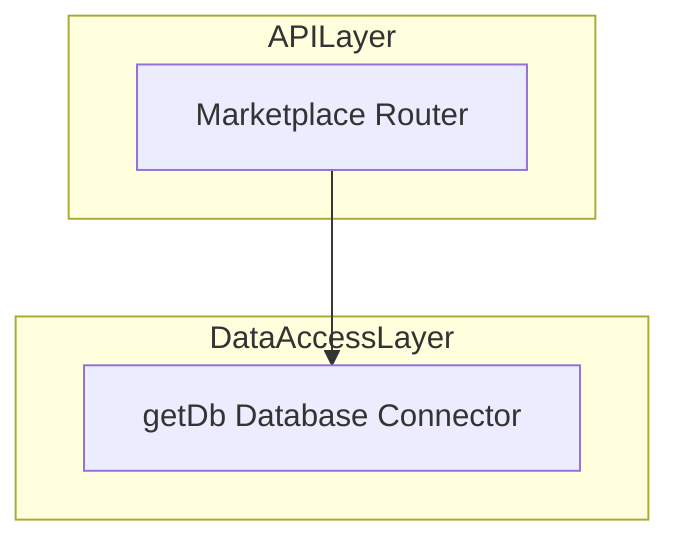
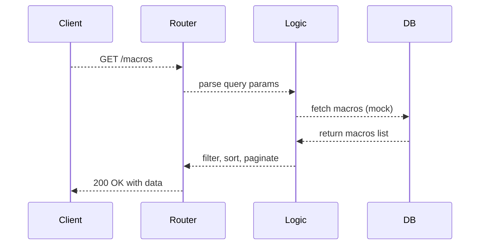
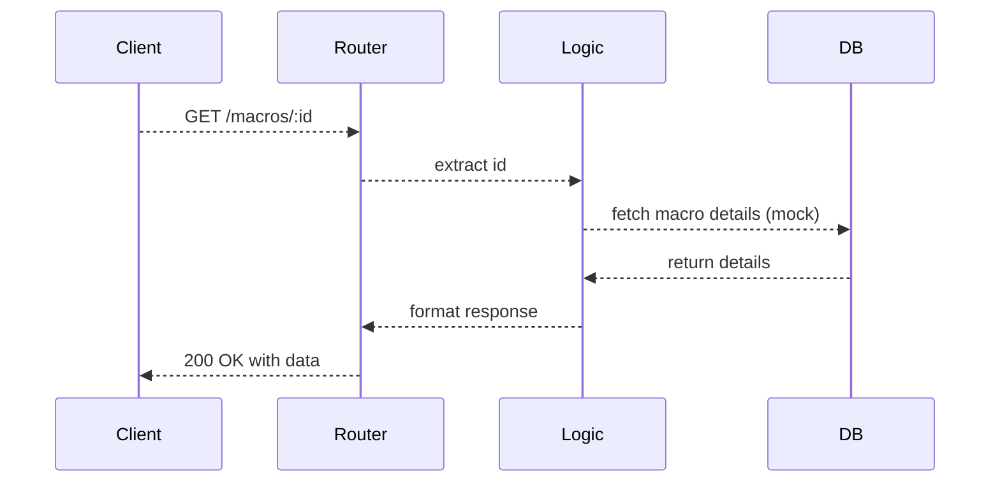
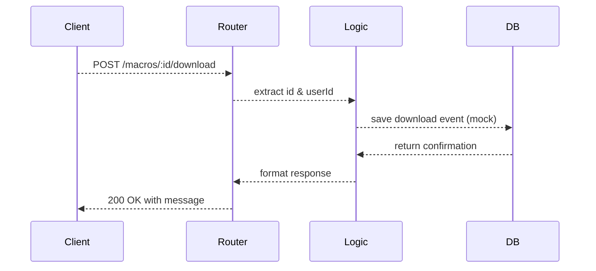
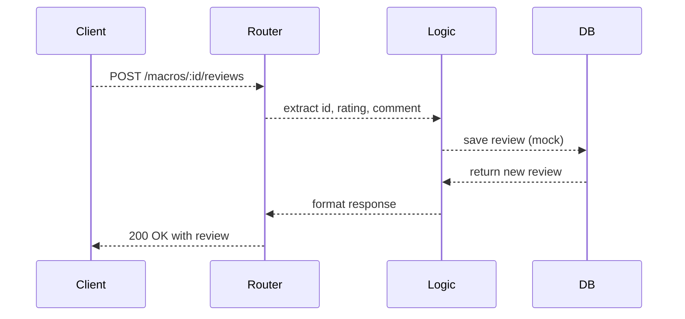

# Marketplace API Feature Documentation

## Overview

The **Marketplace API** powers the macro marketplace in MCP Hub. It offers endpoints to:

- Browse macros with pagination, search, category filtering, and sorting.
- Retrieve detailed macro information including user reviews.
- Record macro download events.
- Submit user reviews for macros.

By centralizing these operations, the API supports future integration with a real database (via `getDb`) and ensures a consistent interface for front-end clients.

## Architecture Overview



## Component Structure

### Business Layer

#### **Marketplace Router** (`server/routes/marketplace.ts`)
- Purpose: Defines HTTP endpoints for macro marketplace operations.
- Key Endpoints:
  - `GET /macros`
  - `GET /macros/:id`
  - `POST /macros/:id/download`
  - `POST /macros/:id/reviews`

> [!NOTE]  
> The `getDb` import is reserved for future database integration; current logic uses mock data.

### Data Access Layer

#### **getDb** (`server/db.ts`)
- Purpose: Provides a connection to the database.
- Status: Not yet used in this router (mock implementation).

## Data Models

### Macro

| Property    | Type   | Description                    |
|-------------|--------|--------------------------------|
| id          | string | Unique macro identifier        |
| name        | string | Macro name                     |
| description | string | Brief macro description        |
| category    | string | Macro category                 |
| downloads   | number | Total download count           |

### MacroReview

| Property | Type   | Description                       |
|----------|--------|-----------------------------------|
| id       | string | Unique review identifier          |
| macroId  | string | Identifier of the reviewed macro  |
| rating   | number | Rating given (1–5)                |
| comment  | string | User’s review comment             |

### MacroDownload

| Property     | Type   | Description                          |
|--------------|--------|--------------------------------------|
| id           | string | Unique download event identifier     |
| macroId      | string | Identifier of the downloaded macro   |
| userId       | string | Identifier of the user               |
| downloadedAt | Date   | Timestamp of the download            |

## API Integration

### List Macros

```api
{
    "title": "List Macros",
    "description": "Retrieves a paginated list of macros with optional filtering and sorting.",
    "method": "GET",
    "baseUrl": "http://localhost:3000",
    "endpoint": "/macros",
    "headers": [],
    "queryParams": [
        { "key": "page", "value": "Page number for pagination", "required": false },
        { "key": "limit", "value": "Items per page", "required": false },
        { "key": "search", "value": "Search term in macro name or description", "required": false },
        { "key": "category", "value": "Filter by category", "required": false },
        { "key": "sortBy", "value": "Sort criterion (downloads)", "required": false }
    ],
    "pathParams": [],
    "bodyType": "none",
    "requestBody": "",
    "formData": [],
    "responses": {
        "200": {
            "description": "Success",
            "body": "{\n  \"success\": true,\n  \"data\": [\n    { \"id\": \"1\", \"name\": \"Read File\", \"description\": \"Read file contents\", \"category\": \"filesystem\", \"downloads\": 150 }\n  ],\n  \"pagination\": { \"page\": 1, \"limit\": 20, \"total\": 5, \"pages\": 1 }\n}"
        },
        "500": {
            "description": "Internal Server Error",
            "body": "{\n  \"success\": false,\n  \"error\": \"Failed to fetch macros\"\n}"
        }
    }
}
```

### Get Macro Details

```api
{
    "title": "Get Macro Details",
    "description": "Retrieves detailed information and reviews for a specific macro by ID.",
    "method": "GET",
    "baseUrl": "http://localhost:3000",
    "endpoint": "/macros/:id",
    "headers": [],
    "queryParams": [],
    "pathParams": [
        { "key": "id", "value": "Macro identifier", "required": true }
    ],
    "bodyType": "none",
    "requestBody": "",
    "formData": [],
    "responses": {
        "200": {
            "description": "Success",
            "body": "{\n  \"success\": true,\n  \"data\": {\n    \"id\": \"1\",\n    \"name\": \"Read File\",\n    \"description\": \"Read file contents\",\n    \"category\": \"filesystem\",\n    \"downloads\": 150,\n    \"reviews\": [\n      { \"id\": \"1\", \"macroId\": \"1\", \"rating\": 5, \"comment\": \"Great macro!\" }\n    ]\n  }\n}"
        },
        "500": {
            "description": "Internal Server Error",
            "body": "{\n  \"success\": false,\n  \"error\": \"Failed to fetch macro\"\n}"
        }
    }
}
```

### Download Macro

```api
{
    "title": "Download Macro",
    "description": "Records a download event for a specific macro.",
    "method": "POST",
    "baseUrl": "http://localhost:3000",
    "endpoint": "/macros/:id/download",
    "headers": [
        { "key": "Content-Type", "value": "application/json", "required": true }
    ],
    "queryParams": [],
    "pathParams": [
        { "key": "id", "value": "Macro identifier", "required": true }
    ],
    "bodyType": "json",
    "requestBody": "{\n  \"userId\": \"user-123\"\n}",
    "formData": [],
    "responses": {
        "200": {
            "description": "Success",
            "body": "{\n  \"success\": true,\n  \"message\": \"Macro downloaded successfully\",\n  \"macroId\": \"1\",\n  \"userId\": \"user-123\"\n}"
        },
        "500": {
            "description": "Internal Server Error",
            "body": "{\n  \"success\": false,\n  \"error\": \"Failed to download macro\"\n}"
        }
    }
}
```

### Add Macro Review

```api
{
    "title": "Add Macro Review",
    "description": "Submits a rating and comment for a specific macro.",
    "method": "POST",
    "baseUrl": "http://localhost:3000",
    "endpoint": "/macros/:id/reviews",
    "headers": [
        { "key": "Content-Type", "value": "application/json", "required": true }
    ],
    "queryParams": [],
    "pathParams": [
        { "key": "id", "value": "Macro identifier", "required": true }
    ],
    "bodyType": "json",
    "requestBody": "{\n  \"rating\": 4,\n  \"comment\": \"Very useful macro\"\n}",
    "formData": [],
    "responses": {
        "200": {
            "description": "Success",
            "body": "{\n  \"success\": true,\n  \"message\": \"Review added successfully\",\n  \"review\": { \"id\": \"new-review\", \"macroId\": \"1\", \"rating\": 4, \"comment\": \"Very useful macro\" }\n}"
        },
        "500": {
            "description": "Internal Server Error",
            "body": "{\n  \"success\": false,\n  \"error\": \"Failed to add review\"\n}"
        }
    }
}
```

## Feature Flows

### Retrieve Macros Flow



### View Macro Details Flow



### Download Macro Flow



### Add Review Flow



## Error Handling

All route handlers use **try/catch**. On failure, they return a **500** status with a JSON error:

```js
res.status(500).json({ success: false, error: 'Failed to fetch macros' });
```

## Integration Points

- Mounted in the main Express application (`server/_core/index.ts`).
- Prepares for Drizzle ORM or other database integration via **getDb**.

## Key Classes Reference

| Class/Type     | Location                     | Responsibility                             |
|----------------|------------------------------|--------------------------------------------|
| Router         | server/routes/marketplace.ts | Defines marketplace API endpoints          |
| Macro          | server/routes/marketplace.ts | Data model for macro metadata              |
| MacroReview    | server/routes/marketplace.ts | Data model for macro reviews               |
| MacroDownload  | server/routes/marketplace.ts | Data model for download events             |
| getDb          | server/db.ts                 | Database connector for future integration  |

## Dependencies

- **express**: Routing and HTTP handling
- **getDb**: Database connector (unused in mock)

## Testing Considerations

- Pagination logic (`page`, `limit`)
- Search and category filtering
- Download-based sorting
- Detail retrieval with reviews
- Download endpoint success and default `anonymous` behavior
- Review submission and response format
- Error responses (simulate exceptions)

## Caching Strategy

_No caching implemented; all responses are generated per request._