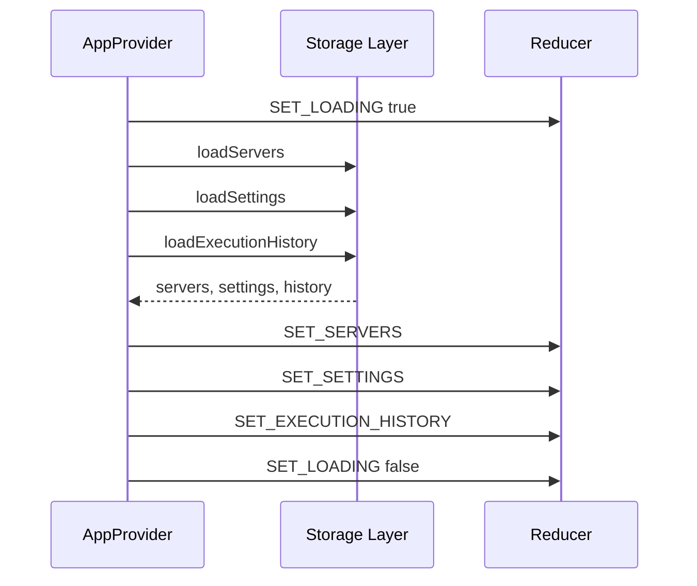
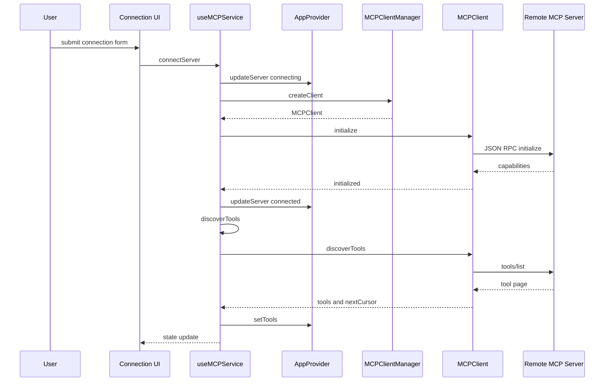
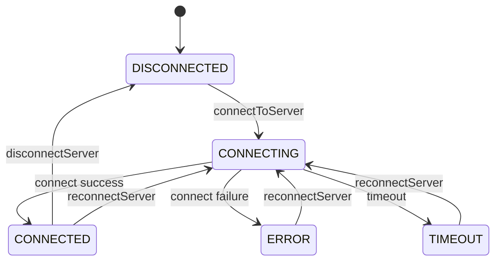
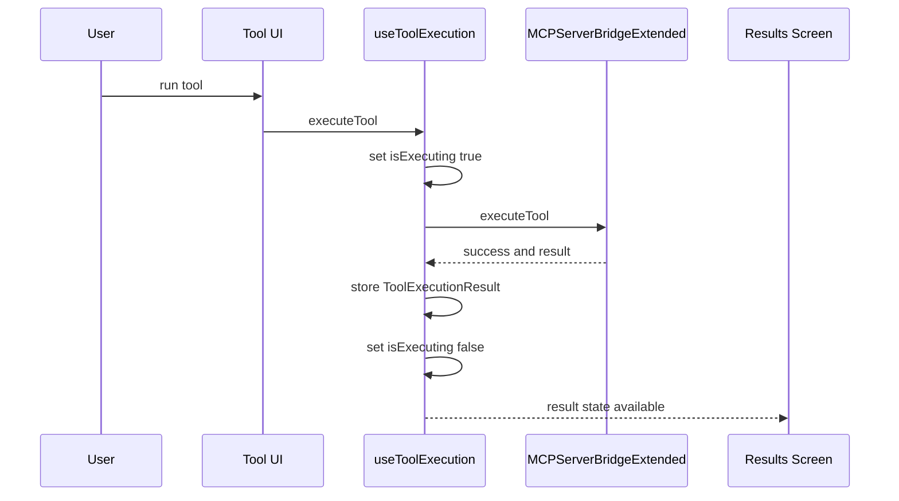
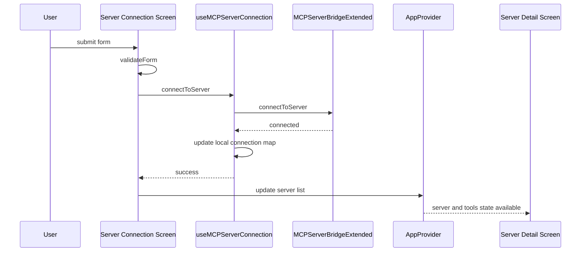
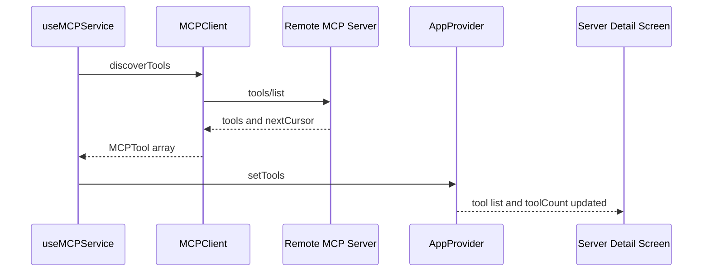
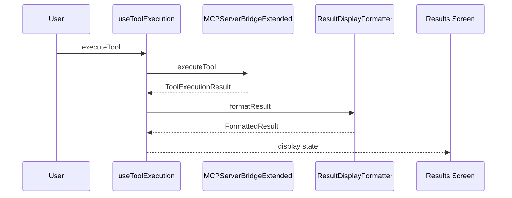
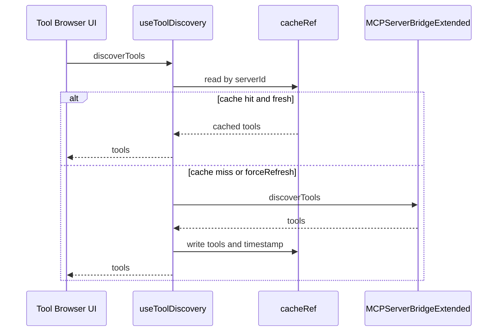

# MCP Integration Domain Client Connection Discovery and Execution Flow

## Overview

This client-side domain is the path from “I have a server” to “I can see tools and execute them.” It starts with connection forms that validate host, port, transport, and auth inputs; continues through native bridge or JSON-RPC client setup; and ends with tool discovery, execution, and formatted result rendering.

The code in this section is organized around two connection paths: a native bridge path that talks to `MCPServerBridge`, `MCPBridge`, and `MCPServerBridgeExtended`, and a TypeScript client path built on `MCPClient` plus `mcpClientManager`. UI state is kept in React hooks and the app context so that connection status, discovered tools, execution history, and formatted results stay synchronized across screens.

## Architecture Overview

```mermaid
flowchart TB
    subgraph PresentationLayer[Presentation Layer]
        ServersScreen[Servers Screen]
        ServerConnectionScreen[Server Connection Screen]
        ServerConnectionUpdatedScreen[Server Connection Updated Screen]
        ServerDetailScreen[Server Detail Screen]
        ResultsScreen[Results Screen]
    end

    subgraph StateLayer[State and Orchestration Layer]
        AppProvider[App Context State Store]
        useMCPService[useMCPService]
        useMCPServerConnection[useMCPServerConnection]
        useMCPBridge[useMCPBridge]
        useMCPBridgeClient[useMCPBridge]
        useMCPBridgeExtended[useMCPBridgeExtended]
        useToolDiscovery[useToolDiscovery]
        useToolExecution[useToolExecution]
        useWebSocket[useWebSocket]
    end

    subgraph TransportLayer[Transport and Bridge Layer]
        MCPClientManager[MCPClientManager]
        MCPClient[MCPClient]
        MCPBridge[Native Module MCPBridge]
        MCPServerBridge[MCPServerBridge]
        MCPServerBridgeExtended[MCPServerBridgeExtended]
        NativeEventEmitter[Native Event Emitter]
        SocketIO[Socket.io Client]
    end

    subgraph RemoteLayer[Remote Systems]
        RemoteMCPServer[Remote MCP Server]
        SocketIOServer[Socket.io Server]
    end

    ServersScreen --> AppProvider
    ServerConnectionScreen --> useMCPServerConnection
    ServerConnectionUpdatedScreen --> useMCPBridgeClient
    ServerDetailScreen --> AppProvider
    ResultsScreen --> useToolExecution

    useMCPService --> AppProvider
    useMCPService --> MCPClientManager
    MCPClientManager --> MCPClient
    MCPClient --> RemoteMCPServer

    useMCPServerConnection --> MCPServerBridgeExtended
    useMCPBridgeClient --> MCPBridge
    useMCPBridge --> MCPServerBridge
    useMCPBridgeExtended --> MCPServerBridgeExtended
    useToolDiscovery --> MCPServerBridgeExtended
    useToolExecution --> MCPServerBridgeExtended

    useMCPBridge --> NativeEventEmitter
    useMCPServerConnection --> NativeEventEmitter
    useMCPBridgeExtended --> NativeEventEmitter

    useWebSocket --> SocketIO
    SocketIO --> SocketIOServer
```

## Presentation Layer

### Servers Screen

_`app/(tabs)/servers.tsx`_

This screen is the entry point into the client-side server pipeline. It reads the shared server list from `useApp()`, supports searching by server name, routes into server details, and exposes navigation into the connection flow.

#### Local State

| State         | Type     | Purpose                                 |
| ------------- | -------- | --------------------------------------- |
| `searchQuery` | `string` | Filters the visible server list by name |

#### Key Methods

| Method               | Description                                                 |
| -------------------- | ----------------------------------------------------------- |
| `handleDeleteServer` | Confirms deletion and calls `deleteServer` from app context |
| `renderServerCard`   | Renders a server card and routes to detail or edit flows    |

#### Interaction Notes

- Uses `router.push('/(tabs)/server-detail?id=...')` to open a selected server.
- Uses `router.push('/(tabs)/add-server')` for the add-server entry point in the navigation tree.
- Uses `router.push('/(tabs)/edit-server?id=...')` for server updates.

### Server Connection Screen

_`app/(tabs)/server-connection.tsx`_

This screen collects connection details and sends them to `useMCPServerConnection().connectToServer`. The form is schema-like in behavior: transport-specific options are shown behind the advanced toggle, validation runs before submission, and the active connections list reflects bridge state.

#### Local State

| State                          | Type                     | Purpose                            |
| ------------------------------ | ------------------------ | ---------------------------------- |
| `formData.name`                | `string`                 | Human-readable server name         |
| `formData.host`                | `string`                 | Server host or local address       |
| `formData.port`                | `number`                 | Transport port                     |
| `formData.transport`           | `TransportType`          | Selected transport                 |
| `formData.isSecure`            | `boolean`                | Secure transport toggle            |
| `formData.authToken`           | `string`                 | Optional token                     |
| `formData.connectionTimeoutMs` | `number`                 | Connection timeout                 |
| `showAdvanced`                 | `boolean`                | Reveals token and timeout controls |
| `validationErrors`             | `Record<string, string>` | Field-level validation messages    |

#### Key Methods

| Method                    | Description                                                        |
| ------------------------- | ------------------------------------------------------------------ |
| `validateForm`            | Validates name, host, and port before connecting                   |
| `handleConnect`           | Builds `ServerConnectionConfig` and submits the connection request |
| `renderField`             | Shared field renderer with inline error display                    |
| `renderTransportSelector` | Renders the transport button group                                 |
| `renderConnectionsList`   | Shows active connection cards and status badges                    |

#### Validation Rules

- `name` is required.
- `host` is required and must match the built-in host pattern.
- `port` must be between `1` and `65535`.

### Server Connection Updated Screen

_`app/(tabs)/server-connection-updated.tsx`_

This variant uses the client bridge hook from and keeps a separate list of connected server IDs. It adds a connection form that is closer to the bridge contract: `serverId`, `host`, `port`, `transport`, `authToken`, and `timeout`.

#### Local State

| State                | Type                     | Purpose                              |
| -------------------- | ------------------------ | ------------------------------------ | -------- | -------- | ------------------ |
| `formData.serverId`  | `string`                 | Bridge-level server identifier       |
| `formData.host`      | `string`                 | Host address                         |
| `formData.port`      | `number`                 | Port                                 |
| `formData.transport` | `'http' \                | 'websocket' \                        | 'sse' \  | 'stdio'` | Selected transport |
| `formData.authToken` | `string`                 | Optional auth token                  |
| `formData.timeout`   | `number`                 | Connection timeout                   |
| `showAdvanced`       | `boolean`                | Shows token and timeout controls     |
| `validationErrors`   | `Record<string, string>` | Form validation messages             |
| `isConnecting`       | `boolean`                | Loading state for the connect action |
| `connectedServers`   | `string[]`               | Local list of connected server IDs   |

#### Key Methods

| Method             | Description                                               |
| ------------------ | --------------------------------------------------------- |
| `validateForm`     | Validates server ID, host, and port                       |
| `handleConnect`    | Calls `connectToServer` and updates local connection list |
| `handleDisconnect` | Calls `disconnectServer` for a given server ID            |

### Server Detail Screen

_`app/(tabs)/server-detail.tsx`_

This screen consumes the shared app context to show the discovered tool list for a selected server and surface server metadata. It is the handoff point between discovery and tool detail navigation.

#### Local State

| State       | Type        | Purpose |
| ----------- | ----------- | ------- | --------------------------------------------- |
| `activeTab` | `'tools' \  | 'info'` | Toggles between tool list and server metadata |

#### Key Methods

| Method           | Description                                          |
| ---------------- | ---------------------------------------------------- |
| `renderToolCard` | Renders discovered tools and routes into tool detail |

#### Integration Notes

- Reads server data from `useApp().servers`.
- Reads tool data from `useApp().getServerTools(server.id)`.
- Uses `tool.inputSchema.required` to show required parameter counts, which keeps the UI aligned with tool schema metadata returned from discovery.

### Results Screen

_`app/(tabs)/results.tsx`_

This screen renders tool execution output through `ResultDisplayFormatter` and also exposes sharing, download, and macro-save actions. It is the main consumer of the execution result shape returned by `useToolExecution()`.

#### Local State

| State                  | Type                    | Purpose                                 |
| ---------------------- | ----------------------- | --------------------------------------- | --------------------------- |
| `selectedResult`       | `ToolExecutionResult \  | null`                                   | Current result being viewed |
| `selectedFormat`       | `ResultType`            | Output formatting mode                  |
| `formattedResult`      | `FormattedResult \      | null`                                   | Render-ready result payload |
| `showRawJson`          | `boolean`               | Toggles raw JSON display                |
| `executionHistory`     | `ToolExecutionResult[]` | Cached execution history for the screen |
| `showSaveAsMacroModal` | `boolean`               | Macro save dialog visibility            |

#### Key Methods

| Method                 | Description                                                                 |
| ---------------------- | --------------------------------------------------------------------------- |
| `handleCopy`           | Copies formatted output into the clipboard flow                             |
| `handleShare`          | Shares the formatted result payload                                         |
| `handleDownload`       | Creates a downloadable payload with `ResultDisplayFormatter.toDownloadable` |
| `handleSaveAsMacro`    | Saves the selected execution as a macro via `createFromExecutionHistory`    |
| `renderFormatSelector` | Builds the available output format selector                                 |
| `renderResultContent`  | Renders formatted output and truncation metadata                            |
| `renderActionButtons`  | Renders copy, share, download, and macro actions                            |
| `renderMetadata`       | Renders execution metadata and error details                                |
| `renderRawJsonToggle`  | Toggles raw JSON visibility                                                 |
| `renderRawJson`        | Renders the raw serialized execution object                                 |

## State and Orchestration Layer

### App Context State Store

_`lib/app-context.tsx`_

`AppProvider` is the shared state boundary for servers, discovered tools, execution history, settings, and loading state. The connection pipeline writes into this store so that screens like `servers.tsx`, `server-detail.tsx`, and `results.tsx` can stay in sync without local duplication.

#### `AppState`

| Property           | Type                        | Description                 |
| ------------------ | --------------------------- | --------------------------- |
| `servers`          | `MCPServer[]`               | Persisted server records    |
| `tools`            | `Record<string, MCPTool[]>` | Tools grouped by `serverId` |
| `executionHistory` | `ToolExecutionResult[]`     | Stored execution history    |
| `settings`         | `AppSettings`               | App configuration           |
| `isLoading`        | `boolean`                   | App initialization state    |

#### `AppContextType`

| Property                | Type                                                                               | Description                                            |
| ----------------------- | ---------------------------------------------------------------------------------- | ------------------------------------------------------ |
| `servers`               | `MCPServer[]`                                                                      | Current server list                                    |
| `tools`                 | `Record<string, MCPTool[]>`                                                        | Tool map by server                                     |
| `executionHistory`      | `ToolExecutionResult[]`                                                            | Current execution history                              |
| `settings`              | `AppSettings`                                                                      | Current app settings                                   |
| `isLoading`             | `boolean`                                                                          | Global loading flag                                    |
| `addServer`             | `(server: MCPServer) => Promise<void>`                                             | Adds a server to state and storage                     |
| `updateServer`          | `(server: MCPServer) => Promise<void>`                                             | Replaces an existing server                            |
| `deleteServer`          | `(serverId: string) => Promise<void>`                                              | Removes a server                                       |
| `setServerStatus`       | `(serverId: string, status: MCPServer['status'], error?: string) => Promise<void>` | Updates connection status and last connected timestamp |
| `setTools`              | `(serverId: string, tools: MCPTool[]) => Promise<void>`                            | Stores discovered tools and updates `toolCount`        |
| `getServerTools`        | `(serverId: string) => MCPTool[]`                                                  | Reads tools for a server                               |
| `addExecutionResult`    | `(result: ToolExecutionResult) => Promise<void>`                                   | Prepends a new execution result                        |
| `clearExecutionHistory` | `() => Promise<void>`                                                              | Clears stored history                                  |
| `updateSettings`        | `(settings: Partial<AppSettings>) => Promise<void>`                                | Merges settings changes                                |
| `initialize`            | `() => Promise<void>`                                                              | Loads persisted state at startup                       |

#### AppProvider Initialization Flow

#### State Update Flow

- `setServerStatus` derives the updated server object from the current server list and updates `lastConnected` when the status becomes `connected`.
- `setTools` writes the tool list into the server-keyed map and also updates the server’s `toolCount`.
- `addExecutionResult` prepends the new result and keeps the stored history bounded by the most recent entries.

### MCP Client Service

_`hooks/use-mcp-service.ts`_

This hook is the local orchestrator for the TypeScript client path. It creates `MCPClient` instances, stores them in a `ref` keyed by server ID, writes connection status back to app context, and recursively discovers paginated tools.

#### State and Internal Storage

| State        | Type                     | Purpose                               |
| ------------ | ------------------------ | ------------------------------------- |
| `clientsRef` | `Map<string, MCPClient>` | Active client instances by `serverId` |

#### Public Methods

| Method             | Description                                                                                        |
| ------------------ | -------------------------------------------------------------------------------------------------- |
| `connectServer`    | Creates a client, initializes it, stores it, updates app context status, and starts tool discovery |
| `discoverTools`    | Fetches tools from a client and persists them into app context                                     |
| `executeTool`      | Executes a tool through the client and returns a result envelope                                   |
| `disconnectServer` | Closes a single client and removes it from the registry                                            |
| `disconnectAll`    | Disconnects every tracked client                                                                   |

#### Connection and Discovery Behavior

- `connectServer` sets server status to `connecting` before creating the client.
- The client config is built from `server.connectionType`, `server.connectionDetails.command`, `server.connectionDetails.url`, `server.connectionDetails.headers`, and the computed timeout.
- On successful initialization, the server status is updated to `connected`.
- Tool discovery is called immediately after connect and recursively follows `nextCursor` until all pages are collected.
- Discovered tools are pushed into app context via `setTools(serverId, tools)`.

#### Connection Lifecycle Flow

## Transport and Bridge Layer

### MCP Client

connectServer calls useApp() inside the callback body, which places a React hook call inside a nested function. The same file also computes duration in the error path with Date.now() - Date.now(), which always evaluates to 0. The visible effect is that the callback does not measure failed execution time and the hook call placement violates React hook rules.

_`lib/mcp-client.ts`_

`MCPClient` is the direct JSON-RPC 2.0 client used by the TypeScript client path. It handles initialization, tool discovery, tool execution, and connection state for a single server.

#### Constructor Dependencies

| Type              | Description                                                             |
| ----------------- | ----------------------------------------------------------------------- |
| `MCPClientConfig` | Server ID, transport type, URL or command details, headers, and timeout |

#### `MCPClientConfig`

| Property         | Type                       | Description                                                    |
| ---------------- | -------------------------- | -------------------------------------------------------------- | ------------------------------------------------------- | --------------------------------- |
| `serverId`       | `string`                   | Server identifier used in the client registry and tool mapping |
| `connectionType` | `'stdio' \                 | 'sse' \                                                        | 'websocket'`                                            | Transport selected for the client |
| `command`        | `string \                  | undefined`                                                     | Command for `stdio` transport                           |
| `url`            | `string \                  | undefined`                                                     | HTTP endpoint for `sse` and `websocket` transport paths |
| `headers`        | `Record<string, string> \  | undefined`                                                     | Additional request headers                              |
| `timeout`        | `number \                  | undefined`                                                     | Transport timeout                                       |

#### Class Properties

| Property          | Type                                               | Description                 |
| ----------------- | -------------------------------------------------- | --------------------------- | --------------------------------------------- |
| `config`          | `MCPClientConfig`                                  | Client configuration        |
| `messageId`       | `number`                                           | JSON-RPC request ID counter |
| `pendingRequests` | `Map<number, (response: JSONRPCResponse) => void>` | Pending request callbacks   |
| `capabilities`    | `ServerCapabilities \                              | null`                       | Server capability payload from initialization |
| `isConnected`     | `boolean`                                          | Connection state            |

#### Public Methods

| Method            | Description                                                            |
| ----------------- | ---------------------------------------------------------------------- |
| `initialize`      | Sends the JSON-RPC `initialize` request and stores server capabilities |
| `discoverTools`   | Requests `tools/list` and maps the response into `MCPTool[]`           |
| `executeTool`     | Sends `tools/call` with the tool name and arguments                    |
| `close`           | Marks the client disconnected and clears pending requests              |
| `getIsConnected`  | Returns the local connection flag                                      |
| `getCapabilities` | Returns cached server capabilities                                     |

#### Request Flow

- `initialize` sends:- `protocolVersion: '2024-11-25'`
- capability buckets for `tools`, `resources`, and `prompts`
- client identity `MCP Hub` version `1.0.0`
- `discoverTools` requires the client to be connected first.
- `executeTool` returns `content` and `isError` from the JSON-RPC result.

#### Transport Selection

- `stdio` calls `sendViaStdio`.
- `sse` and `websocket` call `sendViaHttp`.
- `sendViaHttp` posts the JSON-RPC request to `config.url` with `Content-Type: application/json` plus merged custom headers.

#### `MCPClientManager`

| Property  | Type                     | Description                             |
| --------- | ------------------------ | --------------------------------------- |
| `clients` | `Map<string, MCPClient>` | Registry of active clients by server ID |

#### Public Methods

| Method         | Description                                                  |
| -------------- | ------------------------------------------------------------ |
| `createClient` | Instantiates a new `MCPClient` and stores it in the registry |
| `getClient`    | Returns an existing client by server ID                      |
| `removeClient` | Closes and removes a client from the registry                |
| `closeAll`     | Closes every tracked client and clears the registry          |

### Native Server Connection Bridge

The visible sendViaStdio implementation is a placeholder that returns a mock capability response instead of performing real stdio I/O. In this code path, stdio can report initialization success without a true transport implementation.

_`lib/hooks/useMCPServerConnection.ts`_

This hook manages native connection state for servers that are controlled through `MCPServerBridgeExtended`. It listens for native status events and keeps local connection cards synchronized with the bridge.

#### Enums

`ConnectionStatus`: `DISCONNECTED`, `CONNECTING`, `CONNECTED`, `ERROR`, `TIMEOUT`

`TransportType`: `HTTP`, `WEBSOCKET`, `STDIO`

#### `ConnectionState`

| Property             | Type               | Description                     |
| -------------------- | ------------------ | ------------------------------- | ------------------------------------ |
| `id`                 | `string`           | Server ID                       |
| `name`               | `string`           | Server display name             |
| `status`             | `ConnectionStatus` | Current connection state        |
| `isConnected`        | `boolean`          | Derived connected flag          |
| `error`              | `string \          | undefined`                      | Latest connection error              |
| `lastConnectedAt`    | `number \          | undefined`                      | Last successful connection timestamp |
| `connectionAttempts` | `number`           | Number of attempted connections |

#### `ServerConnectionConfig`

| Property              | Type            | Description         |
| --------------------- | --------------- | ------------------- | ------------------- |
| `id`                  | `string`        | Server ID           |
| `name`                | `string`        | Server name         |
| `host`                | `string`        | Hostname or address |
| `port`                | `number`        | Port                |
| `transport`           | `TransportType` | Chosen transport    |
| `isSecure`            | `boolean \      | undefined`          | HTTPS or WSS toggle |
| `authToken`           | `string \       | undefined`          | Optional token      |
| `connectionTimeoutMs` | `number \       | undefined`          | Connect timeout     |
| `readTimeoutMs`       | `number \       | undefined`          | Read timeout        |

#### Hook State

| State             | Type                           | Purpose                               |
| ----------------- | ------------------------------ | ------------------------------------- | -------------------------------- |
| `connections`     | `Map<string, ConnectionState>` | Connection records keyed by server ID |
| `isLoading`       | `boolean`                      | In-flight native connection action    |
| `error`           | `string \                      | null`                                 | Global connection error          |
| `eventEmitterRef` | `NativeEventEmitter \          | null`                                 | Native event subscription holder |

#### Public Methods

| Method                 | Description                                                                              |
| ---------------------- | ---------------------------------------------------------------------------------------- |
| `connectToServer`      | Calls `MCPServerBridgeExtended.connectToServer` and records a connected state on success |
| `disconnectServer`     | Calls `MCPServerBridgeExtended.disconnectServer` and updates local state                 |
| `reconnectServer`      | Marks the server reconnecting, calls `reconnectServer`, and updates the registry         |
| `getConnectionStatus`  | Reads bridge status and maps failures to `ERROR`                                         |
| `getActiveConnections` | Returns the current connection list as an array                                          |
| `isConnected`          | Returns the boolean connection flag for a server                                         |

#### Native Event

| Event                        | Effect                                                                       |
| ---------------------------- | ---------------------------------------------------------------------------- |
| `MCPConnectionStatusChanged` | Updates `status`, `isConnected`, and `lastConnectedAt` in the local registry |

#### Connection State Flow

### Client Bridge

_`lib/hooks/useMCPBridge.ts`_

This hook is the client-side bridge wrapper used by the updated connection screen. It tracks per-server connection state, discovered tools, execution history, and error state while delegating operations to the native `MCPBridge` module.

#### `Tool`

| Property      | Type     | Description                |
| ------------- | -------- | -------------------------- |
| `name`        | `string` | Tool name                  |
| `description` | `string` | Tool description           |
| `schema`      | `string` | Schema payload as a string |

#### `ConnectionConfig`

| Property    | Type       | Description      |
| ----------- | ---------- | ---------------- | ------------------ | -------- | -------------- |
| `serverId`  | `string`   | Target server ID |
| `host`      | `string`   | Host             |
| `port`      | `number`   | Port             |
| `transport` | `'http' \  | 'websocket' \    | 'sse' \            | 'stdio'` | Transport type |
| `authToken` | `string \  | undefined`       | Optional token     |
| `timeout`   | `number \  | undefined`       | Connection timeout |

#### `ServerStatus`

| Property     | Type                                         | Description                          |
| ------------ | -------------------------------------------- | ------------------------------------ | ---------------- |
| `isRunning`  | `boolean`                                    | Whether the bridge server is running |
| `serverInfo` | `{ uptime: number; transports: string[] } \  | undefined`                           | Runtime metadata |

#### `ExecutionResult`

| Property        | Type       | Description           |
| --------------- | ---------- | --------------------- | ------------------ |
| `success`       | `boolean`  | Execution result flag |
| `result`        | `string \  | undefined`            | Returned output    |
| `resultType`    | `string \  | undefined`            | Output type        |
| `executionTime` | `number \  | undefined`            | Execution duration |
| `error`         | `string \  | undefined`            | Error message      |

#### `ValidationResult`

| Property | Type       | Description         |
| -------- | ---------- | ------------------- |
| `valid`  | `boolean`  | Validation flag     |
| `errors` | `string[]` | Validation messages |

#### Hook State

| State              | Type                     | Purpose                          |
| ------------------ | ------------------------ | -------------------------------- | ----------------- |
| `isReady`          | `boolean`                | Android bridge readiness         |
| `connectionStatus` | `Record<string, string>` | Server status map                |
| `discoveredTools`  | `Record<string, Tool[]>` | Tool cache by server             |
| `executionHistory` | `any[]`                  | Native execution history payload |
| `error`            | `string \                | null`                            | Last bridge error |

#### Public Methods

| Method                  | Description                                   |
| ----------------------- | --------------------------------------------- |
| `connectToServer`       | Connects through `MCPBridge.connectToServer`  |
| `disconnectServer`      | Disconnects a server through the bridge       |
| `getConnectionStatus`   | Reads the bridge-reported status              |
| `discoverTools`         | Fetches tools and stores them by `serverId`   |
| `executeTool`           | Executes a tool with optional timeout         |
| `validateParameters`    | Validates a parameter set through the bridge  |
| `getToolSchema`         | Loads and parses the tool schema payload      |
| `retryExecution`        | Re-runs a failed execution by ID              |
| `getExecutionHistory`   | Loads execution history and stores it locally |
| `clearExecutionHistory` | Clears bridge-side history for a server       |

#### Native Events

| Event                 | Effect                                              |
| --------------------- | --------------------------------------------------- |
| `onConnectionSuccess` | Sets `connectionStatus[serverId]` to `connected`    |
| `onConnectionError`   | Sets status to `error` and stores the error message |
| `onDisconnected`      | Sets status to `disconnected`                       |
| `onToolsDiscovered`   | Logs the count of discovered tools                  |
| `onDiscoveryError`    | Stores the discovery error                          |
| `onExecutionComplete` | Logs successful completion                          |
| `onExecutionError`    | Stores the execution error                          |

### Server Process Bridge and OAuth

_`hooks/use-mcp-bridge.ts`_

This hook controls the server process and OAuth helpers exposed by `MCPServerBridge`. It is separate from the client connection bridge and is used by screens that start or stop the local MCP service.

#### `ServerConfig`

| Property          | Type      | Description                 |
| ----------------- | --------- | --------------------------- |
| `httpPort`        | `number`  | HTTP server port            |
| `enableSSE`       | `boolean` | Enables SSE transport       |
| `enableWebSocket` | `boolean` | Enables WebSocket transport |
| `enableStdio`     | `boolean` | Enables stdio transport     |

#### `ServerStatus`

| Property     | Type                                         | Description                         |
| ------------ | -------------------------------------------- | ----------------------------------- | ---------------- |
| `isRunning`  | `boolean`                                    | Whether the local server is running |
| `serverInfo` | `{ uptime: number; transports: string[] } \  | undefined`                          | Runtime metadata |

#### `ExecutionResult`

| Property        | Type       | Description                     |
| --------------- | ---------- | ------------------------------- | -------------- |
| `success`       | `boolean`  | Whether the tool call succeeded |
| `result`        | `string \  | undefined`                      | Result payload |
| `resultType`    | `string \  | undefined`                      | Result type    |
| `executionTime` | `number \  | undefined`                      | Duration       |
| `error`         | `string \  | undefined`                      | Error text     |

#### `ConnectionConfig`

| Property    | Type       | Description      |
| ----------- | ---------- | ---------------- | ------------------- | -------- | -------------- |
| `serverId`  | `string`   | Target server ID |
| `host`      | `string`   | Host             |
| `port`      | `number`   | Port             |
| `transport` | `'http' \  | 'websocket' \    | 'sse' \             | 'stdio'` | Transport type |
| `authToken` | `string \  | undefined`       | Optional auth token |
| `timeout`   | `number \  | undefined`       | Timeout             |

#### Hook State

| State          | Type           | Purpose                       |
| -------------- | -------------- | ----------------------------- | ----------------- |
| `serverStatus` | `ServerStatus` | Current server process status |
| `isLoading`    | `boolean`      | In-flight action state        |
| `error`        | `string \      | null`                         | Last bridge error |

#### Native Events

| Event           | Effect                      |
| --------------- | --------------------------- |
| `serverStarted` | Sets `isRunning` to `true`  |
| `serverStopped` | Sets `isRunning` to `false` |

#### Public Methods

| Method                     | Description                                          |
| -------------------------- | ---------------------------------------------------- |
| `startServer`              | Starts the MCP server with the configured transports |
| `stopServer`               | Stops the MCP server                                 |
| `getServerStatus`          | Reads the current runtime status                     |
| `executeFilesTool`         | Calls the files tool bridge entry point              |
| `executeCalendarTool`      | Calls the calendar tool bridge entry point           |
| `executeStorageTool`       | Calls the storage tool bridge entry point            |
| `executeCommunicationTool` | Calls the communication tool bridge entry point      |
| `configureOAuth2`          | Stores OAuth 2.0 settings in the bridge              |
| `getAuthorizationUrl`      | Reads the authorization URL from the bridge          |
| `exchangeCodeForToken`     | Exchanges an auth code for a token                   |
| `isAuthenticated`          | Checks the authentication state                      |

### Extended Bridge and Event Hooks

_`hooks/use-mcp-bridge-extended.ts`_

This hook is the broad native bridge for governance, service control, perception capture, audit log access, and macros. It also exposes a reusable event-hook helper.

#### `ServiceStatus`

| Property              | Type      | Description               |
| --------------------- | --------- | ------------------------- |
| `isRunning`           | `boolean` | Service runtime state     |
| `uptime`              | `number`  | Uptime in seconds         |
| `connectionsActive`   | `number`  | Active connections count  |
| `toolsExposed`        | `number`  | Number of exposed tools   |
| `notificationEnabled` | `boolean` | Notification toggle state |

#### `AuditLogEntry`

| Property     | Type          | Description         |
| ------------ | ------------- | ------------------- | ----------------------- | ---------------- |
| `id`         | `string`      | Log entry ID        |
| `timestamp`  | `number`      | Epoch timestamp     |
| `toolName`   | `string`      | Tool name           |
| `serverName` | `string`      | Server display name |
| `status`     | `'success' \  | 'error' \           | 'pending'`              | Execution status |
| `duration`   | `number \     | undefined`          | Execution duration      |
| `message`    | `string \     | undefined`          | Optional log message    |
| `userId`     | `string \     | undefined`          | Optional user ID        |
| `error`      | `string \     | null \              | undefined`              | Optional error   |
| `result`     | `unknown \    | undefined`          | Optional result payload |

#### `AuditLogStats`

| Property            | Type     | Description                 |
| ------------------- | -------- | --------------------------- |
| `totalExecutions`   | `number` | Total log count             |
| `successCount`      | `number` | Successful entries          |
| `errorCount`        | `number` | Failed entries              |
| `averageDuration`   | `number` | Average execution duration  |
| `lastExecutionTime` | `number` | Timestamp of last execution |

#### `GovernanceSettings`

| Property    | Type                                                                 | Description  |
| ----------- | -------------------------------------------------------------------- | ------------ |
| `allowlist` | `Array<{ packageName: string; appName: string; status: 'allowed' }>` | Allowed apps |
| `blocklist` | `Array<{ packageName: string; appName: string; status: 'blocked' }>` | Blocked apps |

#### `PerceptionData`

| Property       | Type                                                                                  | Description                      |
| -------------- | ------------------------------------------------------------------------------------- | -------------------------------- |
| `elementCount` | `number`                                                                              | Number of accessibility elements |
| `elements`     | `Array<{ type: string; label: string; description: string; isInteractive: boolean }>` | Accessibility tree elements      |
| `visualChips`  | `string[]`                                                                            | Base64 visual chips              |
| `timestamp`    | `number`                                                                              | Capture timestamp                |

#### `Macro`

| Property      | Type                                                        | Description        |
| ------------- | ----------------------------------------------------------- | ------------------ | -------------------- |
| `id`          | `string`                                                    | Macro ID           |
| `name`        | `string`                                                    | Macro name         |
| `description` | `string \                                                   | undefined`         | Optional description |
| `actions`     | `Array<{ type: string; toolName: string; params: string }>` | Macro step list    |
| `createdAt`   | `number`                                                    | Creation timestamp |

#### Hook State

| State         | Type      | Purpose                  |
| ------------- | --------- | ------------------------ |
| `isAvailable` | `boolean` | Bridge availability flag |

#### Public Methods

| Method                      | Description                                              |
| --------------------------- | -------------------------------------------------------- |
| `getAuditLog`               | Reads the audit log with status filtering and pagination |
| `getAuditLogStats`          | Returns audit statistics                                 |
| `getGovernanceSettings`     | Returns governance allowlist and blocklist data          |
| `updateAppStatus`           | Updates allow or block state for an app package          |
| `getServiceStatus`          | Reads the current service status                         |
| `startMCPService`           | Starts the MCP service                                   |
| `stopMCPService`            | Stops the MCP service                                    |
| `toggleServiceNotification` | Enables or disables service notifications                |
| `capturePerception`         | Captures screen perception data                          |
| `getMacros`                 | Returns macro definitions                                |
| `createMacro`               | Creates a new macro                                      |
| `deleteMacro`               | Deletes a macro                                          |

#### Event Hook Helper

| Method               | Description                                                                           |
| -------------------- | ------------------------------------------------------------------------------------- |
| `useMCPBridgeEvents` | Subscribes a callback to a named native event and removes the subscription on cleanup |

### Tool Discovery Hook

_`lib/hooks/useToolDiscovery.ts`_

This hook reads tool metadata from the native bridge and caches results per server for five minutes. It also exposes search and filter helpers for downstream tool browsers and detail screens.

#### `ToolSchema`

| Property      | Type         | Description                               |
| ------------- | ------------ | ----------------------------------------- | ----------------- |
| `name`        | `string`     | Tool name                                 |
| `description` | `string`     | Tool description                          |
| `inputSchema` | `JsonSchema` | Input schema used by forms and validation |
| `category`    | `string \    | undefined`                                | Optional category |
| `tags`        | `string[] \  | undefined`                                | Optional tag list |

#### `ToolDiscoveryState`

| Property           | Type           | Description           |
| ------------------ | -------------- | --------------------- | ----------------------------------- |
| `serverId`         | `string`       | Server ID             |
| `tools`            | `ToolSchema[]` | Discovered tools      |
| `isLoading`        | `boolean`      | Discovery in progress |
| `error`            | `string \      | undefined`            | Discovery error                     |
| `lastDiscoveredAt` | `number \      | undefined`            | Last successful discovery timestamp |
| `toolCount`        | `number`       | Count of loaded tools |

#### Hook State

| State             | Type                                                      | Purpose                     |
| ----------------- | --------------------------------------------------------- | --------------------------- | -------------------- |
| `discoveryStates` | `Map<string, ToolDiscoveryState>`                         | Per-server discovery state  |
| `globalError`     | `string \                                                 | null`                       | Last discovery error |
| `cacheRef`        | `Map<string, { tools: ToolSchema[]; timestamp: number }>` | Five-minute discovery cache |

#### Public Methods

| Method                  | Description                                                    |
| ----------------------- | -------------------------------------------------------------- |
| `discoverTools`         | Returns tools from cache or native discovery and updates state |
| `getTools`              | Returns the tool list for a server                             |
| `searchTools`           | Filters tools by name, description, or tags                    |
| `filterByCategory`      | Filters tools by category                                      |
| `getTool`               | Returns a tool by exact name                                   |
| `getCategories`         | Returns unique sorted categories                               |
| `clearCache`            | Clears the cache for one server or all servers                 |
| `getDiscoveryState`     | Returns one server’s discovery state                           |
| `getAllDiscoveryStates` | Returns all discovery states                                   |

#### Caching Behavior

- Cache key: `serverId`
- TTL: `5 * 60 * 1000` milliseconds
- `forceRefresh` bypasses cache and calls the native bridge directly
- Successful discovery updates both the cache and the `discoveryStates` map
- `clearCache(serverId)` removes one entry; `clearCache()` clears everything

### Tool Execution Hook

_`lib/hooks/useToolExecution.ts`_

This hook executes tools through `MCPServerBridgeExtended`, keeps nested execution state by server and tool name, and stores the latest execution result for each tool.

#### `ExecutionState`

| Property         | Type                    | Description           |
| ---------------- | ----------------------- | --------------------- | ------------------------ |
| `isExecuting`    | `boolean`               | Execution in progress |
| `result`         | `ToolExecutionResult \  | undefined`            | Last result              |
| `error`          | `string \               | undefined`            | Execution error          |
| `lastExecutedAt` | `number \               | undefined`            | Last execution timestamp |

#### Hook State

| State             | Type                                       | Purpose                                 |
| ----------------- | ------------------------------------------ | --------------------------------------- | -------------------- |
| `executionStates` | `Map<string, Map<string, ExecutionState>>` | Nested server and tool execution states |
| `globalError`     | `string \                                  | null`                                   | Last execution error |

#### Public Methods

| Method                     | Description                                                     |
| -------------------------- | --------------------------------------------------------------- |
| `executeTool`              | Executes a tool through the native bridge and stores the result |
| `validateParameters`       | Validates a parameter set through the native bridge             |
| `getExecutionState`        | Returns the state for a specific server and tool                |
| `getLastResult`            | Returns the last execution result for a tool                    |
| `clearExecutionHistory`    | Clears state and bridge-side history for a server               |
| `getExecutionHistory`      | Reads execution history from the native bridge                  |
| `getServerExecutionStates` | Returns all tool states for a server                            |
| `isAnyExecuting`           | Returns whether any tool is currently executing for a server    |

#### Execution Flow

- `executeTool` sets `isExecuting: true` before the native call.
- The bridge returns `success`, `result`, `resultType`, `executionTimeMs`, and `error`.
- The hook stores the full `ToolExecutionResult` and resets `isExecuting` to `false`.
- On failure, it stores the error state and rethrows.

#### Execution Flow Diagram

### Socket.io Realtime Hook

_`hooks/use-websocket.ts`_

This hook is the client-side realtime subscription helper. It creates a Socket.io client, listens for `update` messages, and fans them out to room-specific listeners or wildcard listeners.

#### Internal State

| State          | Type                                                | Purpose                               |
| -------------- | --------------------------------------------------- | ------------------------------------- | ----------------------- |
| `socketRef`    | `Socket \                                           | null`                                 | Active Socket.io client |
| `listenersRef` | `Map<string, Set<(data: WebSocketUpdate) => void>>` | Local listener registry keyed by room |

#### Public Methods

| Method      | Description                                                         |
| ----------- | ------------------------------------------------------------------- |
| `connect`   | Creates the Socket.io client if one is not already connected        |
| `subscribe` | Registers a callback for a room and ensures the socket is connected |

#### Message Routing

- Incoming `update` messages are routed to listeners keyed by `${message.type}:${message.event}`.
- The same message is also sent to the wildcard room `*`.
- `connect` uses `io(url, ...)` with websocket and polling transports.

## Feature Flows

### Server Connection and Discovery Flow

The connection flow is split between bridge-based native connections and the TypeScript client path. In both cases, the UI first validates form inputs, then updates status to `connecting`, and only marks the server as `connected` after the connection layer succeeds.

### Tool Discovery and Storage Flow

Tool discovery persists schema-bearing metadata so downstream views can show required parameter counts and build schema-driven forms.

### Tool Execution and Result Rendering Flow

Execution results move through the native bridge or client bridge, then into the formatter used by the results screen.

### Discovery Cache Refresh Flow

## State Management

### Connection Status Model

`ConnectionStatus` is the primary state machine for the native bridge connection path.

- `DISCONNECTED`: default or post-disconnect state
- `CONNECTING`: active connect or reconnect attempt
- `CONNECTED`: connection succeeded
- `ERROR`: bridge or connection failure
- `TIMEOUT`: timeout state used by the enum and connect flow

### Discovery State Model

- `isLoading` is set before cache lookup and before native discovery calls.
- `toolCount` is populated from the loaded `tools` array.
- `lastDiscoveredAt` is written only on successful load.
- `error` and `globalError` capture discovery failures separately.

### Execution State Model

- `isExecuting` is set before the native execution call.
- `result` stores the last successful `ToolExecutionResult`.
- `error` stores the latest tool-specific execution failure.
- `lastExecutedAt` marks the completion timestamp.

### Screen-Level State

- Connection screens keep validation errors in a keyed object so each form field can render its own message.
- `showAdvanced` toggles transport-specific inputs without changing bridge state.
- `ResultsScreen` keeps `selectedFormat`, `showRawJson`, and `showSaveAsMacroModal` local so output rendering stays isolated from transport state.

## Caching Strategy

### Tool Discovery Cache

| Cache                       | Key        | TTL       | Invalidation                                           |
| --------------------------- | ---------- | --------- | ------------------------------------------------------ |
| `useToolDiscovery.cacheRef` | `serverId` | 5 minutes | `forceRefresh`, `clearCache(serverId)`, `clearCache()` |

### Client Registry Cache

| Cache                           | Key        | Role                         | Invalidation                        |
| ------------------------------- | ---------- | ---------------------------- | ----------------------------------- |
| `clientsRef` in `useMCPService` | `serverId` | Active `MCPClient` instances | `disconnectServer`, `disconnectAll` |
| `MCPClientManager.clients`      | `serverId` | Registry of active clients   | `removeClient`, `closeAll`          |

### Realtime Listener Registry

| Cache                            | Key           | Role                    | Invalidation                       |
| -------------------------------- | ------------- | ----------------------- | ---------------------------------- |
| `listenersRef` in `useWebSocket` | `room` or `*` | Socket update listeners | Hook cleanup and component unmount |

## Error Handling

- Connection forms store field-level validation messages in `validationErrors`.
- `useMCPServerConnection` stores a global `error` string and returns `false` on failures.
- `useMCPBridge` and `useMCPBridgeExtended` update hook state and log bridge failures through `console.error`.
- `useToolDiscovery` and `useToolExecution` both update a `globalError` field and a per-server state object when native calls fail.
- `MCPClient.initialize` rethrows initialization failures after clearing `isConnected`.
- `MCPClient.executeTool` returns an `isError` payload instead of throwing on JSON-RPC error responses.
- `ResultDisplayFormatter` falls back to `String(result)` when JSON parsing or formatting fails.

## Integration Points

MCPClient.sendViaHttp throws when config.url is missing, so sse and websocket transports require a URL at runtime even when the transport name suggests a bidirectional session rather than a single POST target.

- `useApp()` is the shared persistence and state boundary for server records, tools, execution history, and settings.
- `MCPClient` and `mcpClientManager` are used by `useMCPService` for the pure TypeScript connection path.
- `MCPServerBridgeExtended` powers native connection control, discovery, execution, governance, and service status.
- `MCPBridge` powers the newer client bridge path for connection, discovery, execution, and schema access.
- `MCPServerBridge` powers service start and stop, OAuth, and specialized tool bridge calls.
- `ResultDisplayFormatter` shapes output for the results screen and its download payloads.
- `useWebSocket` provides Socket.io room subscriptions for realtime updates.

## Dependencies

### React Native and Expo

- `react-native`- `NativeModules`
- `NativeEventEmitter`
- `Platform`
- `useEffect`, `useState`, `useCallback`, `useRef`
- `expo-router`
- `@expo/vector-icons`

### Runtime and Transport

- `fetch` for JSON-RPC POSTs in `MCPClient`
- `socket.io-client` in `useWebSocket`
- `Buffer` in `ResultDisplayFormatter`
- `@react-native-async-storage/async-storage` in the app persistence models used by `AppProvider`

### Project Modules

- `useApp` from
- `MCPClient` and `mcpClientManager` from
- `MCPServerBridgeExtended`, `MCPServerBridge`, and `MCPBridge` native modules
- `ResultDisplayFormatter` for result rendering
- `ResultType` from

## Testing Considerations

- Validate host and port errors in both connection screens.
- Verify that `connectServer` marks servers as `connecting`, then `connected`, then discovers tools.
- Confirm that `discoverTools` recursively follows `nextCursor` and stores all pages in app context.
- Confirm cache hits in `useToolDiscovery` within the five-minute TTL and force refresh bypass behavior.
- Verify execution failure paths set `globalError` and execution state errors.
- Confirm `ResultDisplayFormatter` formatting for JSON, table, tree, image, binary, and stream output.
- Confirm `useMCPServerConnection` updates local state from `MCPConnectionStatusChanged`.
- Confirm Android-only event registration in `useMCPBridge`.
- Confirm `disconnectServer` and `disconnectAll` remove client references and close clients.

## Key Classes Reference

| Class                           | Location                        | Responsibility                                                                         |
| ------------------------------- | ------------------------------- | -------------------------------------------------------------------------------------- |
| `MCPClient`                     | `mcp-client.ts`                 | JSON-RPC client for initialize, discovery, execution, and connection state             |
| `MCPClientManager`              | `mcp-client.ts`                 | Registry for active MCP client instances                                               |
| `AppProvider`                   | `app-context.tsx`               | Global persistence and state synchronization for servers, tools, history, and settings |
| `ServerConnectionScreen`        | `server-connection.tsx`         | Validates and submits native server connection settings                                |
| `ServerConnectionUpdatedScreen` | `server-connection-updated.tsx` | Connects and disconnects servers through the client bridge                             |
| `ServerDetailScreen`            | `server-detail.tsx`             | Displays discovered tools and server metadata                                          |
| `ResultsScreen`                 | `results.tsx`                   | Formats and renders execution results                                                  |
| `useMCPService`                 | `use-mcp-service.ts`            | Orchestrates client creation, discovery, and execution                                 |
| `useMCPServerConnection`        | `useMCPServerConnection.ts`     | Manages native connection state and status events                                      |
| `useMCPBridge`                  | `useMCPBridge.ts`               | Wraps native client bridge operations and result history                               |
| `useMCPBridge`                  | `use-mcp-bridge.ts`             | Controls the server process bridge and OAuth flow                                      |
| `useMCPBridgeExtended`          | `use-mcp-bridge-extended.ts`    | Exposes governance, service status, perception, and macro helpers                      |
| `useToolDiscovery`              | `useToolDiscovery.ts`           | Fetches, caches, and filters tool schemas                                              |
| `useToolExecution`              | `useToolExecution.ts`           | Executes tools and tracks nested execution state                                       |
| `useWebSocket`                  | `use-websocket.ts`              | Socket.io realtime subscription helper                                                 |
| `ResultDisplayFormatter`        | `ResultDisplayFormatter.ts`     | Formats tool execution output for display and export                                   |
