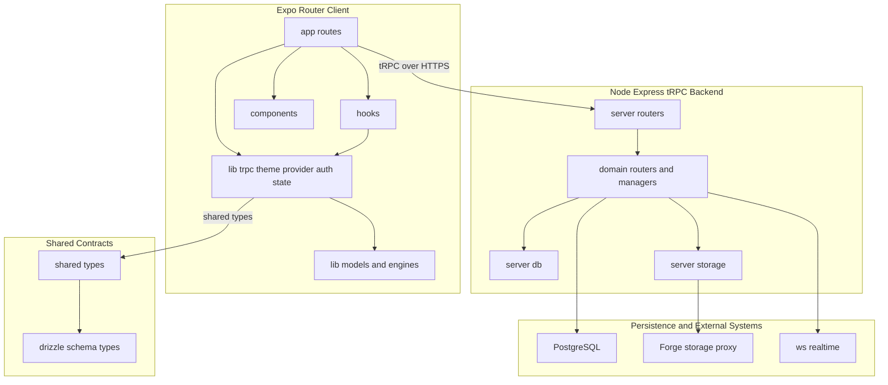
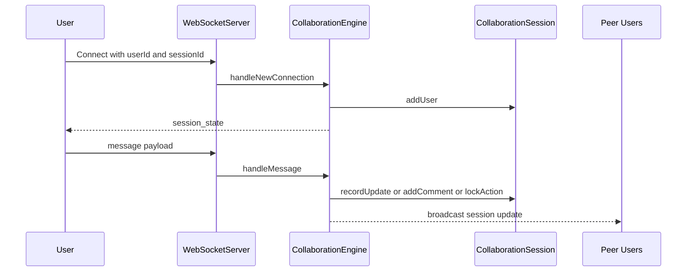
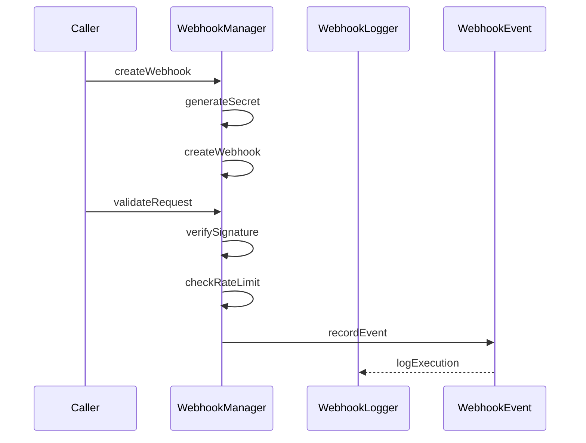
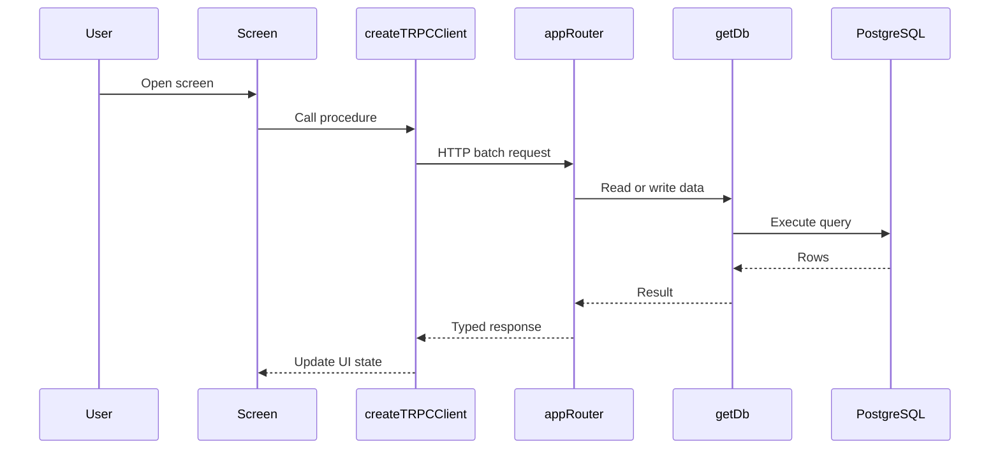
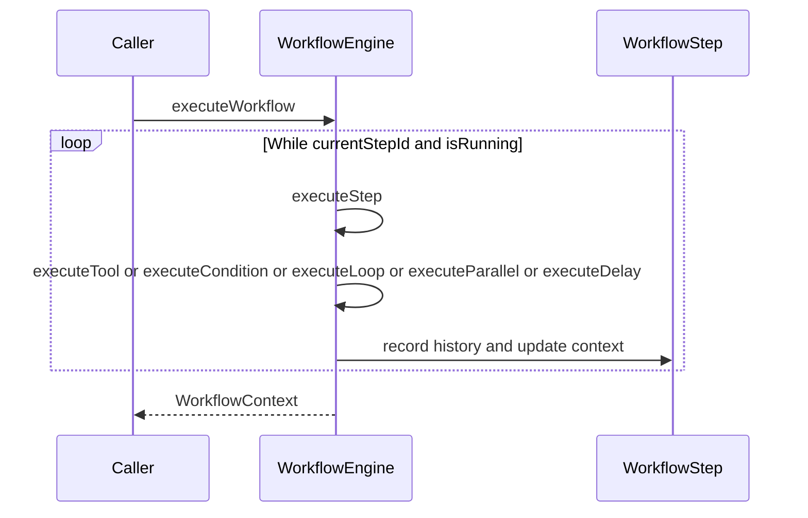
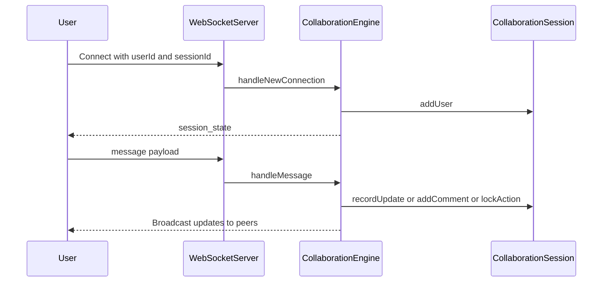

# Platform Architecture and End-to-End Flow

## Overview

MCP Hub is organized as a two-layer system: an Expo/React Native client that owns presentation, client state, and platform-specific auth/theme/runtime glue, and a Node.js/Express+tRPC backend that owns API composition, workflow orchestration, data access, real-time sync, and external integrations. The docs in  and  match the repository split in `app/`, `hooks/`, `components/`, `constants/`, `lib/`, `server/`, `drizzle/`, and `shared/`.

The important boundary is that the client never talks directly to PostgreSQL, S3/storage, or real-time session state. Instead, it goes through  for backend procedures,  for presentation state, and local persistence helpers in `lib/models/` for offline client data. On the server side,  is the composition root for tRPC, while business logic lives in domain modules such as `server/webhooks/`, `server/analytics/`, `server/macros/`, `server/mcp/`, and `server/templates/`.

The shared layer keeps both runtimes aligned.  is the single barrel for shared type exports, while `drizzle/` owns schema and migrations, and the backend derives runtime data access from those definitions.

## Architecture Overview



## Runtime Boundaries and Repository Layout

| Directory | Runtime | What it carries | Boundary type |
| --- | --- | --- | --- |
| `app/` | Client | Expo Router screens and tab routes | Presentation layer |
| `hooks/` | Client | Cross-screen orchestration hooks such as auth and bridge state | Framework glue |
| `components/` | Client | Shared UI primitives | Framework glue |
| `constants/` | Client | Runtime constants and configuration values | Framework glue |
| `lib/` | Client | Transport, theme, client models, app state, engines | Mixed: glue + client business logic |
| `server/` | Server | tRPC routers, domain managers, data access, adapters | Business logic + backend glue |
| `drizzle/` | Shared by server tooling | Schema, relations, migrations | Data contract layer |
| `shared/` | Shared | Cross-runtime TypeScript types and constants | Contract layer |
| `_core/` under `server/`, `shared/`, `lib/` | Both | Framework-level support code | Framework internals |


 describes real-time sync as Socket.io, but the implementation in  uses WebSocketServer from ws on the /ws/collaborate path. The architecture docs and the implemented transport stack are not the same.

The repo docs are explicit that `_core/` directories are framework-level, and that the editable touch points are the non-`_core` files in `server/`, `drizzle/`, `shared/`, `lib/`, `hooks/`, and `app/`. In practice, the business logic lives in the server managers/routers and the local client models, while the route files and providers are glue.

## Client Runtime

###

*File path: `lib/trpc.ts`*

 is the client-side transport boundary. It binds the generated `AppRouter` type to React Query via `createTRPCReact<AppRouter>()`, and creates the actual network client with `httpBatchLink` and `superjson`.

| Method | Description |
| --- | --- |
| `createTRPCClient` | Builds the tRPC client pointed at `${getApiBaseUrl()}/api/trpc`, injects the session token as a bearer header when present, and always sends credentialed fetch requests so cookie-based auth works on web. |


The runtime split is explicit:

- native auth uses `Auth.getSessionToken()` and a bearer `Authorization` header.
- web auth relies on cookies, with `credentials: "include"` in the custom `fetch`.

###

*File path: `lib/theme-provider.tsx`*

`ThemeProvider` is the client-side theme bridge. It keeps the active scheme in React state, writes it into NativeWind, updates React Native `Appearance`, and mirrors the scheme into the browser DOM when `document` is available.

| Prop | Type | Description |
| --- | --- | --- |
| `children` | `React.ReactNode` | The app tree wrapped by the provider. |


| Public context value | Type | Description |
| --- | --- | --- |
| `colorScheme` | `ColorScheme` | The active scheme state. |
| `setColorScheme` | `(scheme: ColorScheme) => void` | Updates local state and applies the scheme across platforms. |


Behaviorally, `applyScheme` does three platform-specific things:

- updates NativeWind’s color scheme,
- calls `Appearance.setColorScheme?.(scheme)` on native,
- mutates `document.documentElement` on web by setting `data-theme`, toggling `dark`, and writing CSS custom properties from `SchemeColors`.

###

*File path: `hooks/use-auth.ts`*

`useAuth` is the auth state bridge that decides how the client checks sessions on each platform. It is platform-aware through `Platform.OS` and hides the storage difference between cookie auth and secure token auth.

| Option | Type | Description |
| --- | --- | --- |
| `autoFetch` | `boolean` | Controls whether the hook fetches session state automatically. |


| Returned field | Type | Description |  |
| --- | --- | --- | --- |
| `user` | `Auth.User \ | null` | The current user object derived from API or local cache. |
| `loading` | `boolean` | Whether auth state is currently being resolved. |  |
| `error` | `Error \ | null` | Last auth fetch error. |
| `isAuthenticated` | `boolean` | Derived from whether `user` is present. |  |
| `refresh` | `() => Promise<void>` | Re-runs the session fetch flow. |  |
| `logout` | `() => Promise<void>` | Calls the backend logout endpoint and clears client-side session state. |  |


The client flow is split by platform:

- **Web**: `fetchUser()` calls `Api.getMe()`, normalizes `lastSignedIn`, and caches the user with `Auth.setUserInfo(userInfo)`.
- **Native**: `fetchUser()` checks `Auth.getSessionToken()` first, then reads cached user data from `Auth.getUserInfo()`.
- **Logout**: `Api.logout()` is attempted first, but the client always clears token and cached user info in `finally`.

###

*File path: `lib/app-context.tsx`*

`app-context` is the client’s in-memory orchestration layer for server connections, tools, execution history, and app settings. It centralizes mutable UI/data state that is shared across screens such as servers, server detail, execution history, and presets.

#### `AppContextType`

| Property | Type | Description |
| --- | --- | --- |
| `servers` | `MCPServer[]` | Connected or configured MCP servers. |
| `tools` | `Record<string, MCPTool[]>` | Tools keyed by server ID. |
| `executionHistory` | `ToolExecutionResult[]` | Recent execution results. |
| `settings` | `AppSettings` | User preferences for runtime behavior. |
| `isLoading` | `boolean` | Initialization and refresh state. |
| `addServer` | `(server: MCPServer) => Promise<void>` | Adds a server to state. |
| `updateServer` | `(server: MCPServer) => Promise<void>` | Replaces a server entry. |
| `deleteServer` | `(serverId: string) => Promise<void>` | Removes a server and its tool mapping. |
| `setServerStatus` | `(serverId: string, status: MCPServer['status'], error?: string) => Promise<void>` | Updates status and optional error text. |
| `setTools` | `(serverId: string, tools: MCPTool[]) => Promise<void>` | Stores tool metadata for a server. |
| `getServerTools` | `(serverId: string) => MCPTool[]` | Reads tools for a server. |
| `addExecutionResult` | `(result: ToolExecutionResult) => Promise<void>` | Prepends an execution result. |
| `clearExecutionHistory` | `() => Promise<void>` | Clears execution history state. |
| `updateSettings` | `(settings: Partial<AppSettings>) => Promise<void>` | Merges partial settings. |
| `initialize` | `() => Promise<void>` | Loads initial state. |


#### `AppSettings`

| Property | Type | Description |  |  |
| --- | --- | --- | --- | --- |
| `theme` | `'light' \ | 'dark' \ | 'auto'` | Theme preference. |
| `executionTimeout` | `number` | Timeout in milliseconds. |  |  |
| `executionTimeoutEnabled` | `boolean` | Toggle for timeout enforcement. |  |  |
| `logRetentionDays` | `number` | Retention window for execution logs. |  |  |
| `autoRefreshInterval` | `number` | Refresh interval in milliseconds, `0` disables it. |  |  |


The reducer keeps the state transitions explicit:

- `SET_SERVERS`, `ADD_SERVER`, `UPDATE_SERVER`, `DELETE_SERVER`
- `SET_TOOLS`
- `SET_EXECUTION_HISTORY`, `ADD_EXECUTION_RESULT`
- `SET_SETTINGS`
- `SET_LOADING`

`ADD_EXECUTION_RESULT` keeps the latest 100 entries, which makes the execution history bounded at the context layer.

###

*File path: `components/themed-view.tsx`*

`ThemedView` is a minimal UI wrapper that provides a background-aware `View`.

|  | Prop | Type | Description |
| --- | --- | --- | --- |
| `className` | `string \ | undefined` | Additional NativeWind classes. |


It is pure presentation glue: `bg-background` is always applied first, and the component forwards all other `ViewProps`.

###

*File path: `lib/models/ExecutionHistory.ts`*

This file is the client-side execution history store used by the execution history screen. It persists JSON in AsyncStorage under `mcp_execution_history` and keeps the latest 1000 execution entries.

#### `ExecutionStatus`

`SUCCESS`, `FAILED`, `TIMEOUT`, `CANCELLED`, `PARTIAL`

#### `ExecutionError`

| Property | Type | Description |  |
| --- | --- | --- | --- |
| `code` | `string` | Error code returned by the execution layer. |  |
| `message` | `string` | Human-readable error message. |  |
| `details` | `Record<string, any> \ | undefined` | Optional structured error details. |


#### `ExecutionHistoryEntry`

| Property | Type | Description |  |
| --- | --- | --- | --- |
| `id` | `string` | Execution ID. |  |
| `serverId` | `string` | Server identifier. |  |
| `serverName` | `string` | Friendly server name. |  |
| `toolName` | `string` | Tool that ran. |  |
| `toolDescription` | `string \ | undefined` | Optional tool description. |
| `parameters` | `Record<string, any>` | Input parameters. |  |
| `result` | `any` | Raw execution result. |  |
| `resultType` | `string` | Result type label. |  |
| `resultSize` | `number` | Result size in bytes. |  |
| `timestamp` | `number` | Unix timestamp. |  |
| `executionTimeMs` | `number` | Duration in milliseconds. |  |
| `status` | `ExecutionStatus` | Final execution state. |  |
| `error` | `ExecutionError \ | undefined` | Optional error payload. |
| `tags` | `string[] \ | undefined` | Optional tags. |
| `notes` | `string \ | undefined` | Optional notes. |


#### `ExecutionHistoryFilter`

|  | Property | Type | Description |
| --- | --- | --- | --- |
| `serverId` | `string \ | undefined` | Filter by server. |
| `toolName` | `string \ | undefined` | Filter by tool name. |
| `status` | `ExecutionStatus \ | undefined` | Filter by final state. |
| `dateFrom` | `number \ | undefined` | Lower timestamp bound. |
| `dateTo` | `number \ | undefined` | Upper timestamp bound. |
| `searchText` | `string \ | undefined` | Free-text search term. |
| `limit` | `number \ | undefined` | Page size. |
| `offset` | `number \ | undefined` | Page offset. |


#### `ExecutionHistoryStats`

| Property | Type | Description |
| --- | --- | --- |
| `totalExecutions` | `number` | Total entries in history. |
| `successCount` | `number` | Count of successful executions. |
| `failureCount` | `number` | Count of failed executions. |
| `timeoutCount` | `number` | Count of timeouts. |
| `averageExecutionTimeMs` | `number` | Mean duration. |
| `mostUsedTools` | `Array<{ toolName: string; count: number }>` | Top tools by usage. |
| `mostUsedServers` | `Array<{ serverId: string; serverName: string; count: number }>` | Top servers by usage. |


| Public method | Description |
| --- | --- |
| `addExecution` | Appends a new entry, trims to the max size, and persists. |
| `getAll` | Reads the full history from AsyncStorage. |
| `getFiltered` | Applies server, tool, status, date, search, and pagination filters. |
| `getById` | Looks up a single execution entry. |
| `deleteExecution` | Removes one entry and persists the new history. |
| `deleteByServer` | Removes all entries for one server. |
| `clearAll` | Deletes the AsyncStorage key entirely. |
| `getStats` | Computes summary and top-tool/top-server statistics. |
| `exportAsJson` | Serializes the full history as JSON. |
| `importFromJson` | Merges JSON data while deduplicating by `id`. |


###

*File path: `lib/models/ServerPreset.ts`*

This file is the client-side server preset store used by the server presets screen. It persists preset JSON in AsyncStorage under `mcp_server_presets`.

#### `TransportType`

`HTTP`, `HTTPS`, `WEBSOCKET`, `WSS`, `STDIO`

#### `ServerPreset`

| Property | Type | Description |  |
| --- | --- | --- | --- |
| `id` | `string` | Preset ID. |  |
| `name` | `string` | Preset name. |  |
| `description` | `string \ | undefined` | Optional description. |
| `host` | `string` | Hostname or address. |  |
| `port` | `number` | Port number. |  |
| `transport` | `TransportType` | Selected transport. |  |
| `authToken` | `string \ | undefined` | Optional token. |
| `timeoutMs` | `number` | Connection timeout. |  |
| `retryAttempts` | `number` | Retry count. |  |
| `tags` | `string[] \ | undefined` | Optional tags. |
| `isFavorite` | `boolean` | Favorite flag. |  |
| `usageCount` | `number` | Number of times used. |  |
| `lastUsedAt` | `number \ | undefined` | Last usage timestamp. |
| `createdAt` | `number` | Creation timestamp. |  |
| `updatedAt` | `number` | Update timestamp. |  |


#### `ServerPresetTemplate`

| Property | Type | Description |  |
| --- | --- | --- | --- |
| `name` | `string` | Template name. |  |
| `description` | `string` | Template description. |  |
| `host` | `string` | Default host. |  |
| `port` | `number` | Default port. |  |
| `transport` | `TransportType` | Default transport. |  |
| `timeoutMs` | `number \ | undefined` | Optional timeout override. |
| `retryAttempts` | `number \ | undefined` | Optional retry override. |
| `tags` | `string[] \ | undefined` | Optional tags. |


#### `ServerPresetFilter`

|  | Property | Type | Description |
| --- | --- | --- | --- |
| `searchText` | `string \ | undefined` | Search text. |
| `tags` | `string[] \ | undefined` | Tag filter. |
| `isFavorite` | `boolean \ | undefined` | Favorite filter. |
| `limit` | `number \ | undefined` | Page size. |
| `offset` | `number \ | undefined` | Page offset. |


| Public method | Description |
| --- | --- |
| `createPreset` | Creates a preset and persists it. |
| `createFromTemplate` | Clones one of the built-in templates. |
| `getAll` | Loads all presets from AsyncStorage. |
| `getFiltered` | Applies search, tag, favorite, and pagination filters. |
| `getById` | Returns one preset by ID. |
| `updatePreset` | Merges updates into a preset and persists. |
| `toggleFavorite` | Flips the favorite flag. |
| `recordUsage` | Increments usage count and updates last used timestamp. |
| `deletePreset` | Removes a preset and persists. |
| `getFavorites` | Returns only favorite presets. |
| `getRecentlyUsed` | Returns the most recently used presets. |
| `exportAsJson` | Serializes all presets. |
| `importFromJson` | Merges imported presets, deduplicating by `id`. |


## Backend Runtime

###

*File path: `server/routers.ts`*

`appRouter` is the backend composition root. It mounts framework and domain routers into one tRPC surface, and its `AppRouter` type is the contract consumed by .

| Router or procedure | Description |
| --- | --- |
| `system` | Mounted from `systemRouter` in `server/_core/systemRouter`. |
| `auth.me` | Returns `opts.ctx.user`. |
| `auth.logout` | Clears the session cookie with `ctx.res.clearCookie(COOKIE_NAME, { ...cookieOptions, maxAge: -1 })` and returns `{ success: true }`. |
| `mcp` | Mounted from `mcpRouter`. |
| `mcpServers` | Mounted from `mcpExtendedRouter`. |


The `auth.logout` handler is intentionally `publicProcedure`. It does not need a logged-in user to execute the cookie clear because it only needs the request context to derive cookie options.

### tRPC Router Surface

| File | Visible procedures |
| --- | --- |
|  | `system`, `auth.me`, `auth.logout`, `mcp`, `mcpServers` |
|  | `getAuthorizationUrl`, `exchangeCode`, `refreshToken` |
|  | `storeToken`, `getTokenMetadata`, `listServerTokens`, `revokeToken`, `rotateToken`, `getExpiredTokens`, `getTokenStats`, `validateScopes` |
|  | `getAllTemplates`, `getTemplate`, `cloneTemplate`, `searchTemplates`, `getTemplatesByCategory`, `getFeaturedTemplates` |
|  | `createWebhook`, `getWebhook`, `listWebhooks`, `updateWebhook` |
|  | `getErrorTrends`, `getPerformanceTrends`, `generateReport` |
|  | `list`, `getByServer`, `store` |
|  | `list`, `getById`, `create` |
|  | MCP server management and tool-operation procedures |
|  | Extended MCP server integration procedures |


###

*File path: `server/db.ts`*

 is the data-access boundary for Drizzle. It lazily creates a MySQL Drizzle instance when `DATABASE_URL` is present, and returns `null` when the database is not available.

| Public method | Description |
| --- | --- |
| `getDb` | Lazily initializes and returns the Drizzle instance or `null`. |
| `upsertUser` | Validates `openId`, builds insert/update payloads, and upserts a user record. |
| `getUserByOpenId` | Reads one user by Manus `openId`. |


`upsertUser` contains the ownership rule used by the backend:

- it always preserves `openId`,
- it normalizes nullable text fields,
- it sets `lastSignedIn` if missing,
- it assigns `role = "admin"` when `user.openId === ENV.ownerOpenId`.

###

*File path: `server/storage.ts`*

 is a thin storage proxy client. It resolves storage credentials from `ENV.forgeApiUrl` and `ENV.forgeApiKey`, and then talks to the built-in Forge storage API with bearer auth.

| Public method | Description |
| --- | --- |
| `storagePut` | Uploads a payload to storage and returns `{ key, url }`. |
| `storageGet` | Builds a download URL for a relative key and returns `{ key, url }`. |


| Helper | Description |
| --- | --- |
| `buildUploadUrl` | Builds `v1/storage/upload` with a `path` query parameter. |
| `buildDownloadUrl` | Builds `v1/storage/downloadUrl` with a `path` query parameter and fetches the signed URL. |
| `buildAuthHeaders` | Returns `Authorization: Bearer <apiKey>`. |
| `getStorageConfig` | Reads and validates storage proxy credentials. |
| `normalizeKey` | Removes leading slashes from keys. |


###

*File path: `server/routes/marketplace.ts`*

The marketplace route is the only direct Express REST surface visible in the provided code. It exposes a paginated macro listing endpoint backed by mock data.

#### List Macros

```api
{
    "title": "List Macros",
    "description": "Returns paginated and filtered macro listings from the marketplace route",
    "method": "GET",
    "baseUrl": "<BackendApiBaseUrl>",
    "endpoint": "/macros",
    "headers": [],
    "queryParams": [
        {
            "key": "page",
            "value": "1",
            "required": false
        },
        {
            "key": "limit",
            "value": "20",
            "required": false
        },
        {
            "key": "search",
            "value": "",
            "required": false
        },
        {
            "key": "category",
            "value": "",
            "required": false
        },
        {
            "key": "sortBy",
            "value": "downloads",
            "required": false
        }
    ],
    "pathParams": [],
    "bodyType": "none",
    "requestBody": "",
    "formData": [],
    "rawBody": "",
    "responses": {
        "200": {
            "description": "Success",
            "body": "{\n    \"success\": true,\n    \"data\": [\n        {\n            \"id\": \"1\",\n            \"name\": \"Read File\",\n            \"description\": \"Read file contents\",\n            \"category\": \"filesystem\",\n            \"downloads\": 150\n        }\n    ],\n    \"pagination\": {\n        \"page\": 1,\n        \"limit\": 20,\n        \"total\": 1,\n        \"pages\": 1\n    }\n}"
        },
        "500": {
            "description": "Server error",
            "body": "{\n    \"success\": false,\n    \"error\": \"Failed to fetch macros\"\n}"
        }
    }
}
```

###  endpoints

#### Get Storage Download URL

```api
{
    "title": "Get Storage Download URL",
    "description": "Builds a signed download URL for a relative storage key using the built-in Forge storage proxy",
    "method": "GET",
    "baseUrl": "<BuiltInForgeApiBaseUrl>",
    "endpoint": "/v1/storage/downloadUrl",
    "headers": [
        {
            "key": "Authorization",
            "value": "Bearer <api_key>",
            "required": true
        }
    ],
    "queryParams": [
        {
            "key": "path",
            "value": "<storage path>",
            "required": true
        }
    ],
    "pathParams": [],
    "bodyType": "none",
    "requestBody": "",
    "formData": [],
    "rawBody": "",
    "responses": {
        "200": {
            "description": "Success",
            "body": "{\n    \"url\": \"https://storage.example.com/files/workflows/export.json\"\n}"
        }
    }
}
```

## Shared Contracts and Data Layer

###

*File path: `shared/types.ts`*

 is the cross-runtime type barrel. It re-exports the Drizzle schema types and shared error types so the client and server can share the same contract names without importing deep paths.

| Export | Description |
| --- | --- |
| `type * from "../drizzle/schema"` | Re-exports inferred schema types. |
| `export * from "./_core/errors"` | Re-exports shared error types. |


This file is the bridge between the runtime layers and the schema layer. The backend writes to the database using Drizzle, and the client receives the same shape through generated TypeScript types.

### `drizzle/`

*File path: `drizzle/`*

`drizzle/` owns the authoritative schema and migrations. The docs point to  and generated SQL migrations as the source of truth, and `pnpm db:push` is the documented migration workflow.

The user table example in the repository docs shows the data model pattern that the backend relies on:

| Column | Type | Role |
| --- | --- | --- |
| `id` | `int` | Surrogate primary key. |
| `openId` | `varchar` | Manus OAuth user identifier. |
| `name` | `text` | Display name. |
| `email` | `varchar` | Email address. |
| `loginMethod` | `varchar` | Login source. |
| `role` | `mysqlEnum` | `user` or `admin`. |
| `createdAt` | `timestamp` | Creation timestamp. |
| `updatedAt` | `timestamp` | Update timestamp. |
| `lastSignedIn` | `timestamp` | Last successful sign-in. |


## Infrastructure Services

### Real Time Collaboration Engine

####

*File path: `server/websocket/collaboration-engine.ts`*

This module owns the live collaborative editing transport. `CollaborationEngine` extends `EventEmitter`, creates a `WebSocketServer`, and maintains session state in memory.

| Constructor dependency | Description |
| --- | --- |
| `http.Server` | The HTTP server that hosts the WebSocket upgrade path. |


#### `CollaborationEngine`

| Property | Type | Description |
| --- | --- | --- |
| `wss` | `WebSocketServer` | The active WebSocket server. |
| `sessions` | `Map<string, CollaborationSession>` | Live collaboration sessions keyed by session ID. |
| `userConnections` | `Map<string, Set<WebSocket>>` | WebSocket connections grouped by user ID. |


| Public method | Description |
| --- | --- |
| `getSessionState` | Returns the current session state for a given session ID. |
| `closeSession` | Closes all connections for a session and removes it. |


#### `CollaborationSession`

| Property | Type | Description |
| --- | --- | --- |
| `id` | `string` | Session ID. |
| `users` | `Map<string, CollaborationUser>` | Connected users. |
| `updates` | `any[]` | Recorded update events. |
| `comments` | `any[]` | Recorded comments. |
| `actionLocks` | `Map<number, string>` | Locked action indexes by user ID. |
| `version` | `number` | Session version counter. |


| Public method | Description |
| --- | --- |
| `addUser` | Adds a user connection to the session. |
| `removeUser` | Removes a user. |
| `getUserConnection` | Returns the WebSocket connection for a user. |
| `getUserCount` | Returns the number of connected users. |
| `getUsers` | Returns connected user IDs. |
| `updateUserCursor` | Updates cursor metadata for a user. |
| `recordUpdate` | Appends an update record. |
| `addComment` | Appends a comment record. |
| `lockAction` | Locks an action index for a user. |
| `unlockAction` | Releases an action lock when owned by the same user. |
| `getActionLock` | Returns the user ID that owns an action lock. |
| `incrementVersion` | Bumps the session version. |
| `getState` | Returns the serializable session state. |
| `broadcast` | Sends a message to all connected users except one. |
| `closeAll` | Closes every open connection in the session. |


#### `CollaborationUser`

| Property | Type | Description |
| --- | --- | --- |
| `id` | `string` | User ID. |
| `connection` | `WebSocket` | Open WebSocket connection. |
| `cursor` | `any` | Current cursor payload. |
| `joinedAt` | `number` | Join timestamp. |


| Public method | Description |
| --- | --- |
| `setupWebSocketServer` | Registers connection, error, and close handlers. |
| `handleNewConnection` | Creates or reuses a session, adds the user, and sends initial state. |
| `handleMessage` | Routes incoming messages by type. |
| `handleMacroUpdate` | Records and broadcasts macro update payloads. |
| `handleActionInsert` | Records and broadcasts insert operations. |
| `handleActionDelete` | Records and broadcasts delete operations. |
| `handleActionModify` | Records and broadcasts modify operations. |
| `handleCursorPosition` | Updates cursor state and broadcasts movement. |
| `handleComment` | Creates and broadcasts comments. |
| `handleLockRequest` | Attempts to lock an action for exclusive editing. |
| `handleUnlockRequest` | Releases an action lock. |
| `broadcastToSession` | Broadcasts a session message to all peers except one. |
| `handleDisconnect` | Removes a user and closes empty sessions. |
| `extractUserId` | Reads `userId` from the request URL. |
| `extractSessionId` | Reads `sessionId` from the request URL. |


#### Collaboration flow



### Webhook Infrastructure

####

The collaboration engine is in-memory. Session state, locks, updates, and comments live on the CollaborationEngine instance, so the process hosting the WebSocketServer owns the active collaboration state.

*File path: `server/webhooks/webhook-manager.ts`*

`WebhookManager` owns webhook lifecycle, request validation, and event tracking. It uses HMAC-SHA256 signatures, IP allow and deny checks, rate limiting, and execution counters.

#### `WebhookConfig`

| Property | Type | Description |  |
| --- | --- | --- | --- |
| `id` | `string` | Webhook ID. |  |
| `name` | `string` | Webhook name. |  |
| `url` | `string` | Delivery URL. |  |
| `secret` | `string` | Signing secret. |  |
| `events` | `string[]` | Event names. |  |
| `isActive` | `boolean` | Active flag. |  |
| `rateLimit` | `number` | Requests per minute. |  |
| `ipWhitelist` | `string[] \ | undefined` | Allowed IPs. |
| `ipBlacklist` | `string[] \ | undefined` | Blocked IPs. |
| `payloadMapping` | `Record<string, string> \ | undefined` | Payload remapping rules. |
| `retryPolicy` | `{ maxRetries: number; backoffMs: number }` | Retry configuration. |  |
| `createdAt` | `Date` | Creation time. |  |
| `updatedAt` | `Date` | Last update time. |  |
| `lastTriggeredAt` | `Date \ | undefined` | Last trigger time. |
| `executionCount` | `number` | Total executions. |  |
| `failureCount` | `number` | Total failures. |  |


#### `WebhookEvent`

| Property | Type | Description |  |  |  |
| --- | --- | --- | --- | --- | --- |
| `id` | `string` | Event ID. |  |  |  |
| `webhookId` | `string` | Parent webhook ID. |  |  |  |
| `event` | `string` | Event name. |  |  |  |
| `payload` | `Record<string, unknown>` | Event payload. |  |  |  |
| `timestamp` | `Date` | Event time. |  |  |  |
| `status` | `'pending' \ | 'success' \ | 'failed' \ | 'retrying'` | Delivery state. |
| `attempts` | `number` | Number of attempts. |  |  |  |
| `lastError` | `string \ | undefined` | Most recent error. |  |  |
| `response` | `{ statusCode: number; body: string } \ | undefined` | Delivery response. |  |  |


#### `WebhookRequest`

| Property | Type | Description |
| --- | --- | --- |
| `timestamp` | `number` | Request timestamp. |
| `signature` | `string` | HMAC signature. |
| `payload` | `Record<string, unknown>` | Raw payload. |


| Public method | Description |
| --- | --- |
| `generateSecret` | Creates a 32-byte hex secret. |
| `generateWebhookUrl` | Builds a webhook URL from `WEBHOOK_BASE_URL` or the default host. |
| `createSignature` | Produces an HMAC-SHA256 signature for a payload. |
| `verifySignature` | Compares a payload against an expected signature. |
| `createWebhook` | Creates and stores a new webhook record. |
| `getWebhook` | Returns a webhook by ID. |
| `listWebhooks` | Returns all stored webhooks. |
| `updateWebhook` | Merges partial updates into a webhook. |
| `deleteWebhook` | Removes a webhook and its rate-limit entry. |
| `checkRateLimit` | Enforces a per-minute request cap. |
| `validateIP` | Applies whitelist and blacklist checks. |
| `validateRequest` | Runs signature, IP, and rate-limit validation. |
| `recordEvent` | Stores a webhook event and updates counters. |
| `getWebhookEvents` | Returns recent events for a webhook. |
| `updateEventStatus` | Updates event delivery status. |
| `getWebhookStats` | Returns execution summary metrics. |


####

WebhookManager stores its state in instance fields, but every public method creates new WebhookManager(). Because webhooks, events, and rateLimitMap are not static, data written by one call is not visible to later calls through a different instance.

*File path: `server/webhooks/webhook-logger.ts`*

`WebhookLogger` stores execution logs, computes aggregate stats, and exposes search/filter helpers.

#### `WebhookLog`

| Property | Type | Description |  |
| --- | --- | --- | --- |
| `id` | `string` | Log ID. |  |
| `webhookId` | `string` | Parent webhook. |  |
| `timestamp` | `Date` | Log time. |  |
| `event` | `string` | Event name. |  |
| `requestPayload` | `Record<string, unknown>` | Request body. |  |
| `responseStatus` | `number` | HTTP status. |  |
| `responseBody` | `string` | Response text. |  |
| `executionTime` | `number` | Duration in milliseconds. |  |
| `success` | `boolean` | Delivery success flag. |  |
| `error` | `string \ | undefined` | Error message. |
| `retryCount` | `number` | Retry count. |  |


| Public method | Description |
| --- | --- |
| `logExecution` | Creates and stores a log entry. |
| `getExecutionLogs` | Returns logs sorted by newest first. |
| `getExecutionStats` | Returns totals, success rate, average time, and last execution data. |
| `getErrorTrends` | Aggregates error counts by hour. |
| `clearOldLogs` | Removes logs older than a threshold. |
| `searchLogs` | Filters logs by event name. |
| `getFailedExecutions` | Returns failed logs. |


`WebhookLogger` has the same instance-state issue as `WebhookManager`: every public method instantiates a fresh logger, so the `logs` map does not persist across calls.

#### Webhook flow



### Analytics and Telemetry

####

*File path: `server/analytics/execution-analytics.ts`*

`ExecutionAnalytics` collects execution metrics in memory, aggregates tool/server stats, and produces daily reports.

#### `ExecutionMetrics`

| Property | Type | Description |  |  |
| --- | --- | --- | --- | --- |
| `toolName` | `string` | Tool identifier. |  |  |
| `serverId` | `string` | Server identifier. |  |  |
| `executionTime` | `number` | Duration in milliseconds. |  |  |
| `status` | `'success' \ | 'failed' \ | 'skipped'` | Final status. |
| `timestamp` | `Date` | Event time. |  |  |
| `errorMessage` | `string \ | undefined` | Optional failure message. |  |
| `parameters` | `Record<string, any> \ | undefined` | Optional input parameters. |  |
| `result` | `any` | Optional raw result. |  |  |


#### `ToolStats`

| Property | Type | Description |  |
| --- | --- | --- | --- |
| `toolName` | `string` | Tool name. |  |
| `totalExecutions` | `number` | Total runs. |  |
| `successfulExecutions` | `number` | Successful runs. |  |
| `failedExecutions` | `number` | Failed runs. |  |
| `skippedExecutions` | `number` | Skipped runs. |  |
| `averageExecutionTime` | `number` | Mean runtime. |  |
| `minExecutionTime` | `number` | Minimum runtime. |  |
| `maxExecutionTime` | `number` | Maximum runtime. |  |
| `successRate` | `number` | Success percentage. |  |
| `errorRate` | `number` | Failure percentage. |  |
| `lastExecutedAt` | `Date \ | undefined` | Last execution time. |


#### `ServerStats`

| Property | Type | Description |  |
| --- | --- | --- | --- |
| `serverId` | `string` | Server identifier. |  |
| `serverType` | `string` | Server type. |  |
| `totalExecutions` | `number` | Total runs. |  |
| `successfulExecutions` | `number` | Successful runs. |  |
| `failedExecutions` | `number` | Failed runs. |  |
| `averageExecutionTime` | `number` | Mean runtime. |  |
| `successRate` | `number` | Success percentage. |  |
| `toolsUsed` | `number` | Tool count. |  |
| `lastActivityAt` | `Date \ | undefined` | Last activity time. |


#### `AnalyticsReport`

| Property | Type | Description |
| --- | --- | --- |
| `period` | `{ startDate: Date; endDate: Date }` | Reporting window. |
| `summary` | `{ totalExecutions: number; successfulExecutions: number; failedExecutions: number; averageExecutionTime: number }` | Summary block. |
| `topTools` | `ToolStats[]` | Top tools by usage. |
| `serverStats` | `ServerStats[]` | Per-server totals. |
| `errorTrends` | `ErrorTrend[]` | Error trend series. |
| `performanceTrends` | `PerformanceTrend[]` | Latency trend series. |


#### `ErrorTrend`

| Property | Type | Description |
| --- | --- | --- |
| `date` | `Date` | Day bucket. |
| `errorCount` | `number` | Errors in the bucket. |
| `errorRate` | `number` | Error percentage. |
| `topErrors` | `Array<{ message: string; count: number }>` | Most frequent error messages. |


#### `PerformanceTrend`

| Property | Type | Description |
| --- | --- | --- |
| `date` | `Date` | Day bucket. |
| `averageExecutionTime` | `number` | Mean latency. |
| `p50ExecutionTime` | `number` | Median latency. |
| `p95ExecutionTime` | `number` | 95th percentile. |
| `p99ExecutionTime` | `number` | 99th percentile. |


| Public method | Description |
| --- | --- |
| `recordExecution` | Stores a metric and updates both stats maps. |
| `getToolStats` | Returns all tool stats or one tool by name. |
| `getServerStats` | Returns all server stats or one server by ID. |
| `getExecutionHistory` | Returns filtered metric history. |
| `getErrorTrends` | Aggregates failed executions by day. |
| `getPerformanceTrends` | Aggregates latency percentiles by day. |
| `generateReport` | Builds a report from the selected date range. |
| `clearAnalytics` | Clears all in-memory analytics state. |


### Workflow Engine and Templates

####

getErrorTrends() sorts trend.topErrors and calls .slice(0, 5), but the sliced array is not assigned back. The returned trend objects keep the full topErrors list instead of a capped list.

*File path: `server/macros/workflow-engine.ts`*

`WorkflowEngine` is the in-memory workflow executor. It supports tools, conditionals, loops, parallel branches, delays, variable substitution, and execution history.

#### `WorkflowStep`

| Property | Type | Description |  |  |  |  |
| --- | --- | --- | --- | --- | --- | --- |
| `id` | `string` | Step ID. |  |  |  |  |
| `type` | `'tool' \ | 'condition' \ | 'loop' \ | 'parallel' \ | 'delay'` | Step kind. |
| `name` | `string` | Step name. |  |  |  |  |
| `config` | `Record<string, any>` | Step configuration. |  |  |  |  |
| `nextStepId` | `string \ | undefined` | Next step. |  |  |  |
| `onErrorStepId` | `string \ | undefined` | Error branch. |  |  |  |


#### `WorkflowCondition`

| Property | Type | Description |  |  |  |  |  |
| --- | --- | --- | --- | --- | --- | --- | --- |
| `variable` | `string` | Variable name to inspect. |  |  |  |  |  |
| `operator` | `'equals' \ | 'notEquals' \ | 'greaterThan' \ | 'lessThan' \ | 'contains' \ | 'exists'` | Comparison operator. |
| `value` | `any` | Reference value. |  |  |  |  |  |
| `trueBranchId` | `string` | Branch ID when true. |  |  |  |  |  |
| `falseBranchId` | `string \ | undefined` | Branch ID when false. |  |  |  |  |


#### `WorkflowLoop`

| Property | Type | Description |  |
| --- | --- | --- | --- |
| `variableName` | `string` | Iteration variable. |  |
| `iterableVariable` | `string` | Source array variable. |  |
| `bodyStepId` | `string` | Step to run per item. |  |
| `nextStepId` | `string \ | undefined` | Next step after the loop. |


#### `WorkflowContext`

| Property | Type | Description |
| --- | --- | --- |
| `variables` | `Record<string, any>` | Runtime variables. |
| `executionHistory` | `ExecutionRecord[]` | Step history. |
| `currentStepId` | `string` | Current pointer. |
| `isRunning` | `boolean` | Execution flag. |
| `isPaused` | `boolean` | Pause flag. |
| `errors` | `WorkflowError[]` | Collected step errors. |


#### `ExecutionRecord`

| Property | Type | Description |  |  |  |  |
| --- | --- | --- | --- | --- | --- | --- |
| `stepId` | `string` | Step ID. |  |  |  |  |
| `stepName` | `string` | Step name. |  |  |  |  |
| `type` | `string` | Step type. |  |  |  |  |
| `startTime` | `Date` | Start timestamp. |  |  |  |  |
| `endTime` | `Date \ | undefined` | End timestamp. |  |  |  |
| `duration` | `number \ | undefined` | Duration in milliseconds. |  |  |  |
| `status` | `'pending' \ | 'running' \ | 'success' \ | 'failed' \ | 'skipped'` | Step status. |
| `result` | `any` | Step result. |  |  |  |  |
| `error` | `string \ | undefined` | Error message. |  |  |  |


#### `WorkflowError`

| Property | Type | Description |
| --- | --- | --- |
| `stepId` | `string` | Failed step ID. |
| `message` | `string` | Error message. |
| `timestamp` | `Date` | Error time. |
| `recoverable` | `boolean` | Recovery flag. |


| Public method | Description |
| --- | --- |
| `registerStep` | Stores a workflow step. |
| `registerCondition` | Stores a conditional branch definition. |
| `registerLoop` | Stores a loop definition. |
| `setVariable` | Writes a workflow variable. |
| `getVariable` | Reads a workflow variable. |
| `executeStep` | Dispatches to the correct executor for a step type. |
| `executeWorkflow` | Runs the workflow from a start step until the pointer stops. |
| `pauseWorkflow` | Marks the context as paused. |
| `resumeWorkflow` | Clears the pause flag. |
| `stopWorkflow` | Clears the running flag. |
| `getContext` | Returns the current workflow context. |
| `getExecutionHistory` | Returns step history. |
| `getErrors` | Returns collected workflow errors. |
| `reset` | Resets the context and all runtime maps. |


####

pauseWorkflow() and resumeWorkflow() only toggle isPaused. The loop in executeWorkflow() checks currentStepId and isRunning, but never isPaused, so pause state does not affect execution once a run starts. [!NOTE] executeCondition() writes the chosen branch into this.context.currentStepId, but executeWorkflow() overwrites currentStepId after each step with step.nextStepId || ''. That means conditional branching is only preserved if the step definition also carries the same branch in nextStepId.

*File path: `server/templates/workflow-templates.ts`*

`WorkflowTemplateManager` is an in-memory template catalog for reusable workflows. The constructor seeds three public templates.

#### `WorkflowTemplate`

| Property | Type | Description |  |  |  |  |
| --- | --- | --- | --- | --- | --- | --- |
| `id` | `string` | Template ID. |  |  |  |  |
| `name` | `string` | Template name. |  |  |  |  |
| `description` | `string` | Human-readable summary. |  |  |  |  |
| `category` | `'github' \ | 'slack' \ | 'notion' \ | 'multi-server' \ | 'custom'` | Category label. |
| `steps` | `TemplateStep[]` | Workflow step list. |  |  |  |  |
| `variables` | `TemplateVariable[]` | Required and optional variables. |  |  |  |  |
| `tags` | `string[]` | Search tags. |  |  |  |  |
| `author` | `string` | Template author. |  |  |  |  |
| `version` | `string` | Version string. |  |  |  |  |
| `createdAt` | `Date` | Creation time. |  |  |  |  |
| `updatedAt` | `Date` | Last update time. |  |  |  |  |
| `isPublic` | `boolean` | Public visibility flag. |  |  |  |  |
| `cloneCount` | `number` | Clone count. |  |  |  |  |
| `rating` | `number` | Average rating. |  |  |  |  |
| `documentation` | `string` | Template documentation text. |  |  |  |  |


#### `TemplateStep`

| Property | Type | Description |  |  |
| --- | --- | --- | --- | --- |
| `id` | `string` | Step ID. |  |  |
| `name` | `string` | Step name. |  |  |
| `description` | `string` | Step description. |  |  |
| `serverId` | `string` | Target server ID. |  |  |
| `serverType` | `'github' \ | 'slack' \ | 'notion'` | Server type. |
| `toolName` | `string` | MCP tool name. |  |  |
| `parameters` | `Record<string, unknown>` | Template parameters. |  |  |
| `condition` | `string \ | undefined` | Optional condition. |  |
| `retryPolicy` | `{ maxRetries: number; backoffMs: number } \ | undefined` | Optional retry policy. |  |
| `timeout` | `number \ | undefined` | Optional timeout. |  |


#### `TemplateVariable`

| Property | Type | Description |  |  |  |  |
| --- | --- | --- | --- | --- | --- | --- |
| `id` | `string` | Variable ID. |  |  |  |  |
| `name` | `string` | Variable name. |  |  |  |  |
| `type` | `'string' \ | 'number' \ | 'boolean' \ | 'array' \ | 'object'` | Variable type. |
| `description` | `string` | Variable description. |  |  |  |  |
| `defaultValue` | `unknown \ | undefined` | Optional default. |  |  |  |
| `required` | `boolean` | Required flag. |  |  |  |  |
| `options` | `unknown[] \ | undefined` | Optional allowed values. |  |  |  |


#### `TemplateCloneInput`

| Property | Type | Description |  |
| --- | --- | --- | --- |
| `templateId` | `string` | Source template ID. |  |
| `newName` | `string` | New clone name. |  |
| `variables` | `Record<string, unknown> \ | undefined` | Optional variable overrides. |


| Public method | Description |
| --- | --- |
| `getAllTemplates` | Returns all public templates. |
| `getTemplate` | Returns one template by ID. |
| `cloneTemplate` | Clones a template and applies overrides. |
| `searchTemplates` | Filters templates by category, tags, or free text. |


### MCP Provider Bridges

####

*File path: `server/mcp/servers/notion-mcp.ts`*

`NotionMCPServer` turns a Notion token into an MCP server config and exposes Notion tool schemas.

#### `NotionConfig`

| Property | Type | Description |  |
| --- | --- | --- | --- |
|  | `token` | `string` | Bearer token for the Notion API. |
| `baseUrl` | `string \ | undefined` | Optional API base URL override. |


| Public method | Description |
| --- | --- |
| `getMCPConfig` | Returns the MCP server config with auth and headers. |
| `getAvailableTools` | Returns the Notion tool schemas. |
| `validateToken` | Checks token validity against `/users/me`. |


####

*File path: `server/mcp/servers/slack-mcp.ts`*

`SlackMCPServer` turns a Slack token into an MCP server config and exposes Slack tool schemas.

#### `SlackConfig`

| Property | Type | Description |  |
| --- | --- | --- | --- |
|  | `token` | `string` | Bearer token for Slack API calls. |
| `baseUrl` | `string \ | undefined` | Optional API base URL override. |


| Public method | Description |
| --- | --- |
| `getMCPConfig` | Returns the MCP server config with auth and headers. |
| `getAvailableTools` | Returns the Slack tool schemas. |
| `validateToken` | Checks token validity against `auth.test`. |


## Feature Flows

### Client Startup and Typed API Request



On native, the request carries a bearer token from SecureStore. On web, the same client includes cookies automatically through `credentials: "include"`.

### Workflow Execution



The execution path is entirely in-memory. It records `ExecutionRecord` entries, tracks `WorkflowError` objects on failures, and returns the final `WorkflowContext` at the end of the run.

### Real Time Collaboration



The collaboration session is keyed by `sessionId`, and the engine keeps user connections in memory so it can broadcast state updates and lock changes to peers.

## State Management

### Platform Theme State

- `ThemeProvider` owns `colorScheme` and `setColorScheme`.
- Web and native updates are synchronized through `applyScheme`.
- DOM updates are applied only when `document` exists.

### Authentication State

- `useAuth` owns `user`, `loading`, `error`, and `isAuthenticated`.
- `autoFetch` controls whether session resolution starts automatically.
- Web fetches the user from `Api.getMe()`, while native reads token and cached user info locally first.

### App State Reducer

- `appReducer` keeps server list, tool map, execution history, settings, and loading state in a single context.
- `ADD_EXECUTION_RESULT` is bounded to the latest 100 entries.
- `DELETE_SERVER` removes both the server and its tool entry.

### Local Persistence State

- `ExecutionHistoryManager` persists to `mcp_execution_history`.
- `ServerPresetManager` persists to `mcp_server_presets`.
- Both managers read and write JSON via AsyncStorage, which keeps the client screens offline-capable.

## Integration Points

- **Expo Router client**: route composition in `app/` and screen-level UI state.
- **React Native and web theme sync**:  writes theme into NativeWind, `Appearance`, and the browser DOM.
- **tRPC client-server boundary**:  binds `AppRouter` into typed hooks.
- **Cookie auth vs bearer auth**: `useAuth` and `createTRPCClient` split platform behavior.
- **Database persistence**:  and `drizzle/` drive user persistence and schema evolution.
- **Storage proxy**:  talks to the built-in Forge storage API.
- **Real-time collaboration**:  provides live session sync.
- **Webhook delivery**: `server/webhooks/*` handles creation, validation, logging, and templates.
- **Analytics and telemetry**:  and  keep execution history and reporting data.
- **MCP server integration**:  and  adapt external APIs into MCP configs and tool lists.

## Error Handling

The client and server both handle failures close to the boundary that produced them.

- `useAuth` catches fetch and cache failures, sets `error`, and clears `user` on failure.
-  returns `null` when the database is unavailable and logs warnings instead of throwing in read paths.
- `storagePut` throws when the storage proxy responds with a non-OK status and includes the proxy’s response text in the error message.
- `WorkflowEngine` records runtime errors in `this.context.errors` and rethrows.
- `ExecutionHistoryManager`, `ServerPresetManager`, `WebhookLogger`, and `ExecutionAnalytics` catch read/write failures and either return safe defaults or rethrow with logging depending on the operation.

## Dependencies

### Client-side packages and runtime services

- Expo Router and React Native
- NativeWind and React Native `Appearance`
- `@trpc/react-query`, `@trpc/client`, and `superjson`
- `expo-secure-store`
- `@react-native-async-storage/async-storage`
- `react-native` `Platform`

### Server-side packages and runtime services

- Node.js and Express
- tRPC
- `drizzle-orm`
- `zod`
- `ws`
- `events`
- `crypto`
- PostgreSQL via `DATABASE_URL`
- Built-in storage proxy via `BUILT_IN_FORGE_API_URL` and `BUILT_IN_FORGE_API_KEY`

### Shared contract layer

-
-
- generated migrations under `drizzle/`

## Testing Considerations

-  shows `appRouter.createCaller(ctx)` as the pattern for testing tRPC procedures.
-  verifies that `auth.logout` clears `COOKIE_NAME` with the expected cookie flags.
- `pnpm check` validates TypeScript boundaries across client, server, and shared layers.
- `pnpm db:push` is the documented schema evolution path after  changes.
- Collaboration, webhook, and workflow tests should assert session state, locking, event recording, and failure handling because those services keep runtime state in memory.
- Client-side persistence tests should verify JSON round-trips and bounded history behavior for `ExecutionHistoryManager` and `ServerPresetManager`.

## Key Classes Reference

| Class | Responsibility |
| --- | --- |
|  | Typed tRPC client configuration and transport setup. |
|  | Cross-platform theme state and DOM/native synchronization. |
|  | Platform-aware auth state resolution and logout flow. |
|  | Central client state for servers, tools, execution history, and settings. |
|  | Client-side execution history persistence and statistics. |
|  | Client-side server preset persistence and templates. |
|  | Root tRPC router composition and session cookie logout. |
|  | Lazy database bootstrap and user persistence helpers. |
|  | Storage proxy client for upload and download URLs. |
|  | Real-time collaboration sessions and broadcast flow. |
|  | Webhook lifecycle, validation, and event tracking. |
|  | Webhook execution logging and aggregation. |
|  | Execution metrics and reporting. |
|  | Workflow execution engine with branching, loops, and parallel steps. |
|  | In-memory workflow template catalog and cloning. |
|  | Notion MCP adapter and tool catalog. |
|  | Slack MCP adapter and tool catalog. |
|  | Express macro marketplace route. |
|  | Shared cross-runtime type barrel. |
|  | Database schema and inferred model types. |
