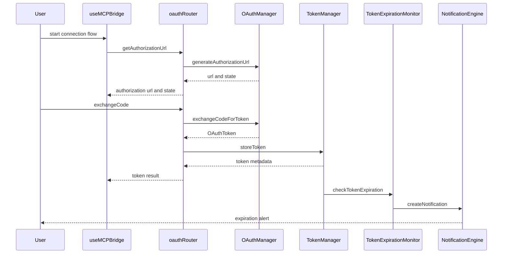
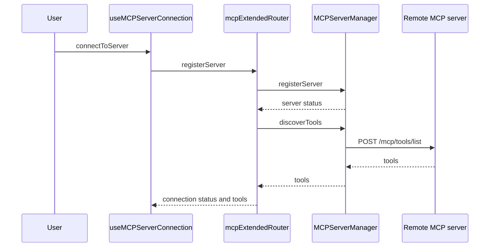
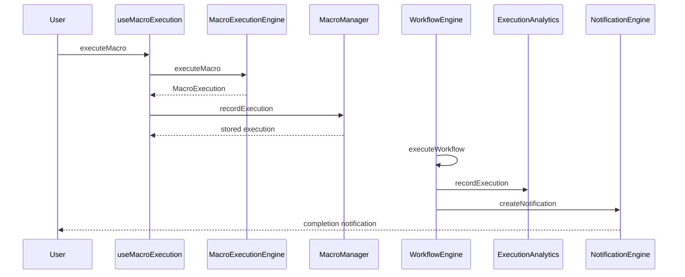
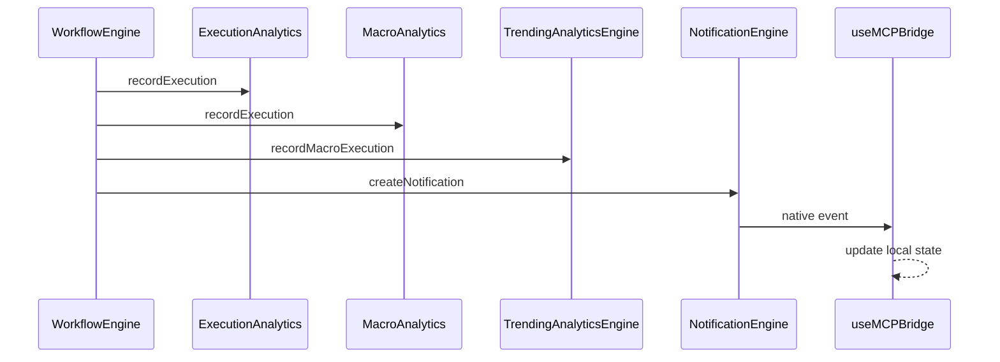
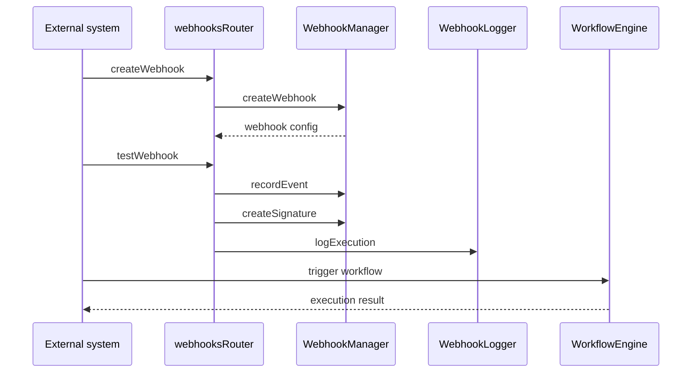
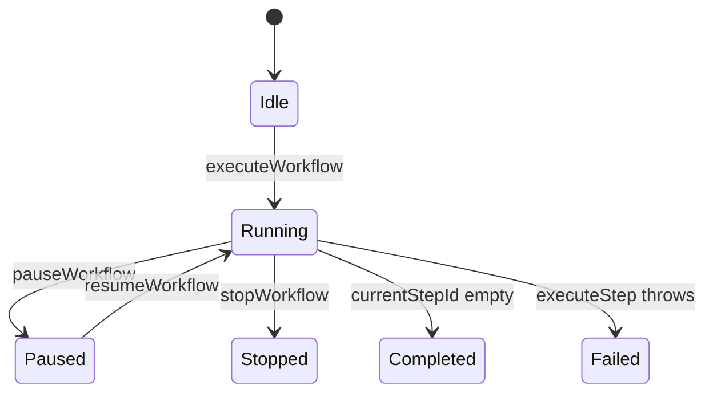

# Platform Architecture and End-to-End Flow

## Overview

MCP Hub’s execution path starts in the Expo/React Native client, where hooks such as `useMCPBridge`, `useToolExecution`, `useMacroExecution`, and `useMCPServerConnection` coordinate connection state, tool discovery, macro playback, and native event updates. The backend then takes over through tRPC routers in `server/auth/`, `server/tokens/`, `server/mcp/`, , `server/analytics/`, `server/webhooks/`, and `server/websocket/`, with persistence anchored in the PostgreSQL schema described in .

The architecture docs describe the system as a layered automation platform with token lifecycle management, real-time execution, webhook-driven triggers, analytics, and WebSocket sync. The visible code implements those ideas through in-memory managers, event emitters, native bridge hooks, tRPC procedures, and external MCP server adapters for GitHub, Slack, and Notion.

## Architecture Overview

```mermaid
flowchart TD
    subgraph ClientLayer [Expo React Native Client]
        UseAuth[useAuth]
        UseMCPBridge[useMCPBridge]
        UseToolExecution[useToolExecution]
        UseMacroExecution[useMacroExecution]
        UseMCPServerConnection[useMCPServerConnection]
    end

    subgraph ApiLayer [Node Express tRPC Backend]
        OAuthRouter[oauthRouter]
        MCPRouter[mcpRouter]
        MCPExtendedRouter[mcpExtendedRouter]
        WebhooksRouter[webhooksRouter]
    end

    subgraph CoreServices [Core Services]
        TokenManager[TokenManager]
        TokenExpirationMonitor[TokenExpirationMonitor]
        WorkflowEngine[WorkflowEngine]
        MCPServerManager[MCPServerManager]
        MCPClient[MCPClient]
        ExecutionAnalytics[ExecutionAnalytics]
        MacroAnalytics[MacroAnalytics]
        NotificationEngine[NotificationEngine]
        WebhookManager[WebhookManager]
        WebhookLogger[WebhookLogger]
        ConflictResolver[ConflictResolver]
    end

    subgraph Persistence [PostgreSQL and Local Storage]
        TokensTable[tokens]
        OAuthStatesTable[oauth_states]
        WorkflowsTable[workflows]
        WorkflowStepsTable[workflow_steps]
        ExecutionsTable[executions]
        ExecutionErrorsTable[execution_errors]
        AnalyticsTable[analytics]
        AsyncStorage[AsyncStorage]
    end

    subgraph ExternalSystems [External and Device Systems]
        GitHubMCP[GitHubMCPServer]
        SlackMCP[SlackMCPServer]
        NotionMCP[NotionMCPServer]
        ExpoNotifications[expo-notifications]
        NativeBridge[NativeEventEmitter]
        WebSocketClients[WebSocket clients]
        MCPServers[Remote MCP servers]
    end

    UseMCPBridge --> OAuthRouter
    UseToolExecution --> MCPRouter
    UseMacroExecution --> WorkflowEngine
    UseMCPServerConnection --> MCPExtendedRouter

    OAuthRouter --> TokenManager
    TokenManager --> TokensTable
    OAuthRouter --> OAuthStatesTable
    TokenExpirationMonitor --> ExpoNotifications

    MCPRouter --> MCPServerManager
    MCPExtendedRouter --> MCPServerManager
    MCPServerManager --> MCPServers
    MCPServerManager --> GitHubMCP
    MCPServerManager --> SlackMCP
    MCPServerManager --> NotionMCP

    WorkflowEngine --> ExecutionAnalytics
    WorkflowEngine --> MacroAnalytics
    WorkflowEngine --> NotificationEngine
    ExecutionAnalytics --> AnalyticsTable
    WorkflowEngine --> ExecutionsTable
    WorkflowEngine --> ExecutionErrorsTable
    WorkflowEngine --> WorkflowsTable
    WorkflowEngine --> WorkflowStepsTable

    WebhooksRouter --> WebhookManager
    WebhooksRouter --> WebhookLogger
    WebhookManager --> ExecutionsTable
    WebhookLogger --> AnalyticsTable

    NotificationEngine --> NativeBridge
    NotificationEngine --> WebSocketClients
    ConflictResolver --> WebSocketClients

    UseMCPBridge --> NativeBridge
    UseToolExecution --> NativeBridge
    UseMacroExecution --> AsyncStorage
```

## End-to-End Flow

### 1. Authentication and Token Lifecycle

A user starts authentication from the client, which calls into the OAuth flow exposed by `oauthRouter`. The router creates or verifies OAuth state, exchanges the authorization code for a token payload, and returns the access token metadata to the client. The token manager then handles encryption, storage, rotation, retrieval, and revocation.

### 2. MCP Server Registration and Tool Discovery

After authentication, the client registers or connects to an MCP server through either the native bridge hooks or the backend `mcpRouter` and `mcpExtendedRouter`. The server manager creates an Axios client per server, builds authentication headers, fetches tools from the remote MCP endpoint, and caches the tool list by `serverId`.

### 3. Workflow and Macro Execution

Workflow execution is coordinated by `WorkflowEngine` on the server and `MacroExecutionEngine` on the client. The server-side engine records execution history, evaluates conditions, executes loops and parallel branches, and marks each step as success or failure. The client-side macro hook drives a macro engine, records execution history with `MacroManager`, and updates progress state for the UI.

### 4. Analytics, Telemetry, and Broadcast Updates

Execution metrics are recorded in the analytics services as workflows and tools complete. `ExecutionAnalytics` updates tool and server statistics, `MacroAnalytics` emits `execution_recorded`, and `TrendingAnalyticsEngine` invalidates its cache when macro usage changes. Real-time updates are then broadcast through event emitters and the WebSocket layer.

### 5. Webhook-Triggered Execution

Webhook creation and verification run through `webhooksRouter` and `WebhookManager`. A webhook event is recorded, signed, verified, and can trigger downstream workflow execution. Logging is handled by `WebhookLogger`.

## Client Hooks

### `useMCPBridge`

*`lib/hooks/useMCPBridge.ts`*

This hook is the Android-native bridge for server connectivity, tool discovery, tool execution, and execution history. It listens to native events and keeps client state synchronized with the bridge lifecycle.

#### Properties

| Property | Type | Description |  |
| --- | --- | --- | --- |
| `isReady` | `boolean` | Indicates whether the native bridge is ready. |  |
| `connectionStatus` | `Record<string, string>` | Per-server connection status map keyed by `serverId`. |  |
| `discoveredTools` | `Record<string, Tool[]>` | Cached discovered tools per server. |  |
| `executionHistory` | `any[]` | Client-side execution history returned by the bridge. |  |
| `error` | `string \ | null` | Last bridge or event error message. |

#### Hook Helpers

| Type | Description |
| --- | --- |
| `ConnectionConfig` | Server connection inputs: `serverId`, `host`, `port`, `transport`, `authToken`, `timeout`. |
| `ExecutionResult` | Normalized tool execution result returned to the UI. |
| `ValidationResult` | Parameter validation response with `valid` and `errors`. |
| `Tool` | Tool shape with `name`, `description`, and `schema`. |

#### Methods

| Method | Description |
| --- | --- |
| `connectToServer` | Connects to a server through `MCPBridge.connectToServer`. |
| `disconnectServer` | Disconnects a server through `MCPBridge.disconnectServer`. |
| `getConnectionStatus` | Reads the current connection status for a server. |
| `discoverTools` | Fetches tools from the bridge and stores them by `serverId`. |
| `executeTool` | Executes a tool and normalizes the result shape for the client. |
| `validateParameters` | Validates tool parameters through the bridge. |
| `getToolSchema` | Retrieves and parses a tool schema JSON string. |
| `retryExecution` | Retries a failed execution by execution ID. |
| `getExecutionHistory` | Fetches execution history and updates local state. |
| `clearExecutionHistory` | Clears stored execution history for a server. |
| `setError` | Updates the current hook error state. |

#### Event Lifecycle

- Registers `NativeEventEmitter` listeners on Android only.
- Handles `onConnectionSuccess`, `onConnectionError`, `onDisconnected`, `onToolsDiscovered`, `onDiscoveryError`, `onExecutionComplete`, and `onExecutionError`.
- Sets `isReady` once the listeners are active.
- Removes all listeners in the cleanup function.

### `useToolExecution`

*`lib/hooks/useToolExecution.ts`*

This hook tracks per-tool execution state around the native `MCPServerBridgeExtended` bridge. It keeps a nested map of server IDs and tool names so the UI can render live execution progress, results, and failures.

#### Properties

| Property | Type | Description |  |
| --- | --- | --- | --- |
|  | `executionStates` | `Map<string, Map<string, ExecutionState>>` | Nested execution state keyed by server and tool. |
| `globalError` | `string \ | null` | Current hook-level error message. |

#### Methods

| Method | Description |
| --- | --- |
| `executeTool` | Starts tool execution, updates state, and captures the result. |
| `validateParameters` | Validates tool parameters through the native bridge. |
| `getExecutionState` | Returns the current state for a server tool pair. |
| `getLastResult` | Returns the last execution result for a server tool pair. |
| `clearExecutionHistory` | Clears execution history and removes stored state for a server. |
| `getExecutionHistory` | Retrieves execution history from the native bridge. |
| `getServerExecutionStates` | Returns all execution states for a server. |
| `isAnyExecuting` | Checks whether any tool is currently executing on a server. |

### `useMacroExecution`

*`lib/hooks/useMacroExecution.ts`*

This hook orchestrates macro creation, execution, and history management on the client. It uses `MacroExecutionEngine` for playback and `MacroManager` for storage and history operations.

#### Properties

| Property | Type | Description |  |
| --- | --- | --- | --- |
| `macros` | `Macro[]` | Loaded macros. |  |
| `currentExecution` | `MacroExecution \ | null` | Current macro execution record. |
| `isExecuting` | `boolean` | Indicates active macro playback. |  |
| `isPaused` | `boolean` | Indicates paused playback. |  |
| `error` | `string \ | null` | Last macro execution or storage error. |
| `progress` | `number` | Current execution progress percentage. |  |

#### Methods

| Method | Description |
| --- | --- |
| `loadMacros` | Loads all macros from `MacroManager`. |
| `createFromHistory` | Creates a macro from execution history entries. |
| `createFromExecutionHistory` | Alias for `createFromHistory`. |
| `createFromTemplate` | Creates a macro from a template key. |
| `executeMacro` | Executes a macro and records the result. |
| `pauseExecution` | Pauses the engine and marks the hook as paused. |
| `resumeExecution` | Resumes the engine and clears paused state. |
| `cancelExecution` | Cancels the execution and sets the error message. |
| `deleteMacro` | Deletes a macro and removes it from local state. |
| `toggleFavorite` | Toggles favorite status and refreshes the macro entry. |
| `getExecutionHistory` | Retrieves execution history for a macro. |
| `exportMacro` | Exports a macro to a serialized form. |
| `importMacro` | Imports a macro from JSON and appends it to state. |

#### Execution Flow

- Sets `isExecuting` and resets progress before playback.
- Calls `engineRef.current.executeMacro` with `stopOnError: false` and `retryFailedSteps: true`.
- Streams progress through `onProgress`.
- Logs step failures through `onStepError`.
- Persists the completed execution via `MacroManager.recordExecution`.

### `useMCPServerConnection`

*`lib/hooks/useMCPServerConnection.ts`*

This hook manages server connection state through the native MCP bridge and listens for connection status updates using a `NativeEventEmitter`.

#### Properties

| Property | Type | Description |  |
| --- | --- | --- | --- |
| `connections` | `Map<string, ConnectionState>` | Connection state keyed by server ID. |  |
| `isLoading` | `boolean` | Indicates an in-progress connection call. |  |
| `error` | `string \ | null` | Current connection error. |
| `eventEmitterRef` | `NativeEventEmitter \ | null` | Cached native event emitter instance. |

#### Methods

| Method | Description |
| --- | --- |
| `handleConnectionStatusChanged` | Updates local state after a native connection status event. |
| `connectToServer` | Connects a server through `MCPServerBridgeExtended.connectToServer`. |

#### Event Lifecycle

- Creates the `NativeEventEmitter` once.
- Subscribes to `MCPConnectionStatusChanged`.
- Updates `isConnected`, `status`, and `lastConnectedAt` from native events.
- Cleans up the subscription on unmount.

## Auth and Token Services

### OAuth Router

*`server/auth/oauth-router.ts`*

This router exposes the OAuth entry points used by the client to begin and complete authorization for GitHub, Slack, and Notion.

#### Procedures

| Procedure | Description |
| --- | --- |
| `getAuthorizationUrl` | Generates an authorization URL and `state` value for a server type and server ID. |
| `exchangeCode` | Verifies `state`, exchanges the code for a token, and returns the token payload with `serverId`. |
| `refreshToken` | Exchanges a refresh token for a new access token payload. |
| `revokeToken` | Public router procedure for token revocation. |

#### Request Shape

| Property | Type | Description |
| --- | --- | --- |
| `serverType` | `ServerTypeEnum` | Target integration type. |
| `serverId` | `string` | Server identifier used to bind the OAuth state. |
| `code` | `string` | Authorization code returned by the provider. |
| `state` | `string` | CSRF protection value created during initiation. |
| `refreshToken` | `string` | Provider refresh token for renewal. |

### Token Manager

The router uses publicProcedure for OAuth operations, so the auth flow itself is not wrapped in protectedProcedure.

*`server/tokens/token-manager.ts`*

`TokenManager` encrypts token material, stores token metadata, and supports retrieval, revocation, and rotation.

#### Methods

| Method | Description |
| --- | --- |
| `storeToken` | Encrypts a token, stores its encrypted payload and metadata, and returns the metadata. |
| `getToken` | Decrypts and returns the token string while updating `lastUsedAt`. |
| `getTokenMetadata` | Returns metadata without decrypting the token. |
| `listServerTokens` | Returns active token metadata for a server. |
| `revokeToken` | Marks a token inactive. |
| `rotateToken` | Revokes the old token and stores a replacement token. |
| `isTokenExpired` | Checks whether `expiresAt` is in the past. |

#### Stored Token Payload

| Property | Type | Description |
| --- | --- | --- |
| `encrypted` | `string` | Encrypted token payload. |
| `iv` | `string` | Initialization vector used during encryption. |
| `authTag` | `string` | Authentication tag for the encrypted payload. |
| `metadata` | `TokenMetadata` | Token metadata returned to the caller. |

### Token Expiration Monitor

*`server/notifications/token-expiration-monitor.ts`*

This monitor scans token expiration windows, emits alerts, and schedules push notifications through `expo-notifications`.

#### Properties

| Property | Type | Description |
| --- | --- | --- |
| `checkIntervalMs` | `number` | Interval between periodic checks, set to one hour. |
| `criticalThresholdDays` | `number` | Threshold for critical alerts, set to one day. |
| `warningThresholdDays` | `number` | Threshold for warning alerts, set to seven days. |
| `refreshThresholdMs` | `number` | Refresh threshold constant, set to five minutes. |

#### Interfaces

| Interface | Properties |
| --- | --- |
| `TokenExpirationAlert` | `tokenId`, `serverId`, `serverType`, `tokenName`, `expiresAt`, `daysUntilExpiration`, `alertLevel` |
| `ExpirationCheckResult` | `alerts`, `expiredTokens`, `tokensNeedingRefresh` |

#### Methods

| Method | Description |
| --- | --- |
| `checkTokenExpiration` | Scans token inputs and returns alerts, expired tokens, and refresh candidates. |
| `sendExpirationNotification` | Schedules an immediate push notification for one alert. |
| `sendBatchNotifications` | Sends critical alerts first and warning alerts with a short delay. |
| `schedulePeriodicChecks` | Runs an initial check and then repeats every hour. |
| `daysUntilExpiration` | Returns whole days remaining until token expiry. |
| `needsImmediateRefresh` | Checks whether the token expires within five minutes. |
| `getTimeUntilNextCheck` | Returns the configured check interval. |

## MCP Runtime and Workflow Engine

### MCP Client

refreshThresholdMs is defined as 300000, but checkTokenExpiration uses a hardcoded five-minute comparison instead of the constant.

*`lib/mcp-client.ts`*

`MCPClient` manages direct JSON-RPC style communication with a single MCP server, including initialization, tool discovery, and tool execution.

#### Properties

| Property | Type | Description |  |
| --- | --- | --- | --- |
| `config` | `MCPClientConfig` | Connection and transport settings for the server. |  |
| `messageId` | `number` | Incrementing JSON-RPC request identifier. |  |
| `pendingRequests` | `Map<number, (response: JSONRPCResponse) => void>` | Pending response callbacks keyed by request ID. |  |
| `capabilities` | `ServerCapabilities \ | null` | Capabilities returned during initialization. |
| `isConnected` | `boolean` | Current connection flag. |  |

#### Methods

| Method | Description |
| --- | --- |
| `initialize` | Sends the `initialize` JSON-RPC request and stores server capabilities. |
| `discoverTools` | Calls `tools/list` and maps remote tools into `MCPTool` records. |
| `executeTool` | Executes a named tool with arguments and returns content plus error state. |
| `sendViaHttp` | Sends JSON-RPC requests through `fetch` using `Content-Type: application/json`. |
| `close` | Clears pending requests and marks the client disconnected. |
| `getIsConnected` | Returns the current connection state. |
| `getCapabilities` | Returns the last stored server capabilities. |

#### Initialization Payload

| Property | Type | Description |
| --- | --- | --- |
| `protocolVersion` | `string` | Protocol version sent during initialization. |
| `capabilities.tools` | `object` | Tool capability declaration. |
| `capabilities.resources` | `object` | Resource capability declaration. |
| `capabilities.prompts` | `object` | Prompt capability declaration. |
| `clientInfo.name` | `string` | Client name sent to the server. |
| `clientInfo.version` | `string` | Client version sent to the server. |

### MCP Server Manager

*`server/mcp/mcp-server-manager.ts`*

This manager holds per-server Axios clients, tool caches, and connection status records. It is the backend-facing discovery and execution layer used by the tRPC routers.

#### Properties

| Property | Type | Description |
| --- | --- | --- |
| `servers` | `Map<string, MCPServerConfigWithUnknownHeaders>` | Registered server configurations. |
| `clients` | `Map<string, AxiosInstance>` | Axios client per server. |
| `toolCache` | `Map<string, MCPTool[]>` | Tool cache keyed by `serverId`. |
| `serverStatus` | `Map<string, ServerStatus>` | Connection and error status per server. |

#### Methods

| Method | Description |
| --- | --- |
| `registerServer` | Stores the config, creates the Axios client, and initializes a disconnected status. |
| `discoverTools` | Fetches tools, populates the cache, and updates server status. |
| `executeTool` | Calls the remote MCP tool endpoint and returns success or error. |
| `getServerStatus` | Returns the current status for one server. |
| `getAllServerStatuses` | Returns status records for all servers. |

#### Header Construction

`buildHeaders` merges custom headers with authentication headers and supports:

- `Authorization: Bearer ...`
- `X-API-Key: ...`
- `Authorization: Basic ...`

#### Tool Cache Strategy

- Cache key: `serverId`
- Read-through behavior: `discoverTools` returns cached tools immediately when present
- Cache population: after a successful `/mcp/tools/list` response

### Workflow Engine

*`server/macros/workflow-engine.ts`*

This engine is the server-side execution coordinator for workflow steps, conditions, loops, parallel branches, and delays. It records step-level execution history and errors in `WorkflowContext`.

#### Properties

| Property | Type | Description |
| --- | --- | --- |
| `context` | `WorkflowContext` | Current workflow state and execution records. |
| `steps` | `Map<string, WorkflowStep>` | Registered steps keyed by step ID. |
| `conditions` | `Map<string, WorkflowCondition>` | Conditional branches keyed by condition ID. |
| `loops` | `Map<string, WorkflowLoop>` | Loop definitions keyed by loop ID. |

#### Interfaces

| Interface | Properties |
| --- | --- |
| `WorkflowStep` | `id`, `type`, `name`, `config`, `nextStepId`, `onErrorStepId` |
| `WorkflowCondition` | `variable`, `operator`, `value`, `trueBranchId`, `falseBranchId` |
| `WorkflowLoop` | `variableName`, `iterableVariable`, `bodyStepId`, `nextStepId` |
| `WorkflowContext` | `variables`, `executionHistory`, `currentStepId`, `isRunning`, `isPaused`, `errors` |
| `ExecutionRecord` | `stepId`, `stepName`, `type`, `startTime`, `endTime`, `duration`, `status`, `result`, `error` |
| `WorkflowError` | `stepId`, `message`, `timestamp`, `recoverable` |

#### Methods

| Method | Description |
| --- | --- |
| `registerStep` | Registers a workflow step in the step map. |
| `registerCondition` | Registers a condition branch definition. |
| `registerLoop` | Registers a loop definition. |
| `setVariable` | Sets a workflow variable in the current context. |
| `getVariable` | Reads a workflow variable from the current context. |
| `executeStep` | Executes one registered step and records success or failure. |
| `executeWorkflow` | Walks the workflow from a start step until execution stops. |
| `pauseWorkflow` | Sets the paused flag in the current context. |
| `resumeWorkflow` | Clears the paused flag in the current context. |
| `stopWorkflow` | Stops the current execution loop. |
| `getContext` | Returns the current workflow context. |
| `getExecutionHistory` | Returns the recorded execution history. |
| `getErrors` | Returns recorded workflow errors. |
| `reset` | Clears context, history, and errors. |

#### Execution Behavior

- `executeStep` records a `running` entry before work starts.
- `tool`, `condition`, `loop`, `parallel`, and `delay` are the supported step types.
- `condition` branches update `this.context.currentStepId`.
- `loop` iterates arrays from `context.variables`.
- `parallel` uses `Promise.allSettled`.
- `delay` waits for `delayMs` or `1000` by default.
- Failed steps set `status` to `failed` and push a `WorkflowError` with `recoverable` support.

#### Workflow State Diagram

### Built-in MCP Server Adapters

#### GitHub MCP Server

executeWorkflow overwrites this.context.currentStepId with step.nextStepId after each step, so the branch selection written by executeCondition and executeLoop does not persist in the shown control loop. pauseWorkflow and resumeWorkflow only flip flags; executeWorkflow does not read isPaused.

*`server/mcp/servers/github-mcp.ts`*

| Property | Type | Description |
| --- | --- | --- |
| `config` | `GitHubConfig` | GitHub connection settings with a default base URL. |

| Method | Description |
| --- | --- |
| `getMCPConfig` | Returns the MCP server config for GitHub. |
| `getAvailableTools` | Returns GitHub tool definitions and input schemas. |

`getMCPConfig` builds:

- `id: github-mcp`
- `name: GitHub`
- `url: ${baseUrl}/mcp`
- bearer authentication with `config.token`
- GitHub-specific headers

#### Slack MCP Server

*`server/mcp/servers/slack-mcp.ts`*

| Property | Type | Description |
| --- | --- | --- |
| `config` | `SlackConfig` | Slack connection settings with a default base URL. |

| Method | Description |
| --- | --- |
| `getMCPConfig` | Returns the MCP server config for Slack. |
| `getAvailableTools` | Returns Slack tool definitions and input schemas. |

#### Notion MCP Server

*`server/mcp/servers/notion-mcp.ts`*

| Property | Type | Description |
| --- | --- | --- |
| `config` | `NotionConfig` | Notion connection settings with a default base URL. |

| Method | Description |
| --- | --- |
| `getMCPConfig` | Returns the MCP server config for Notion. |
| `getAvailableTools` | Returns Notion tool definitions and input schemas. |
| `validateToken` | Verifies the Notion token by calling `/users/me`. |

## Analytics and Telemetry

### Execution Analytics

*`server/analytics/execution-analytics.ts`*

This service records execution metrics and aggregates per-tool and per-server statistics.

#### Interfaces

| Interface | Properties |
| --- | --- |
| `ExecutionMetrics` | `toolName`, `serverId`, `executionTime`, `status`, `timestamp`, `errorMessage`, `parameters`, `result` |
| `ServerStats` | `serverId`, `serverType`, `totalExecutions`, `successfulExecutions`, `failedExecutions`, `averageExecutionTime`, `successRate`, `toolsUsed`, `lastActivityAt` |

#### Methods

| Method | Description |
| --- | --- |
| `recordExecution` | Stores the metric record and updates tool and server statistics. |

`updateToolStats` tracks:

- total executions
- success, failure, and skipped counts
- min, max, average execution time
- success and error rates
- `lastExecutedAt`

`updateServerStats` tracks server-level totals and uses an empty `serverType` placeholder until the registry supplies it.

### Macro Analytics

*`server/analytics/macro-analytics.ts`*

`MacroAnalytics` extends `EventEmitter` and records macro-level execution metrics, user-level metrics, and global aggregates.

#### Properties

| Property | Type | Description |
| --- | --- | --- |
| `metrics` | `Map<string, MacroMetrics>` | Macro-level metrics keyed by macro ID. |
| `userMetrics` | `Map<string, UserMetrics>` | User-level metrics keyed by user ID. |
| `globalMetrics` | `GlobalMetrics` | Platform-wide aggregate metrics. |

#### Methods

| Method | Description |
| --- | --- |
| `recordExecution` | Updates macro, user, and global metrics and emits `execution_recorded`. |

#### Emitted Events

- `execution_recorded`

### Trending Analytics Engine

*`server/analytics/trending-analytics.ts`*

This engine maintains trending-related counters and a cached trending snapshot.

#### Properties

| Property | Type | Description |  |
| --- | --- | --- | --- |
| `macroMetrics` | `Map<string, MacroMetrics>` | Macro trending metrics keyed by macro ID. |  |
| `forkMetrics` | `Map<string, ForkMetrics>` | Fork metrics keyed by fork ID. |  |
| `versionMetrics` | `Map<string, VersionMetrics>` | Version metrics keyed by version ID. |  |
| `trendingCache` | `TrendingData \ | null` | Cached trending snapshot. |
| `cacheExpiry` | `number` | Expiration timestamp for cached trending data. |  |

#### Methods

| Method | Description |
| --- | --- |
| `recordMacroExecution` | Updates execution metrics and invalidates the trending cache. |
| `recordMacroDownload` | Increments download metrics and invalidates the cache. |
| `recordMacroView` | Increments view metrics and invalidates the cache. |

#### Cache Strategy

- Cached data is stored in `trendingCache`
- Expiration is tracked in `cacheExpiry`
- Record methods call cache invalidation immediately after state changes

## Notifications and Real-Time Delivery

### Notification Engine

*`server/notifications/notification-engine.ts`*

`NotificationEngine` is the real-time notification bus. It stores notifications in memory, tracks subscribers by user, queues pending notifications, and emits delivery events.

#### Properties

| Property | Type | Description |
| --- | --- | --- |
| `notifications` | `Map<string, Notification[]>` | Notifications per user. |
| `subscribers` | `Map<string, Set<string>>` | Active connection IDs per user. |
| `notificationQueues` | `Map<string, Notification[]>` | Pending delivery queue per user. |
| `deliveryLog` | `DeliveryLog[]` | Delivery attempts and outcomes. |

#### Interfaces

| Interface | Properties |
| --- | --- |
| `Notification` | `id`, `userId`, `type`, `title`, `message`, `data`, `priority`, `timestamp`, `read`, `delivered`, `deliveryAttempts`, `maxRetries` |
| `NotificationType` | `collaboration_update`, `schedule_trigger`, `macro_execution`, `fork_notification`, `version_update`, `anomaly_alert`, `system_alert`, `user_mention`, `macro_comment`, `download_complete` |
| `DeliveryLog` | `notificationId`, `status`, `userId`, `timestamp` |
| `NotificationStats` | `totalNotifications`, `totalRead`, `totalUnread`, `totalDelivered`, `totalSubscribers`, `successfulDeliveries`, `failedDeliveries`, `deliverySuccessRate` |
| `UserNotificationStats` | `userId`, `totalNotifications`, `unreadCount`, `readCount`, `deliveredCount`, `isConnected`, `connectionCount` |

#### Methods

| Method | Description |
| --- | --- |
| `createNotification` | Creates, stores, and queues a notification, then emits `notification_created`. |
| `subscribe` | Adds a connection ID for a user and emits `user_subscribed`. |
| `unsubscribe` | Removes a connection ID for a user and emits `user_unsubscribed`. |
| `deliverNotification` | Emits delivery events for each connection and marks the notification delivered. |
| `deliverPendingNotifications` | Drains the pending queue while delivery succeeds. |
| `markAsRead` | Marks one notification as read and emits `notification_read`. |
| `markAllAsRead` | Marks all notifications for a user as read and emits `notifications_read`. |
| `getNotifications` | Returns recent notifications with optional unread filtering. |
| `getUnreadCount` | Returns unread notification count for a user. |
| `deleteNotification` | Removes one notification and emits `notification_deleted`. |
| `deleteAllNotifications` | Removes all notifications for a user and emits `notifications_deleted`. |
| `broadcastNotification` | Creates a notification for each target user. |
| `getDeliveryLog` | Returns recent delivery log entries. |
| `getStatistics` | Computes platform-wide notification statistics. |
| `getUserStatistics` | Computes per-user notification statistics. |
| `cleanupOldNotifications` | Removes notifications older than the requested retention window. |

#### Emitted Events

- `notification_created`
- `user_subscribed`
- `user_unsubscribed`
- `deliver`
- `notification_read`
- `notifications_read`
- `notification_deleted`
- `notifications_deleted`

#### Delivery Flow

- Queues notifications immediately after creation
- Delivers to every active `connectionId`
- Retries until `maxRetries`
- Leaves undelivered notifications queued when the user is offline

### Notification Dispatcher

*`server/notifications/notification-dispatcher.ts`*

`NotificationDispatcher` is a thin facade over `NotificationEngine` for typed notification creation.

#### Constructor Dependencies

| Type | Description |
| --- | --- |
| `NotificationEngine` | Creates the underlying notification records and emits delivery events. |

#### Methods

| Method | Description |
| --- | --- |
| `dispatchCollaborationUpdate` | Sends a collaboration update notification. |
| `dispatchScheduleTrigger` | Sends a scheduled-run notification with status-specific text. |
| `dispatchMacroExecution` | Sends a macro execution notification with success or failure text. |

### Notification Preferences System

*`server/notifications/notification-preferences.ts`*

This service stores notification preferences per user and determines whether a given notification should be delivered through a specific channel.

#### Properties

| Property | Type | Description |
| --- | --- | --- |
| `userPreferences` | `Map<string, UserNotificationPreferences>` | Preferences per user. |
| `deliveryMethods` | `Map<string, DeliveryMethod[]>` | Delivery methods per user. |

#### Interfaces

| Interface | Properties |
| --- | --- |
| `UserNotificationPreferences` | `userId`, `createdAt`, `updatedAt`, `notificationTypes`, `deliveryMethods`, `quietHours`, `frequency`, `privacy` |
| `NotificationTypePreference` | `enabled`, `inApp`, `push`, `email` |
| `DeliveryMethodPreference` | `enabled`, `retryAttempts`, `retryDelayMs` |
| `QuietHours` | `enabled`, `startTime`, `endTime`, `timezone` |
| `FrequencyPreference` | `batchNotifications`, `batchIntervalMinutes`, `maxNotificationsPerDay` |
| `PrivacyPreference` | `trackingEnabled`, `analyticsEnabled`, `dataRetentionDays` |
| `DeliveryMethod` | `name`, `enabled`, `config` |
| `RetryConfiguration` | `maxAttempts`, `delayMs` |
| `PreferencesStatistics` | `totalUsers`, `inAppEnabled`, `pushEnabled`, `emailEnabled`, `quietHoursEnabled`, `batchingEnabled`, `avgNotificationTypesEnabled` |

#### Methods

| Method | Description |
| --- | --- |
| `createDefaultPreferences` | Creates the full preference object for a user. |
| `getUserPreferences` | Returns the current preference record. |
| `updateNotificationTypePreference` | Updates one notification type entry. |
| `updateDeliveryMethodPreference` | Updates a delivery method entry. |
| `updateQuietHours` | Updates quiet hours settings. |
| `updateFrequencyPreferences` | Updates batching and daily limit settings. |
| `updatePrivacyPreferences` | Updates privacy-related settings. |
| `shouldDeliverNotification` | Evaluates type, channel, global, and quiet-hour constraints. |
| `getDeliveryMethods` | Returns the enabled delivery methods for one notification type. |
| `getRetryConfiguration` | Returns retry settings for one delivery method. |
| `shouldBatchNotifications` | Returns the batching flag for the user. |
| `getBatchIntervalMs` | Returns the batch interval in milliseconds. |
| `checkDailyLimit` | Checks whether the daily limit has been reached. |
| `exportPreferences` | Serializes preferences to JSON. |
| `importPreferences` | Imports preferences from JSON if the `userId` matches. |
| `resetToDefaults` | Clears current preferences and recreates defaults. |
| `getAllUsersWithPreferences` | Returns all users with stored preferences. |
| `getPreferencesStatistics` | Returns platform-level preference statistics. |

### Token Expiration Alerts and Push Delivery

`TokenExpirationMonitor` uses `expo-notifications` to send immediate alerts for critical token windows. It is the push-facing companion to `TokenManager` and `NotificationEngine`.

## Webhooks

### Webhook Manager

*`server/webhooks/webhook-manager.ts`*

`WebhookManager` handles webhook configuration, HMAC signatures, event recording, and webhook statistics.

#### Properties

| Property | Type | Description |
| --- | --- | --- |
| `webhooks` | `Map<string, WebhookConfig>` | Stored webhook configurations. |
| `events` | `Map<string, WebhookEvent>` | Recorded webhook events. |
| `rateLimitMap` | `Map<string, number[]>` | Timestamp buckets for rate limiting. |

#### Methods

| Method | Description |
| --- | --- |
| `generateSecret` | Creates a 32-byte hex secret. |
| `generateWebhookUrl` | Builds a webhook URL from `WEBHOOK_BASE_URL` or the default API base. |
| `createSignature` | Creates an HMAC-SHA256 signature for a payload. |
| `verifySignature` | Compares an expected signature against a supplied signature. |
| `createWebhook` | Creates a webhook record with generated ID, timestamps, and counters. |
| `getWebhook` | Returns a webhook by ID. |
| `listWebhooks` | Returns all stored webhooks. |
| `updateWebhook` | Applies partial updates to a webhook. |
| `deleteWebhook` | Removes a webhook. |
| `recordEvent` | Records a webhook event. |
| `getWebhookEvents` | Returns recent events for a webhook. |
| `getWebhookStats` | Returns execution and failure counts for a webhook. |

### Webhook Logger

The static methods instantiate WebhookManager inside each call, while the webhooks, events, and rateLimitMap collections are instance fields. In the shown code, webhook state does not persist across separate static calls.

*`server/webhooks/webhook-logger.ts`*

`WebhookLogger` stores execution logs and derived statistics for webhook activity.

#### Properties

| Property | Type | Description |
| --- | --- | --- |
| `logs` | `Map<string, WebhookLog[]>` | Log entries grouped by webhook ID. |

#### Interfaces

| Interface | Properties |
| --- | --- |
| `WebhookLog` | `id`, `webhookId`, `timestamp`, `event`, `requestPayload`, `responseStatus`, `responseBody`, `executionTime`, `success`, `error`, `retryCount` |

#### Methods

| Method | Description |
| --- | --- |
| `logExecution` | Creates and stores a log entry. |
| `getExecutionLogs` | Returns logs sorted newest first. |
| `getExecutionStats` | Returns counts, rates, and last-execution details. |
| `getErrorTrends` | Returns hourly failure trends for the requested window. |
| `clearOldLogs` | Deletes logs older than the retention window. |
| `searchLogs` | Filters logs by event name. |
| `getFailedExecutions` | Returns failed log entries. |

### Webhooks Router

logExecution, getExecutionLogs, and the other static methods create a new WebhookLogger instance each time. Because logs is instance state, the visible code does not preserve log history across calls.

*`server/webhooks/webhooks-router.ts`*

This router exposes webhook lifecycle operations as `publicProcedure` calls.

#### Procedures

| Procedure | Description |
| --- | --- |
| `createWebhook` | Creates a webhook, generates a secret, and updates the URL to include the new webhook ID. |
| `getWebhook` | Returns one webhook by ID. |
| `listWebhooks` | Returns all webhooks. |
| `updateWebhook` | Applies partial updates to a webhook. |
| `deleteWebhook` | Deletes a webhook and returns success. |
| `getWebhookEvents` | Returns events for a webhook. |
| `getWebhookStats` | Returns webhook statistics. |
| `testWebhook` | Records a pending event and returns the generated signature. |
| `rotateSecret` | Generates and stores a new webhook secret. |
| `verifySignature` | Verifies a request payload against the stored secret. |

#### Request Shape

| Property | Type | Description |  |
| --- | --- | --- | --- |
| `name` | `string` | Webhook name. |  |
| `events` | `string[]` | Events to subscribe to. |  |
| `rateLimit` | `number` | Per-webhook rate limit. |  |
| `ipWhitelist` | `string[] \ | undefined` | Optional allowlist. |
| `ipBlacklist` | `string[] \ | undefined` | Optional denylist. |
| `retryPolicy.maxRetries` | `number` | Retry count. |  |
| `retryPolicy.backoffMs` | `number` | Retry backoff in milliseconds. |  |
| `webhookId` | `string` | Target webhook ID. |  |
| `payload` | `Record<string, any>` | Test or signature payload. |  |
| `signature` | `string` | Signature supplied for verification. |  |
| `limit` | `number` | Result limit for log or event queries. |  |

### Webhook Templates

The router uses publicProcedure for all shown webhook procedures. The visible runtime code does not enforce JWT authentication at the router boundary, even though the API docs describe authenticated requests.

*`server/webhooks/webhook-templates.ts`*

| Interface | Properties |
| --- | --- |
| `WebhookTemplate` | `id`, `name`, `description`, `serverType`, `eventType`, `payloadMapping`, `workflowId`, `createdAt` |

#### Methods

| Method | Description |
| --- | --- |
| `getTemplate` | Returns one predefined template by ID. |
| `listTemplates` | Returns all predefined templates. |
| `listByServer` | Returns templates filtered by server type. |

## WebSocket Sync and Conflict Resolution

### Conflict Resolver

*`server/websocket/conflict-resolver.ts`*

This service resolves simultaneous edits using operational transformation, last-write-wins, or custom merge strategies.

#### Properties

This utility is implemented as static methods and does not maintain instance fields.

#### Interfaces

| Interface | Properties |
| --- | --- |
| `Operation` | `type`, `index`, `data`, `length`, `version`, `timestamp`, `userId` |
| `Conflict` | `op1`, `op2`, `type`, `severity` |
| `ResolvedConflicts` | `transformedLocal`, `transformedRemote`, `conflicts` |
| `ValidationResult` | `valid`, `errors` |
| `OperationHistory` | `total`, `byType`, `byUser`, `timeline` |
| `MergeStrategy` | `local_priority`, `remote_priority`, `combine`, `lww` |

#### Methods

| Method | Description |
| --- | --- |
| `resolveConflicts` | Transforms local and remote operations against each other. |
| `detectConflict` | Detects index, range, and delete-modify conflicts. |
| `rangesOverlap` | Tests whether two operation ranges overlap. |
| `transformOperation` | Adjusts an operation against another operation. |
| `mergeWithLWW` | Returns the newer of two operations. |
| `mergeCustom` | Applies one of the custom merge strategies. |
| `combineOperations` | Merges compatible modification data. |
| `validateConsistency` | Verifies version continuity and operation validity. |
| `isValidOperation` | Validates operation type and required fields. |
| `rebaseOperations` | Rebases operations onto a base operation list. |
| `getOperationHistory` | Summarizes operations by type, user, and time. |

#### Real-Time Sync Note

## State Management

### Client Hook State

The architecture docs describe Socket.io for real-time sync, while the visible WebSocket implementation in  imports ws. The code path shown here follows the ws-based implementation and the client-side NativeEventEmitter hooks.

- `useMCPBridge` stores connection, discovery, execution, and error state per server ID.
- `useToolExecution` stores nested tool execution state by server and tool.
- `useMacroExecution` keeps macro lists, active execution state, pause state, and progress percentage.
- `useMCPServerConnection` stores connection records in a `Map` and updates them from native events.

### Server Execution State

- `WorkflowEngine` keeps current step IDs, variables, execution history, and errors in `WorkflowContext`.
- `MCPServerManager` stores server status and tool caches in memory.
- `NotificationEngine` queues notifications until a subscriber is available.
- `WebhookManager` and `WebhookLogger` use in-memory stores for events and logs in the shown code.

## Error Handling

- `WorkflowEngine.executeStep` catches failures, records `WorkflowError`, and rethrows the original error.
- `NotificationEngine.deliverNotification` increments `deliveryAttempts`, retries until `maxRetries`, and logs the final status.
- `WebhookManager.verifySignature` uses HMAC comparison logic before accepting a signature.
- `MCPServerManager.executeTool` and `discoverTools` return structured `{ success, error }` responses on failure.
- The client hooks catch errors, convert them to strings, and store them in local hook state.

## Dependencies

### Runtime and Framework Packages

- `axios`
- `zod`
- `crypto`
- `events`
- `ws`
- `expo-notifications`
- `@react-native-async-storage/async-storage`
- `NativeEventEmitter`
- `Platform`
- `fetch`

### External Systems

- GitHub MCP server
- Slack MCP server
- Notion MCP server
- Remote MCP servers registered by the user
- Device notification services
- WebSocket clients and native bridge modules

### Documented System References

- 
- 
- 
- 

## Testing Considerations

- OAuth state generation and state verification for `oauthRouter.exchangeCode`.
- Token encryption, decryption, rotation, and revocation in `TokenManager`.
- Expiration alert classification in `TokenExpirationMonitor`.
- Tool discovery cache reuse in `MCPServerManager.discoverTools`.
- Step branching, loop handling, and error recording in `WorkflowEngine`.
- Notification queuing, delivery retries, and read-state mutations in `NotificationEngine`.
- HMAC signature creation and verification in `WebhookManager`.
- Static in-memory persistence behavior in `WebhookManager` and `WebhookLogger`.
- Conflict detection and transformation rules in `ConflictResolver`.
- Android-only listener registration in `useMCPBridge` and `useMCPServerConnection`.

## Key Classes Reference

| Class | Responsibility |
| --- | --- |
| `useMCPBridge.ts` | Native server connection, discovery, execution, and bridge event handling. |
| `useToolExecution.ts` | Per-tool execution state and native bridge orchestration. |
| `useMacroExecution.ts` | Client-side macro playback, history recording, and progress updates. |
| `useMCPServerConnection.ts` | Native connection state tracking and status updates. |
| `oauth-router.ts` | OAuth authorization, code exchange, token refresh, and token revocation flow. |
| `token-manager.ts` | Secure token encryption, storage, retrieval, rotation, and revocation. |
| `token-expiration-monitor.ts` | Token expiry checks and push notification alerts. |
| `mcp-client.ts` | Direct MCP JSON-RPC client for initialization, discovery, and execution. |
| `mcp-server-manager.ts` | Backend server registry, request client creation, caching, and status tracking. |
| `workflow-engine.ts` | Workflow step execution, branching, looping, and execution history. |
| `github-mcp.ts` | GitHub MCP configuration and tool schema definitions. |
| `slack-mcp.ts` | Slack MCP configuration and tool schema definitions. |
| `notion-mcp.ts` | Notion MCP configuration, tool schemas, and token validation. |
| `execution-analytics.ts` | Tool and server execution metrics aggregation. |
| `macro-analytics.ts` | Macro-level analytics and event emission. |
| `trending-analytics.ts` | Trending macro metrics and cache invalidation. |
| `notification-engine.ts` | Notification queuing, delivery, subscription, and read tracking. |
| `notification-dispatcher.ts` | Typed notification facade over `NotificationEngine`. |
| `notification-preferences.ts` | User delivery preferences, quiet hours, batching, and retry rules. |
| `webhook-manager.ts` | Webhook configuration, signatures, events, and statistics. |
| `webhook-logger.ts` | Webhook execution logging and derived metrics. |
| `webhooks-router.ts` | Public webhook lifecycle procedures. |
| `webhook-templates.ts` | Predefined webhook templates and lookup helpers. |
| `conflict-resolver.ts` | Concurrent edit conflict detection and transformation. |
