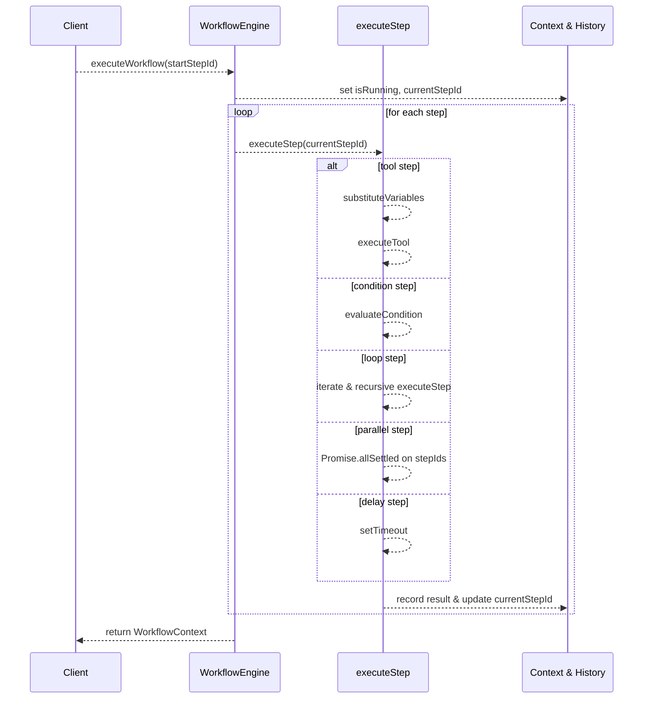

# Workflow Engine Feature Documentation

## Overview

The **Workflow Engine** provides advanced control flow capabilities for macro automation. It supports:

- **Conditional execution** (if/else branches)
- **Loops** over iterable variables
- **Parallel task execution**
- **Delays** and error recovery

By defining a graph of steps (tool calls, conditions, loops, etc.), this engine enables complex automation flows beyond simple linear macros. It integrates with existing macro systems to orchestrate multi-step workflows in a reusable, data-driven manner.

## Architecture Overview

```mermaid
flowchart TB
    subgraph WorkflowEngineModule
        WE[WorkflowEngine]
        CTX[WorkflowContext]
        STP[WorkflowStep Registry]
        CON[WorkflowCondition Registry]
        LOOP[WorkflowLoop Registry]
    end
    WE --> CTX
    WE --> STP
    WE --> CON
    WE --> LOOP
    note right of CTX
      Tracks runtime variables,
      history & errors
    end
```

## Component Structure

### Interfaces

#### WorkflowStep

| Property      | Type                                       | Description                                            |
|---------------|--------------------------------------------|--------------------------------------------------------|
| **id**        | `string`                                   | Unique identifier for the step                        |
| **type**      | `'tool'` \| `'condition'` \| `'loop'` \| `'parallel'` \| `'delay'` | Step category driving execution logic         |
| **name**      | `string`                                   | Human-readable name                                    |
| **config**    | `Record<string, any>`                      | Step-specific settings (tool name, branch IDs, etc.)   |
| **nextStepId**| `string?`                                  | ID of the next step on success                        |
| **onErrorStepId**| `string?`                               | ID of the recovery step on failure                     |

#### WorkflowCondition

| Property          | Type                                                   | Description                                 |
|-------------------|--------------------------------------------------------|---------------------------------------------|
| **variable**      | `string`                                               | Context variable to evaluate                |
| **operator**      | `'equals'` \| `'notEquals'` \| `'greaterThan'` \| `'lessThan'` \| `'contains'` \| `'exists'` | Comparison operator  |
| **value**         | `any`                                                  | Value to compare against                    |
| **trueBranchId**  | `string`                                               | Next step if condition is met               |
| **falseBranchId** | `string?`                                              | Next step if condition fails                |

#### WorkflowLoop

| Property           | Type                    | Description                                         |
|--------------------|-------------------------|-----------------------------------------------------|
| **variableName**   | `string`                | Name of loop variable                               |
| **iterableVariable**| `string`               | Context variable holding an array                   |
| **bodyStepId**     | `string`                | Step to execute for each item                       |
| **nextStepId**     | `string?`               | Step to execute after loop completion               |

#### WorkflowContext

| Property            | Type                                | Description                                        |
|---------------------|-------------------------------------|----------------------------------------------------|
| **variables**       | `Record<string, any>`               | Runtime variables                                  |
| **executionHistory**| `ExecutionRecord[]`                 | Chronological step records                         |
| **currentStepId**   | `string`                            | ID of the step about to execute                    |
| **isRunning**       | `boolean`                           | Workflow active flag                               |
| **isPaused**        | `boolean`                           | Workflow paused flag                               |
| **errors**          | `WorkflowError[]`                   | Collected errors with metadata                     |

#### ExecutionRecord

| Property         | Type                                 | Description                                     |
|------------------|--------------------------------------|-------------------------------------------------|
| **stepId**       | `string`                             | Executed step’s ID                              |
| **stepName**     | `string`                             | Step’s name                                     |
| **type**         | `string`                             | Step type                                       |
| **startTime**    | `Date`                               | Timestamp when execution began                  |
| **endTime**      | `Date?`                              | Timestamp when execution ended                   |
| **duration**     | `number?`                            | Milliseconds elapsed                            |
| **status**       | `'pending'` \| `'running'` \| `'success'` \| `'failed'` \| `'skipped'` | Execution outcome         |
| **result**       | `any?`                               | Output of the step                              |
| **error**        | `string?`                            | Error message if failed                         |

#### WorkflowError

| Property       | Type      | Description                                         |
|----------------|-----------|-----------------------------------------------------|
| **stepId**     | `string`  | ID of the step where the error occurred             |
| **message**    | `string`  | Error description                                   |
| **timestamp**  | `Date`    | When the error was recorded                         |
| **recoverable**| `boolean` | Whether execution can continue past this error      |

---

### WorkflowEngine Class

#### Public API

| Method                    | Signature                                                            | Description                                                            |
|---------------------------|----------------------------------------------------------------------|------------------------------------------------------------------------|
| **registerStep**          | `(step: WorkflowStep): void`                                         | Adds a new step to the workflow registry                               |
| **registerCondition**     | `(id: string, condition: WorkflowCondition): void`                   | Registers a named conditional branch                                   |
| **registerLoop**          | `(id: string, loop: WorkflowLoop): void`                             | Registers a named loop definition                                      |
| **setVariable**           | `(name: string, value: any): void`                                   | Defines or updates a context variable                                  |
| **getVariable**           | `(name: string): any`                                                | Retrieves a context variable                                           |
| **executeStep**           | `(stepId: string): Promise<any>`                                     | Executes one step by ID and records its outcome                        |
| **executeWorkflow**       | `(startStepId: string): Promise<WorkflowContext>`                    | Runs steps from the given entry point until completion                 |
| **pauseWorkflow**         | `(): void`                                                           | Temporarily halts execution                                            |
| **resumeWorkflow**        | `(): void`                                                           | Resumes a paused workflow                                              |
| **stopWorkflow**          | `(): void`                                                           | Stops execution entirely                                               |
| **getContext**            | `(): WorkflowContext`                                                | Returns the current execution context                                  |
| **getExecutionHistory**   | `(): ExecutionRecord[]`                                              | Retrieves all step records                                             |
| **getErrors**             | `(): WorkflowError[]`                                                | Retrieves all errors                                                    |
| **reset**                 | `(): void`                                                           | Clears context, history, and errors for a fresh run                    |

> [!TIP]  
> Use `reset()` before calling `executeWorkflow` a second time to clear prior state.

#### Private Helpers

- **evaluateCondition** `(condition: WorkflowCondition): boolean`
- **executeTool** `(step: WorkflowStep): Promise<any>`
- **executeCondition** `(step: WorkflowStep): Promise<any>`
- **executeLoop** `(step: WorkflowStep): Promise<any>`
- **executeParallel** `(step: WorkflowStep): Promise<any>`
- **executeDelay** `(step: WorkflowStep): Promise<any>`
- **substituteVariables** `(config: Record<string, any>): Record<string, any>`

> [!IMPORTANT]  
> The engine simulates tool calls via `console.log`. Implement real integrations in `executeTool`.

```card
{"title":"⚠️ Next Steps","content":"Replace the TODO in executeTool with actual tool invocation logic."}
```

---

## Execution Flow



---

## Error Handling

- **Step failures** update the corresponding `ExecutionRecord` status to `'failed'` and record an error message.
- **Recoverable errors** (controlled by `WorkflowError.recoverable`) allow loops and parallels to continue.
- **onErrorStepId** (when configured) can direct execution to alternate recovery steps.

```js
try {
  await engine.executeWorkflow('step_start');
} catch (err) {
  console.error('Workflow aborted:', err);
  const errors = engine.getErrors();
}
```

---

## Integration Points

- Complements **MacroExecutionEngine** by adding control flow constructs around tool calls.
- Can be embedded within **MacroChainingEngine** or scheduling mechanisms to orchestrate multi-macro scenarios.

---

## State Management

The engine exposes a live `WorkflowContext`:

- **variables**: dynamic key/value store
- **executionHistory**: detailed record of each step
- **errors**: list of encountered issues
- **isRunning/isPaused**: control flags

Use `getContext()`, `getExecutionHistory()` and `getErrors()` to inspect runtime state.

---

## Dependencies

- No external packages; uses built-in `Map`, `Promise`, and `setTimeout`.
- Logging via `console.log`.

---

## Testing Considerations

- Validate **variable substitution** for different data types.
- Test **conditional branches** with all operators.
- Ensure **loop** handles empty and non-array iterables.
- Verify **parallel execution** aggregates successful and failed outcomes.
- Confirm **pause/resume/stop** correctly alters `isRunning` and `isPaused`.