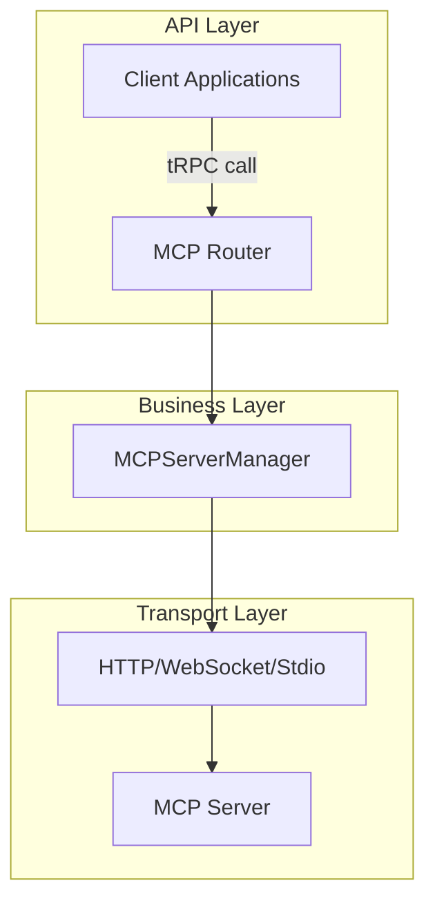
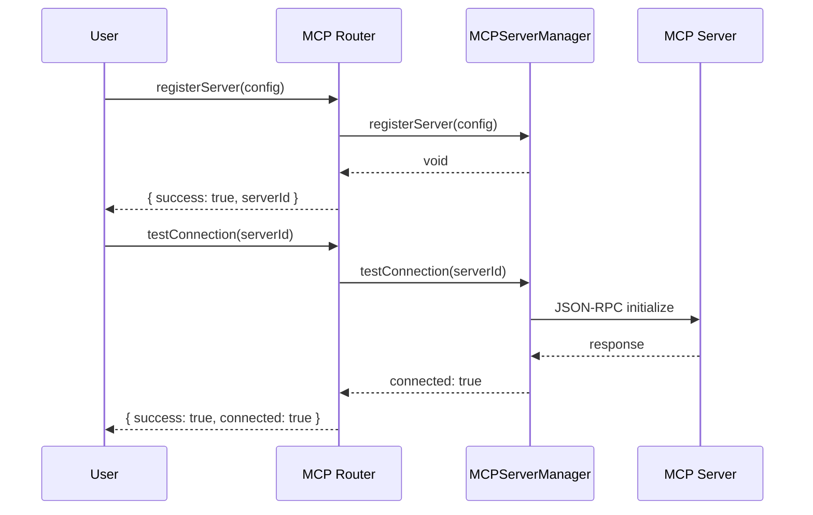
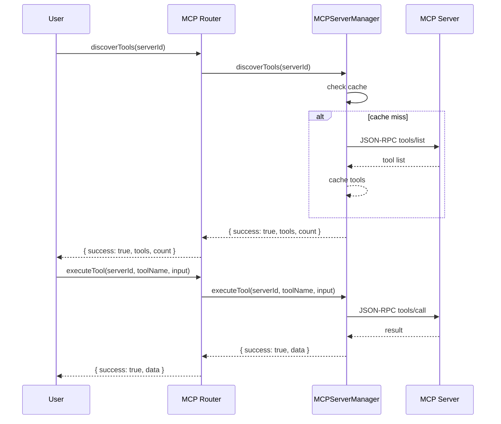

# MCP Router Feature Documentation

## Overview

The **MCP Router** exposes a set of tRPC procedures that allow clients to manage and interact with Model Context Protocol (MCP) servers. Developers can register new servers, discover and execute tools exposed by those servers, check connectivity and status, and manage in-memory caches of tool listings.

At runtime, the router delegates business logic to `MCPServerManager`, which handles HTTP/WebSocket/Stdio transport, JSON-RPC communication, and caching. This separation ensures a clean API surface while encapsulating transport and protocol details.

## Architecture Overview



## Component Structure

### 1. API Layer

#### **mcpRouter** (`server/mcp/mcp-router.ts`)

- **Purpose**: Defines tRPC procedures for registering, querying, and managing MCP servers and their tools .
- **Responsibilities**:
  - Validate inputs with Zod schemas.
  - Invoke `MCPServerManager` methods.
  - Use the `redactServerConfig` helper function to redact sensitive credentials (`token`, `password`) from server configurations before returning them to clients.
  - Wrap calls in `try/catch` to return structured error responses.

**Procedures Overview**

| Procedure            | Type     | Input Schema                                                     | Description                       | Response                                                           |
| -------------------- | -------- | ---------------------------------------------------------------- | --------------------------------- | ------------------------------------------------------------------ |
| registerServer       | Mutation | `MCPServerConfigSchema`                                          | Register an MCP server and redact credentials         | `{ success: boolean; serverId: string }`                           |
| discoverTools        | Query    | `{ serverId: string }`                                           | Discover tools from a server      | `{ success:boolean; tools:MCPTool[]; count:number; error?:string}` |
| executeTool          | Mutation | `{ serverId:string; toolName:string; input:Record<string,any> }` | Execute a tool on a server        | `{ success:boolean; data?:any; error?:string }`                    |
| getServerStatus      | Query    | `{ serverId: string }`                                           | Get status of a specific server   | `ServerStatus \| { error:string }`                                 |
| getAllServerStatuses | Query    | _none_                                                           | Get statuses of all servers       | `ServerStatus[]`                                                   |
| testConnection       | Mutation | `{ serverId: string }`                                           | Test connection to a server       | `{ success:boolean; connected:boolean; error?:string }`            |
| clearToolCache       | Mutation | `{ serverId: string }`                                           | Clear cached tools for one server | `{ success:boolean }`                                              |
| clearAllCaches       | Mutation | _none_                                                           | Clear all tool caches             | `{ success:boolean }`                                              |
| removeServer         | Mutation | `{ serverId: string }`                                           | Unregister a server                               | `{ success:boolean }`                                              |
| getAllServers        | Query    | _none_                                                           | List all registered servers and redact credentials (redacted)            | `MCPServerConfig[]`                                                |
| getServer            | Query    | `{ serverId: string }`                                           | Get config of a specific server and redact credentials (redacted)        | `MCPServerConfig \| { error:string }`                              |

### 2. Business Layer

#### **MCPServerManager** (`server/mcp/mcp-server-manager.ts`)

- **Purpose**: Manages server configurations, transports, tool discovery caches, and status tracking .
- **Responsibilities**:
  - Create and store Axios/WebSocket/Stdio clients.
  - Send JSON-RPC requests (`tools/list`, `tools/call`, `initialize`).
  - Cache tool lists in memory.
  - Track and update server statuses.

**Key Methods**

| Method                                   | Description                                          | Returns                                                  |
| ---------------------------------------- | ---------------------------------------------------- | -------------------------------------------------------- |
| `registerServer(config)`                 | Store config and initialize HTTP client              | `void`                                                   |
| `discoverTools(serverId)`                | Fetch or return cached tool list                     | `Promise<MCPTool[]>`                                     |
| `executeTool(serverId, toolName, input)` | Invoke a tool via JSON-RPC                           | `Promise<{ success:boolean; data?:any; error?:string }>` |
| `getServerStatus(serverId)`              | Retrieve the current status                          | `ServerStatus \| undefined`                              |
| `getAllServerStatuses()`                 | Retrieve statuses for all servers                    | `ServerStatus[]`                                         |
| `testConnection(serverId)`               | Perform JSON-RPC `initialize` to verify connectivity | `Promise<boolean>`                                       |
| `clearToolCache(serverId)`               | Invalidate cache for one server                      | `void`                                                   |
| `clearAllCaches()`                       | Invalidate cache for all servers                     | `void`                                                   |
| `removeServer(serverId)`                 | Remove config and client mapping                     | `void`                                                   |
| `getAllServers()`                        | List all stored server configs                       | `MCPServerConfig[]`                                      |
| `getServer(serverId)`                    | Retrieve a single server config                      | `MCPServerConfig \| undefined`                           |

### 3. Data Access Layer

- **Transport**: Axios is used to send HTTP POST requests for JSON-RPC calls; WebSocket and Stdio transports are also supported under the same interface.
- **Caching**: Tool lists are cached per server in `MCPServerManager.toolCache` until invalidated.

### 4. Data Models

#### **MCPServerConfig**

Defines server connection parameters .

| Property         | Type                                                                  | Description               |
| ---------------- | --------------------------------------------------------------------- | ------------------------- |
| `id`             | `string`                                                              | Unique server identifier  |
| `name`           | `string`                                                              | Display name              |
| `url`            | `string`                                                              | Base URL or stdio command |
| `type`           | `'http' \| 'websocket' \| 'stdio'`                                    | Transport type            |
| `headers?`       | `Record<string,string>`                                               | Custom HTTP headers       |
| `auth?`          | `{ type:'bearer'\|'api-key'\|'basic'; token?; username?; password? }` | Authentication details    |
| `timeout?`       | `number`                                                              | Request timeout (ms)      |
| `retryAttempts?` | `number`                                                              | Number of retry attempts  |

#### **ServerStatus**

Tracks runtime status of each server .

| Property         | Type                                   | Description                          |
| ---------------- | -------------------------------------- | ------------------------------------ |
| `id`             | `string`                               | Server identifier                    |
| `name`           | `string`                               | Display name                         |
| `status`         | `'connected'\|'disconnected'\|'error'` | Current status                       |
| `lastConnected?` | `Date`                                 | Timestamp of last successful connect |
| `lastError?`     | `string`                               | Last error message                   |
| `toolCount?`     | `number`                               | Cached tool count                    |

---

## API Integration

Each tRPC procedure is exposed via `POST` to `/api/trpc/{router}.{procedure}`. All requests require `Authorization: Bearer <token>`.

### Register Server

```api
{
  "title": "Register Server",
  "description": "Register an MCP server and redact credentials",
  "method": "POST",
  "baseUrl": "http://localhost:3000",
  "endpoint": "/api/trpc/mcp.registerServer",
  "headers": [
    { "key": "Content-Type", "value": "application/json", "required": true },
    { "key": "Authorization", "value": "Bearer <token>", "required": true }
  ],
  "pathParams": [],
  "queryParams": [],
  "bodyType": "json",
  "requestBody": "{\n  \"input\": {\n    \"id\": \"server1\",\n    \"name\": \"My Server\",\n    \"url\": \"https://example.com\",\n    \"type\": \"http\",\n    \"headers\": {\"X-Custom\": \"value\"},\n    \"auth\": {\"type\": \"bearer\", \"token\": \"abc123\"},\n    \"timeout\": 30000,\n    \"retryAttempts\": 3\n  }\n}",
  "responses": {
    "200": {
      "description": "Server registered successfully",
      "body": "{\n  \"success\": true,\n  \"serverId\": \"server1\"\n}"
    }
  }
}
```

### Discover Tools

```api
{
  "title": "Discover Tools",
  "description": "Retrieve available tools from a registered MCP server",
  "method": "POST",
  "baseUrl": "http://localhost:3000",
  "endpoint": "/api/trpc/mcp.discoverTools",
  "headers": [
    { "key": "Content-Type", "value": "application/json", "required": true },
    { "key": "Authorization", "value": "Bearer <token>", "required": true }
  ],
  "pathParams": [],
  "queryParams": [],
  "bodyType": "json",
  "requestBody": "{\n  \"input\": { \"serverId\": \"server1\" }\n}",
  "responses": {
    "200": {
      "description": "Tools discovered successfully",
      "body": "{\n  \"success\": true,\n  \"tools\": [\n    { \"name\": \"listFiles\", \"description\": \"List directory files\", \"inputSchema\": {}, \"outputSchema\": {}, \"annotations\": {} }\n  ],\n  \"count\": 1\n}"
    }
  }
}
```

### Execute Tool

```api
{
  "title": "Execute Tool",
  "description": "Invoke a tool on an MCP server",
  "method": "POST",
  "baseUrl": "http://localhost:3000",
  "endpoint": "/api/trpc/mcp.executeTool",
  "headers": [
    { "key": "Content-Type", "value": "application/json", "required": true },
    { "key": "Authorization", "value": "Bearer <token>", "required": true }
  ],
  "pathParams": [],
  "queryParams": [],
  "bodyType": "json",
  "requestBody": "{\n  \"input\": {\n    \"serverId\": \"server1\",\n    \"toolName\": \"listFiles\",\n    \"input\": { \"path\": \"/home/user\" }\n  }\n}",
  "responses": {
    "200": {
      "description": "Tool executed successfully",
      "body": "{\n  \"success\": true,\n  \"data\": [\"file1.txt\",\"file2.log\"]\n}"
    }
  }
}
```

### Get Server Status

```api
{
  "title": "Get Server Status",
  "description": "Fetch the current status of an MCP server",
  "method": "POST",
  "baseUrl": "http://localhost:3000",
  "endpoint": "/api/trpc/mcp.getServerStatus",
  "headers": [
    { "key": "Content-Type", "value": "application/json", "required": true },
    { "key": "Authorization", "value": "Bearer <token>", "required": true }
  ],
  "pathParams": [],
  "queryParams": [],
  "bodyType": "json",
  "requestBody": "{\n  \"input\": { \"serverId\": \"server1\" }\n}",
  "responses": {
    "200": {
      "description": "Server status retrieved",
      "body": "{\n  \"id\": \"server1\",\n  \"name\": \"My Server\",\n  \"status\": \"connected\",\n  \"lastConnected\": \"2024-05-01T10:00:00Z\"\n}"
    }
  }
}
```

### Get All Server Statuses

```api
{
  "title": "Get All Server Statuses",
  "description": "Retrieve statuses for all registered MCP servers",
  "method": "POST",
  "baseUrl": "http://localhost:3000",
  "endpoint": "/api/trpc/mcp.getAllServerStatuses",
  "headers": [
    { "key": "Content-Type", "value": "application/json", "required": true },
    { "key": "Authorization", "value": "Bearer <token>", "required": true }
  ],
  "pathParams": [],
  "queryParams": [],
  "bodyType": "none",
  "responses": {
    "200": {
      "description": "List of server statuses",
      "body": "[\n  { \"id\": \"server1\", \"name\": \"My Server\", \"status\": \"connected\" }\n]"
    }
  }
}
```

### Test Connection

```api
{
  "title": "Test Connection",
  "description": "Test connectivity to a registered MCP server",
  "method": "POST",
  "baseUrl": "http://localhost:3000",
  "endpoint": "/api/trpc/mcp.testConnection",
  "headers": [
    { "key": "Content-Type", "value": "application/json", "required": true },
    { "key": "Authorization", "value": "Bearer <token>", "required": true }
  ],
  "pathParams": [],
  "queryParams": [],
  "bodyType": "json",
  "requestBody": "{\n  \"input\": { \"serverId\": \"server1\" }\n}",
  "responses": {
    "200": {
      "description": "Connection test result",
      "body": "{\n  \"success\": true,\n  \"connected\": true\n}"
    }
  }
}
```

### Clear Tool Cache

```api
{
  "title": "Clear Tool Cache",
  "description": "Invalidate cached tools for a specific server",
  "method": "POST",
  "baseUrl": "http://localhost:3000",
  "endpoint": "/api/trpc/mcp.clearToolCache",
  "headers": [
    { "key": "Content-Type", "value": "application/json", "required": true },
    { "key": "Authorization", "value": "Bearer <token>", "required": true }
  ],
  "pathParams": [],
  "queryParams": [],
  "bodyType": "json",
  "requestBody": "{\n  \"input\": { \"serverId\": \"server1\" }\n}",
  "responses": {
    "200": {
      "description": "Cache cleared successfully",
      "body": "{\n  \"success\": true\n}"
    }
  }
}
```

### Clear All Caches

```api
{
  "title": "Clear All Tool Caches",
  "description": "Invalidate all cached tool lists across servers",
  "method": "POST",
  "baseUrl": "http://localhost:3000",
  "endpoint": "/api/trpc/mcp.clearAllCaches",
  "headers": [
    { "key": "Content-Type", "value": "application/json", "required": true },
    { "key": "Authorization", "value": "Bearer <token>", "required": true }
  ],
  "pathParams": [],
  "queryParams": [],
  "bodyType": "none",
  "responses": {
    "200": {
      "description": "All caches cleared",
      "body": "{\n  \"success\": true\n}"
    }
  }
}
```

### Remove Server

```api
{
  "title": "Remove Server",
  "description": "Unregister a server and remove its client instance",
  "method": "POST",
  "baseUrl": "http://localhost:3000",
  "endpoint": "/api/trpc/mcp.removeServer",
  "headers": [
    { "key": "Content-Type", "value": "application/json", "required": true },
    { "key": "Authorization", "value": "Bearer <token>", "required": true }
  ],
  "pathParams": [],
  "queryParams": [],
  "bodyType": "json",
  "requestBody": "{\n  \"input\": { \"serverId\": \"server1\" }\n}",
  "responses": {
    "200": {
      "description": "Server removed successfully",
      "body": "{\n  \"success\": true\n}"
    }
  }
}
```

### Get All Servers

```api
{
  "title": "Get All Servers",
  "description": "List all registered MCP server configurations",
  "method": "POST",
  "baseUrl": "http://localhost:3000",
  "endpoint": "/api/trpc/mcp.getAllServers",
  "headers": [
    { "key": "Content-Type", "value": "application/json", "required": true },
    { "key": "Authorization", "value": "Bearer <token>", "required": true }
  ],
  "pathParams": [],
  "queryParams": [],
  "bodyType": "none",
  "responses": {
    "200": {
      "description": "Registered server configurations (sensitive fields redacted)",
      "body": "[\n  {\n    \"id\": \"server1\",\n    \"name\": \"My Server\",\n    \"url\": \"https://example.com\",\n    \"type\": \"http\",\n    \"headers\": {\"X-Custom\": \"value\"},\n    \"auth\": {\"type\": \"bearer\"},\n    \"timeout\": 30000,\n    \"retryAttempts\": 3\n  }\n]"
    }
  }
}
```

### Get Server

```api
{
  "title": "Get Server",
  "description": "Retrieve configuration for a specific MCP server (sensitive fields redacted)",
  "method": "POST",
  "baseUrl": "http://localhost:3000",
  "endpoint": "/api/trpc/mcp.getServer",
  "headers": [
    { "key": "Content-Type", "value": "application/json", "required": true },
    { "key": "Authorization", "value": "Bearer <token>", "required": true }
  ],
  "pathParams": [],
  "queryParams": [],
  "bodyType": "json",
  "requestBody": "{\n  \"input\": { \"serverId\": \"server1\" }\n}",
  "responses": {
    "200": {
      "description": "Server configuration retrieved (sensitive fields redacted)",
      "body": "{\n  \"id\": \"server1\",\n  \"name\": \"My Server\",\n  \"url\": \"https://example.com\",\n  \"type\": \"http\",\n  \"headers\": {\"X-Custom\": \"value\"},\n  \"auth\": {\"type\": \"bearer\"},\n  \"timeout\": 30000,\n  \"retryAttempts\": 3\n}"
    }
  }
}
```

---

## Feature Flows

### Server Registration and Connection Flow



### Tool Discovery and Execution Flow



---

## State Management

- **connected**: Server is reachable and ready.
- **disconnected**: No active connection.
- **error**: Last operation failed.
- **unknown**: Server not found or uninitialized.

## Integration Points

- Mounted under `mcp` in `AppRouter` (`server/routers.ts`), alongside `mcpServers` for extended procedures .
- Uses `protectedProcedure` from the core to enforce authentication on all endpoints.

## Key Classes Reference

| Class                     | Location                           | Responsibility                                                |
| ------------------------- | ---------------------------------- | ------------------------------------------------------------- |
| **mcpRouter**             | `server/mcp/mcp-router.ts`         | Defines tRPC procedures for MCP server lifecycle and tool ops |
| **MCPServerConfigSchema** | `server/mcp/mcp-router.ts`         | Zod schema validating server config input                     |
| **MCPServerManager**      | `server/mcp/mcp-server-manager.ts` | Business logic for server registration, discovery, execution  |
| **MCPServerConfig**       | `server/mcp/mcp-server-manager.ts` | Interface defining server connection parameters               |
| **ServerStatus**          | `server/mcp/mcp-server-manager.ts` | Interface representing server runtime status                  |

## Error Handling

Procedures wrap manager calls in `try/catch` and return a standardized error response:

```js
try {
  // call manager
} catch (error) {
  return {
    success: false,
    error: error instanceof Error ? error.message : 'Unknown error',
  };
}
```

## Caching Strategy

- Tool listings cached per server in `MCPServerManager.toolCache`.
- Clear specific cache via `clearToolCache`.
- Clear all caches via `clearAllCaches`.

## Dependencies

- **zod** for schema validation
- **tRPC** (`router`, `protectedProcedure`) for RPC definitions
- **axios** for HTTP transport in `MCPServerManager`

## Testing Considerations

- Register server with valid/invalid configs.
- Discover tools on both cached and uncached scenarios.
- Execute tools with correct and incorrect parameters.
- Verify status endpoints reflect real connection changes.
- Validate cache invalidation via clear procedures.
