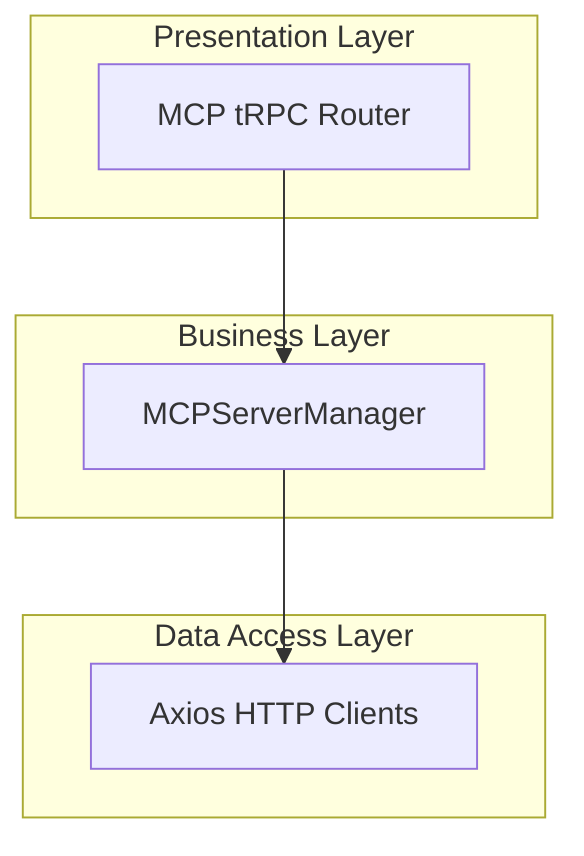
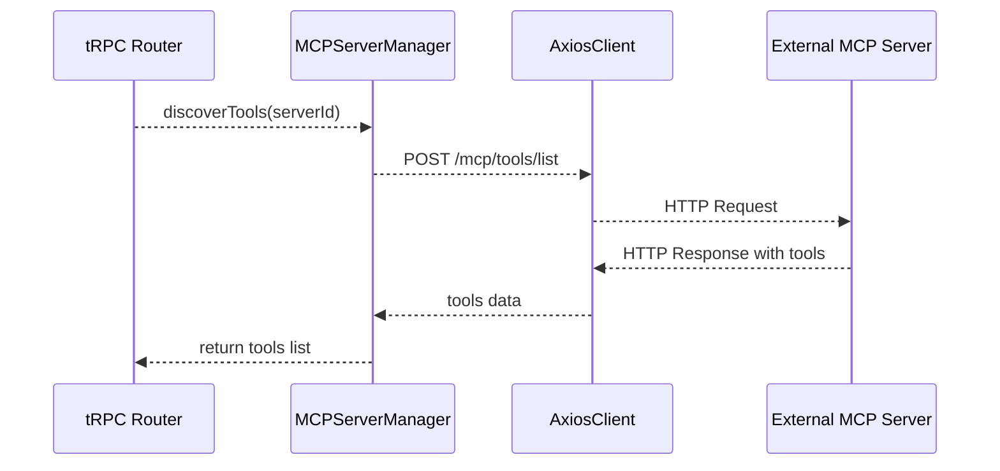
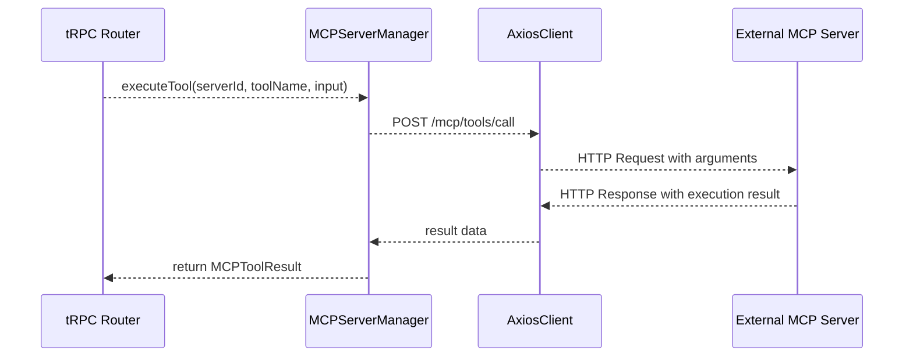

# MCP Server Manager Feature Documentation 🛠️

## Overview

The **MCP Server Manager** centralizes the registration, connection management, and tool operations for external MCP servers. It supports HTTP, WebSocket, and stdio transports while handling authentication, timeouts, and retry logic.

By caching discovered tools and tracking server statuses, it optimizes performance and provides reliable health checks. This manager integrates with tRPC routers to enable seamless server registration, tool discovery, execution, and status reporting in the broader application.

## Architecture Overview



## Component Structure

### 1. Business Layer

#### **MCPServerManager** (`server/mcp/mcp-server-manager.ts`)

- **Purpose**  
  Manages MCP server lifecycles, tool discovery, execution, caching, and status tracking.

- **Key Properties**  
  - `servers: Map<string, MCPServerConfigWithUnknownHeaders>`  
    Stores registered server configurations.  
  - `clients: Map<string, AxiosInstance>`  
    Axios instances keyed by server ID.  
  - `toolCache: Map<string, MCPTool[]>`  
    Cached tool lists per server.  
  - `serverStatus: Map<string, ServerStatus>`  
    Tracks connection status and metadata.

- **Key Methods**

| Method                                       | Visibility      | Description                                                        | Returns                              |
|----------------------------------------------|-----------------|--------------------------------------------------------------------|--------------------------------------|
| `registerServer(config)`                     | [badge:public]  | Registers a new server and initializes its Axios client.          | `void`                               |
| `buildHeaders(config)`                       | [badge:private] | Constructs HTTP headers, including authentication tokens.         | `Record<string, string>`             |
| `discoverTools(serverId)`                    | [badge:public]  | Retrieves and caches available tools via `POST /mcp/tools/list`.  | `Promise<MCPTool[]>`                 |
| `executeTool(serverId, toolName, input)`     | [badge:public]  | Executes a tool via `POST /mcp/tools/call` and returns the result.| `Promise<MCPToolResult>`             |
| `getServerStatus(serverId)`                  | [badge:public]  | Returns status information for a specific server.                 | `ServerStatus \| null`               |
| `getAllServerStatuses()`                     | [badge:public]  | Returns statuses for all registered servers.                      | `ServerStatus[]`                     |
| `testConnection(serverId)`                   | [badge:public]  | Sends `GET /health` to verify server reachability.                | `Promise<boolean>`                   |
| `clearToolCache(serverId)`                   | [badge:public]  | Invalidates the tool cache for a given server.                    | `void`                               |
| `clearAllCaches()`                           | [badge:public]  | Clears tool caches for all servers.                               | `void`                               |
| `removeServer(serverId)`                     | [badge:public]  | Unregisters a server and cleans up its resources.                 | `void`                               |
| `getAllServers()`                            | [badge:public]  | Lists all registered server configurations.                       | `MCPServerConfigWithUnknownHeaders[]`|
| `getServer(serverId)`                        | [badge:public]  | Retrieves a server configuration by ID.                           | `MCPServerConfigWithUnknownHeaders \| null` |

## Data Models

### **MCPServerConfig**

| Property        | Type                                            | Description                               |
|-----------------|-------------------------------------------------|-------------------------------------------|
| `id`            | `string`                                        | Unique server identifier                  |
| `name`          | `string`                                        | Display name of the server                |
| `url`           | `string`                                        | Base URL for Axios HTTP requests          |
| `type`          | `'http' \| 'websocket' \| 'stdio'`              | Transport mechanism                       |
| `headers?`      | `Record<string, string>`                       | Custom HTTP headers                       |
| `auth?`         | `{ type, token?, username?, password? }`        | Authentication configuration              |
| `timeout?`      | `number`                                        | Request timeout in milliseconds           |
| `retryAttempts?`| `number`                                        | Retry attempts on failure                 |

### **MCPTool**

| Property         | Type                                                    | Description                   |
|------------------|---------------------------------------------------------|-------------------------------|
| `name`           | `string`                                                | Tool identifier               |
| `description`    | `string`                                                | Human-readable summary        |
| `inputSchema`    | `{ type: string; properties: Record<string, any>; required?: string[] }` | JSON schema for inputs |

### **MCPToolResult**

| Property   | Type     | Description                              |
|------------|----------|------------------------------------------|
| `success`  | `boolean`| Indicates execution success              |
| `data?`    | `any`    | Result payload on success                |
| `error?`   | `string` | Error message on failure                 |

### **ServerStatus**

| Property         | Type                                          | Description                              |
|------------------|-----------------------------------------------|------------------------------------------|
| `id`             | `string`                                      | Server identifier                        |
| `name`           | `string`                                      | Display name                             |
| `status`         | `'connected' \| 'disconnected' \| 'error'`    | Current connection state                 |
| `lastConnected?` | `Date`                                        | Timestamp of last successful action      |
| `lastError?`     | `string`                                      | Last error message                       |
| `toolCount?`     | `number`                                      | Number of cached tools                   |

## API Integration

### GET /health – Test Server Health

```api
{
  "title": "Test Server Health",
  "description": "Checks whether the MCP server is reachable",
  "method": "GET",
  "baseUrl": "<configured server url>",
  "endpoint": "/health",
  "headers": [
    {
      "key": "Authorization",
      "value": "Bearer <token> or Basic auth",
      "required": false
    }
  ],
  "queryParams": [],
  "pathParams": [],
  "bodyType": "none",
  "responses": {
    "200": {
      "description": "Server is healthy",
      "body": "{ \"status\": \"ok\" }"
    },
    "default": {
      "description": "Error or unreachable server",
      "body": "{ \"error\": \"message\" }"
    }
  }
}
```

### POST /mcp/tools/list – Discover MCP Tools

```api
{
  "title": "Discover MCP Tools",
  "description": "Retrieves available tools from the MCP server",
  "method": "POST",
  "baseUrl": "<configured server url>",
  "endpoint": "/mcp/tools/list",
  "headers": [],
  "bodyType": "json",
  "requestBody": "{}",
  "responses": {
    "200": {
      "description": "List of tools",
      "body": "{ \"tools\": [ { \"name\": \"toolName\", \"description\": \"...\", \"inputSchema\": {...} } ] }"
    },
    "default": {
      "description": "Discovery failed",
      "body": "{ \"error\": \"message\" }"
    }
  }
}
```

### POST /mcp/tools/call – Execute MCP Tool

```api
{
  "title": "Execute MCP Tool",
  "description": "Executes a specified tool on the MCP server",
  "method": "POST",
  "baseUrl": "<configured server url>",
  "endpoint": "/mcp/tools/call",
  "headers": [],
  "bodyType": "json",
  "requestBody": "{\n  \"name\": \"toolName\",\n  \"arguments\": { \"key\": \"value\" }\n}",
  "responses": {
    "200": {
      "description": "Execution result",
      "body": "{ \"result\": { ... } }"
    },
    "default": {
      "description": "Execution error",
      "body": "{ \"error\": \"message\" }"
    }
  }
}
```

## Feature Flows

### 1. Tool Discovery Flow



### 2. Tool Execution Flow



## Error Handling

- On **discovery** failure, updates `ServerStatus.status` to **error** and records `lastError`.  
- On **execution** failure, similarly flags the server status and returns `success: false`.  
- Throws clear errors when a server or client instance is missing.

## Caching Strategy 🔄

- **Tool Cache**: Uses `toolCache` map to store `MCPTool[]` after first fetch.  
- **Invalidation**:
  - `clearToolCache(serverId)`: Clears cache for one server.  
  - `clearAllCaches()`: Clears all cached entries.

> [!TIP]
> Clearing cache ensures fresh tool discovery if server capabilities change.

## Integration Points

- Invoked by tRPC routers:
  - `server/mcp/mcp-router.ts`
  - `server/mcp/mcp-router-extended.ts`
- Exposes methods for server registration, discovery, execution, and health checks.

## Dependencies

- **axios**: HTTP client for all server communications.  
- **btoa**: Browser API used for Basic authentication header encoding.

## Key Classes Reference

| Class              | Location                                  | Responsibility                                                        |
|--------------------|-------------------------------------------|-----------------------------------------------------------------------|
| `MCPServerManager` | `server/mcp/mcp-server-manager.ts`        | Manages server configs, HTTP clients, tool operations, and statuses   |

## Testing Considerations

- **Registration**: Validate creation of Axios client and initial status entry.  
- **Health Check**: `testConnection` should return `true` for a healthy `/health` and `false` on error.  
- **Discovery**: Confirm caching behavior and error propagation.  
- **Execution**: Verify correct `MCPToolResult` on success and error scenarios.  
- **Status Tracking**: Ensure `serverStatus` updates for `connected`, `disconnected`, and `error`.  
- **Cache Management**: Test `clearToolCache` and `clearAllCaches` remove entries.  
- **Removal**: Confirm `removeServer` cleans up all internal maps without leaks.