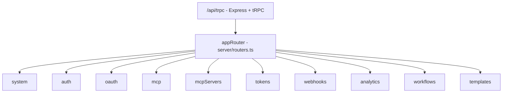

> Audience: developers & contributors | Last verified: 2026-08-06

This page documents everything the server exposes: the Express bootstrap, the ten tRPC routers, rate limits, and REST routes. It is the code-level companion to the [API reference](../api-reference/index.md) section, which documents the same procedures from the caller's point of view.

## Bootstrap (`server/_core/index.ts`)

- Listens on **port 3000**, falling back to `3001`–`3019` if busy.
- Mounts Express with JSON parsing and a **CORS allowlist**.
- Mounts the **global** limiter (all requests) and the **api** limiter (the `/api/trpc` mount); the other limiters are defined but not wired (see below).
- Hosts tRPC at `/api/trpc` (httpBatchLink target) and the REST routes.

## tRPC core

- `server/_core/trpc.ts` — `publicProcedure`, `protectedProcedure`, `adminProcedure`; errors `UNAUTHORIZED`/`10001` and `FORBIDDEN`/`10002`; superjson transformer.
- `server/_core/context.ts` — `createContext` builds `TrpcContext { req, res, user }`, resolving the session via `sdk.authenticateRequest`.
- `server/_core/env.ts` — reads `VITE_APP_ID`, `JWT_SECRET`, `DATABASE_URL`, `OAUTH_SERVER_URL`, `OWNER_OPEN_ID`, `NODE_ENV`, `BUILT_IN_FORGE_API_URL`, `BUILT_IN_FORGE_API_KEY`.

## The ten routers (`server/routers.ts`)

`appRouter` = `system`, `auth`, `oauth`, `mcp`, `mcpServers`, `tokens`, `webhooks`, `analytics`, `workflows`, `templates`.

### `system` (`server/_core/systemRouter.ts`)

| Procedure | Guard | Notes |
| --- | --- | --- |
| `health` | public | Input: timestamp; liveness probe. |
| `notifyOwner` | admin | Notify the owner user. |

### `auth` (inline in `server/routers.ts`)

| Procedure | Guard | Notes |
| --- | --- | --- |
| `me` | public | Returns `ctx.user` or `null`. |
| `logout` | public | Clears the session cookie. |

### `oauth` (`server/auth/oauth-router.ts`)

| Procedure | Guard | Notes |
| --- | --- | --- |
| `getAuthorizationUrl` | public | Returns `{ url, state, serverType }`; `state` is the CSRF token. |
| `exchangeCode` | public | `verifyState` then exchange code for tokens; returns `{ success, token, serverId }`. |
| `refreshToken` | protected | Exchange a refresh token for a new access token. |
| `revokeToken` | protected | Revoke an access token. |
| `checkTokenStatus` | public | Local expiry check; `needsRefresh` within 5 min. |

See [Auth & sessions](auth-session.md) for the full flow.

### `mcp` (`server/mcp/mcp-router.ts`)

| Procedure | Guard | Notes |
| --- | --- | --- |
| register server | protected | Validates `MCPServerConfigSchema`, redacts secrets on response. |
| list servers | protected | |
| execute tool | protected | `tools/call` over the MCP connection. |
| remove server | protected | |

### `mcpServers` (`server/mcp/mcp-router-extended.ts`)

| Procedure | Guard | Notes |
| --- | --- | --- |
| `getAvailableServers` | protected | |
| `getServerDefinition` | protected | |
| `getServerTools` | protected | Populates tool discovery. |
| `validateToken` | protected | Confirm an auth token before registering. |

### `tokens` (`server/tokens/token-router.ts`)

| Procedure | Guard | Notes |
| --- | --- | --- |
| store / get metadata / list | protected | AES-256-GCM encrypted, in-memory store. |
| revoke / rotate | protected | |
| get expired | protected | |

### `webhooks` (`server/webhooks/webhooks-router.ts`)

| Procedure | Guard | Notes |
| --- | --- | --- |
| create | protected | Default rate limit 60/min; retry `maxRetries: 3`, backoff 1000ms; HMAC-signed payloads. |
| list / update / delete | protected | |

### `analytics` (`server/analytics/analytics-router.ts`)

| Procedure | Guard | Notes |
| --- | --- | --- |
| `recordExecution` | protected | Status enum: `success`, `failed`, or `skipped`. |
| `getToolStats` / `getServerStats` / `getExecutionHistory` | protected | In-memory aggregation. |

### `workflows` (`server/procedures/workflows.ts`)

| Procedure | Guard | Notes |
| --- | --- | --- |
| list / getById / create / save / execute / delete | protected | In-memory `workflowStore`; `execute` runs the `WorkflowEngine` (tool steps simulated). |

### `templates` (`server/templates/templates-router.ts`)

| Procedure | Guard | Notes |
| --- | --- | --- |
| `getAllTemplates` / `getTemplate` / `searchTemplates` / `getTemplatesByCategory` / `getFeaturedTemplates` | public | Catalog reads, no session needed. |
| `cloneTemplate` | protected | Clone id `cloned-<ts>-<rand>`. |

## Rate limiters (`server/_core/rate-limiter.ts`)

| Limiter | Limit | Applied to |
| --- | --- | --- |
| `globalLimiter` | 1000 / 15 min | **everything** (mounted) |
| `apiLimiter` | 100 / 1 min | **the `/api/trpc` mount** (mounted) |
| `authLimiter` | 5 / 15 min | defined, **not mounted** |
| `workflowLimiter` | 20 / 1 min | defined, **not mounted** |
| `uploadLimiter` | 10 / 1 min | defined, **not mounted** |

## REST routes

Besides tRPC, the server mounts plain REST routes, including the OAuth callback endpoint used by the web client (`/api/oauth/callback`) — see `getRedirectUri` in `constants/oauth.ts`. Deep links for native builds return via the app scheme instead.

## Not exposed (yet)

There is **no** router for macros, collaboration, governance, notifications, permissions, or the other planned feature modules, even though engines and screens exist. See [Repository map](repository-map.md) for which server folders are unwired, and [Feature tour](../start-here/feature-tour.md) for status labels.

## Related pages

- [API reference](../api-reference/index.md) — caller-facing procedure docs.
- [Auth & sessions](auth-session.md) — the guards and tokens in depth.
- [MCP integration](mcp-integration.md) — what `mcp`/`mcpServers` actually do.
- [Data model](data-model.md) — why most of these procedures read from memory.
- [Installation overview](../install-and-configure/installation-overview.md) — port, env, and deployment.
