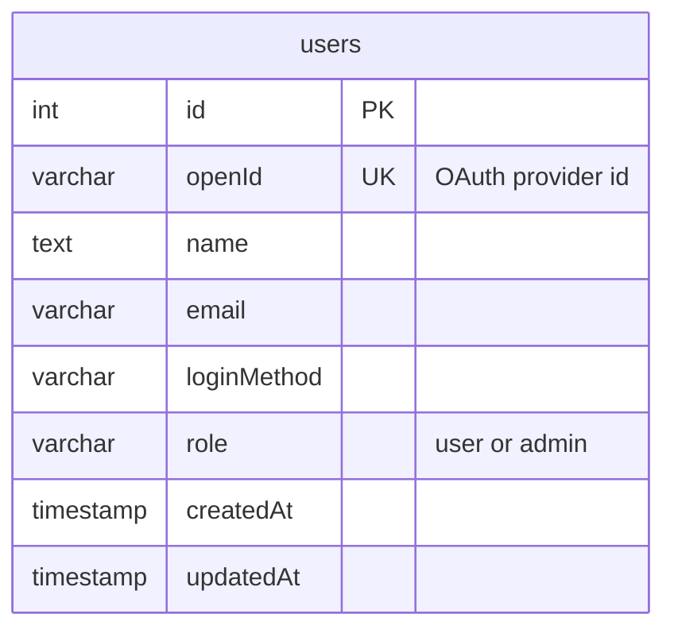
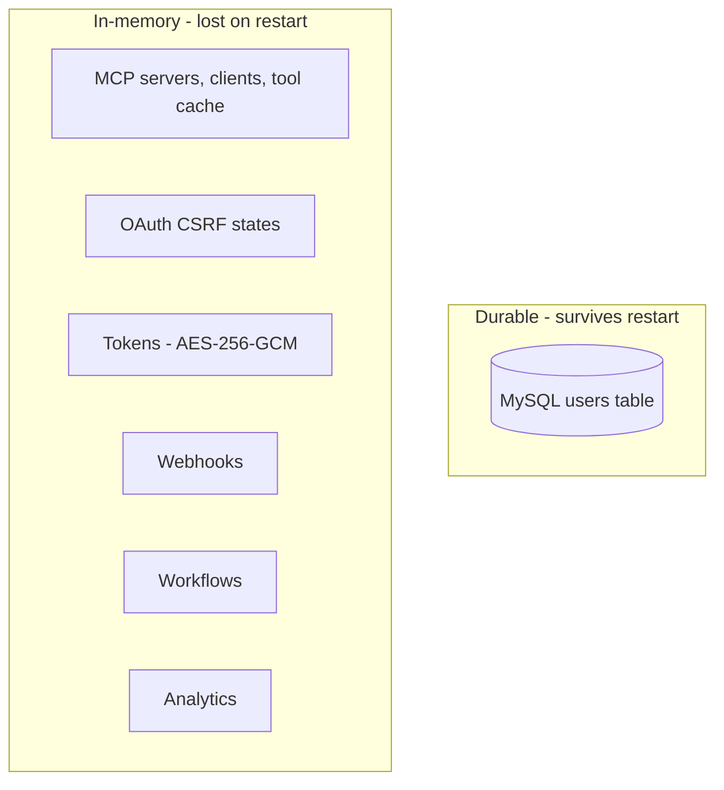

> Audience: developers & contributors | Last verified: 2026-08-06

This is the shortest and most important reality-check page in the wiki: MCP Hub persists almost nothing. One table is durable; everything else is in memory.

## The durable table: `users`

Defined in `drizzle/schema.ts`, accessed through `server/db.ts` (lazy `getDb()`, MySQL via Drizzle ORM):

| Column | Type | Notes |
| --- | --- | --- |
| `id` | int, auto-increment, PK | |
| `openId` | varchar(64), unique | OAuth provider identifier |
| `name` | text | |
| `email` | varchar(320) | |
| `loginMethod` | (provider enum) | How the user signed in |
| `role` | enum `'user' \| 'admin'`, default `'user'` | Admin via `OWNER_OPEN_ID` promotion |
| `createdAt` / `updatedAt` | timestamps | |

Key behavior: `upsertUser` in `server/db.ts` **auto-promotes** any user whose `openId` equals `OWNER_OPEN_ID` to `admin`. See [Auth & sessions](auth-session.md).

> [!IMPORTANT]
> There is no table for MCP servers, tools, tokens, webhooks, workflows, analytics, or macros. `drizzle/schema.ts` contains only the `users` table.

## In-memory stores

| Store | Module | Survives restart? | Notes |
| --- | --- | --- | --- |
| MCP servers / clients / tool cache / status | `server/mcp/mcp-server-manager.ts` | No | `servers`, `clients`, `toolCache`, `serverStatus` Maps |
| OAuth CSRF states | `server/auth/oauth-manager.ts` | No | 10-minute expiry, comment: "would be replaced with database" |
| Tokens | `server/tokens/token-manager.ts` | No | AES-256-GCM; key from `TOKEN_ENCRYPTION_KEY` or a fresh random key (undecryptable after restart) |
| Webhooks | `server/webhooks/webhook-manager.ts` | No | HMAC-signed, retry policy, `WEBHOOK_BASE_URL` |
| Workflows | `server/procedures/workflows.ts` | No | `workflowStore` Map |
| Analytics | `server/analytics/` | No | Aggregations derived at query time |
| Macro state | `lib/engines/`, `server/macros/` | No | Client-side engines |

## Implications

- **Single-instance assumption.** In-memory Maps cannot be shared across server replicas. Any multi-instance deployment is limited to the parts of the app that only need the `users` table (auth).
- **Data loss on restart.** Registering servers, creating tokens/webhooks/workflows, and accumulated analytics all reset when the process exits.
- **Ephemeral crypto keys.** Without `TOKEN_ENCRYPTION_KEY`, the encryption key is random per boot, so stored tokens become undecryptable garbage on restart — effectively equivalent to losing them.

## What the wiki says about it

The [feature status](../start-here/feature-tour.md) and [limitations](../user-guide/index.md) pages treat persistence as the top operational caveat. The [Overview](overview.md) diagram marks MySQL as the only durable box for exactly this reason.

## Related pages

- [Overview](overview.md) — the system diagram.
- [Auth & sessions](auth-session.md) — the role column and admin promotion.
- [Environment variables](../install-and-configure/environment-variables.md) — `DATABASE_URL`, `TOKEN_ENCRYPTION_KEY`.
- [Database setup](../install-and-configure/database.md) — running the schema.
