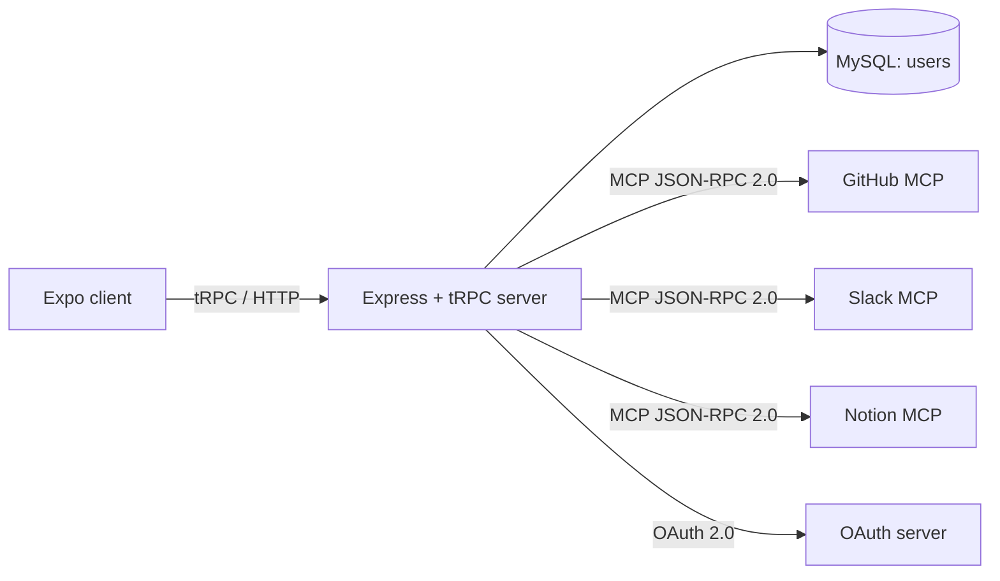

> Audience: developers & contributors | Last verified: 2026-08-06

MCP Hub is a **tool hub**: one backend that holds your MCP server connections, tools, macros, workflows, tokens, and webhooks, plus a cross-platform client that talks to it. This page is the 30,000-foot view; every subsystem has a dedicated page linked from the [architecture index](index.md).

## Two processes

- **Server** — Express + tRPC on port 3000 (fallback `3001`–`3019`). Owns all state and integration logic. See [Backend API surface](backend-api-surface.md).
- **Client** — an Expo (React Native) app that renders the UI and calls the server's tRPC endpoint over HTTP. See [Frontend interface](frontend-interface.md).

## Two languages over the wire

1. **tRPC** (HTTP + JSON) — every user-facing interaction: auth, server CRUD, tokens, webhooks, analytics, workflows, templates. Routed through `server/appRouter`.
2. **JSON-RPC 2.0** — the Model Context Protocol (MCP) used to talk *out* to registered MCP servers. The hub is an MCP **client**. See [MCP integration](mcp-integration.md).

## The flow in one diagram

## Layering inside the server

| Layer | Files | Responsibility |
| --- | --- | --- |
| HTTP bootstrap | [`server/_core/index.ts`](../install-and-configure/installation-overview.md) | Express app, CORS, JSON parsing, rate limiters, router mount. |
| tRPC core | `server/_core/trpc.ts` | `publicProcedure` / `protectedProcedure` / `adminProcedure` + superjson. |
| Context & session | `server/_core/context.ts`, `sdk.ts`, `env.ts` | Builds `TrpcContext`, verifies session JWT, exposes env vars. |
| Routers | `server/routers.ts` | The 10 registered routers in `appRouter`. |
| Feature modules | `server/{mcp,tokens,webhooks,analytics,procedures,macros,auth,...}` | Business logic per feature. |
| Persistence | `server/db.ts`, `drizzle/schema.ts` | Lazy MySQL connection + the single `users` table. |

## Ten registered routers

`server/routers.ts` composes `appRouter` from exactly these routers:

`system`, `auth`, `oauth`, `mcp`, `mcpServers`, `tokens`, `webhooks`, `analytics`, `workflows`, `templates`.

Each is documented with its procedures on [Backend API surface](backend-api-surface.md). Note there is **no** router for macros, collaboration, governance, notifications, or the other disabled feature modules — see [Repository map](repository-map.md) for which server folders exist but are not wired into the router tree.

## State model

- **Durable:** only the `users` table (MySQL) via Drizzle ORM.
- **In-memory:** everything else — MCP servers/clients, OAuth states, tokens, webhooks, workflows, analytics, macro state.

> [!IMPORTANT]
> Restarting the server clears all registered MCP servers, tokens, webhooks, workflow definitions, and analytics. This is the single most important operational caveat; the full picture is on [Data model](data-model.md).

## Next steps

- New to MCP? → [MCP integration](mcp-integration.md)
- Understand the security model → [Auth & sessions](auth-session.md)
- Explore the code layout → [Repository map](repository-map.md)
- Read the app's contract → [Frontend interface](frontend-interface.md) and [Backend API surface](backend-api-surface.md)
