> Audience: contributors | Status: living document | Last verified: 2026-08-06

MCP Hub's automation lives in `.github/workflows/`. There are exactly three workflows: one CI pipeline and two GitHub Pages deployers for the static landing page. All are read directly from the committed YAML on `main`.

```mermaid
flowchart TD
    subgraph CI["ci.yml - the quality gate"]
        TRIG["push to main or develop, or any PR"] --> CHK["pnpm check - tsc"]
        CHK --> LNT["pnpm lint"]
        LNT --> TST["pnpm test"]
        TST --> GATE["gate result"]
    end
    subgraph LP["deploy-landing-page.yml"]
        LT["push to main touching landing-page/ or landing/"] --> CON["configure-pages@v4"]
        CON --> RES["resolve landing-page/ else landing/"]
        RES --> UPL["upload-pages-artifact@v3"]
        UPL --> DEP["deploy-pages@v4"]
    end
    subgraph ST["static.yml - the older deployer"]
        STT["push to main, any path"] --> C5["configure-pages@v5"]
        C5 --> U5["upload ./landing"]
        U5 --> D5["deploy-pages@v5"]
    end
```

## CI — `ci.yml`

Runs the quality gate on every relevant branch and PR.

| Aspect | Value |
| --- | --- |
| Triggers | Push to `main` or `develop`; pull requests to any branch |
| Runner | `ubuntu-latest` |
| Toolchain | `actions/checkout@v4`, `pnpm/action-setup@v4`, `actions/setup-node@v4` with Node 20 + pnpm cache |
| Install | `pnpm install --no-frozen-lockfile` |
| Steps | `pnpm check` → `pnpm lint` → `pnpm test` |

This is exactly the local gate described in [Testing strategy](testing-strategy.md) (`pnpm check` / `pnpm lint` / `pnpm test`), so a green `./scripts/test.sh` locally predicts a green CI. If CI fails, the failure identifies which of the three gates your branch violates.

> [!NOTE]
> CI does **not** build Android, run the landing-page builds, or run the excluded root `__tests__/` suites. Those are out of scope of the automated gate (see the [Android](../install-and-configure/android.md) note).

## GitHub Pages — `deploy-landing-page.yml`

Deploys the static landing page to GitHub Pages.

| Aspect | Value |
| --- | --- |
| Triggers | Push to `main` touching `landing-page/**`, `landing/**`, or the workflow file itself; manual `workflow_dispatch` |
| Permissions | `contents: read`, `pages: write`, `id-token: write` |
| Concurrency | Group `pages`, `cancel-in-progress: false` |
| Directory resolution | `landing-page/` if it exists, else `landing/`, else fail with an error |
| Steps | `configure-pages@v4`, resolve dir, `upload-pages-artifact@v3`, `deploy-pages@v4` |
| Env | `github-pages` environment; URL from `deployment.outputs.page_url` |

The workflow accepts either directory name so the landing page can live at `landing-page/` or `landing/`; exactly one must exist on `main` for the deploy to succeed.

## GitHub Pages — `static.yml`

A second, older deployer for the same landing page.

| Aspect | Value |
| --- | --- |
| Triggers | Push to `main` (any path); manual `workflow_dispatch` |
| Permissions | `contents: read`, `pages: write`, `id-token: write` |
| Concurrency | Group `pages`, `cancel-in-progress: false` |
| Upload path | Hard-coded `./landing` |
| Steps | `configure-pages@v5`, `upload-pages-artifact@v3`, `deploy-pages@v5` |

> [!WARNING]
> `deploy-landing-page.yml` and `static.yml` both deploy the landing page and share the `pages` concurrency group, so they cannot run against each other. They differ in trigger paths and in which directory they upload (`landing-page/`→`landing/` fallback vs hard-coded `./landing`). If a landing-page change lives in `landing-page/`, only `deploy-landing-page.yml` fires; `static.yml` still fires on any `main` push. Both target the same `github-pages` environment.

## Which workflow runs for my branch?

- Pushing to `main` or `develop`, or opening a PR: `ci.yml` runs the check/lint/test gate.
- Pushing to `main` with landing-page changes: `deploy-landing-page.yml` (and `static.yml`) may also run.
- Everything else: no workflow runs — CI is not triggered for ordinary feature branches, so a green local `./scripts/test.sh` is your primary signal before opening the PR.

## Next steps

- [Testing strategy](testing-strategy.md) — what the CI gate protects.
- [Development workflow](development-workflow.md) — where automation fits in the PR lifecycle.
