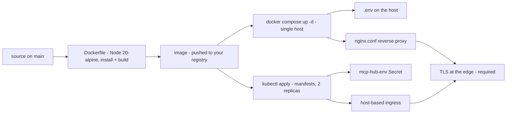

> Audience: operators & self-hosters | Status: living document | Last verified: 2026-08-06

This page maps the deployment surface of MCP Hub: what you actually have to deploy, the two supported container paths, and the runtime properties that matter when you plan for production. Mechanical install steps are in [Install & configure](../install-and-configure/index.md); this page assumes you have [local development](../install-and-configure/local-development.md) working.

## Runtime modes

| Mode | Runs on | Database | Notes |
| --- | --- | --- | --- |
| Local development | Your machine (`pnpm dev`) | Optional | Metro serves the web client on port 8081. |
| Self-hosted (container) | Docker or Kubernetes | Optional | Node 20-alpine image; env via `.env` or a k8s secret. |
| Mobile builds | `pnpm android` / `pnpm ios` | Optional | Needs native toolchains; see [Android](../install-and-configure/android.md) and [iOS & web](../install-and-configure/ios-web.md). |

The application is identical in every mode — the difference is who runs the Node backend and the optional MySQL. This is the cloud-hosted vs self-hosted question: the same code, operated by you or by a platform.

## The artifacts you have

| Artifact | Path | What it does |
| --- | --- | --- |
| Dockerfile | repo root | Two-stage Node 20-alpine image; `pnpm install --frozen-lockfile` then `pnpm build`; runs `pnpm start`. |
| docker-compose.yml | repo root | Minimal single-service compose: builds from the Dockerfile, `env_file: .env`, port 3000, `restart: unless-stopped`. No MySQL service — bring your own. |
| Kubernetes manifests | `kubernetes/deployment.yaml`, `kubernetes/ingress.yaml` | Starter scaffolding: 2 replicas, ClusterIP service, host-based ingress. |
| nginx.conf | repo root | Reverse proxy that forwards to the app container and passes WebSocket upgrade headers. |
| scripts/deploy.sh | repo root | Docker build + `kubectl apply` of the two manifests. |



Full contents of the Dockerfile, compose file, and manifests are documented on [Docker & Kubernetes](../install-and-configure/docker.md).

## Deployment modes in detail

### Docker (single host)

```bash
docker build -t mcp-hub:latest .
docker run -d --name mcp-hub -p 3000:3000 --env-file .env mcp-hub:latest
```

Or with compose:

```bash
cp .env.example .env
# edit .env with your production values
docker compose up -d --build
```

Verify with `curl http://localhost:3000/api/health` — expect `{ ok: true, timestamp, version }`.

### Kubernetes

The provided manifests are starter scaffolding, not a production spec (see the warning in [Docker & Kubernetes](../install-and-configure/docker.md)). They lack resource limits, probes, autoscaling, TLS annotations, and MySQL. `scripts/deploy.sh` builds an image and applies them:

```bash
IMAGE_NAME=ghcr.io/your-org/mcp-hub IMAGE_TAG=v1.0.0 ./scripts/deploy.sh
```

You must create the `mcp-hub-env` Secret the Deployment's `envFrom` references, and supply your own ingress/registry. The [Production checklist](production-checklist.md) lists every gap.

## Runtime properties that shape production decisions

1. **In-memory state.** Servers, tools, tokens, webhooks, workflows, analytics are all in memory and lost on restart. Only the MySQL `users` table persists ([Data model](../architecture/data-model.md)). Plan for state loss on any restart or scale-out.
2. **Port behavior.** The API listens on port 3000 by default and scans up to 3019 for a free port if 3000 is busy ([Backend API surface](../architecture/backend-api-surface.md)). Pin the port explicitly in production.
3. **CORS allowlist.** Only `http://localhost:8081`, `http://localhost:3000`, `EXPO_WEB_PREVIEW_URL`, and `EXPO_PACKAGER_PROXY_URL` are allowed origins. To serve the web client from a real domain you must set the appropriate `EXPO_*` URL vars — see [Environment variables](../install-and-configure/environment-variables.md).
4. **Health endpoint.** `GET /api/health` is public, unrate-limited, and returns `{ ok: true, timestamp, version: '1.0.0' }` ([System API](../api-reference/system.md)). This is the liveness check your orchestration should use.
5. **Logging is console-only.** There is no file logging, structured log shipping, or log rotation wired into the runtime. See [Monitoring & runbooks](monitoring-runbooks.md).

## What production means for MCP Hub today

Given the in-memory state and the scaffolding-grade operational artifacts, a production deployment currently means: a containerized single instance behind a reverse proxy with TLS, an explicit pinned port, a MySQL database for user persistence, and a deliberate plan for state loss on restart. The [Production checklist](production-checklist.md) turns that into a concrete list.

## Next steps

- [Production checklist](production-checklist.md) — the go-live verification list.
- [Build & release](build-release.md) — how updates are built and shipped.
- [Reverse proxy](reverse-proxy.md) — exposing the service with TLS and WebSocket support.
- [Docker & Kubernetes](../install-and-configure/docker.md) — the artifact contents in detail.
